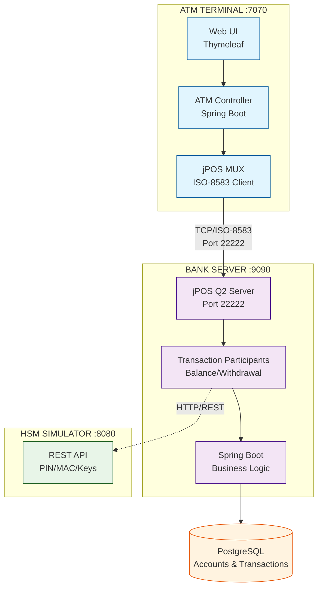

# Training Spring JPos 2025 #

Technology Stack :

* Java 25
* Maven 3
* PostgreSQL 17
* Spring Boot 3.5.6
* JPos 3.0.0

## Materi Training ##

Hari 1 – Spring Boot Application Setup, REST, dan Database
* Pengenalan ekosistem pembayaran & ISO-8583
* Dasar Spring Boot & Dependency Injection
* Implementasi REST API untuk bank server (Balance Inquiry & Withdrawal)
* Integrasi database PostgreSQL untuk accounts & transactions
* Setup ATM terminal simulator dengan web UI

Hari 2 – JPOS Integration & ISO-8583 Basics
* Struktur ISO-8583 (MTI, Bitmap, Data Elements)
* Pesan administratif (Sign-On, Sign-Off, Echo)
* Pengenalan JPOS: Q2 Server, Channels, MUX, Packager
* Praktikum: komunikasi ISO-8583 ATM-to-Server (Sign-On/Echo)
* Setup jPOS Q2 Server pada bank dan jPOS MUX pada ATM

Hari 3 – End-to-End ATM Transaction Flow
* Integrasi JPOS dengan Spring Boot (Transaction Participants)
* Translasi Web UI ↔ ISO-8583
* Implementasi alur transaksi ATM end-to-end (Balance & Withdrawal)
* Processing Code, PAN, Amount, STAN handling
* Collaborative testing & debugging

Hari 4 – HSM Simulation, PIN, MAC & Key Management
* Konsep HSM, MAC, dan PIN
* Setup HSM simulator untuk cryptographic operations
* AES-128 PIN block encryption (field 123)
* AES-CMAC untuk message integrity (field 64)
* PIN verification dengan HSM integration
* Terminal-initiated key rotation (TPK/TSK)
* Integrasi HSM ke alur transaksi ATM

Hari 5 – Connection Resiliency & Production Readiness
* Persistent connection dengan heartbeat & automatic re-sign-on
* Server-initiated key rotation via admin REST API
* Key lifecycle management (PENDING → ACTIVE → EXPIRED)
* End-to-end testing seluruh sistem (transactions & key rotation)
* Best practices (security, PCI DSS, deployment, monitoring)
* Diskusi & Q&A

## Case Study: Sistem ATM dengan jPOS

### Overview
Workshop ini membangun sistem ATM lengkap dengan 2 aplikasi utama untuk demonstrasi konsep end-to-end ATM transaction processing, security, dan key management. Sistem ini mencakup ATM terminal simulator yang berkomunikasi dengan server bank menggunakan protokol ISO-8583, dilengkapi dengan HSM simulator untuk operasi cryptographic.

### Sample Applications

Terdapat 2 aplikasi sample yang dikembangkan selama workshop:

1. **spring-jpos-atm-server** - Bank server untuk pemrosesan transaksi ATM
2. **spring-jpos-atm-simulator** - ATM terminal simulator dengan web UI

Aplikasi tambahan untuk keamanan:
3. **[hsm-simulator](https://github.com/artivisi/hsm-simulator)** - HSM simulator untuk PIN/MAC/Key operations

### Arsitektur Aplikasi



### Komponen Sistem

**ATM Terminal Simulator (spring-jpos-atm-simulator) - Port 7070**
- Web UI berbasis Thymeleaf untuk simulasi ATM operations
- Spring Boot REST API untuk transaction handling
- jPOS QMUX dan ChannelAdaptor untuk ISO-8583 communication
- Automatic sign-on/sign-off capability
- Terminal-initiated dan server-initiated key rotation support
- AES-128 PIN block encryption (field 123)
- AES-CMAC for message integrity

**Bank Server (spring-jpos-atm-server) - Port 9090 (REST), Port 22222 (ISO-8583)**
- jPOS Q2 Server untuk receive ISO-8583 messages dari ATM
- Spring Boot untuk business logic (account management, transaction processing)
- Transaction Participants untuk balance inquiry dan cash withdrawal
- PostgreSQL database untuk accounts dan transaction logs
- Sign-on tracking dan connection management
- Terminal-initiated dan server-initiated key rotation
- HSM integration untuk PIN verification dan MAC generation

**HSM Simulator - Port 8080**
- REST API untuk cryptographic operations
- PIN block generation dan verification (ISO 9564)
- MAC generation dan verification (AES-CMAC, HMAC-SHA256)
- Key generation dan key rotation
- TPK (Terminal PIN Key) dan TSK (Terminal Session Key) management

### Alur Transaksi ATM

**1. Sign-On (Automatic pada startup)**
```
ATM → Bank: 0800 Sign-On Request (DE 70 = 001)
Bank → ATM: 0810 Sign-On Response (DE 39 = 00)
```

**2. Balance Inquiry**
```
User → ATM UI: Input card number + PIN
ATM → HSM: Encrypt PIN block (AES-128)
ATM → Bank: 0200 Balance Request (MTI 0200, Processing Code 310000)
                DE 2 (PAN), DE 52/123 (PIN Block), DE 64 (MAC)
Bank → HSM: Verify PIN block
Bank → DB: Check account balance
Bank → ATM: 0210 Balance Response (DE 39 = 00, DE 54 = Balance)
ATM → User: Display balance
```

**3. Cash Withdrawal**
```
User → ATM UI: Input amount
ATM → Bank: 0200 Withdrawal Request (Processing Code 010000)
                DE 4 (Amount), DE 52/123 (PIN Block), DE 64 (MAC)
Bank → HSM: Verify PIN block
Bank → DB: Check balance & deduct amount
Bank → ATM: 0210 Withdrawal Response (DE 39 = 00)
ATM → User: Dispense cash (simulated)
```

**4. Terminal-Initiated Key Rotation**
```
ATM → Bank: 0800 Key Change Request (DE 53 = 0101 for TPK, MAC = OLD TSK)
Bank → HSM: Generate new TPK
HSM → Bank: New TPK encrypted under old TPK
Bank → ATM: 0810 Encrypted New Key (DE 48 = Checksum, DE 123 = Encrypted Key)
ATM: Decrypt, verify checksum, test new key
ATM → Bank: 0800 Key Installation Confirmation (DE 53 = 0301, MAC = NEW TPK)
Bank: Verify MAC with pending key, activate new key
Bank → ATM: 0810 Confirmation Response (DE 39 = 00)
```

**5. Server-Initiated Key Rotation**
```
Admin → Bank REST API: POST /api/admin/key-rotation/rotate/TRM-ISS001-ATM-001?keyType=TPK
Bank → ATM: 0800 Key Rotation Notification (DE 53 = 0701, DE 70 = 301)
ATM → Bank: 0810 Acknowledge (DE 39 = 00)
[ATM automatically initiates terminal-initiated key change flow]
ATM → Bank: 0800 Key Change Request (DE 53 = 0101)
Bank → ATM: 0810 New Encrypted Key...
[Rest follows terminal-initiated flow]
```

### Key Features Implemented

**Security Features:**
- AES-128 PIN encryption (field 123) dan backward compatible 3DES (field 52)
- AES-CMAC dan HMAC-SHA256 untuk message integrity
- Terminal-initiated key rotation (ATM initiates key change)
- Server-initiated key rotation (Admin triggers remote key change)
- Explicit key installation confirmation mechanism
- Sign-on requirement enforcement (response code 91 untuk unsigned terminals)

**Connection Management:**
- Automatic sign-on saat startup
- Persistent connection dengan heartbeat
- Automatic re-sign-on capability
- Channel deregistration pada disconnect
- Connection status monitoring via REST API

**Key Rotation:**
- Operation codes (01-07) untuk key change protocol
- Key lifecycle management (PENDING → ACTIVE → EXPIRED)
- HSM integration untuk key generation
- Admin REST API untuk trigger remote key rotation
- Comprehensive testing procedures

**Database Features:**
- Account management dengan balance tracking
- Transaction logging dengan ISO-8583 message storage
- Crypto key management dengan rotation tracking
- Optimistic locking untuk concurrent transaction handling

### Teknologi Integrasi

- **Spring Boot 4.0.0-RC1 + jPOS 3.0.0**: Embedded Q2 server dalam Spring Boot
- **Java 25 Virtual Threads**: Optimal performance untuk concurrent transactions
- **ISO-8583 BASE24**: Real binary messaging untuk ATM communication
- **ASCIIChannel**: Communication channel untuk ISO-8583 messages
- **PostgreSQL 17**: Database untuk accounts, transactions, dan keys
- **AES-128 + AES-CMAC**: Modern cryptography untuk PIN dan MAC
- **BouncyCastle 1.78.1**: Cryptographic provider
- **Thymeleaf + Tailwind CSS**: Modern web UI untuk ATM simulator

### Sample Data

**Accounts in spring-jpos-atm-server:**
- `1234567890` - John Doe (Balance: 5,000,000 IDR)
- `0987654321` - Jane Smith (Balance: 3,000,000 IDR)
- `5555555555` - Bob Johnson (Balance: 10,000,000 IDR)

### Quick Start

```bash
# Terminal 1: Start HSM Simulator
cd hsm-simulator
mvn spring-boot:run

# Terminal 2: Start Bank Server
cd sample-apps/spring-jpos-atm-server
docker-compose up -d  # Start PostgreSQL
mvn spring-boot:run

# Terminal 3: Start ATM Simulator
cd sample-apps/spring-jpos-atm-simulator
docker-compose up -d  # Start PostgreSQL
mvn spring-boot:run

# Access ATM UI
open http://localhost:7070

# Access Bank REST API
curl http://localhost:9090/api/admin/key-rotation/connected-terminals
```