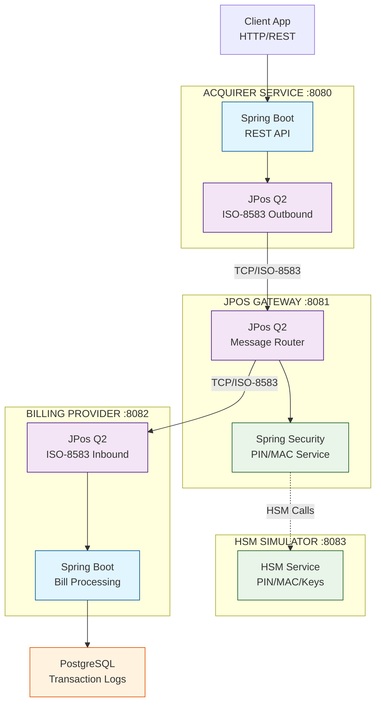

# Training Spring JPos 2025 #

Technology Stack :

* Java 25
* Maven 3
* PostgreSQL 17
* Spring Boot 3.5.6
* JPos 3.0.0

## Materi Training ##

Hari 1 – Spring Boot Application Setup, REST, dan Database
* Pengenalan ekosistem pembayaran & ISO-8583
* Dasar Spring Boot & Dependency Injection
* Implementasi REST API (Acquirer & Billing Provider)
* Integrasi database PostgreSQL & logging transaksi

Hari 2 – JPOS Integration & ISO-8583 Basics
* Struktur ISO-8583 (MTI, Bitmap, Data Elements)
* Pesan administratif (Logon, Logoff, Echo)
* Pengenalan JPOS: Q2, Channels, MUX, Packager
* Praktikum: komunikasi ISO-8583 awal (Logon/Echo)

Hari 3 – End-to-End Bill Payment Flow
* Integrasi JPOS dengan Spring Boot
* Translasi JSON ↔ ISO-8583
* Implementasi alur pembayaran end-to-end
* Collaborative testing & debugging

Hari 4 – HSM Simulation, PIN, MAC & Key Exchange
* Konsep HSM, MAC, dan PIN
* Simulasi key exchange via ISO-8583
* Generasi & verifikasi MAC
* Pin Management, Pinblock, Pin Storage, Pin Verification
* Integrasi HSM ke alur pembayaran

Hari 5 – Connection Resiliency & Production Readiness
* Retry mechanism & reconnection
* Store-and-forward pattern
* End-to-end testing seluruh sistem
* Best practices (security, PCI DSS, deployment, monitoring Grafana)
* Diskusi & Q&A

## Case Study: Arsitektur Sistem Pembayaran

### Overview
Workshop ini membangun ekosistem pembayaran digital dengan 4 aplikasi utama untuk demonstrasi konsep end-to-end processing.

### Arsitektur Aplikasi

### Komponen Sistem

**Acquirer Service (Port 8080)**
- Entry point untuk request pembayaran dari client
- Spring Boot REST API untuk handling request
- JPos Q2 untuk konversi ke ISO-8583

**JPos Gateway (Port 8081)**
- Central router untuk routing pesan ISO-8583
- Spring Security untuk PIN/MAC operations
- Penghubung antar semua komponen

**HSM Simulator (Port 8083)**
- Simulasi cryptographic operations
- PIN encryption, MAC generation, key exchange
- Demonstrasi security concepts

**Billing Provider (Port 8082)**
- Bill payment processing
- JPos Q2 untuk receive ISO-8583 messages
- Spring Boot untuk business logic

### Alur Pembayaran

1. **Client** mengirim request via HTTP/REST ke **Acquirer**
2. **Acquirer** konversi ke ISO-8583 dan kirim ke **Gateway**
3. **Gateway** proses security via **HSM** dan routing ke **Billing**
4. **Billing** proses pembayaran dan simpan ke **PostgreSQL**
5. Response dikembalikan melalui semua layer

### Teknologi Integrasi

- **Spring Boot + JPos**: Embedded Q2 server dalam Spring Boot
- **ISO-8583**: Real binary messaging antar services
- **Security**: PIN Block, MAC, Key Exchange
- **Database**: Transaction logging dan audit trail