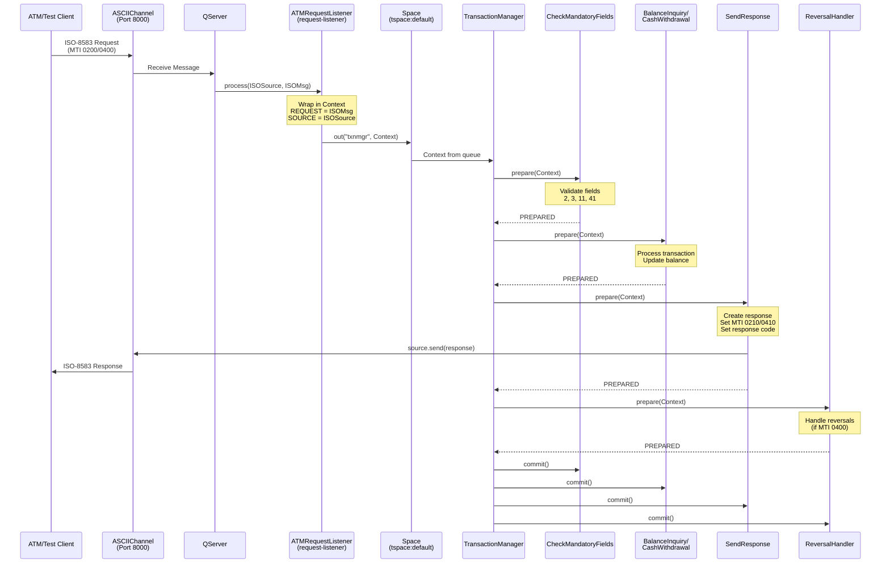
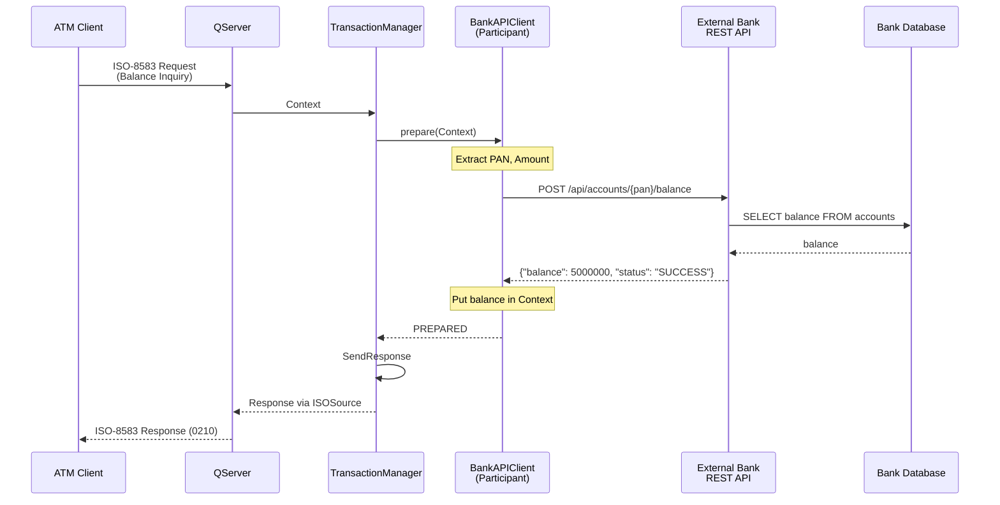
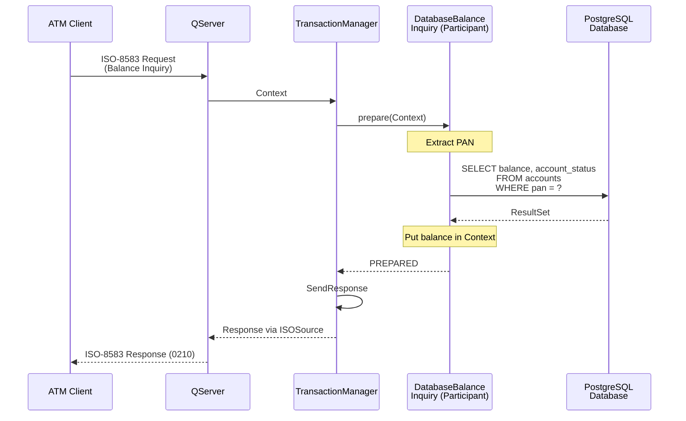

# jPOS ATM Switch

Aplikasi jPOS 3 yang mengimplementasikan ATM switch dengan Java 25, mendukung:
- Transaksi Balance Inquiry (MTI 0200, Processing Code 31xxxx)
- Transaksi Cash Withdrawal (MTI 0200, Processing Code 01xxxx)
- Operasi Reversal untuk skenario timeout (MTI 0400)
- Komunikasi ASCIIChannel
- Format message ISO87A (ISO-8583:1987)

## Struktur Project

```
jpos-atm-switch/
├── build.gradle                    # Konfigurasi build Gradle
├── src/
│   ├── main/
│   │   └── java/
│   │       └── com/example/atm/
│   │           ├── ATMRequestListener.java         # Request-listener untuk QServer
│   │           ├── TestClient.java                 # Client untuk simulasi ATM
│   │           └── participants/
│   │               ├── CheckMandatoryFields.java   # Validasi field wajib
│   │               ├── BalanceInquiry.java         # Menangani balance inquiry
│   │               ├── CashWithdrawal.java         # Menangani cash withdrawal
│   │               ├── SendResponse.java           # Mengirim response ke client
│   │               └── ReversalHandler.java        # Menangani request reversal
│   └── dist/
│       ├── deploy/                  # Deployment descriptor Q2
│       │   ├── 00_logger.xml        # Konfigurasi logger
│       │   ├── 10_channel.xml       # QServer dengan ASCIIChannel dan BASE24Packager
│       │   └── 20_txnmgr.xml        # Transaction Manager
│       └── cfg/                     # File konfigurasi (jika diperlukan)
```

## Build Aplikasi

```bash
# Build dan install aplikasi
./gradlew installApp

# Aplikasi akan terinstal di: build/install/jpos-atm-switch/
```

## Menjalankan Aplikasi

### Menjalankan ATM Switch

```bash
# Jalankan Q2 server
./gradlew run
```

Switch akan listening di port 8000 untuk koneksi masuk.

### Menjalankan Test Client

Pada terminal terpisah:

```bash
# Opsi 1: Menggunakan shell script (disarankan)
./run-test-client.sh

# Opsi 2: Menggunakan Gradle task
./gradlew runTestClient
```

## Jenis Transaksi

### Balance Inquiry (MTI: 0200)
- Processing Code: 31xxxx
- Mengembalikan saldo rekening di field 54

### Cash Withdrawal (MTI: 0200)
- Processing Code: 01xxxx
- Jumlah penarikan di field 4 (dalam satuan sen)
- Mengembalikan saldo baru di field 54

### Reversal (MTI: 0400)
- Membatalkan transaksi sebelumnya
- Mengembalikan saldo rekening
- Menggunakan processing code yang sama dengan transaksi aslinya

## Response Code

- `00` - Approved (Disetujui)
- `30` - Format error
- `51` - Insufficient funds (Dana tidak mencukupi)
- `96` - System error

## Skenario Testing

Test client mendemonstrasikan:
1. Balance inquiry untuk PAN 4111111111111111
2. Cash withdrawal sebesar 500.00
3. Balance inquiry (menampilkan saldo yang berkurang)
4. Reversal dari transaksi penarikan
5. Balance inquiry (menampilkan saldo yang dikembalikan)

## Alur Transaksi

### Diagram Alur Message



### Detail Alur Eksekusi

#### 1. Penerimaan Message
- **QServer** listening di port 8000 menggunakan ASCIIChannel dengan BASE24Packager
- Menerima message ISO-8583 dari client ATM
- Untuk setiap message yang masuk, memanggil `request-listener` yang dikonfigurasi

#### 2. Pemrosesan Request (ATMRequestListener.java:25-31)
```java
public boolean process(ISOSource source, ISOMsg msg) {
    Context ctx = new Context();
    ctx.put("REQUEST", msg);      // Message ISO asli
    ctx.put("SOURCE", source);    // Channel untuk mengirim response
    sp.out(queue, ctx, timeout);  // Masukkan ke queue TransactionManager
    return true;
}
```

#### 3. Rantai Transaction Participant

TransactionManager menjalankan participant secara berurutan. Setiap participant mengimplementasikan pola **two-phase commit** (`prepare` → `commit/abort`):

**CheckMandatoryFields** (CheckMandatoryFields.java:14)
- Memvalidasi field ISO-8583 yang wajib ada: PAN (2), Processing Code (3), STAN (11), Terminal ID (41)
- Mengekstrak nilai-nilai tersebut ke dalam Context untuk participant berikutnya
- Mengembalikan `PREPARED | NO_JOIN` (tidak ikut serta dalam fase commit)

**BalanceInquiry** (BalanceInquiry.java:23)
- Hanya memproses jika MTI=0200 dan Processing Code dimulai dengan "31"
- Menghasilkan saldo random (simulasi)
- Mengeset response code "00" untuk sukses
- Mengembalikan `PREPARED | NO_JOIN`

**CashWithdrawal** (CashWithdrawal.java:23)
- Hanya memproses jika MTI=0200 dan Processing Code dimulai dengan "01"
- Menyimpan saldo per PAN dalam static HashMap di memory
- Memvalidasi kecukupan dana
- Mengurangi jumlah penarikan dari saldo
- Mengembalikan `PREPARED` (ikut serta dalam commit untuk mendukung rollback)
- Pada `abort()`: Membatalkan penarikan dengan menambahkan kembali jumlahnya

**SendResponse** (SendResponse.java:16)
- Membuat message response ISO-8583 (0210 atau 0410)
- Mengeset response code dari Context (default "96" jika error)
- Mengirim response melalui `ISOSource.send(response)`
- Mengembalikan `PREPARED | NO_JOIN`

**ReversalHandler** (ReversalHandler.java:17)
- Hanya memproses jika MTI=0400 (message reversal)
- Mencatat informasi reversal
- Mengeset response code "00"
- Mengembalikan `PREPARED | NO_JOIN`

#### 4. Two-Phase Commit

Jika semua participant mengembalikan `PREPARED`:
- TransactionManager memanggil `commit()` pada setiap participant
- Untuk CashWithdrawal: transaksi diselesaikan

Jika ada participant yang mengembalikan `ABORTED`:
- TransactionManager memanggil `abort()` pada setiap participant
- Untuk CashWithdrawal: saldo dikembalikan

## Konfigurasi

### Konfigurasi QServer (10_channel.xml)
- **Server Class**: `org.jpos.q2.iso.QServer` - Listening untuk message ISO-8583 yang masuk
- **Protocol**: ASCIIChannel dengan BASE24Packager
- **Port**: 8000 (listening di semua interface)
- **Request Listener**: `ATMRequestListener` - Meneruskan message ke TransactionManager

### Transaction Manager (20_txnmgr.xml)
- **Queue**: `txnmgr` (space: `tspace:default`)
- **Sessions**: 2 thread untuk memproses transaksi secara bersamaan
- **Max Sessions**: 128 (berkat Java Virtual Threads di jPOS 3.0)
- **Debug**: diaktifkan untuk logging detail
- **Participants**: Dieksekusi berurutan: CheckMandatoryFields → BalanceInquiry → CashWithdrawal → SendResponse → ReversalHandler

## Log

Log aplikasi ditulis ke: `build/install/jpos-atm-switch/log/q2.log`

## Requirements

- Java 25 (jPOS 3.0.0 memerlukan Java 22+)
- Gradle 8.10 (sudah termasuk via wrapper)
- jPOS 3.0.0

## Peningkatan untuk Production

> **⚠️ Catatan Penting tentang jPOS-EE:**
>
> jPOS-EE (Extended Edition) menyediakan integrasi database yang lebih bersih dengan dukungan Hibernate built-in, connection pooling, dan transaction participant (`Open`/`Close`). Namun, **jPOS-EE belum kompatibel dengan jPOS 3.0** per Januari 2025.
>
> - jPOS-EE 2.2.x bekerja dengan jPOS 2.x (versi LTS)
> - jPOS-EE 3.0 masih dalam tahap pengembangan (work in progress)
>
> Pendekatan integrasi database yang ditunjukkan di bawah menggunakan **pengelolaan koneksi manual** sebagai solusi sementara. Ketika jPOS-EE 3.0 tersedia, sebaiknya Anda migrasi untuk menggunakan class `org.jpos.ee.DB` dan participant `Open`/`Close` agar kode lebih bersih dan mudah dimaintain.

Implementasi saat ini menggunakan **penyimpanan in-memory** dan **data simulasi** untuk keperluan demonstrasi. Untuk deployment production, Anda perlu mengintegrasikan dengan sistem eksternal.

### 1. Integrasi dengan External Bank REST API

#### Gambaran Arsitektur



#### Langkah Implementasi

**Langkah 1: Tambahkan Dependency HTTP Client**

Update `build.gradle`:
```gradle
dependencies {
    implementation 'org.jpos:jpos:3.0.0'
    implementation 'org.jdom:jdom2:2.0.6.1'

    // Tambahkan HTTP client
    implementation 'com.squareup.okhttp3:okhttp:4.12.0'
    implementation 'com.fasterxml.jackson.core:jackson-databind:2.17.2'

    testImplementation 'junit:junit:4.13.2'
}
```

**Langkah 2: Buat Bank API Client**

File: `src/main/java/com/example/atm/integration/BankAPIClient.java`
```java
package com.example.atm.integration;

import com.fasterxml.jackson.databind.ObjectMapper;
import okhttp3.*;

import java.io.IOException;
import java.math.BigDecimal;
import java.util.concurrent.TimeUnit;

public class BankAPIClient {
    private final OkHttpClient client;
    private final String baseUrl;
    private final ObjectMapper objectMapper;

    public BankAPIClient(String baseUrl) {
        this.baseUrl = baseUrl;
        this.client = new OkHttpClient.Builder()
                .connectTimeout(10, TimeUnit.SECONDS)
                .readTimeout(30, TimeUnit.SECONDS)
                .build();
        this.objectMapper = new ObjectMapper();
    }

    public BalanceResponse getBalance(String pan) throws IOException {
        Request request = new Request.Builder()
                .url(baseUrl + "/api/accounts/" + pan + "/balance")
                .get()
                .build();

        try (Response response = client.newCall(request).execute()) {
            if (!response.isSuccessful()) {
                throw new IOException("Unexpected code " + response);
            }
            return objectMapper.readValue(response.body().string(), BalanceResponse.class);
        }
    }

    public WithdrawalResponse withdraw(String pan, BigDecimal amount) throws IOException {
        MediaType JSON = MediaType.get("application/json; charset=utf-8");

        String json = objectMapper.writeValueAsString(
            new WithdrawalRequest(pan, amount)
        );

        RequestBody body = RequestBody.create(json, JSON);
        Request request = new Request.Builder()
                .url(baseUrl + "/api/accounts/" + pan + "/withdraw")
                .post(body)
                .build();

        try (Response response = client.newCall(request).execute()) {
            if (!response.isSuccessful()) {
                throw new IOException("Unexpected code " + response);
            }
            return objectMapper.readValue(response.body().string(), WithdrawalResponse.class);
        }
    }

    public static class BalanceResponse {
        public BigDecimal balance;
        public String status;
        public String accountNumber;
    }

    public static class WithdrawalRequest {
        public String pan;
        public BigDecimal amount;

        public WithdrawalRequest(String pan, BigDecimal amount) {
            this.pan = pan;
            this.amount = amount;
        }
    }

    public static class WithdrawalResponse {
        public String status;
        public BigDecimal newBalance;
        public String transactionId;
    }
}
```

**Langkah 3: Buat REST Integration Participant**

File: `src/main/java/com/example/atm/participants/BankAPIBalanceInquiry.java`
```java
package com.example.atm.participants;

import com.example.atm.integration.BankAPIClient;
import org.jpos.core.Configurable;
import org.jpos.core.Configuration;
import org.jpos.transaction.Context;
import org.jpos.transaction.TransactionParticipant;
import org.jpos.util.Logger;

import java.io.Serializable;

public class BankAPIBalanceInquiry implements TransactionParticipant, Configurable {
    private Configuration cfg;
    private Logger logger;
    private BankAPIClient apiClient;

    @Override
    public int prepare(long id, Serializable context) {
        Context ctx = (Context) context;
        String mti = (String) ctx.get("MTI");
        String processingCode = (String) ctx.get("PROCESSING_CODE");

        // Hanya proses balance inquiry
        if (!"0200".equals(mti) || !processingCode.startsWith("31")) {
            return PREPARED | NO_JOIN;
        }

        String pan = (String) ctx.get("PAN");

        try {
            // Panggil external bank API
            BankAPIClient.BalanceResponse response = apiClient.getBalance(pan);

            if ("SUCCESS".equals(response.status)) {
                ctx.put("BALANCE", response.balance);
                ctx.put("RESPONSE_CODE", "00");
            } else {
                ctx.put("RESPONSE_CODE", "96"); // System error
            }

        } catch (Exception e) {
            ctx.put("RESPONSE_CODE", "91"); // System malfunction
            ctx.put("ERROR", e.getMessage());
            if (logger != null) {
                logger.error("Bank API error", e);
            }
        }

        return PREPARED | NO_JOIN;
    }

    @Override
    public void commit(long id, Serializable context) {
        // No-op untuk inquiry
    }

    @Override
    public void abort(long id, Serializable context) {
        Context ctx = (Context) context;
        ctx.put("RESPONSE_CODE", "96");
    }

    @Override
    public void setConfiguration(Configuration cfg) {
        this.cfg = cfg;
        String baseUrl = cfg.get("bank-api-url", "http://localhost:8080");
        this.apiClient = new BankAPIClient(baseUrl);

        String loggerName = cfg.get("logger");
        if (loggerName != null) {
            logger = Logger.getLogger(loggerName);
        }
    }
}
```

**Langkah 4: Update Konfigurasi Transaction Manager**

File: `src/dist/deploy/20_txnmgr.xml`

Ganti `BalanceInquiry` dengan `BankAPIBalanceInquiry`:
```xml
<txnmgr name="txnmgr" logger="Q2" class="org.jpos.transaction.TransactionManager">
    <property name="queue" value="txnmgr" />
    <property name="sessions" value="2" />
    <property name="max-sessions" value="128" />
    <property name="debug" value="true" />

    <participant class="com.example.atm.participants.CheckMandatoryFields"
                 logger="Q2" realm="check-mandatory-fields" />

    <!-- Gunakan REST API untuk balance inquiry -->
    <participant class="com.example.atm.participants.BankAPIBalanceInquiry"
                 logger="Q2" realm="bank-api-balance">
        <property name="bank-api-url" value="http://localhost:8080" />
    </participant>

    <participant class="com.example.atm.participants.CashWithdrawal"
                 logger="Q2" realm="cash-withdrawal" />
    <participant class="com.example.atm.participants.SendResponse"
                 logger="Q2" realm="send-response" />
    <participant class="com.example.atm.participants.ReversalHandler"
                 logger="Q2" realm="reversal-handler" />
</txnmgr>
```

**Langkah 5: Kebutuhan External Bank API**

Aplikasi bank eksternal harus menyediakan endpoint berikut:

```
GET  /api/accounts/{pan}/balance
POST /api/accounts/{pan}/withdraw
POST /api/accounts/{pan}/reversal
```

### 2. Integrasi dengan PostgreSQL Database

#### Gambaran Arsitektur



#### Database Schema

```sql
-- Buat tabel accounts
CREATE TABLE accounts (
    id BIGSERIAL PRIMARY KEY,
    pan VARCHAR(19) NOT NULL UNIQUE,
    account_number VARCHAR(20) NOT NULL,
    account_name VARCHAR(100) NOT NULL,
    balance DECIMAL(15,2) NOT NULL DEFAULT 0,
    account_status VARCHAR(20) NOT NULL DEFAULT 'ACTIVE',
    created_at TIMESTAMP NOT NULL DEFAULT CURRENT_TIMESTAMP,
    updated_at TIMESTAMP NOT NULL DEFAULT CURRENT_TIMESTAMP
);

-- Buat tabel transactions
CREATE TABLE transactions (
    id BIGSERIAL PRIMARY KEY,
    account_id BIGINT NOT NULL REFERENCES accounts(id),
    transaction_type VARCHAR(20) NOT NULL,
    amount DECIMAL(15,2) NOT NULL,
    balance_before DECIMAL(15,2) NOT NULL,
    balance_after DECIMAL(15,2) NOT NULL,
    stan VARCHAR(6) NOT NULL,
    terminal_id VARCHAR(16) NOT NULL,
    response_code VARCHAR(2) NOT NULL,
    created_at TIMESTAMP NOT NULL DEFAULT CURRENT_TIMESTAMP
);

-- Buat index untuk lookup lebih cepat
CREATE INDEX idx_accounts_pan ON accounts(pan);
CREATE INDEX idx_transactions_account_id ON transactions(account_id);
CREATE INDEX idx_transactions_stan ON transactions(stan);

-- Data contoh
INSERT INTO accounts (pan, account_number, account_name, balance, account_status)
VALUES
    ('4111111111111111', '1234567890', 'John Doe', 5000000.00, 'ACTIVE'),
    ('4111111111111112', '1234567891', 'Jane Smith', 3000000.00, 'ACTIVE');
```

#### Langkah Implementasi

**Langkah 1: Tambahkan Dependency Database**

Update `build.gradle`:
```gradle
dependencies {
    implementation 'org.jpos:jpos:3.0.0'
    implementation 'org.jdom:jdom2:2.0.6.1'

    // Tambahkan PostgreSQL driver dan connection pool
    implementation 'org.postgresql:postgresql:42.7.3'
    implementation 'com.zaxxer:HikariCP:5.1.0'

    testImplementation 'junit:junit:4.13.2'
}
```

**Langkah 2: Buat Konfigurasi Database**

File: `src/dist/cfg/database.properties`
```properties
db.url=jdbc:postgresql://localhost:5432/atm_switch
db.username=postgres
db.password=postgres
db.driver=org.postgresql.Driver
db.pool.size=10
db.pool.timeout=30000
```

**Langkah 3: Buat Database Manager**

File: `src/main/java/com/example/atm/database/DatabaseManager.java`
```java
package com.example.atm.database;

import com.zaxxer.hikari.HikariConfig;
import com.zaxxer.hikari.HikariDataSource;

import java.io.FileInputStream;
import java.io.IOException;
import java.sql.Connection;
import java.sql.SQLException;
import java.util.Properties;

public class DatabaseManager {
    private static DatabaseManager instance;
    private HikariDataSource dataSource;

    private DatabaseManager(String configFile) throws IOException {
        Properties props = new Properties();
        props.load(new FileInputStream(configFile));

        HikariConfig config = new HikariConfig();
        config.setJdbcUrl(props.getProperty("db.url"));
        config.setUsername(props.getProperty("db.username"));
        config.setPassword(props.getProperty("db.password"));
        config.setDriverClassName(props.getProperty("db.driver"));
        config.setMaximumPoolSize(Integer.parseInt(props.getProperty("db.pool.size", "10")));
        config.setConnectionTimeout(Long.parseLong(props.getProperty("db.pool.timeout", "30000")));
        config.setAutoCommit(false); // Pengelolaan transaksi manual

        this.dataSource = new HikariDataSource(config);
    }

    public static synchronized DatabaseManager getInstance(String configFile) throws IOException {
        if (instance == null) {
            instance = new DatabaseManager(configFile);
        }
        return instance;
    }

    public Connection getConnection() throws SQLException {
        return dataSource.getConnection();
    }

    public void close() {
        if (dataSource != null && !dataSource.isClosed()) {
            dataSource.close();
        }
    }
}
```

**Langkah 4: Buat Database Participant**

File: `src/main/java/com/example/atm/participants/DatabaseBalanceInquiry.java`
```java
package com.example.atm.participants;

import com.example.atm.database.DatabaseManager;
import org.jpos.core.Configurable;
import org.jpos.core.Configuration;
import org.jpos.transaction.Context;
import org.jpos.transaction.TransactionParticipant;
import org.jpos.util.Logger;

import java.io.Serializable;
import java.math.BigDecimal;
import java.sql.Connection;
import java.sql.PreparedStatement;
import java.sql.ResultSet;

public class DatabaseBalanceInquiry implements TransactionParticipant, Configurable {
    private Configuration cfg;
    private Logger logger;
    private DatabaseManager dbManager;

    @Override
    public int prepare(long id, Serializable context) {
        Context ctx = (Context) context;
        String mti = (String) ctx.get("MTI");
        String processingCode = (String) ctx.get("PROCESSING_CODE");

        // Hanya proses balance inquiry
        if (!"0200".equals(mti) || !processingCode.startsWith("31")) {
            return PREPARED | NO_JOIN;
        }

        String pan = (String) ctx.get("PAN");

        try (Connection conn = dbManager.getConnection();
             PreparedStatement ps = conn.prepareStatement(
                     "SELECT balance, account_status FROM accounts WHERE pan = ?")) {

            ps.setString(1, pan);
            ResultSet rs = ps.executeQuery();

            if (rs.next()) {
                String status = rs.getString("account_status");

                if ("ACTIVE".equals(status)) {
                    BigDecimal balance = rs.getBigDecimal("balance");
                    ctx.put("BALANCE", balance);
                    ctx.put("RESPONSE_CODE", "00");
                } else {
                    ctx.put("RESPONSE_CODE", "57"); // Transaction not permitted
                }
            } else {
                ctx.put("RESPONSE_CODE", "14"); // Invalid card number
            }

        } catch (Exception e) {
            ctx.put("RESPONSE_CODE", "96"); // System error
            ctx.put("ERROR", e.getMessage());
            if (logger != null) {
                logger.error("Database error", e);
            }
        }

        return PREPARED | NO_JOIN;
    }

    @Override
    public void commit(long id, Serializable context) {
        // No-op untuk inquiry
    }

    @Override
    public void abort(long id, Serializable context) {
        Context ctx = (Context) context;
        ctx.put("RESPONSE_CODE", "96");
    }

    @Override
    public void setConfiguration(Configuration cfg) {
        this.cfg = cfg;
        String dbConfigFile = cfg.get("database-config", "cfg/database.properties");

        try {
            this.dbManager = DatabaseManager.getInstance(dbConfigFile);
        } catch (Exception e) {
            throw new RuntimeException("Failed to initialize database", e);
        }

        String loggerName = cfg.get("logger");
        if (loggerName != null) {
            logger = Logger.getLogger(loggerName);
        }
    }
}
```

File: `src/main/java/com/example/atm/participants/DatabaseCashWithdrawal.java`
```java
package com.example.atm.participants;

import com.example.atm.database.DatabaseManager;
import org.jpos.core.Configurable;
import org.jpos.core.Configuration;
import org.jpos.iso.ISOMsg;
import org.jpos.transaction.Context;
import org.jpos.transaction.TransactionParticipant;
import org.jpos.util.Logger;

import java.io.Serializable;
import java.math.BigDecimal;
import java.sql.Connection;
import java.sql.PreparedStatement;
import java.sql.ResultSet;

public class DatabaseCashWithdrawal implements TransactionParticipant, Configurable {
    private Configuration cfg;
    private Logger logger;
    private DatabaseManager dbManager;

    @Override
    public int prepare(long id, Serializable context) {
        Context ctx = (Context) context;
        String mti = (String) ctx.get("MTI");
        String processingCode = (String) ctx.get("PROCESSING_CODE");

        if (!"0200".equals(mti) || !processingCode.startsWith("01")) {
            return PREPARED | NO_JOIN;
        }

        ISOMsg msg = (ISOMsg) ctx.get("REQUEST");
        String pan = (String) ctx.get("PAN");
        String stan = (String) ctx.get("STAN");
        String terminalId = (String) ctx.get("TERMINAL_ID");

        try {
            String amountStr = msg.getString(4);
            BigDecimal amount = new BigDecimal(amountStr).divide(new BigDecimal("100"));

            Connection conn = dbManager.getConnection();
            ctx.put("DB_CONNECTION", conn); // Simpan untuk commit/abort

            // Lock row untuk update
            PreparedStatement ps = conn.prepareStatement(
                    "SELECT id, balance, account_status FROM accounts WHERE pan = ? FOR UPDATE");
            ps.setString(1, pan);
            ResultSet rs = ps.executeQuery();

            if (rs.next()) {
                long accountId = rs.getLong("id");
                BigDecimal currentBalance = rs.getBigDecimal("balance");
                String status = rs.getString("account_status");

                if (!"ACTIVE".equals(status)) {
                    ctx.put("RESPONSE_CODE", "57");
                    return PREPARED;
                }

                if (currentBalance.compareTo(amount) < 0) {
                    ctx.put("RESPONSE_CODE", "51"); // Insufficient funds
                    return PREPARED;
                }

                // Update saldo
                BigDecimal newBalance = currentBalance.subtract(amount);
                PreparedStatement updatePs = conn.prepareStatement(
                        "UPDATE accounts SET balance = ?, updated_at = CURRENT_TIMESTAMP WHERE id = ?");
                updatePs.setBigDecimal(1, newBalance);
                updatePs.setLong(2, accountId);
                updatePs.executeUpdate();

                // Insert record transaksi
                PreparedStatement txnPs = conn.prepareStatement(
                        "INSERT INTO transactions (account_id, transaction_type, amount, " +
                        "balance_before, balance_after, stan, terminal_id, response_code) " +
                        "VALUES (?, ?, ?, ?, ?, ?, ?, ?)");
                txnPs.setLong(1, accountId);
                txnPs.setString(2, "WITHDRAWAL");
                txnPs.setBigDecimal(3, amount);
                txnPs.setBigDecimal(4, currentBalance);
                txnPs.setBigDecimal(5, newBalance);
                txnPs.setString(6, stan);
                txnPs.setString(7, terminalId);
                txnPs.setString(8, "00");
                txnPs.executeUpdate();

                ctx.put("NEW_BALANCE", newBalance);
                ctx.put("RESPONSE_CODE", "00");
            } else {
                ctx.put("RESPONSE_CODE", "14"); // Invalid card
            }

        } catch (Exception e) {
            ctx.put("RESPONSE_CODE", "96");
            ctx.put("ERROR", e.getMessage());
            if (logger != null) {
                logger.error("Withdrawal error", e);
            }
        }

        return PREPARED; // Ikut serta dalam commit
    }

    @Override
    public void commit(long id, Serializable context) {
        Context ctx = (Context) context;
        Connection conn = (Connection) ctx.get("DB_CONNECTION");
        if (conn != null) {
            try {
                conn.commit();
                conn.close();
            } catch (Exception e) {
                if (logger != null) {
                    logger.error("Commit error", e);
                }
            }
        }
    }

    @Override
    public void abort(long id, Serializable context) {
        Context ctx = (Context) context;
        Connection conn = (Connection) ctx.get("DB_CONNECTION");
        if (conn != null) {
            try {
                conn.rollback();
                conn.close();
            } catch (Exception e) {
                if (logger != null) {
                    logger.error("Rollback error", e);
                }
            }
        }
        ctx.put("RESPONSE_CODE", "96");
    }

    @Override
    public void setConfiguration(Configuration cfg) {
        this.cfg = cfg;
        String dbConfigFile = cfg.get("database-config", "cfg/database.properties");

        try {
            this.dbManager = DatabaseManager.getInstance(dbConfigFile);
        } catch (Exception e) {
            throw new RuntimeException("Failed to initialize database", e);
        }

        String loggerName = cfg.get("logger");
        if (loggerName != null) {
            logger = Logger.getLogger(loggerName);
        }
    }
}
```

**Langkah 5: Update Konfigurasi Transaction Manager**

File: `src/dist/deploy/20_txnmgr.xml`
```xml
<txnmgr name="txnmgr" logger="Q2" class="org.jpos.transaction.TransactionManager">
    <property name="queue" value="txnmgr" />
    <property name="sessions" value="2" />
    <property name="max-sessions" value="128" />
    <property name="debug" value="true" />

    <participant class="com.example.atm.participants.CheckMandatoryFields"
                 logger="Q2" realm="check-mandatory-fields" />

    <!-- Gunakan PostgreSQL untuk balance inquiry -->
    <participant class="com.example.atm.participants.DatabaseBalanceInquiry"
                 logger="Q2" realm="db-balance">
        <property name="database-config" value="cfg/database.properties" />
    </participant>

    <!-- Gunakan PostgreSQL untuk cash withdrawal -->
    <participant class="com.example.atm.participants.DatabaseCashWithdrawal"
                 logger="Q2" realm="db-withdrawal">
        <property name="database-config" value="cfg/database.properties" />
    </participant>

    <participant class="com.example.atm.participants.SendResponse"
                 logger="Q2" realm="send-response" />
    <participant class="com.example.atm.participants.ReversalHandler"
                 logger="Q2" realm="reversal-handler" />
</txnmgr>
```

**Langkah 6: Setup PostgreSQL**

```bash
# Jalankan PostgreSQL dengan Docker
docker run --name atm-postgres \
  -e POSTGRES_PASSWORD=postgres \
  -e POSTGRES_DB=atm_switch \
  -p 5432:5432 \
  -d postgres:16

# Jalankan SQL schema
psql -h localhost -U postgres -d atm_switch -f schema.sql
```

### Perbandingan: In-Memory vs REST API vs Database

| Aspek | In-Memory (Saat Ini) | REST API | PostgreSQL |
|--------|---------------------|----------|------------|
| **Persistence** | ❌ Hilang saat restart | ✅ Persisten | ✅ Persisten |
| **Scalability** | ❌ Hanya single instance | ✅ Horizontal scaling | ✅ Read replicas |
| **Transaction Safety** | ⚠️ Terbatas | ✅ ACID via sistem eksternal | ✅ Jaminan ACID |
| **Performance** | ⚡ Tercepat (in-process) | 🐢 Latency network | ⚡ Cepat (connection pool) |
| **Complexity** | ✅ Sederhana | ⚠️ Butuh service eksternal | ⚠️ Butuh setup DB |
| **Use Case** | Development/Demo | Arsitektur microservices | Aplikasi monolith tradisional |

### Perbedaan Kunci

**Pendekatan REST API:**
- ✅ Arsitektur yang terpisah
- ✅ Integrasi yang tidak terikat bahasa
- ✅ Mudah menambahkan caching layer
- ❌ Overhead network
- ❌ Ketergantungan pada service tambahan

**Pendekatan Database:**
- ✅ Akses data langsung
- ✅ Transaksi ACID
- ✅ Performa lebih baik (tanpa overhead HTTP)
- ✅ Transaction logging built-in
- ❌ Coupling erat dengan schema database
- ❌ Memerlukan database administration

Pilih **REST API** untuk arsitektur microservices dimana logika bank terpisah.
Pilih **Database** untuk aplikasi tradisional dimana ATM switch memiliki data rekening.

### 3. Masa Depan: Pendekatan jPOS-EE 3.0 (Ketika Tersedia)

Ketika jPOS-EE 3.0 tersedia dengan dukungan jPOS 3.0, integrasi database akan jauh lebih sederhana dan bersih.

#### Pola jPOS-EE 3.0 yang Diharapkan

**Konfigurasi (`cfg/db.properties`):**
```properties
hibernate.connection.username=postgres
hibernate.connection.password=postgres
hibernate.dialect=org.hibernate.dialect.PostgreSQLDialect
hibernate.connection.url=jdbc:postgresql://localhost:5432/atm_switch
hibernate.c3p0.min_size=5
hibernate.c3p0.max_size=20
hibernate.c3p0.timeout=300
```

**Transaction Manager (`deploy/20_txnmgr.xml`):**
```xml
<txnmgr name="txnmgr" logger="Q2" class="org.jpos.transaction.TransactionManager">
    <property name="queue" value="txnmgr" />
    <property name="sessions" value="2" />
    <property name="max-sessions" value="128" />

    <!-- Buka database session dan transaction -->
    <participant class="org.jpos.transaction.Open" logger="Q2">
        <property name="timeout" value="30000" />
    </participant>

    <participant class="com.example.atm.participants.CheckMandatoryFields"
                 logger="Q2" realm="check-mandatory-fields" />

    <!-- Business participant menggunakan DB dari context -->
    <participant class="com.example.atm.participants.BalanceInquiryEE"
                 logger="Q2" realm="balance-inquiry" />
    <participant class="com.example.atm.participants.CashWithdrawalEE"
                 logger="Q2" realm="cash-withdrawal" />

    <participant class="com.example.atm.participants.SendResponse"
                 logger="Q2" realm="send-response" />

    <!-- Tutup database session (auto commit/rollback) -->
    <participant class="org.jpos.transaction.Close" logger="Q2" />
</txnmgr>
```

**Kode Participant:**
```java
package com.example.atm.participants;

import org.jpos.ee.DB;
import org.jpos.transaction.Context;
import org.jpos.transaction.TransactionParticipant;
import com.example.atm.entities.Account;

import java.io.Serializable;
import java.math.BigDecimal;

public class BalanceInquiryEE implements TransactionParticipant {

    @Override
    public int prepare(long id, Serializable context) {
        Context ctx = (Context) context;
        String mti = (String) ctx.get("MTI");
        String processingCode = (String) ctx.get("PROCESSING_CODE");

        if (!"0200".equals(mti) || !processingCode.startsWith("31")) {
            return PREPARED | NO_JOIN;
        }

        String pan = (String) ctx.get("PAN");

        // Ambil DB dari context (dibuka oleh Open participant)
        DB db = (DB) ctx.get("DB");

        // Gunakan HQL atau Criteria API
        Account account = db.session()
            .createQuery("from Account where pan = :pan", Account.class)
            .setParameter("pan", pan)
            .uniqueResult();

        if (account != null && "ACTIVE".equals(account.getStatus())) {
            ctx.put("BALANCE", account.getBalance());
            ctx.put("RESPONSE_CODE", "00");
        } else if (account == null) {
            ctx.put("RESPONSE_CODE", "14"); // Invalid card
        } else {
            ctx.put("RESPONSE_CODE", "57"); // Transaction not permitted
        }

        return PREPARED | NO_JOIN;
    }

    @Override
    public void commit(long id, Serializable context) {
        // No-op, Close participant menangani commit
    }

    @Override
    public void abort(long id, Serializable context) {
        Context ctx = (Context) context;
        ctx.put("RESPONSE_CODE", "96");
    }
}
```

**Participant dengan Update:**
```java
public class CashWithdrawalEE implements TransactionParticipant {

    @Override
    public int prepare(long id, Serializable context) {
        Context ctx = (Context) context;
        String mti = (String) ctx.get("MTI");
        String processingCode = (String) ctx.get("PROCESSING_CODE");

        if (!"0200".equals(mti) || !processingCode.startsWith("01")) {
            return PREPARED | NO_JOIN;
        }

        ISOMsg msg = (ISOMsg) ctx.get("REQUEST");
        String pan = (String) ctx.get("PAN");
        String stan = (String) ctx.get("STAN");
        String terminalId = (String) ctx.get("TERMINAL_ID");

        String amountStr = msg.getString(4);
        BigDecimal amount = new BigDecimal(amountStr).divide(new BigDecimal("100"));

        DB db = (DB) ctx.get("DB");

        // Lock row untuk update
        Account account = db.session()
            .createQuery("from Account where pan = :pan", Account.class)
            .setParameter("pan", pan)
            .setLockMode(LockModeType.PESSIMISTIC_WRITE)
            .uniqueResult();

        if (account == null) {
            ctx.put("RESPONSE_CODE", "14");
            return PREPARED | NO_JOIN;
        }

        if (!"ACTIVE".equals(account.getStatus())) {
            ctx.put("RESPONSE_CODE", "57");
            return PREPARED | NO_JOIN;
        }

        if (account.getBalance().compareTo(amount) < 0) {
            ctx.put("RESPONSE_CODE", "51");
            return PREPARED | NO_JOIN;
        }

        // Update saldo
        BigDecimal newBalance = account.getBalance().subtract(amount);
        account.setBalance(newBalance);
        db.session().update(account);

        // Log transaksi
        Transaction txn = new Transaction();
        txn.setAccount(account);
        txn.setType("WITHDRAWAL");
        txn.setAmount(amount);
        txn.setStan(stan);
        txn.setTerminalId(terminalId);
        db.session().save(txn);

        ctx.put("NEW_BALANCE", newBalance);
        ctx.put("RESPONSE_CODE", "00");

        return PREPARED; // Ikut serta dalam commit
    }

    @Override
    public void commit(long id, Serializable context) {
        // Close participant menangani commit
    }

    @Override
    public void abort(long id, Serializable context) {
        // Close participant menangani rollback secara otomatis
        Context ctx = (Context) context;
        ctx.put("RESPONSE_CODE", "96");
    }
}
```

#### Keunggulan Utama Pendekatan jPOS-EE

**vs Pengelolaan Koneksi Manual:**
- ✅ **Tanpa lifecycle koneksi manual** - Participant `Open`/`Close` menanganinya
- ✅ **Pengelolaan transaksi otomatis** - commit/rollback ditangani otomatis
- ✅ **Connection pooling built-in** - C3P0 dikonfigurasi lewat properties
- ✅ **Kode lebih bersih** - participant fokus pada logika bisnis saja
- ✅ **Hibernate ORM** - entity alih-alih JDBC
- ✅ **Boilerplate lebih sedikit** - tanpa try-catch-finally untuk koneksi

**Perbandingan:**

| Fitur | Manual (Saat Ini) | jPOS-EE (Masa Depan) |
|---------|-----------------|------------------|
| Connection Management | Manual di setiap participant | Participant `Open`/`Close` |
| Transaction Control | Simpan Connection di Context | Otomatis via class `DB` |
| Rollback Logic | Manual di `abort()` | Otomatis |
| Connection Pool | Setup HikariCP manual | C3P0 built-in |
| Code Complexity | Tinggi (150+ baris) | Rendah (50-80 baris) |
| Error Handling | Try-catch manual | Built-in |
| ORM Support | ❌ JDBC saja | ✅ Entity Hibernate |

#### Jalur Migrasi

Ketika jPOS-EE 3.0 dirilis:

1. **Tambahkan dependency jPOS-EE** ke `build.gradle`:
   ```gradle
   implementation 'org.jpos.ee:jposee-db-postgresql:3.0.0'
   ```

2. **Buat Hibernate entity** untuk tabel Anda

3. **Ganti participant manual** dengan versi jPOS-EE yang menggunakan class `DB`

4. **Tambahkan participant `Open`/`Close`** ke transaction manager

5. **Hapus** `DatabaseManager` manual dan kode pengelolaan koneksi

6. **Konfigurasi** `cfg/db.properties` alih-alih setup programmatic

#### Referensi

- [jPOS-EE GitHub Repository](https://github.com/jpos/jPOS-EE)
- [jPOS-EE Database Support Documentation](https://github.com/jpos/jPOS-EE/blob/master/doc/src/asciidoc/module_dbsupport.adoc)
- [jPOS 3.0 Release Notes](https://jpos.org/blog/2024/11/jpos-3.0.0-has-been-released/)

**Catatan:** Pantau [mailing list jPOS](https://groups.google.com/g/jpos-users) untuk pengumuman rilis jPOS-EE 3.0.
