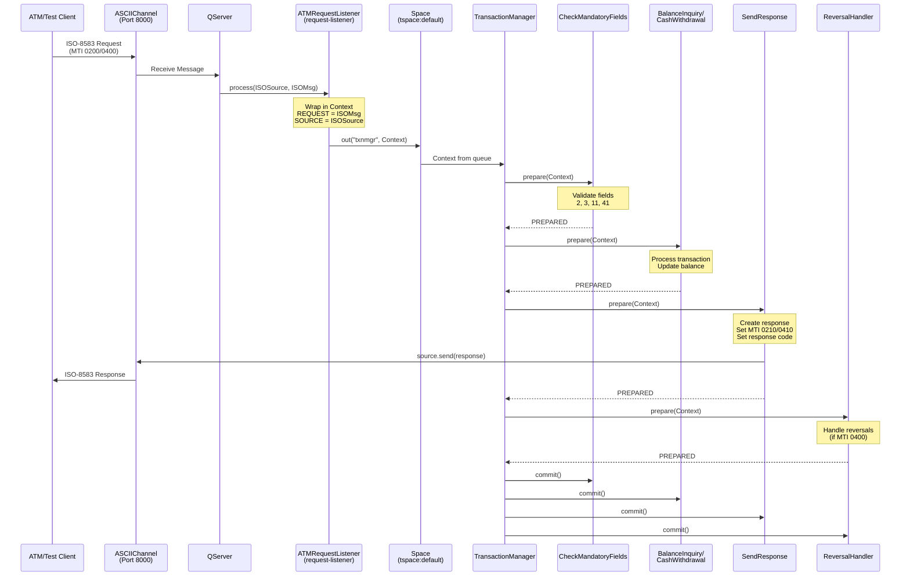

# jPOS ATM Switch

A jPOS 3 application implementing an ATM switch with Java 25, supporting:
- Balance Inquiry transactions (MTI 0200, Processing Code 31xxxx)
- Cash Withdrawal transactions (MTI 0200, Processing Code 01xxxx)
- Reversal operations for timeout scenarios (MTI 0400)
- ASCIIChannel communication
- ISO87A (ISO-8583:1987) message format

## Project Structure

```
jpos-atm-switch/
├── build.gradle                    # Gradle build configuration
├── src/
│   ├── main/
│   │   └── java/
│   │       └── com/example/atm/
│   │           ├── ATMRequestListener.java         # QServer request-listener
│   │           ├── TestClient.java                 # Test client to simulate ATM
│   │           └── participants/
│   │               ├── CheckMandatoryFields.java   # Validates required fields
│   │               ├── BalanceInquiry.java         # Handles balance inquiry
│   │               ├── CashWithdrawal.java         # Handles cash withdrawal
│   │               ├── SendResponse.java           # Sends response to client
│   │               └── ReversalHandler.java        # Handles reversal requests
│   └── dist/
│       ├── deploy/                  # Q2 deployment descriptors
│       │   ├── 00_logger.xml        # Logger configuration
│       │   ├── 10_channel.xml       # QServer with ASCIIChannel and BASE24Packager
│       │   └── 20_txnmgr.xml        # Transaction Manager
│       └── cfg/                     # Configuration files (if needed)
```

## Building the Application

```bash
# Build and install the application
./gradlew installApp

# The application will be installed to: build/install/jpos-atm-switch/
```

## Running the Application

### Start the ATM Switch

```bash
# Run the Q2 server
./gradlew run
```

The switch will listen on port 8000 for incoming connections.

### Run the Test Client

In a separate terminal:

```bash
# Option 1: Using the shell script (recommended)
./run-test-client.sh

# Option 2: Using Gradle task
./gradlew runTestClient
```

## Transaction Types

### Balance Inquiry (MTI: 0200)
- Processing Code: 31xxxx
- Returns account balance in field 54

### Cash Withdrawal (MTI: 0200)
- Processing Code: 01xxxx
- Amount in field 4 (in cents)
- Returns new balance in field 54

### Reversal (MTI: 0400)
- Reverses a previous transaction
- Restores account balance
- Uses same processing code as original transaction

## Response Codes

- `00` - Approved
- `30` - Format error
- `51` - Insufficient funds
- `96` - System error

## Testing Scenarios

The test client demonstrates:
1. Balance inquiry for PAN 4111111111111111
2. Cash withdrawal of 500.00
3. Balance inquiry (shows reduced balance)
4. Reversal of the withdrawal
5. Balance inquiry (shows restored balance)

## Transaction Flow

### Message Flow Diagram



### Execution Flow Details

#### 1. Message Reception
- **QServer** listens on port 8000 using ASCIIChannel with BASE24Packager
- Receives ISO-8583 messages from ATM clients
- For each incoming message, invokes the configured `request-listener`

#### 2. Request Processing (ATMRequestListener.java:25-31)
```java
public boolean process(ISOSource source, ISOMsg msg) {
    Context ctx = new Context();
    ctx.put("REQUEST", msg);      // Original ISO message
    ctx.put("SOURCE", source);    // Channel to send response
    sp.out(queue, ctx, timeout);  // Put in TransactionManager queue
    return true;
}
```

#### 3. Transaction Participants Chain

The TransactionManager executes participants in sequence. Each participant implements the **two-phase commit** pattern (`prepare` → `commit/abort`):

**CheckMandatoryFields** (CheckMandatoryFields.java:14)
- Validates required ISO-8583 fields: PAN (2), Processing Code (3), STAN (11), Terminal ID (41)
- Extracts values into Context for downstream participants
- Returns `PREPARED | NO_JOIN` (doesn't participate in commit phase)

**BalanceInquiry** (BalanceInquiry.java:23)
- Processes only if MTI=0200 and Processing Code starts with "31"
- Generates random balance (simulated)
- Sets response code "00" for success
- Returns `PREPARED | NO_JOIN`

**CashWithdrawal** (CashWithdrawal.java:23)
- Processes only if MTI=0200 and Processing Code starts with "01"
- Maintains in-memory balance per PAN in static HashMap
- Validates sufficient funds
- Deducts withdrawal amount from balance
- Returns `PREPARED` (participates in commit for rollback support)
- On `abort()`: Reverses the withdrawal by adding amount back

**SendResponse** (SendResponse.java:16)
- Creates ISO-8583 response message (0210 or 0410)
- Sets response code from Context (default "96" if error)
- Sends response via `ISOSource.send(response)`
- Returns `PREPARED | NO_JOIN`

**ReversalHandler** (ReversalHandler.java:17)
- Processes only if MTI=0400 (reversal message)
- Logs reversal information
- Sets response code "00"
- Returns `PREPARED | NO_JOIN`

#### 4. Two-Phase Commit

If all participants return `PREPARED`:
- TransactionManager calls `commit()` on each participant
- For CashWithdrawal: transaction is finalized

If any participant returns `ABORTED`:
- TransactionManager calls `abort()` on each participant
- For CashWithdrawal: balance is restored

## Configuration

### QServer Configuration (10_channel.xml)
- **Server Class**: `org.jpos.q2.iso.QServer` - Listens for incoming ISO-8583 messages
- **Protocol**: ASCIIChannel with BASE24Packager
- **Port**: 8000 (listens on all interfaces)
- **Request Listener**: `ATMRequestListener` - Forwards messages to TransactionManager

### Transaction Manager (20_txnmgr.xml)
- **Queue**: `txnmgr` (space: `tspace:default`)
- **Sessions**: 2 concurrent transaction processing threads
- **Max Sessions**: 128 (thanks to Java Virtual Threads in jPOS 3.0)
- **Debug**: enabled for detailed logging
- **Participants**: Executed in order: CheckMandatoryFields → BalanceInquiry → CashWithdrawal → SendResponse → ReversalHandler

## Logs

Application logs are written to: `build/install/jpos-atm-switch/log/q2.log`

## Requirements

- Java 25 (jPOS 3.0.0 requires Java 22+)
- Gradle 8.10 (included via wrapper)
- jPOS 3.0.0
