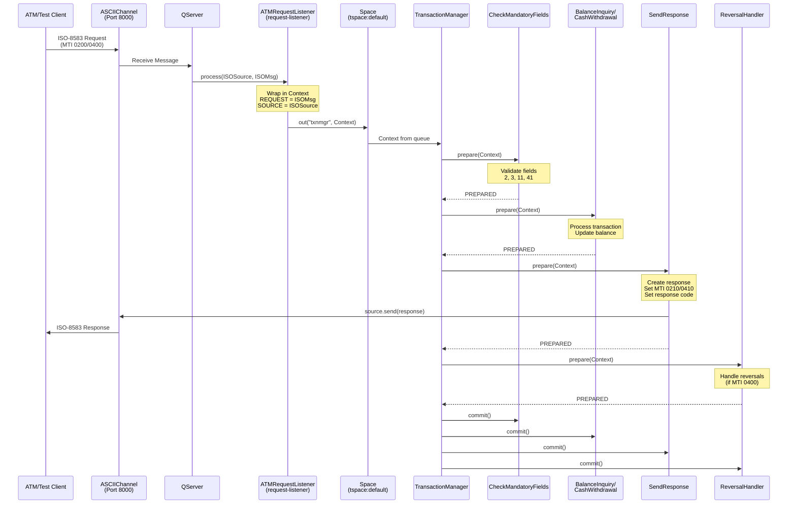
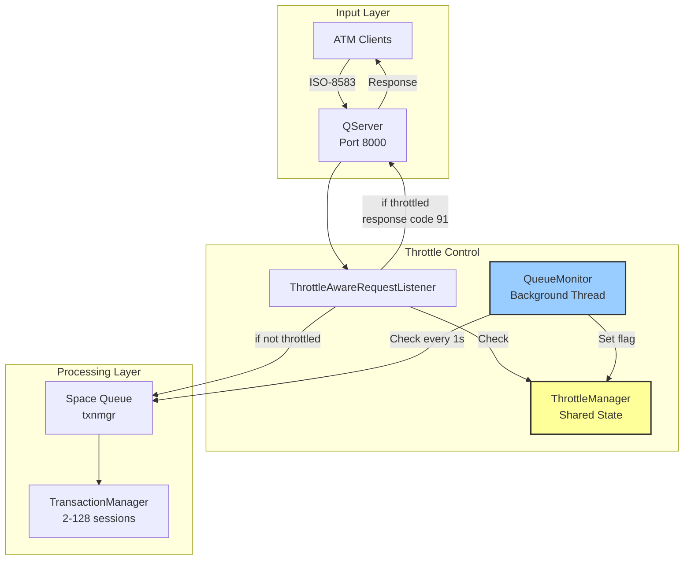
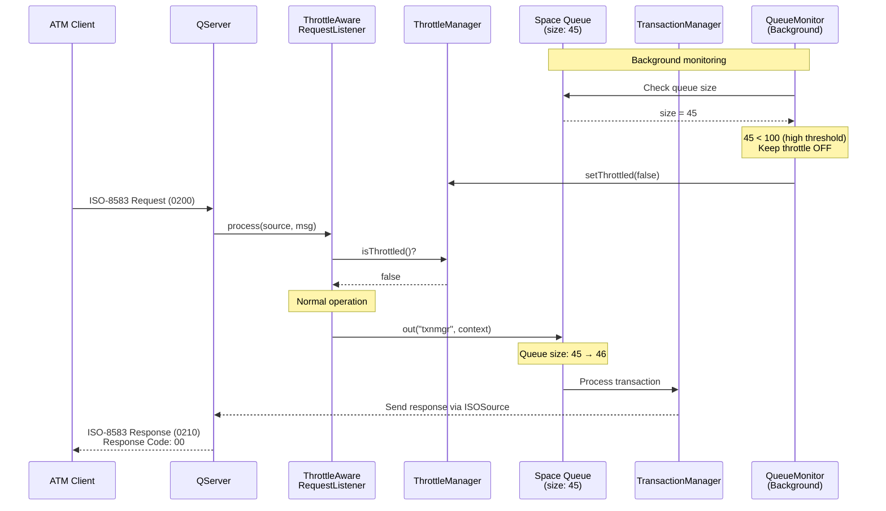
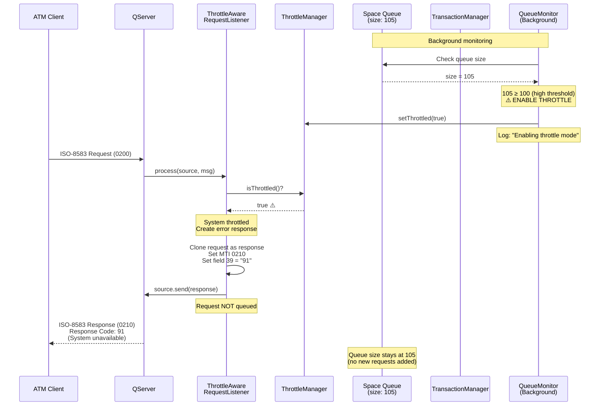
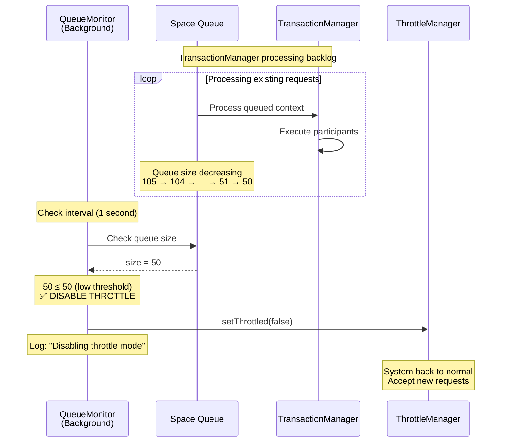
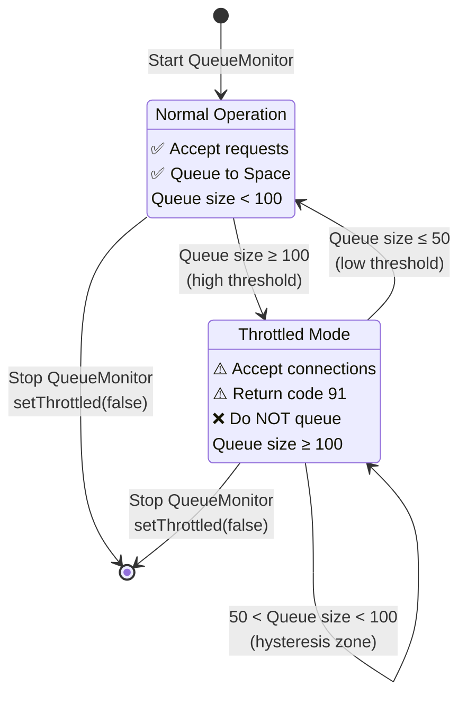
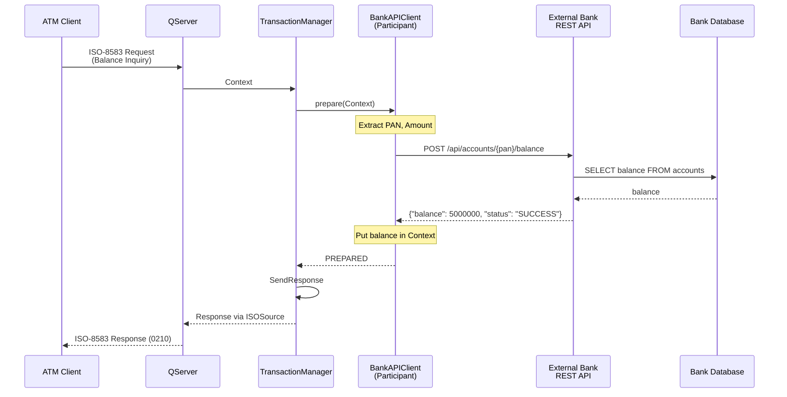
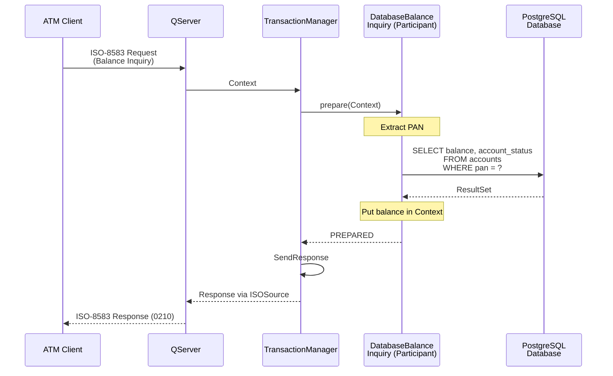

# jPOS ATM Switch

A jPOS 3 application implementing an ATM switch with Java 25, supporting:
- Balance Inquiry transactions (MTI 0200, Processing Code 31xxxx)
- Cash Withdrawal transactions (MTI 0200, Processing Code 01xxxx)
- Reversal operations for timeout scenarios (MTI 0400)
- ASCIIChannel communication
- ISO87A (ISO-8583:1987) message format

## Project Structure

```
jpos-atm-switch/
├── build.gradle                    # Gradle build configuration
├── THROTTLING.md                   # Throttling mechanism documentation
├── src/
│   ├── main/
│   │   └── java/
│   │       └── com/example/atm/
│   │           ├── ATMRequestListener.java              # Basic request-listener
│   │           ├── ThrottleAwareRequestListener.java    # Throttle-aware request-listener
│   │           ├── QueueMonitor.java                    # Queue monitoring QBean
│   │           ├── ThrottleManager.java                 # Shared throttle state
│   │           ├── TestClient.java                      # Test client to simulate ATM
│   │           ├── LoadTestClient.java                  # Load testing tool
│   │           └── participants/
│   │               ├── CheckMandatoryFields.java        # Validates required fields
│   │               ├── BalanceInquiry.java              # Handles balance inquiry
│   │               ├── CashWithdrawal.java              # Handles cash withdrawal
│   │               ├── SendResponse.java                # Sends response to client
│   │               └── ReversalHandler.java             # Handles reversal requests
│   └── dist/
│       ├── deploy/                  # Q2 deployment descriptors
│       │   ├── 00_logger.xml        # Logger configuration
│       │   ├── 10_channel_with_throttle.xml  # QServer with throttle-aware listener
│       │   ├── 15_queue_monitor.xml          # Queue monitoring configuration
│       │   └── 20_txnmgr.xml                 # Transaction Manager
│       └── cfg/                     # Configuration files (if needed)
```

## Building the Application

```bash
# Build and install the application
./gradlew installApp

# The application will be installed to: build/install/jpos-atm-switch/
```

## Running the Application

### Start the ATM Switch

```bash
# Run the Q2 server
./gradlew run
```

The switch will listen on port 8000 for incoming connections.

### Run the Test Client

In a separate terminal:

```bash
# Option 1: Using the shell script (recommended)
./run-test-client.sh

# Option 2: Using Gradle task
./gradlew runTestClient
```

## Transaction Types

### Balance Inquiry (MTI: 0200)
- Processing Code: 31xxxx
- Returns account balance in field 54

### Cash Withdrawal (MTI: 0200)
- Processing Code: 01xxxx
- Amount in field 4 (in cents)
- Returns new balance in field 54

### Reversal (MTI: 0400)
- Reverses a previous transaction
- Restores account balance
- Uses same processing code as original transaction

## Response Codes

- `00` - Approved
- `30` - Format error
- `51` - Insufficient funds
- `91` - System unavailable (returned during throttling)
- `96` - System error

## Testing Scenarios

The test client demonstrates:
1. Balance inquiry for PAN 4111111111111111
2. Cash withdrawal of 500.00
3. Balance inquiry (shows reduced balance)
4. Reversal of the withdrawal
5. Balance inquiry (shows restored balance)

## Transaction Flow

### Message Flow Diagram



### Execution Flow Details

#### 1. Message Reception
- **QServer** listens on port 8000 using ASCIIChannel with BASE24Packager
- Receives ISO-8583 messages from ATM clients
- For each incoming message, invokes the configured `request-listener`

#### 2. Request Processing (ATMRequestListener.java:25-31)
```java
public boolean process(ISOSource source, ISOMsg msg) {
    Context ctx = new Context();
    ctx.put("REQUEST", msg);      // Original ISO message
    ctx.put("SOURCE", source);    // Channel to send response
    sp.out(queue, ctx, timeout);  // Put in TransactionManager queue
    return true;
}
```

#### 3. Transaction Participants Chain

The TransactionManager executes participants in sequence. Each participant implements the **two-phase commit** pattern (`prepare` → `commit/abort`):

**CheckMandatoryFields** (CheckMandatoryFields.java:14)
- Validates required ISO-8583 fields: PAN (2), Processing Code (3), STAN (11), Terminal ID (41)
- Extracts values into Context for downstream participants
- Returns `PREPARED | NO_JOIN` (doesn't participate in commit phase)

**BalanceInquiry** (BalanceInquiry.java:23)
- Processes only if MTI=0200 and Processing Code starts with "31"
- Generates random balance (simulated)
- Sets response code "00" for success
- Returns `PREPARED | NO_JOIN`

**CashWithdrawal** (CashWithdrawal.java:23)
- Processes only if MTI=0200 and Processing Code starts with "01"
- Maintains in-memory balance per PAN in static HashMap
- Validates sufficient funds
- Deducts withdrawal amount from balance
- Returns `PREPARED` (participates in commit for rollback support)
- On `abort()`: Reverses the withdrawal by adding amount back

**SendResponse** (SendResponse.java:16)
- Creates ISO-8583 response message (0210 or 0410)
- Sets response code from Context (default "96" if error)
- Sends response via `ISOSource.send(response)`
- Returns `PREPARED | NO_JOIN`

**ReversalHandler** (ReversalHandler.java:17)
- Processes only if MTI=0400 (reversal message)
- Logs reversal information
- Sets response code "00"
- Returns `PREPARED | NO_JOIN`

#### 4. Two-Phase Commit

If all participants return `PREPARED`:
- TransactionManager calls `commit()` on each participant
- For CashWithdrawal: transaction is finalized

If any participant returns `ABORTED`:
- TransactionManager calls `abort()` on each participant
- For CashWithdrawal: balance is restored

## Queue Monitoring and Throttling

The ATM switch implements **automatic throttling** to prevent system overload when the Space queue size exceeds configurable thresholds. This provides backpressure control during high traffic periods.

### Architecture



### Throttling Behavior

#### Normal Operation (Queue Size < 100)



#### Throttled Operation (Queue Size ≥ 100)



#### Resume Normal Operation (Queue Size ≤ 50)



### State Diagram



### Configuration Parameters

File: `src/dist/deploy/15_queue_monitor.xml`

```xml
<queue-monitor class="com.example.atm.QueueMonitor" logger="Q2" realm="queue-monitor">
    <property name="space" value="tspace:default" />
    <property name="queue" value="txnmgr" />
    <property name="check-interval" value="1000" />      <!-- Check every 1 second -->
    <property name="high-threshold" value="100" />       <!-- Throttle at 100 -->
    <property name="low-threshold" value="50" />         <!-- Resume at 50 -->
</queue-monitor>
```

File: `src/dist/deploy/10_channel_with_throttle.xml`

```xml
<request-listener class="com.example.atm.ThrottleAwareRequestListener"
                  logger="Q2" realm="incoming-request-listener">
    <property name="space" value="tspace:default" />
    <property name="queue" value="txnmgr" />
    <property name="timeout" value="60000" />
    <property name="throttle-response-code" value="91" />  <!-- System unavailable -->
</request-listener>
```

### Response Codes During Throttling

| Code | Description | When Used |
|------|-------------|-----------|
| `00` | Approved | Normal operation - transaction successful |
| `91` | **System malfunction** | **System throttled - queue size exceeded** |
| `96` | System error | Technical error in processing |

### Hysteresis Mechanism

The throttling uses **hysteresis** (different thresholds for enable/disable) to prevent rapid state flapping:

```
Queue Size Timeline:

      100 ─────────────────────────── High Threshold (Enable throttle)
       │    ↑                    ↓
       │    │  Hysteresis Zone  │
       │    │                    │
       50 ─────────────────────────── Low Threshold (Disable throttle)

        0 ────────────────────────────

Timeline:
    95 → 98 → 102 → 105 ⚠️ THROTTLE ENABLED
    105 → 98 → 85 → 70 (still throttled - in hysteresis zone)
    70 → 55 → 48 ✅ THROTTLE DISABLED
    48 → 52 → 55 (still normal - in hysteresis zone)
```

**Without hysteresis** (if using same threshold):
- Queue hits 100: throttle ON
- TransactionManager processes 1 request: queue = 99, throttle OFF
- New request arrives: queue = 100, throttle ON
- TransactionManager processes 1 request: queue = 99, throttle OFF
- **Result**: Rapid on/off flapping, unstable behavior

**With hysteresis** (high=100, low=50):
- Queue hits 100: throttle ON
- Queue must drop to 50 before throttle turns OFF
- Provides stable behavior during load fluctuations

### Load Testing

To test the throttling mechanism, use the included load test client:

```bash
# Lower thresholds for easier testing (edit 15_queue_monitor.xml)
# high-threshold: 10
# low-threshold: 5

# Start the server
./gradlew installApp
build/install/jpos-atm-switch/bin/q2

# In another terminal, generate load
./gradlew run --args="com.example.atm.LoadTestClient 20 10"
```

**Expected behavior:**
1. Initial requests succeed with response code `00`
2. When queue reaches 10, throttle activates
3. New requests receive response code `91` (System unavailable)
4. TransactionManager processes backlog
5. When queue drops to 5, throttle deactivates
6. New requests succeed again with response code `00`

**Monitor logs:**
```
Queue size (10) reached high threshold (10). Enabling throttle mode.
Request rejected (system throttled): MTI=0200
Queue size (5) dropped to low threshold (5). Disabling throttle mode.
```

### Performance Tuning

#### TransactionManager Configuration

File: `src/dist/deploy/20_txnmgr.xml`

```xml
<property name="sessions" value="2" />        <!-- Initial worker threads -->
<property name="max-sessions" value="128" />  <!-- Maximum concurrent sessions -->
```

- **Low traffic**: `sessions=2` sufficient
- **Medium traffic**: `sessions=10-20` recommended
- **High traffic**: Increase `max-sessions` to 256 or 512

#### Queue Threshold Guidelines

| System Capacity | High Threshold | Low Threshold | Check Interval |
|----------------|----------------|---------------|----------------|
| Small (1-10 TPS) | 50 | 25 | 1000ms |
| Medium (10-50 TPS) | 100 | 50 | 1000ms |
| Large (50-200 TPS) | 500 | 250 | 500ms |
| Very Large (200+ TPS) | 1000 | 500 | 500ms |

**Formula:**
- `high_threshold` ≈ `max_sessions` × `avg_transaction_time_seconds`
- `low_threshold` = `high_threshold` × 0.5
- `check_interval` = 1000ms (reduce to 500ms for very high traffic)

### Benefits of Graceful Throttling

**Compared to TCP Connection Rejection:**

| Aspect | Graceful (Code 91) | TCP Rejection |
|--------|-------------------|---------------|
| **Client Experience** | ✅ Receives proper ISO-8583 response | ❌ Connection refused error |
| **Error Handling** | ✅ Standard response code handling | ❌ Network-level exception |
| **Monitoring** | ✅ Trackable via response codes | ❌ Connection attempts not logged |
| **Retry Logic** | ✅ Clients can implement smart retry | ⚠️ May trigger retry storms |
| **Standards Compliance** | ✅ ISO-8583 compliant | ❌ Non-standard error |

### Implementation Details

**Components:**

1. **QueueMonitor.java** (`src/main/java/com/example/atm/QueueMonitor.java:24`)
   - Background thread checking queue size every 1 second
   - Uses `LocalSpace.size(queueName)` to get queue depth
   - Sets shared throttle flag via `ThrottleManager`

2. **ThrottleManager.java** (`src/main/java/com/example/atm/ThrottleManager.java:9`)
   - Singleton with `AtomicBoolean` for thread-safe state
   - Used by both QueueMonitor and ThrottleAwareRequestListener

3. **ThrottleAwareRequestListener.java** (`src/main/java/com/example/atm/ThrottleAwareRequestListener.java:27`)
   - Checks `ThrottleManager.isThrottled()` before queueing
   - Returns ISO-8583 response with code 91 when throttled
   - Accepts TCP connection but doesn't queue to Space

For complete documentation, see [`THROTTLING.md`](THROTTLING.md).

## Configuration

### QServer Configuration (10_channel.xml)
- **Server Class**: `org.jpos.q2.iso.QServer` - Listens for incoming ISO-8583 messages
- **Protocol**: ASCIIChannel with BASE24Packager
- **Port**: 8000 (listens on all interfaces)
- **Request Listener**: `ATMRequestListener` - Forwards messages to TransactionManager

### Transaction Manager (20_txnmgr.xml)
- **Queue**: `txnmgr` (space: `tspace:default`)
- **Sessions**: 2 concurrent transaction processing threads
- **Max Sessions**: 128 (thanks to Java Virtual Threads in jPOS 3.0)
- **Debug**: enabled for detailed logging
- **Participants**: Executed in order: CheckMandatoryFields → BalanceInquiry → CashWithdrawal → SendResponse → ReversalHandler

## Logs

Application logs are written to: `build/install/jpos-atm-switch/log/q2.log`

## Requirements

- Java 25 (jPOS 3.0.0 requires Java 22+)
- Gradle 8.10 (included via wrapper)
- jPOS 3.0.0

## Production Improvements

> **⚠️ Important Note about jPOS-EE:**
>
> jPOS-EE (Extended Edition) provides cleaner database integration with built-in Hibernate support, connection pooling, and transaction participants (`Open`/`Close`). However, **jPOS-EE is not yet compatible with jPOS 3.0** as of January 2025.
>
> - jPOS-EE 2.2.x works with jPOS 2.x (LTS version)
> - jPOS-EE 3.0 is under development (work in progress)
>
> The database integration approaches shown below use **manual connection management** as a temporary workaround. When jPOS-EE 3.0 becomes available, you should migrate to use its `org.jpos.ee.DB` class and `Open`/`Close` participants for cleaner, more maintainable code.

The current implementation uses **in-memory storage** and **simulated data** for demonstration purposes. For production deployment, you should integrate with external systems.

### 1. Integration with External Bank REST API

#### Architecture Overview



#### Implementation Steps

**Step 1: Add HTTP Client Dependency**

Update `build.gradle`:
```gradle
dependencies {
    implementation 'org.jpos:jpos:3.0.0'
    implementation 'org.jdom:jdom2:2.0.6.1'

    // Add HTTP client
    implementation 'com.squareup.okhttp3:okhttp:4.12.0'
    implementation 'com.fasterxml.jackson.core:jackson-databind:2.17.2'

    testImplementation 'junit:junit:4.13.2'
}
```

**Step 2: Create Bank API Client**

File: `src/main/java/com/example/atm/integration/BankAPIClient.java`
```java
package com.example.atm.integration;

import com.fasterxml.jackson.databind.ObjectMapper;
import okhttp3.*;

import java.io.IOException;
import java.math.BigDecimal;
import java.util.concurrent.TimeUnit;

public class BankAPIClient {
    private final OkHttpClient client;
    private final String baseUrl;
    private final ObjectMapper objectMapper;

    public BankAPIClient(String baseUrl) {
        this.baseUrl = baseUrl;
        this.client = new OkHttpClient.Builder()
                .connectTimeout(10, TimeUnit.SECONDS)
                .readTimeout(30, TimeUnit.SECONDS)
                .build();
        this.objectMapper = new ObjectMapper();
    }

    public BalanceResponse getBalance(String pan) throws IOException {
        Request request = new Request.Builder()
                .url(baseUrl + "/api/accounts/" + pan + "/balance")
                .get()
                .build();

        try (Response response = client.newCall(request).execute()) {
            if (!response.isSuccessful()) {
                throw new IOException("Unexpected code " + response);
            }
            return objectMapper.readValue(response.body().string(), BalanceResponse.class);
        }
    }

    public WithdrawalResponse withdraw(String pan, BigDecimal amount) throws IOException {
        MediaType JSON = MediaType.get("application/json; charset=utf-8");

        String json = objectMapper.writeValueAsString(
            new WithdrawalRequest(pan, amount)
        );

        RequestBody body = RequestBody.create(json, JSON);
        Request request = new Request.Builder()
                .url(baseUrl + "/api/accounts/" + pan + "/withdraw")
                .post(body)
                .build();

        try (Response response = client.newCall(request).execute()) {
            if (!response.isSuccessful()) {
                throw new IOException("Unexpected code " + response);
            }
            return objectMapper.readValue(response.body().string(), WithdrawalResponse.class);
        }
    }

    public static class BalanceResponse {
        public BigDecimal balance;
        public String status;
        public String accountNumber;
    }

    public static class WithdrawalRequest {
        public String pan;
        public BigDecimal amount;

        public WithdrawalRequest(String pan, BigDecimal amount) {
            this.pan = pan;
            this.amount = amount;
        }
    }

    public static class WithdrawalResponse {
        public String status;
        public BigDecimal newBalance;
        public String transactionId;
    }
}
```

**Step 3: Create REST Integration Participant**

File: `src/main/java/com/example/atm/participants/BankAPIBalanceInquiry.java`
```java
package com.example.atm.participants;

import com.example.atm.integration.BankAPIClient;
import org.jpos.core.Configurable;
import org.jpos.core.Configuration;
import org.jpos.transaction.Context;
import org.jpos.transaction.TransactionParticipant;
import org.jpos.util.Logger;

import java.io.Serializable;

public class BankAPIBalanceInquiry implements TransactionParticipant, Configurable {
    private Configuration cfg;
    private Logger logger;
    private BankAPIClient apiClient;

    @Override
    public int prepare(long id, Serializable context) {
        Context ctx = (Context) context;
        String mti = (String) ctx.get("MTI");
        String processingCode = (String) ctx.get("PROCESSING_CODE");

        // Only process balance inquiry
        if (!"0200".equals(mti) || !processingCode.startsWith("31")) {
            return PREPARED | NO_JOIN;
        }

        String pan = (String) ctx.get("PAN");

        try {
            // Call external bank API
            BankAPIClient.BalanceResponse response = apiClient.getBalance(pan);

            if ("SUCCESS".equals(response.status)) {
                ctx.put("BALANCE", response.balance);
                ctx.put("RESPONSE_CODE", "00");
            } else {
                ctx.put("RESPONSE_CODE", "96"); // System error
            }

        } catch (Exception e) {
            ctx.put("RESPONSE_CODE", "91"); // System malfunction
            ctx.put("ERROR", e.getMessage());
            if (logger != null) {
                logger.error("Bank API error", e);
            }
        }

        return PREPARED | NO_JOIN;
    }

    @Override
    public void commit(long id, Serializable context) {
        // No-op for inquiry
    }

    @Override
    public void abort(long id, Serializable context) {
        Context ctx = (Context) context;
        ctx.put("RESPONSE_CODE", "96");
    }

    @Override
    public void setConfiguration(Configuration cfg) {
        this.cfg = cfg;
        String baseUrl = cfg.get("bank-api-url", "http://localhost:8080");
        this.apiClient = new BankAPIClient(baseUrl);

        String loggerName = cfg.get("logger");
        if (loggerName != null) {
            logger = Logger.getLogger(loggerName);
        }
    }
}
```

**Step 4: Update Transaction Manager Configuration**

File: `src/dist/deploy/20_txnmgr.xml`

Replace `BalanceInquiry` with `BankAPIBalanceInquiry`:
```xml
<txnmgr name="txnmgr" logger="Q2" class="org.jpos.transaction.TransactionManager">
    <property name="queue" value="txnmgr" />
    <property name="sessions" value="2" />
    <property name="max-sessions" value="128" />
    <property name="debug" value="true" />

    <participant class="com.example.atm.participants.CheckMandatoryFields"
                 logger="Q2" realm="check-mandatory-fields" />

    <!-- Use REST API for balance inquiry -->
    <participant class="com.example.atm.participants.BankAPIBalanceInquiry"
                 logger="Q2" realm="bank-api-balance">
        <property name="bank-api-url" value="http://localhost:8080" />
    </participant>

    <participant class="com.example.atm.participants.CashWithdrawal"
                 logger="Q2" realm="cash-withdrawal" />
    <participant class="com.example.atm.participants.SendResponse"
                 logger="Q2" realm="send-response" />
    <participant class="com.example.atm.participants.ReversalHandler"
                 logger="Q2" realm="reversal-handler" />
</txnmgr>
```

**Step 5: External Bank API Requirements**

The external bank application should provide these endpoints:

```
GET  /api/accounts/{pan}/balance
POST /api/accounts/{pan}/withdraw
POST /api/accounts/{pan}/reversal
```

### 2. Integration with PostgreSQL Database

#### Architecture Overview



#### Database Schema

```sql
-- Create accounts table
CREATE TABLE accounts (
    id BIGSERIAL PRIMARY KEY,
    pan VARCHAR(19) NOT NULL UNIQUE,
    account_number VARCHAR(20) NOT NULL,
    account_name VARCHAR(100) NOT NULL,
    balance DECIMAL(15,2) NOT NULL DEFAULT 0,
    account_status VARCHAR(20) NOT NULL DEFAULT 'ACTIVE',
    created_at TIMESTAMP NOT NULL DEFAULT CURRENT_TIMESTAMP,
    updated_at TIMESTAMP NOT NULL DEFAULT CURRENT_TIMESTAMP
);

-- Create transactions table
CREATE TABLE transactions (
    id BIGSERIAL PRIMARY KEY,
    account_id BIGINT NOT NULL REFERENCES accounts(id),
    transaction_type VARCHAR(20) NOT NULL,
    amount DECIMAL(15,2) NOT NULL,
    balance_before DECIMAL(15,2) NOT NULL,
    balance_after DECIMAL(15,2) NOT NULL,
    stan VARCHAR(6) NOT NULL,
    terminal_id VARCHAR(16) NOT NULL,
    response_code VARCHAR(2) NOT NULL,
    created_at TIMESTAMP NOT NULL DEFAULT CURRENT_TIMESTAMP
);

-- Create index for faster lookups
CREATE INDEX idx_accounts_pan ON accounts(pan);
CREATE INDEX idx_transactions_account_id ON transactions(account_id);
CREATE INDEX idx_transactions_stan ON transactions(stan);

-- Sample data
INSERT INTO accounts (pan, account_number, account_name, balance, account_status)
VALUES
    ('4111111111111111', '1234567890', 'John Doe', 5000000.00, 'ACTIVE'),
    ('4111111111111112', '1234567891', 'Jane Smith', 3000000.00, 'ACTIVE');
```

#### Implementation Steps

**Step 1: Add Database Dependencies**

Update `build.gradle`:
```gradle
dependencies {
    implementation 'org.jpos:jpos:3.0.0'
    implementation 'org.jdom:jdom2:2.0.6.1'

    // Add PostgreSQL driver and connection pool
    implementation 'org.postgresql:postgresql:42.7.3'
    implementation 'com.zaxxer:HikariCP:5.1.0'

    testImplementation 'junit:junit:4.13.2'
}
```

**Step 2: Create Database Configuration**

File: `src/dist/cfg/database.properties`
```properties
db.url=jdbc:postgresql://localhost:5432/atm_switch
db.username=postgres
db.password=postgres
db.driver=org.postgresql.Driver
db.pool.size=10
db.pool.timeout=30000
```

**Step 3: Create Database Manager**

File: `src/main/java/com/example/atm/database/DatabaseManager.java`
```java
package com.example.atm.database;

import com.zaxxer.hikari.HikariConfig;
import com.zaxxer.hikari.HikariDataSource;

import java.io.FileInputStream;
import java.io.IOException;
import java.sql.Connection;
import java.sql.SQLException;
import java.util.Properties;

public class DatabaseManager {
    private static DatabaseManager instance;
    private HikariDataSource dataSource;

    private DatabaseManager(String configFile) throws IOException {
        Properties props = new Properties();
        props.load(new FileInputStream(configFile));

        HikariConfig config = new HikariConfig();
        config.setJdbcUrl(props.getProperty("db.url"));
        config.setUsername(props.getProperty("db.username"));
        config.setPassword(props.getProperty("db.password"));
        config.setDriverClassName(props.getProperty("db.driver"));
        config.setMaximumPoolSize(Integer.parseInt(props.getProperty("db.pool.size", "10")));
        config.setConnectionTimeout(Long.parseLong(props.getProperty("db.pool.timeout", "30000")));
        config.setAutoCommit(false); // Manual transaction management

        this.dataSource = new HikariDataSource(config);
    }

    public static synchronized DatabaseManager getInstance(String configFile) throws IOException {
        if (instance == null) {
            instance = new DatabaseManager(configFile);
        }
        return instance;
    }

    public Connection getConnection() throws SQLException {
        return dataSource.getConnection();
    }

    public void close() {
        if (dataSource != null && !dataSource.isClosed()) {
            dataSource.close();
        }
    }
}
```

**Step 4: Create Database Participant**

File: `src/main/java/com/example/atm/participants/DatabaseBalanceInquiry.java`
```java
package com.example.atm.participants;

import com.example.atm.database.DatabaseManager;
import org.jpos.core.Configurable;
import org.jpos.core.Configuration;
import org.jpos.transaction.Context;
import org.jpos.transaction.TransactionParticipant;
import org.jpos.util.Logger;

import java.io.Serializable;
import java.math.BigDecimal;
import java.sql.Connection;
import java.sql.PreparedStatement;
import java.sql.ResultSet;

public class DatabaseBalanceInquiry implements TransactionParticipant, Configurable {
    private Configuration cfg;
    private Logger logger;
    private DatabaseManager dbManager;

    @Override
    public int prepare(long id, Serializable context) {
        Context ctx = (Context) context;
        String mti = (String) ctx.get("MTI");
        String processingCode = (String) ctx.get("PROCESSING_CODE");

        // Only process balance inquiry
        if (!"0200".equals(mti) || !processingCode.startsWith("31")) {
            return PREPARED | NO_JOIN;
        }

        String pan = (String) ctx.get("PAN");

        try (Connection conn = dbManager.getConnection();
             PreparedStatement ps = conn.prepareStatement(
                     "SELECT balance, account_status FROM accounts WHERE pan = ?")) {

            ps.setString(1, pan);
            ResultSet rs = ps.executeQuery();

            if (rs.next()) {
                String status = rs.getString("account_status");

                if ("ACTIVE".equals(status)) {
                    BigDecimal balance = rs.getBigDecimal("balance");
                    ctx.put("BALANCE", balance);
                    ctx.put("RESPONSE_CODE", "00");
                } else {
                    ctx.put("RESPONSE_CODE", "57"); // Transaction not permitted
                }
            } else {
                ctx.put("RESPONSE_CODE", "14"); // Invalid card number
            }

        } catch (Exception e) {
            ctx.put("RESPONSE_CODE", "96"); // System error
            ctx.put("ERROR", e.getMessage());
            if (logger != null) {
                logger.error("Database error", e);
            }
        }

        return PREPARED | NO_JOIN;
    }

    @Override
    public void commit(long id, Serializable context) {
        // No-op for inquiry
    }

    @Override
    public void abort(long id, Serializable context) {
        Context ctx = (Context) context;
        ctx.put("RESPONSE_CODE", "96");
    }

    @Override
    public void setConfiguration(Configuration cfg) {
        this.cfg = cfg;
        String dbConfigFile = cfg.get("database-config", "cfg/database.properties");

        try {
            this.dbManager = DatabaseManager.getInstance(dbConfigFile);
        } catch (Exception e) {
            throw new RuntimeException("Failed to initialize database", e);
        }

        String loggerName = cfg.get("logger");
        if (loggerName != null) {
            logger = Logger.getLogger(loggerName);
        }
    }
}
```

File: `src/main/java/com/example/atm/participants/DatabaseCashWithdrawal.java`
```java
package com.example.atm.participants;

import com.example.atm.database.DatabaseManager;
import org.jpos.core.Configurable;
import org.jpos.core.Configuration;
import org.jpos.iso.ISOMsg;
import org.jpos.transaction.Context;
import org.jpos.transaction.TransactionParticipant;
import org.jpos.util.Logger;

import java.io.Serializable;
import java.math.BigDecimal;
import java.sql.Connection;
import java.sql.PreparedStatement;
import java.sql.ResultSet;

public class DatabaseCashWithdrawal implements TransactionParticipant, Configurable {
    private Configuration cfg;
    private Logger logger;
    private DatabaseManager dbManager;

    @Override
    public int prepare(long id, Serializable context) {
        Context ctx = (Context) context;
        String mti = (String) ctx.get("MTI");
        String processingCode = (String) ctx.get("PROCESSING_CODE");

        if (!"0200".equals(mti) || !processingCode.startsWith("01")) {
            return PREPARED | NO_JOIN;
        }

        ISOMsg msg = (ISOMsg) ctx.get("REQUEST");
        String pan = (String) ctx.get("PAN");
        String stan = (String) ctx.get("STAN");
        String terminalId = (String) ctx.get("TERMINAL_ID");

        try {
            String amountStr = msg.getString(4);
            BigDecimal amount = new BigDecimal(amountStr).divide(new BigDecimal("100"));

            Connection conn = dbManager.getConnection();
            ctx.put("DB_CONNECTION", conn); // Store for commit/abort

            // Lock the row for update
            PreparedStatement ps = conn.prepareStatement(
                    "SELECT id, balance, account_status FROM accounts WHERE pan = ? FOR UPDATE");
            ps.setString(1, pan);
            ResultSet rs = ps.executeQuery();

            if (rs.next()) {
                long accountId = rs.getLong("id");
                BigDecimal currentBalance = rs.getBigDecimal("balance");
                String status = rs.getString("account_status");

                if (!"ACTIVE".equals(status)) {
                    ctx.put("RESPONSE_CODE", "57");
                    return PREPARED;
                }

                if (currentBalance.compareTo(amount) < 0) {
                    ctx.put("RESPONSE_CODE", "51"); // Insufficient funds
                    return PREPARED;
                }

                // Update balance
                BigDecimal newBalance = currentBalance.subtract(amount);
                PreparedStatement updatePs = conn.prepareStatement(
                        "UPDATE accounts SET balance = ?, updated_at = CURRENT_TIMESTAMP WHERE id = ?");
                updatePs.setBigDecimal(1, newBalance);
                updatePs.setLong(2, accountId);
                updatePs.executeUpdate();

                // Insert transaction record
                PreparedStatement txnPs = conn.prepareStatement(
                        "INSERT INTO transactions (account_id, transaction_type, amount, " +
                        "balance_before, balance_after, stan, terminal_id, response_code) " +
                        "VALUES (?, ?, ?, ?, ?, ?, ?, ?)");
                txnPs.setLong(1, accountId);
                txnPs.setString(2, "WITHDRAWAL");
                txnPs.setBigDecimal(3, amount);
                txnPs.setBigDecimal(4, currentBalance);
                txnPs.setBigDecimal(5, newBalance);
                txnPs.setString(6, stan);
                txnPs.setString(7, terminalId);
                txnPs.setString(8, "00");
                txnPs.executeUpdate();

                ctx.put("NEW_BALANCE", newBalance);
                ctx.put("RESPONSE_CODE", "00");
            } else {
                ctx.put("RESPONSE_CODE", "14"); // Invalid card
            }

        } catch (Exception e) {
            ctx.put("RESPONSE_CODE", "96");
            ctx.put("ERROR", e.getMessage());
            if (logger != null) {
                logger.error("Withdrawal error", e);
            }
        }

        return PREPARED; // Participate in commit
    }

    @Override
    public void commit(long id, Serializable context) {
        Context ctx = (Context) context;
        Connection conn = (Connection) ctx.get("DB_CONNECTION");
        if (conn != null) {
            try {
                conn.commit();
                conn.close();
            } catch (Exception e) {
                if (logger != null) {
                    logger.error("Commit error", e);
                }
            }
        }
    }

    @Override
    public void abort(long id, Serializable context) {
        Context ctx = (Context) context;
        Connection conn = (Connection) ctx.get("DB_CONNECTION");
        if (conn != null) {
            try {
                conn.rollback();
                conn.close();
            } catch (Exception e) {
                if (logger != null) {
                    logger.error("Rollback error", e);
                }
            }
        }
        ctx.put("RESPONSE_CODE", "96");
    }

    @Override
    public void setConfiguration(Configuration cfg) {
        this.cfg = cfg;
        String dbConfigFile = cfg.get("database-config", "cfg/database.properties");

        try {
            this.dbManager = DatabaseManager.getInstance(dbConfigFile);
        } catch (Exception e) {
            throw new RuntimeException("Failed to initialize database", e);
        }

        String loggerName = cfg.get("logger");
        if (loggerName != null) {
            logger = Logger.getLogger(loggerName);
        }
    }
}
```

**Step 5: Update Transaction Manager Configuration**

File: `src/dist/deploy/20_txnmgr.xml`
```xml
<txnmgr name="txnmgr" logger="Q2" class="org.jpos.transaction.TransactionManager">
    <property name="queue" value="txnmgr" />
    <property name="sessions" value="2" />
    <property name="max-sessions" value="128" />
    <property name="debug" value="true" />

    <participant class="com.example.atm.participants.CheckMandatoryFields"
                 logger="Q2" realm="check-mandatory-fields" />

    <!-- Use PostgreSQL for balance inquiry -->
    <participant class="com.example.atm.participants.DatabaseBalanceInquiry"
                 logger="Q2" realm="db-balance">
        <property name="database-config" value="cfg/database.properties" />
    </participant>

    <!-- Use PostgreSQL for cash withdrawal -->
    <participant class="com.example.atm.participants.DatabaseCashWithdrawal"
                 logger="Q2" realm="db-withdrawal">
        <property name="database-config" value="cfg/database.properties" />
    </participant>

    <participant class="com.example.atm.participants.SendResponse"
                 logger="Q2" realm="send-response" />
    <participant class="com.example.atm.participants.ReversalHandler"
                 logger="Q2" realm="reversal-handler" />
</txnmgr>
```

**Step 6: Setup PostgreSQL**

```bash
# Start PostgreSQL with Docker
docker run --name atm-postgres \
  -e POSTGRES_PASSWORD=postgres \
  -e POSTGRES_DB=atm_switch \
  -p 5432:5432 \
  -d postgres:16

# Execute SQL schema
psql -h localhost -U postgres -d atm_switch -f schema.sql
```

### Comparison: In-Memory vs REST API vs Database

| Aspect | In-Memory (Current) | REST API | PostgreSQL |
|--------|---------------------|----------|------------|
| **Persistence** | ❌ Lost on restart | ✅ Persistent | ✅ Persistent |
| **Scalability** | ❌ Single instance only | ✅ Horizontal scaling | ✅ Read replicas |
| **Transaction Safety** | ⚠️ Limited | ✅ ACID via external system | ✅ ACID guarantees |
| **Performance** | ⚡ Fastest (in-process) | 🐢 Network latency | ⚡ Fast (connection pool) |
| **Complexity** | ✅ Simple | ⚠️ Requires external service | ⚠️ Requires DB setup |
| **Use Case** | Development/Demo | Microservices architecture | Traditional monolith |

### Key Differences

**REST API Approach:**
- ✅ Decoupled architecture
- ✅ Language-agnostic integration
- ✅ Easy to add caching layers
- ❌ Network overhead
- ❌ Additional service dependency

**Database Approach:**
- ✅ Direct data access
- ✅ ACID transactions
- ✅ Better performance (no HTTP overhead)
- ✅ Transaction logging built-in
- ❌ Tight coupling to database schema
- ❌ Requires database administration

Choose **REST API** for microservices architecture where bank logic is separate.
Choose **Database** for traditional applications where the ATM switch owns the account data.

### 3. Future: jPOS-EE 3.0 Approach (When Available)

When jPOS-EE 3.0 becomes available with jPOS 3.0 support, the database integration will be much simpler and cleaner.

#### Expected jPOS-EE 3.0 Pattern

**Configuration (`cfg/db.properties`):**
```properties
hibernate.connection.username=postgres
hibernate.connection.password=postgres
hibernate.dialect=org.hibernate.dialect.PostgreSQLDialect
hibernate.connection.url=jdbc:postgresql://localhost:5432/atm_switch
hibernate.c3p0.min_size=5
hibernate.c3p0.max_size=20
hibernate.c3p0.timeout=300
```

**Transaction Manager (`deploy/20_txnmgr.xml`):**
```xml
<txnmgr name="txnmgr" logger="Q2" class="org.jpos.transaction.TransactionManager">
    <property name="queue" value="txnmgr" />
    <property name="sessions" value="2" />
    <property name="max-sessions" value="128" />

    <!-- Open database session and transaction -->
    <participant class="org.jpos.transaction.Open" logger="Q2">
        <property name="timeout" value="30000" />
    </participant>

    <participant class="com.example.atm.participants.CheckMandatoryFields"
                 logger="Q2" realm="check-mandatory-fields" />

    <!-- Business participants use DB from context -->
    <participant class="com.example.atm.participants.BalanceInquiryEE"
                 logger="Q2" realm="balance-inquiry" />
    <participant class="com.example.atm.participants.CashWithdrawalEE"
                 logger="Q2" realm="cash-withdrawal" />

    <participant class="com.example.atm.participants.SendResponse"
                 logger="Q2" realm="send-response" />

    <!-- Close database session (auto commit/rollback) -->
    <participant class="org.jpos.transaction.Close" logger="Q2" />
</txnmgr>
```

**Participant Code:**
```java
package com.example.atm.participants;

import org.jpos.ee.DB;
import org.jpos.transaction.Context;
import org.jpos.transaction.TransactionParticipant;
import com.example.atm.entities.Account;

import java.io.Serializable;
import java.math.BigDecimal;

public class BalanceInquiryEE implements TransactionParticipant {

    @Override
    public int prepare(long id, Serializable context) {
        Context ctx = (Context) context;
        String mti = (String) ctx.get("MTI");
        String processingCode = (String) ctx.get("PROCESSING_CODE");

        if (!"0200".equals(mti) || !processingCode.startsWith("31")) {
            return PREPARED | NO_JOIN;
        }

        String pan = (String) ctx.get("PAN");

        // Get DB from context (opened by Open participant)
        DB db = (DB) ctx.get("DB");

        // Use HQL or Criteria API
        Account account = db.session()
            .createQuery("from Account where pan = :pan", Account.class)
            .setParameter("pan", pan)
            .uniqueResult();

        if (account != null && "ACTIVE".equals(account.getStatus())) {
            ctx.put("BALANCE", account.getBalance());
            ctx.put("RESPONSE_CODE", "00");
        } else if (account == null) {
            ctx.put("RESPONSE_CODE", "14"); // Invalid card
        } else {
            ctx.put("RESPONSE_CODE", "57"); // Transaction not permitted
        }

        return PREPARED | NO_JOIN;
    }

    @Override
    public void commit(long id, Serializable context) {
        // No-op, Close participant handles commit
    }

    @Override
    public void abort(long id, Serializable context) {
        Context ctx = (Context) context;
        ctx.put("RESPONSE_CODE", "96");
    }
}
```

**Participant with Updates:**
```java
public class CashWithdrawalEE implements TransactionParticipant {

    @Override
    public int prepare(long id, Serializable context) {
        Context ctx = (Context) context;
        String mti = (String) ctx.get("MTI");
        String processingCode = (String) ctx.get("PROCESSING_CODE");

        if (!"0200".equals(mti) || !processingCode.startsWith("01")) {
            return PREPARED | NO_JOIN;
        }

        ISOMsg msg = (ISOMsg) ctx.get("REQUEST");
        String pan = (String) ctx.get("PAN");
        String stan = (String) ctx.get("STAN");
        String terminalId = (String) ctx.get("TERMINAL_ID");

        String amountStr = msg.getString(4);
        BigDecimal amount = new BigDecimal(amountStr).divide(new BigDecimal("100"));

        DB db = (DB) ctx.get("DB");

        // Lock row for update
        Account account = db.session()
            .createQuery("from Account where pan = :pan", Account.class)
            .setParameter("pan", pan)
            .setLockMode(LockModeType.PESSIMISTIC_WRITE)
            .uniqueResult();

        if (account == null) {
            ctx.put("RESPONSE_CODE", "14");
            return PREPARED | NO_JOIN;
        }

        if (!"ACTIVE".equals(account.getStatus())) {
            ctx.put("RESPONSE_CODE", "57");
            return PREPARED | NO_JOIN;
        }

        if (account.getBalance().compareTo(amount) < 0) {
            ctx.put("RESPONSE_CODE", "51");
            return PREPARED | NO_JOIN;
        }

        // Update balance
        BigDecimal newBalance = account.getBalance().subtract(amount);
        account.setBalance(newBalance);
        db.session().update(account);

        // Log transaction
        Transaction txn = new Transaction();
        txn.setAccount(account);
        txn.setType("WITHDRAWAL");
        txn.setAmount(amount);
        txn.setStan(stan);
        txn.setTerminalId(terminalId);
        db.session().save(txn);

        ctx.put("NEW_BALANCE", newBalance);
        ctx.put("RESPONSE_CODE", "00");

        return PREPARED; // Participate in commit
    }

    @Override
    public void commit(long id, Serializable context) {
        // Close participant handles commit
    }

    @Override
    public void abort(long id, Serializable context) {
        // Close participant handles rollback automatically
        Context ctx = (Context) context;
        ctx.put("RESPONSE_CODE", "96");
    }
}
```

#### Key Benefits of jPOS-EE Approach

**vs Manual Connection Management:**
- ✅ **No manual connection lifecycle** - `Open`/`Close` participants handle it
- ✅ **Automatic transaction management** - commit/rollback handled automatically
- ✅ **Connection pooling built-in** - C3P0 configured through properties
- ✅ **Cleaner code** - participants focus on business logic only
- ✅ **Hibernate ORM** - entities instead of JDBC
- ✅ **Less boilerplate** - no try-catch-finally for connections

**Comparison:**

| Feature | Manual (Current) | jPOS-EE (Future) |
|---------|-----------------|------------------|
| Connection Management | Manual in each participant | `Open`/`Close` participants |
| Transaction Control | Store Connection in Context | Automatic via `DB` class |
| Rollback Logic | Manual in `abort()` | Automatic |
| Connection Pool | Manual HikariCP setup | Built-in C3P0 |
| Code Complexity | High (150+ lines) | Low (50-80 lines) |
| Error Handling | Manual try-catch | Built-in |
| ORM Support | ❌ JDBC only | ✅ Hibernate entities |

#### Migration Path

When jPOS-EE 3.0 is released:

1. **Add jPOS-EE dependency** to `build.gradle`:
   ```gradle
   implementation 'org.jpos.ee:jposee-db-postgresql:3.0.0'
   ```

2. **Create Hibernate entities** for your tables

3. **Replace manual participants** with jPOS-EE versions using `DB` class

4. **Add `Open`/`Close`** participants to transaction manager

5. **Remove** manual `DatabaseManager` and connection handling code

6. **Configure** `cfg/db.properties` instead of programmatic setup

#### References

- [jPOS-EE GitHub Repository](https://github.com/jpos/jPOS-EE)
- [jPOS-EE Database Support Documentation](https://github.com/jpos/jPOS-EE/blob/master/doc/src/asciidoc/module_dbsupport.adoc)
- [jPOS 3.0 Release Notes](https://jpos.org/blog/2024/11/jpos-3.0.0-has-been-released/)

**Note:** Monitor the [jPOS mailing list](https://groups.google.com/g/jpos-users) for jPOS-EE 3.0 release announcements.
