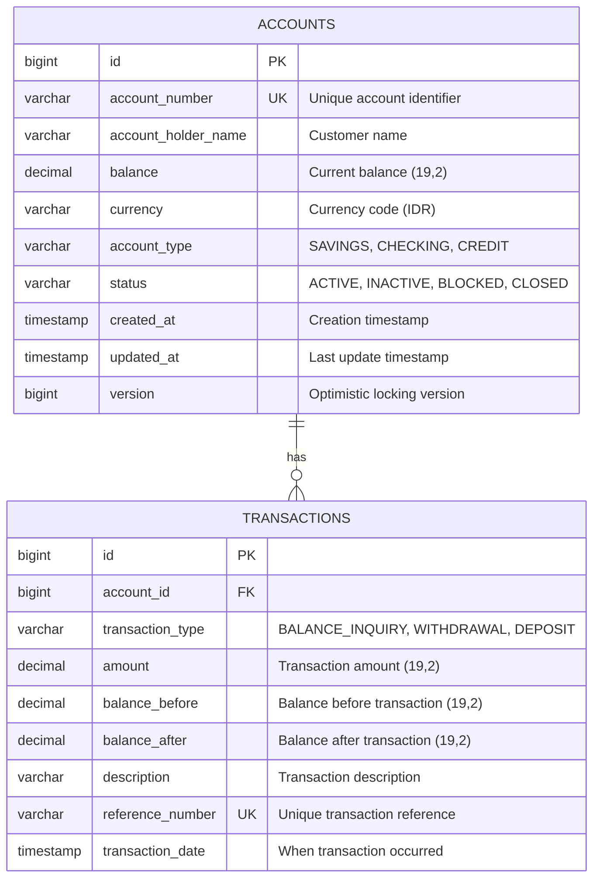
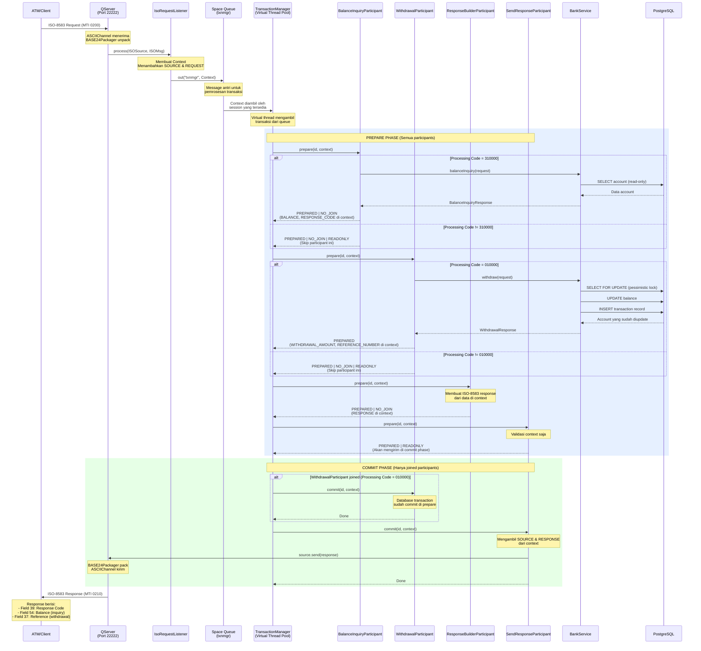

# Spring Boot ATM Server

Aplikasi Spring Boot untuk operasi perbankan dengan database PostgreSQL.

## Fitur

- Balance inquiry (cek saldo)
- Cash withdrawal (tarik tunai)
- Transaction history tracking (pencatatan riwayat transaksi)
- PostgreSQL 17 database
- Flyway database migrations
- Virtual threads support (Java 25)

## Prerequisites

- Java 25
- Docker dan Docker Compose
- Maven

## Setup Database

Jalankan PostgreSQL menggunakan Docker Compose:

```bash
docker-compose up -d
```

Perintah ini akan menjalankan PostgreSQL 17 di port 5432 dengan kredensial berikut:
- Database: `bankdb`
- Username: `bankuser`
- Password: `bankpass`

## Menjalankan Aplikasi

```bash
mvn spring-boot:run
```

Aplikasi akan:
1. Terkoneksi ke PostgreSQL
2. Menjalankan Flyway migrations untuk membuat table
3. Memasukkan data sampel
4. Berjalan di port default 8080

## Database Schema



### Table Accounts
- `id`: Primary key
- `account_number`: Identifier rekening yang unik
- `account_holder_name`: Nama nasabah
- `balance`: Saldo saat ini
- `currency`: Kode mata uang (default: IDR)
- `account_type`: SAVINGS, CHECKING, CREDIT
- `status`: ACTIVE, INACTIVE, BLOCKED, CLOSED
- `version`: Versi untuk optimistic locking

### Table Transactions
- `id`: Primary key
- `account_id`: Foreign key ke table accounts
- `transaction_type`: BALANCE_INQUIRY, WITHDRAWAL, DEPOSIT, dll.
- `amount`: Nominal transaksi
- `balance_before`: Saldo sebelum transaksi
- `balance_after`: Saldo setelah transaksi
- `description`: Deskripsi transaksi
- `reference_number`: Nomor referensi transaksi yang unik
- `transaction_date`: Waktu transaksi terjadi

## Data Sampel

Tiga akun test dibuat:
- Account: `1234567890` - John Doe (Saldo: 5.000.000 IDR)
- Account: `0987654321` - Jane Smith (Saldo: 3.000.000 IDR)
- Account: `5555555555` - Bob Johnson (Saldo: 10.000.000 IDR)

## REST API Endpoints

Base URL: `http://localhost:8080/api/bank`

### 1. Balance Inquiry

**Endpoint:** `POST /api/bank/balance-inquiry`

**Deskripsi:** Query saldo rekening tanpa mengubah data (operasi read-only)

**Request Body:**
```json
{
  "accountNumber": "1234567890"
}
```

**Success Response (200 OK):**
```json
{
  "accountNumber": "1234567890",
  "accountHolderName": "John Doe",
  "balance": 5000000.00,
  "currency": "IDR",
  "accountType": "SAVINGS",
  "timestamp": "2025-10-28T10:30:00",
  "referenceNumber": "A1B2C3D4E5F6G7H8"
}
```

**Error Responses:**
- `404 NOT FOUND` - Rekening tidak ditemukan
```json
{
  "timestamp": "2025-10-28T10:30:00",
  "status": 404,
  "error": "Not Found",
  "message": "Account not found: 1234567890",
  "path": "/api/bank/balance-inquiry"
}
```

- `403 FORBIDDEN` - Rekening tidak aktif
```json
{
  "timestamp": "2025-10-28T10:30:00",
  "status": 403,
  "error": "Forbidden",
  "message": "Account is not active: 1234567890",
  "path": "/api/bank/balance-inquiry"
}
```

- `400 BAD REQUEST` - Error validasi
```json
{
  "timestamp": "2025-10-28T10:30:00",
  "status": 400,
  "error": "Bad Request",
  "message": "Validation failed",
  "path": "/api/bank/balance-inquiry",
  "validationErrors": {
    "accountNumber": "Account number is required"
  }
}
```

**Contoh cURL:**
```bash
curl -X POST http://localhost:8080/api/bank/balance-inquiry \
  -H "Content-Type: application/json" \
  -d '{"accountNumber":"1234567890"}'
```

### 2. Cash Withdrawal

**Endpoint:** `POST /api/bank/withdrawal`

**Deskripsi:** Tarik tunai dari rekening dan catat transaksi

**Request Body:**
```json
{
  "accountNumber": "1234567890",
  "amount": 500000.00
}
```

**Success Response (201 CREATED):**
```json
{
  "accountNumber": "1234567890",
  "accountHolderName": "John Doe",
  "withdrawalAmount": 500000.00,
  "balanceBefore": 5000000.00,
  "balanceAfter": 4500000.00,
  "currency": "IDR",
  "timestamp": "2025-10-28T10:30:00",
  "referenceNumber": "B2C3D4E5F6G7H8I9"
}
```

**Error Responses:**
- `404 NOT FOUND` - Rekening tidak ditemukan
- `403 FORBIDDEN` - Rekening tidak aktif
- `400 BAD REQUEST` - Saldo tidak mencukupi
```json
{
  "timestamp": "2025-10-28T10:30:00",
  "status": 400,
  "error": "Bad Request",
  "message": "Insufficient balance. Current balance: 5000000.00, requested: 6000000.00",
  "path": "/api/bank/withdrawal"
}
```

- `400 BAD REQUEST` - Error validasi
```json
{
  "timestamp": "2025-10-28T10:30:00",
  "status": 400,
  "error": "Bad Request",
  "message": "Validation failed",
  "path": "/api/bank/withdrawal",
  "validationErrors": {
    "accountNumber": "Account number is required",
    "amount": "Amount must be positive"
  }
}
```

**Contoh cURL:**
```bash
curl -X POST http://localhost:8080/api/bank/withdrawal \
  -H "Content-Type: application/json" \
  -d '{"accountNumber":"1234567890","amount":500000.00}'
```

## jPOS ISO-8583 Server

Aplikasi ini dilengkapi dengan jPOS server yang mendengarkan ISO-8583 message di port 22222.

### Konfigurasi

**application.yml:**
```yaml
spring:
  threads:
    virtual:
      enabled: true

jpos:
  server:
    port: 22222           # Port untuk QServer
    max-sessions: 100     # Maksimal concurrent client sessions
    channel: org.jpos.iso.channel.ASCIIChannel    # Class untuk ISO channel
    packager: org.jpos.iso.packager.BASE24Packager # Class untuk ISO packager
```

Property konfigurasi jPOS dari `application.yml` otomatis di-set sebagai system properties sebelum Q2 start, dan file konfigurasi XML di direktori `deploy/` menggunakan property placeholders (`${jpos.server.port}`, `${jpos.server.max-sessions}`, dll.) untuk referensi nilai-nilai tersebut.

### Transaksi ISO-8583 yang Didukung

#### 1. Balance Inquiry (Processing Code: 310000)

**Request Message Fields:**
- MTI: 0200
- Field 2: PAN (Primary Account Number)
- Field 3: 310000 (Balance Inquiry)
- Field 4: Amount (12 digit, right-justified, zero-padded)
- Field 7: Transmission Date/Time (MMDDhhmmss)
- Field 11: System Trace Audit Number (6 digit)
- Field 12: Time, Local Transaction (hhmmss)
- Field 13: Date, Local Transaction (MMDD)
- Field 41: Terminal ID (8 karakter)
- Field 102: Nomor Rekening

**Response Message Fields:**
- MTI: 0210
- Field 39: Response Code
  - `00`: Approved (disetujui)
  - `14`: Invalid account (rekening tidak valid)
  - `30`: Format error
  - `62`: Restricted account (rekening diblokir)
  - `96`: System error
- Field 54: Additional Amounts (informasi saldo)

#### 2. Cash Withdrawal (Processing Code: 010000)

**Request Message Fields:**
- MTI: 0200
- Field 2: PAN
- Field 3: 010000 (Withdrawal)
- Field 4: Amount dalam cents (000000050000 = 500.00)
- Field 7: Transmission Date/Time
- Field 11: System Trace Audit Number
- Field 12: Time, Local Transaction
- Field 13: Date, Local Transaction
- Field 41: Terminal ID
- Field 102: Nomor Rekening

**Response Message Fields:**
- MTI: 0210
- Field 37: Retrieval Reference Number
- Field 39: Response Code
  - `00`: Approved (disetujui)
  - `14`: Invalid account (rekening tidak valid)
  - `51`: Insufficient funds (saldo tidak cukup)
  - `62`: Restricted account (rekening diblokir)
  - `96`: System error

### Konfigurasi Channel

**Channel Type:** ASCIIChannel
**Packager:** ISO87APackager (standar ISO-8583 1987 ASCII)
**Port:** 22222

### Integrasi Virtual Thread

jPOS 3.0.0 memanfaatkan Java 21+ virtual threads untuk performa dan skalabilitas optimal:

- **TransactionManager**: Berjalan di virtual threads dengan sessions yang bisa dikonfigurasi (default: 10, max: 128)
  - Menggunakan `Executors.newThreadPerTaskExecutor(Thread.ofVirtual().factory())`
  - Bisa menangani 100k+ concurrent sessions dengan aman tanpa masalah
  - Referensi: [TransactionManager.java:136-140](https://github.com/jpos/jPOS/blob/v3_0_0/jpos/src/main/java/org/jpos/transaction/TransactionManager.java#L136-L140)

- **Request Handlers**: Setiap ISO-8583 message diproses di virtual thread yang terpisah
  - Tidak ada batasan thread pool - membuat threads sesuai kebutuhan
  - Konfigurasi lokal: `deploy/20_txnmgr.xml` (sessions: 10, max-sessions: 128)

- **Q2 Server Thread**: Loop utama Q2 berjalan di virtual thread
  - Implementasi: `JposConfig.java:33-42` menggunakan `Thread.ofVirtual().name("q2-main").start()`
  - Start Q2 container secara asynchronous saat Spring Boot startup

- **Executor Service**: Virtual thread per task executor untuk unlimited scalability
  - Tidak perlu manajemen thread pool tradisional
  - Threads bersifat lightweight dan dibuat/dihancurkan sesuai kebutuhan

**Kapabilitas Performa:**
- Contoh workload: 5.000 TPS dengan SLA 15 detik = 75.000 in-flight transactions
- Ini tidak mungkin dilakukan dengan platform threads namun sangat manageable dengan virtual threads
- Referensi: [jPOS 3.0.0 Release Announcement](https://jpos.org/blog/2024/11/jpos-3.0.0-has-been-released/)

**Mengapa Java 21+?**
- jPOS 3.0.0 memerlukan minimal Java 21 karena penggunaan virtual thread
- Rilis awal menunggu perbaikan Java 22/23 untuk masalah pinned thread
- Implementasi kami menggunakan Java 25 untuk optimisasi virtual thread terkini
- Virtual threads membuat fitur TransactionManager continuations yang lama menjadi obsolete

**Referensi Implementasi Lokal:**
- Q2 Virtual Thread Startup: `src/main/java/com/example/atm/jpos/JposConfig.java:33-42`
- Konfigurasi TransactionManager: `deploy/20_txnmgr.xml` (konfigurasi sessions)
- Konfigurasi QServer: `deploy/10_qserver.xml` (ASCIIChannel dengan BASE24Packager)
- Konfigurasi Spring Virtual Thread: `src/main/resources/application.yml` (spring.threads.virtual.enabled)

Hal ini memungkinkan server menangani ribuan koneksi concurrent secara efisien tanpa batasan thread pool atau pattern async/continuation yang kompleks.

### Alur Transaksi jPOS

Diagram berikut mengilustrasikan bagaimana ISO-8583 message diproses melalui pipeline transaksi jPOS:



#### Penjelasan Alur Transaksi

**1. Penerimaan Message (QServer)**
- Client terkoneksi ke port 22222 via ASCIIChannel
- BASE24Packager unpack field-field ISO-8583 message
- QServer memanggil IsoRequestListener untuk setiap request

**2. Routing Request (IsoRequestListener)**
- Membuat jPOS Context dan populate:
  - `SOURCE`: ISOSource untuk mengirim response kembali
  - `REQUEST`: ISOMsg yang sudah di-unpack dengan semua field
- Memasukkan context ke Space queue bernama "txnmgr"
- Return segera (non-blocking)

**3. Pemrosesan Transaksi (TransactionManager)**
- Virtual thread mengambil context dari queue "txnmgr"
- Menjalankan PREPARE phase untuk semua participants secara berurutan
- Setiap participant mengembalikan status flags:
  - `PREPARED`: Participant siap untuk commit
  - `NO_JOIN`: Participant tidak akan ikut di commit phase
  - `READONLY`: Participant tidak mengubah database
  - `ABORTED`: Abort seluruh transaksi (tidak digunakan, kami pakai PREPARED | NO_JOIN untuk error)

**4. Eksekusi Rantai Participant**

**BalanceInquiryParticipant (Processing Code 310000):**
- Cek apakah processing code = 310000
- Jika ya: Panggil BankService.balanceInquiry()
  - Baca account dari database (no locks, read-only)
  - Masukkan BALANCE, RESPONSE_CODE, ACCOUNT_HOLDER_NAME ke context
  - Return `PREPARED | NO_JOIN` (tidak perlu commit)
- Jika tidak: Return `PREPARED | NO_JOIN | READONLY` (skip)

**WithdrawalParticipant (Processing Code 010000):**
- Cek apakah processing code = 010000
- Jika ya: Panggil BankService.withdraw()
  - Menggunakan pessimistic locking (SELECT FOR UPDATE)
  - Update saldo account
  - Insert transaction record
  - Database transaction commit di Spring @Transactional
  - Masukkan WITHDRAWAL_AMOUNT, BALANCE_AFTER, REFERENCE_NUMBER ke context
  - Return `PREPARED` (join commit phase untuk logging)
- Jika tidak: Return `PREPARED | NO_JOIN | READONLY` (skip)

**ResponseBuilderParticipant:**
- Clone request message
- Set direction ke OUTGOING
- Ubah MTI dari 0200 ke 0210
- Populate response fields:
  - Field 39: Response code dari context
  - Field 54: Balance (jika ada di context)
  - Field 37: Reference number dipotong jadi 12 karakter (jika ada)
- Masukkan RESPONSE ke context
- Return `PREPARED | NO_JOIN` (tidak perlu commit)

**SendResponseParticipant:**
- Di prepare: Return `PREPARED | READONLY` saja
- Di commit: Ambil SOURCE dan RESPONSE dari context
  - Panggil source.send(response)
  - Response di-pack oleh BASE24Packager
  - Dikirim kembali via ASCIIChannel ke client

**5. Commit Phase**
- Hanya participants yang return `PREPARED` tanpa `NO_JOIN` yang ikut
- Untuk withdrawal: WithdrawalParticipant.commit() dipanggil (hanya untuk logging, DB sudah commit)
- Untuk semua transaksi: SendResponseParticipant.commit() mengirim response ke client

**6. Error Handling**
- Semua exception ditangkap di participants
- Response code yang sesuai di-set di context (14, 30, 51, 62, 96)
- Return `PREPARED | NO_JOIN` bukan `ABORTED`
- Response tetap dibuat dan dikirim dengan error code
- Transaksi tetap berlanjut sampai selesai walaupun ada business error

**7. Integrasi Spring**
- SpringBeanFactory menjembatani jPOS participants dengan Spring DI
- Participants dianotasi dengan @Component dikelola oleh Spring
- BankService di-inject via SpringBeanFactory.getBean()
- Spring @Transactional boundaries dihormati di dalam participant.prepare()

#### Penting: Klarifikasi Terminologi COMMIT

**jPOS TransactionManager COMMIT vs Database COMMIT adalah konsep yang berbeda:**

**jPOS TransactionManager COMMIT Phase:**
- Bagian dari lifecycle transaksi jPOS dua fase: PREPARE → COMMIT (atau ABORT)
- TIDAK berhubungan dengan database transactions
- Terjadi SETELAH semua participants berhasil prepare
- Digunakan untuk:
  - Operasi cleanup akhir
  - Logging completion
  - Mengirim responses ke clients
  - Task post-processing
- Contoh: `SendResponseParticipant.commit()` mengirim ISO-8583 response

**Spring @Transactional Database COMMIT:**
- Database transaction commit yang sesungguhnya (ACID)
- Terjadi selama `participant.prepare()` ketika method @Transactional selesai
- Mengontrol perubahan database (INSERT, UPDATE, DELETE)
- Menggunakan pessimistic locking (SELECT FOR UPDATE)
- Contoh: `BankService.withdraw()` commit perubahan database sebelum return

**Timeline Contoh untuk Withdrawal Transaction:**

```
Time    Event                                   Status Database
────────────────────────────────────────────────────────────────────
T1      TM panggil WithdrawalParticipant.prepare()
T2      └─> BankService.withdraw() mulai          @Transactional dimulai
T3          └─> SELECT FOR UPDATE (lock account)
T4          └─> UPDATE accounts SET balance...
T5          └─> INSERT INTO transactions...
T6      BankService.withdraw() return             @Transactional COMMIT ✓
T7      WithdrawalParticipant.prepare() return    (DB sudah commit!)
        Status: PREPARED
────────────────────────────────────────────────────────────────────
T8      TM panggil WithdrawalParticipant.commit() (DB sudah commit)
T9      └─> Hanya log "Transaction committed"     (Tidak ada operasi DB)
T10     TM panggil SendResponseParticipant.commit()
T11     └─> Kirim ISO-8583 response ke client
────────────────────────────────────────────────────────────────────
```

**Poin-Poin Kunci:**

1. **Database commit terjadi di PREPARE phase** (T6)
   - Ketika Spring @Transactional method return dengan sukses
   - Ini adalah database COMMIT yang sesungguhnya
   - Perubahan disimpan permanen ke PostgreSQL

2. **jPOS commit phase terjadi SETELAH database commit** (T8-T11)
   - Perubahan database sudah commit dan visible
   - Digunakan hanya untuk post-processing
   - Tidak bisa rollback perubahan database

3. **Mengapa design seperti ini?**
   - jPOS TransactionManager tidak mengontrol Spring transactions
   - @Transactional boundary setiap participant adalah independent
   - Participant.prepare() return success hanya jika database commit berhasil
   - Jika database commit gagal, exception ditangkap dan return PREPARED | NO_JOIN dengan error code

4. **Error Handling:**
   - Jika BankService throw exception (T2-T6): Spring @Transactional rollback otomatis
   - Participant tangkap exception, set error response code (51, 14, 62, dll.)
   - Return PREPARED | NO_JOIN (skip commit phase)
   - Response tetap dibuat dan dikirim dengan error code
   - Tidak ada perubahan database yang disimpan

5. **Balance Inquiry (Read-Only):**
   - Tidak perlu database commit (SELECT saja)
   - Spring @Transactional(readOnly=true) optimize untuk reads
   - Tidak ada transaction record yang dibuat
   - Return PREPARED | NO_JOIN (tidak ikut commit phase)

Pemisahan ini memungkinkan alur transaksi jPOS tetap berlanjut walaupun operasi database gagal, memastikan clients selalu menerima response dengan error code yang sesuai.

## Tech Stack

- Spring Boot 4.0.0-RC1
- Java 25 dengan Virtual Threads
- PostgreSQL 17
- Flyway DB
- Spring Data JPA
- Hibernate
- Lombok
- jPOS 3.0.0
