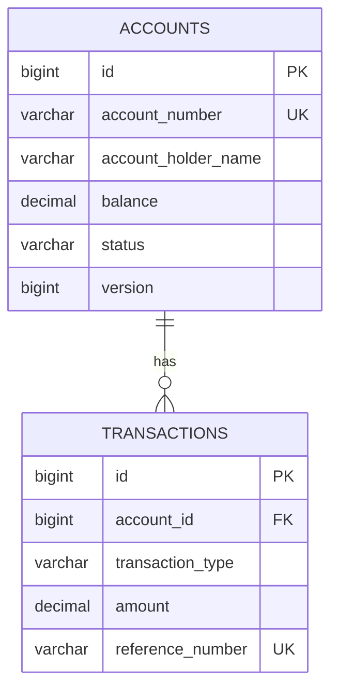

# Spring Boot ATM Server with jPOS

Spring Boot application for bank operations with PostgreSQL database and jPOS ISO-8583 server.

## Features

- Balance inquiry & cash withdrawal
- PostgreSQL 17 database with Flyway migrations
- jPOS 3.0.0 ISO-8583 server (port 22222)
- Virtual threads (Java 25)
- **AES-128 PIN encryption** & **AES-CMAC** support
- Backward compatible with 3DES

## Prerequisites

- Java 25
- Docker and Docker Compose
- Maven

## Quick Start

```bash
# Start PostgreSQL
docker-compose up -d

# Run application
mvn spring-boot:run

# Server starts on:
# - REST API: http://localhost:8080
# - jPOS ISO-8583: port 22222
```

## Sample Accounts

- `1234567890` - John Doe (Balance: 5,000,000 IDR)
- `0987654321` - Jane Smith (Balance: 3,000,000 IDR)
- `5555555555` - Bob Johnson (Balance: 10,000,000 IDR)

## REST API

### Balance Inquiry
```bash
curl -X POST http://localhost:8080/api/bank/balance-inquiry \
  -H "Content-Type: application/json" \
  -d '{"accountNumber":"1234567890"}'
```

### Cash Withdrawal
```bash
curl -X POST http://localhost:8080/api/bank/withdrawal \
  -H "Content-Type: application/json" \
  -d '{"accountNumber":"1234567890","amount":500000.00}'
```

## Server-Initiated Key Rotation

The server can trigger key rotation remotely for connected terminals via REST API.

### Admin API Endpoints

#### Trigger Key Rotation
```bash
# Rotate TSK key for a terminal
curl -X POST http://localhost:8080/api/admin/key-rotation/rotate/TRM-ISS001-ATM-001?keyType=TSK

# Rotate TPK key for a terminal
curl -X POST http://localhost:8080/api/admin/key-rotation/rotate/TRM-ISS001-ATM-001?keyType=TPK
```

#### List Connected Terminals
```bash
curl http://localhost:8080/api/admin/key-rotation/connected-terminals
```

#### Check Terminal Status
```bash
curl http://localhost:8080/api/admin/key-rotation/status/TRM-ISS001-ATM-001
```

### Key Rotation Protocol

1. **Admin triggers rotation** via REST API
2. **Server sends notification** (0800) to terminal:
   ```
   MTI: 0800
   Field 53: "07" + keyType + "000000000000"  // Operation 07 = key rotation notification
   Field 70: "301"                            // Key change request
   ```
3. **Terminal acknowledges** with 0810
4. **Terminal initiates key change** (same as terminal-initiated flow)
5. **HSM generates new key** and encrypts it
6. **Server sends encrypted key** to terminal
7. **Terminal activates new key** and confirms to server

This allows centralized key management without manual intervention at each terminal.

## Documentation

Comprehensive documentation is available in the `docs/` directory:

### Key Rotation Documentation

- **[Key Rotation Overview](docs/KEY_ROTATION_OVERVIEW.md)** - High-level overview with mermaid diagrams comparing both terminal-initiated and server-initiated key rotation methods
- **[Terminal-Initiated Key Rotation](docs/KEY_ROTATION_TERMINAL_INITIATED.md)** - Detailed protocol specification for terminal-initiated key changes, including message formats, complete flow, implementation guide, and troubleshooting
- **[Server-Initiated Key Rotation](docs/KEY_ROTATION_SERVER_INITIATED.md)** - Remote key rotation triggering via admin API, notification protocol, and complete implementation guide
- **[Key Rotation Testing Guide](docs/KEY_ROTATION_TESTING.md)** - Comprehensive testing procedures including prerequisites, test cases, error scenarios, and automated testing

### Quick Reference

- **[Key Change Quick Reference](docs/KEY_CHANGE_QUICK_REFERENCE.md)** - Quick reference for field formats, operation codes, and common commands

**Key Topics Covered:**
- Complete ISO-8583 0800/0810 message specifications
- Operation codes (01-07) and their meanings
- Explicit confirmation mechanism
- HSM integration patterns
- Key lifecycle management (PENDING → ACTIVE → EXPIRED)
- Security considerations and best practices
- Error handling and troubleshooting
- End-to-end testing procedures

## jPOS ISO-8583 Server

### Configuration

```yaml
jpos:
  server:
    port: 22222
    max-sessions: 100
    channel: org.jpos.iso.channel.ASCIIChannel
    packager: org.jpos.iso.packager.BASE24Packager
```

### Supported Transactions

| Transaction | MTI | Processing Code | Fields |
|-------------|-----|-----------------|--------|
| Balance Inquiry | 0200/0210 | 310000 | 2,3,4,7,11,12,13,41,102 |
| Cash Withdrawal | 0200/0210 | 010000 | 2,3,4,7,11,12,13,41,102 |

### Response Codes

| Code | Description |
|------|-------------|
| 00 | Approved |
| 14 | Invalid account |
| 30 | Format error |
| 51 | Insufficient funds |
| 55 | Incorrect PIN |
| 62 | Restricted account |
| 91 | Terminal not signed on |
| 96 | System error |

### Sign-On Requirement

All terminals **MUST** sign on before performing financial transactions:

```
MTI 0800
Field 70: "001"  // Sign-on
Field 41: Terminal ID
Field 42: Institution ID
```

**Sign-off:**
```
MTI 0800
Field 70: "002"  // Sign-off
```

The server tracks terminal connections and rejects transactions (response code 91) from terminals that haven't completed sign-on.

## AES-128 PIN & MAC Support

### Field Mapping

| Algorithm | PIN Field | Size | MAC Field | Size |
|-----------|-----------|------|-----------|------|
| **3DES** (legacy) | 52 | 8 bytes | 64 | 16 bytes |
| **AES-128** (modern) | 123 | 16 bytes (hex) | 64 | 16 bytes |

### Configuration

```yaml
hsm:
  pin:
    encryption-algorithm: AES_128  # or TDES
    format: ISO_0
  mac:
    algorithm: AES_CMAC             # or HMAC_SHA256_TRUNCATED
    verify-enabled: true
    generate-enabled: true
```

### Key Components

- **AesPinBlockUtil**: ISO 9564 PIN block encryption (ISO-0, ISO-1, ISO-3, ISO-4)
- **AesCmacUtil**: AES-CMAC and HMAC-SHA256 MAC generation
- **MacVerificationParticipant**: Verifies request MAC, generates response MAC
- **PinVerificationParticipant**: Supports both field 52 (3DES) and field 123 (AES-128)

### Usage Example

```java
// Build and encrypt AES-128 PIN block
byte[] clearPinBlock = AesPinBlockUtil.buildClearPinBlock(
    "1234", "4111111111111111", PinFormat.ISO_0
);
byte[] encrypted = AesPinBlockUtil.encryptPinBlock(clearPinBlock, tpk128Bytes);
isoMsg.set(123, ISOUtil.hexString(encrypted));  // 32 hex chars

// Generate MAC
byte[] mac = AesCmacUtil.generateMac(messageData, tmk128Bytes);
isoMsg.set(64, mac);  // 16 bytes
```

### Why Field 123?

- Field 52 is only 8 bytes (designed for DES/3DES)
- AES always produces 16-byte blocks (regardless of key size)
- Field 123 (LLLCHAR) accommodates 16-byte encrypted blocks as 32 hex characters
- Field 64 (BINARY 16) perfectly fits AES-CMAC output

### Backward Compatibility

The system checks both fields automatically:
1. Configured algorithm determines primary field (52 or 123)
2. If PIN not found, checks alternative field
3. Supports gradual migration from 3DES to AES-128

## Virtual Threads

jPOS 3.0.0 uses Java virtual threads for optimal performance:

- **TransactionManager**: Virtual thread per transaction (10 sessions, max 128)
- **Q2 Server**: Runs on dedicated virtual thread
- **Scalability**: Can handle 100k+ concurrent sessions
- Example: 5,000 TPS × 15s SLA = 75,000 in-flight transactions

Configuration:
```yaml
spring:
  threads:
    virtual:
      enabled: true
```

## Tech Stack

- Spring Boot 4.0.0-RC1
- Java 25 with Virtual Threads
- PostgreSQL 17
- jPOS 3.0.0
- BouncyCastle 1.78.1 (AES/CMAC)
- Flyway, Hibernate, Lombok

## Testing

```bash
# Run all tests
mvn test

# Run AES tests only
mvn test -Dtest="AesPinBlockUtilTest,AesCmacUtilTest"
```

Test results: ✅ 19 tests passed (AES PIN & MAC utilities)

## Database Schema



## Architecture Notes

### jPOS Transaction Flow

1. **QServer** receives ISO-8583 on port 22222
2. **MacVerificationParticipant** verifies MAC (field 64)
3. **PinVerificationParticipant** verifies PIN (field 52 or 123)
4. **BalanceInquiry/Withdrawal** participants process business logic
5. **ResponseBuilderParticipant** builds ISO-8583 response
6. **SendResponseParticipant** sends response with generated MAC

### Database Transaction vs jPOS Transaction

- **Spring @Transactional commits** happen in `prepare()` phase
- **jPOS `commit()` phase** is for post-processing only (logging, sending response)
- Database changes are permanent before jPOS commit phase
- This ensures client always receives response even if DB fails

### Spring Integration

- `SpringBeanFactory` bridges jPOS participants with Spring DI
- Participants use `SpringBeanFactory.getBean()` to access Spring services
- All business logic in Spring @Service classes

## Security Notes

⚠️ **Production Requirements:**
- Replace `DUMMY_TMK_AES128` in `MacVerificationParticipant` with real keys from HSM
- Implement proper key management and rotation
- Use hardware security module (HSM) for PIN encryption
- Never log clear PIN blocks or keys

## License

Training project for Spring Boot + jPOS integration.
