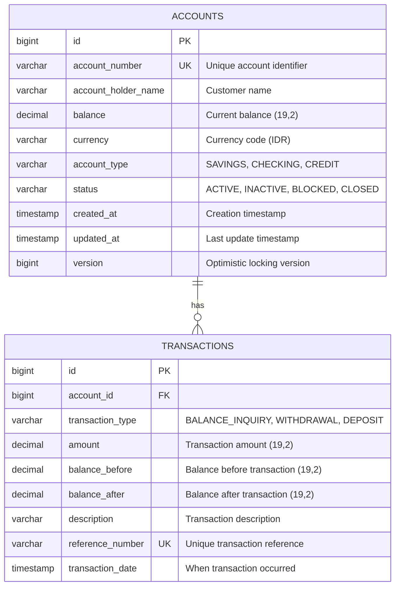
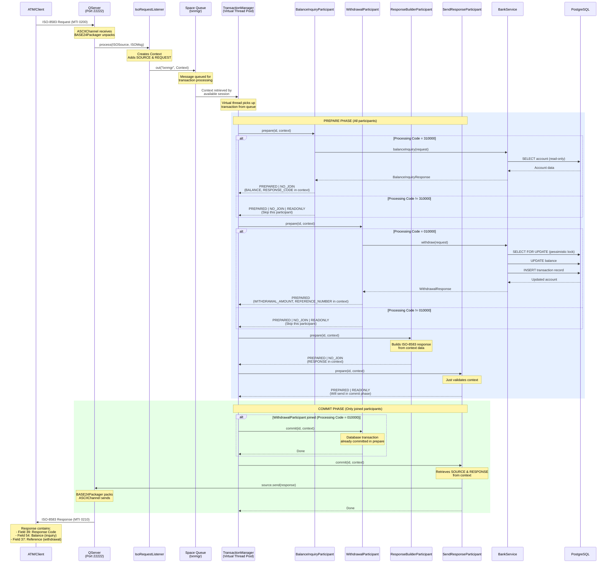

# Spring Boot ATM Server

Spring Boot application for bank operations with PostgreSQL database.

## Features

- Balance inquiry
- Cash withdrawal
- Transaction history tracking
- PostgreSQL 17 database
- Flyway database migrations
- Virtual threads support (Java 25)

## Prerequisites

- Java 25
- Docker and Docker Compose
- Maven

## Database Setup

Start PostgreSQL using Docker Compose:

```bash
docker-compose up -d
```

This will start PostgreSQL 17 on port 5432 with the following credentials:
- Database: `bankdb`
- Username: `bankuser`
- Password: `bankpass`

## Running the Application

```bash
mvn spring-boot:run
```

The application will:
1. Connect to PostgreSQL
2. Run Flyway migrations to create tables
3. Insert sample data
4. Start on default port 8080

## Database Schema



### Accounts Table
- `id`: Primary key
- `account_number`: Unique account identifier
- `account_holder_name`: Customer name
- `balance`: Current balance
- `currency`: Currency code (default: IDR)
- `account_type`: SAVINGS, CHECKING, CREDIT
- `status`: ACTIVE, INACTIVE, BLOCKED, CLOSED
- `version`: Optimistic locking version

### Transactions Table
- `id`: Primary key
- `account_id`: Foreign key to accounts
- `transaction_type`: BALANCE_INQUIRY, WITHDRAWAL, DEPOSIT, etc.
- `amount`: Transaction amount
- `balance_before`: Balance before transaction
- `balance_after`: Balance after transaction
- `description`: Transaction description
- `reference_number`: Unique transaction reference
- `transaction_date`: When transaction occurred

## Sample Data

Three test accounts are created:
- Account: `1234567890` - John Doe (Balance: 5,000,000 IDR)
- Account: `0987654321` - Jane Smith (Balance: 3,000,000 IDR)
- Account: `5555555555` - Bob Johnson (Balance: 10,000,000 IDR)

## REST API Endpoints

Base URL: `http://localhost:8080/api/bank`

### 1. Balance Inquiry

**Endpoint:** `POST /api/bank/balance-inquiry`

**Description:** Query account balance without modifying data (read-only operation)

**Request Body:**
```json
{
  "accountNumber": "1234567890"
}
```

**Success Response (200 OK):**
```json
{
  "accountNumber": "1234567890",
  "accountHolderName": "John Doe",
  "balance": 5000000.00,
  "currency": "IDR",
  "accountType": "SAVINGS",
  "timestamp": "2025-10-28T10:30:00",
  "referenceNumber": "A1B2C3D4E5F6G7H8"
}
```

**Error Responses:**
- `404 NOT FOUND` - Account not found
```json
{
  "timestamp": "2025-10-28T10:30:00",
  "status": 404,
  "error": "Not Found",
  "message": "Account not found: 1234567890",
  "path": "/api/bank/balance-inquiry"
}
```

- `403 FORBIDDEN` - Account not active
```json
{
  "timestamp": "2025-10-28T10:30:00",
  "status": 403,
  "error": "Forbidden",
  "message": "Account is not active: 1234567890",
  "path": "/api/bank/balance-inquiry"
}
```

- `400 BAD REQUEST` - Validation error
```json
{
  "timestamp": "2025-10-28T10:30:00",
  "status": 400,
  "error": "Bad Request",
  "message": "Validation failed",
  "path": "/api/bank/balance-inquiry",
  "validationErrors": {
    "accountNumber": "Account number is required"
  }
}
```

**cURL Example:**
```bash
curl -X POST http://localhost:8080/api/bank/balance-inquiry \
  -H "Content-Type: application/json" \
  -d '{"accountNumber":"1234567890"}'
```

### 2. Cash Withdrawal

**Endpoint:** `POST /api/bank/withdrawal`

**Description:** Withdraw cash from account and record transaction

**Request Body:**
```json
{
  "accountNumber": "1234567890",
  "amount": 500000.00
}
```

**Success Response (201 CREATED):**
```json
{
  "accountNumber": "1234567890",
  "accountHolderName": "John Doe",
  "withdrawalAmount": 500000.00,
  "balanceBefore": 5000000.00,
  "balanceAfter": 4500000.00,
  "currency": "IDR",
  "timestamp": "2025-10-28T10:30:00",
  "referenceNumber": "B2C3D4E5F6G7H8I9"
}
```

**Error Responses:**
- `404 NOT FOUND` - Account not found
- `403 FORBIDDEN` - Account not active
- `400 BAD REQUEST` - Insufficient balance
```json
{
  "timestamp": "2025-10-28T10:30:00",
  "status": 400,
  "error": "Bad Request",
  "message": "Insufficient balance. Current balance: 5000000.00, requested: 6000000.00",
  "path": "/api/bank/withdrawal"
}
```

- `400 BAD REQUEST` - Validation errors
```json
{
  "timestamp": "2025-10-28T10:30:00",
  "status": 400,
  "error": "Bad Request",
  "message": "Validation failed",
  "path": "/api/bank/withdrawal",
  "validationErrors": {
    "accountNumber": "Account number is required",
    "amount": "Amount must be positive"
  }
}
```

**cURL Example:**
```bash
curl -X POST http://localhost:8080/api/bank/withdrawal \
  -H "Content-Type: application/json" \
  -d '{"accountNumber":"1234567890","amount":500000.00}'
```

## jPOS ISO-8583 Server

The application includes a jPOS server that listens for ISO-8583 messages on port 22222.

### Configuration

**application.yml:**
```yaml
spring:
  threads:
    virtual:
      enabled: true

jpos:
  server:
    port: 22222
    max-connections: 100
```

### Supported ISO-8583 Transactions

#### 1. Balance Inquiry (Processing Code: 310000)

**Request Message Fields:**
- MTI: 0200
- Field 2: PAN (Primary Account Number)
- Field 3: 310000 (Balance Inquiry)
- Field 4: Amount (12 digits, right-justified, zero-padded)
- Field 7: Transmission Date/Time (MMDDhhmmss)
- Field 11: System Trace Audit Number (6 digits)
- Field 12: Time, Local Transaction (hhmmss)
- Field 13: Date, Local Transaction (MMDD)
- Field 41: Terminal ID (8 characters)
- Field 102: Account Number

**Response Message Fields:**
- MTI: 0210
- Field 39: Response Code
  - `00`: Approved
  - `14`: Invalid account
  - `30`: Format error
  - `62`: Restricted account
  - `96`: System error
- Field 54: Additional Amounts (Balance information)

#### 2. Cash Withdrawal (Processing Code: 010000)

**Request Message Fields:**
- MTI: 0200
- Field 2: PAN
- Field 3: 010000 (Withdrawal)
- Field 4: Amount in cents (000000050000 = 500.00)
- Field 7: Transmission Date/Time
- Field 11: System Trace Audit Number
- Field 12: Time, Local Transaction
- Field 13: Date, Local Transaction
- Field 41: Terminal ID
- Field 102: Account Number

**Response Message Fields:**
- MTI: 0210
- Field 37: Retrieval Reference Number
- Field 39: Response Code
  - `00`: Approved
  - `14`: Invalid account
  - `51`: Insufficient funds
  - `62`: Restricted account
  - `96`: System error

### Channel Configuration

**Channel Type:** ASCIIChannel
**Packager:** ISO87APackager (standard ISO-8583 1987 ASCII)
**Port:** 22222

### Virtual Thread Integration

jPOS 3.0.0 leverages Java 21+ virtual threads for optimal performance and scalability:

- **TransactionManager**: Runs on virtual threads with configurable sessions (default: 10, max: 128)
  - Uses `Executors.newThreadPerTaskExecutor(Thread.ofVirtual().factory())`
  - Can safely handle 100k+ concurrent sessions without issues
  - Reference: [TransactionManager.java:136-140](https://github.com/jpos/jPOS/blob/v3_0_0/jpos/src/main/java/org/jpos/transaction/TransactionManager.java#L136-L140)

- **Request Handlers**: Each ISO-8583 message is processed on a separate virtual thread
  - No thread pool limits - creates threads on demand
  - Local configuration: `deploy/20_txnmgr.xml` (sessions: 10, max-sessions: 128)

- **Q2 Server Thread**: Main Q2 loop runs on a virtual thread
  - Implementation: `JposConfig.java:33-42` using `Thread.ofVirtual().name("q2-main").start()`
  - Starts Q2 container asynchronously during Spring Boot startup

- **Executor Service**: Virtual thread per task executor for unlimited scalability
  - No need for traditional thread pool management
  - Threads are lightweight and created/destroyed as needed

**Performance Capabilities:**
- Example workload: 5,000 TPS with 15-second SLA = 75,000 in-flight transactions
- This would be unreasonable with platform threads but is entirely manageable with virtual threads
- Reference: [jPOS 3.0.0 Release Announcement](https://jpos.org/blog/2024/11/jpos-3.0.0-has-been-released/)

**Why Java 21+?**
- jPOS 3.0.0 requires Java 21 minimum due to virtual thread usage
- Initial release waited for Java 22/23 improvements to pinned thread issues
- Our implementation uses Java 25 for latest virtual thread optimizations
- Virtual threads make the previous TransactionManager continuations feature obsolete

**Local Implementation References:**
- Q2 Virtual Thread Startup: `src/main/java/com/example/atm/jpos/JposConfig.java:33-42`
- TransactionManager Config: `deploy/20_txnmgr.xml` (sessions configuration)
- QServer Config: `deploy/10_qserver.xml` (ASCIIChannel with BASE24Packager)
- Spring Virtual Thread Config: `src/main/resources/application.yml` (spring.threads.virtual.enabled)

This allows the server to handle thousands of concurrent connections efficiently without thread pool limitations or complex async/continuation patterns.

### jPOS Transaction Flow

The following diagram illustrates how ISO-8583 messages are processed through the jPOS transaction pipeline:



#### Transaction Flow Explanation

**1. Message Reception (QServer)**
- Client connects to port 22222 via ASCIIChannel
- BASE24Packager unpacks ISO-8583 message fields
- QServer invokes IsoRequestListener for each request

**2. Request Routing (IsoRequestListener)**
- Creates jPOS Context and populates:
  - `SOURCE`: ISOSource for sending response back
  - `REQUEST`: Unpacked ISOMsg with all fields
- Puts context into Space queue named "txnmgr"
- Returns immediately (non-blocking)

**3. Transaction Processing (TransactionManager)**
- Virtual thread picks up context from "txnmgr" queue
- Executes PREPARE phase for all participants sequentially
- Each participant returns status flags:
  - `PREPARED`: Participant ready to commit
  - `NO_JOIN`: Participant won't participate in commit phase
  - `READONLY`: Participant made no database changes
  - `ABORTED`: Abort entire transaction (not used, we use PREPARED | NO_JOIN for errors)

**4. Participant Chain Execution**

**BalanceInquiryParticipant (Processing Code 310000):**
- Checks if processing code = 310000
- If yes: Calls BankService.balanceInquiry()
  - Reads account from database (no locks, read-only)
  - Puts BALANCE, RESPONSE_CODE, ACCOUNT_HOLDER_NAME into context
  - Returns `PREPARED | NO_JOIN` (no commit needed)
- If no: Returns `PREPARED | NO_JOIN | READONLY` (skip)

**WithdrawalParticipant (Processing Code 010000):**
- Checks if processing code = 010000
- If yes: Calls BankService.withdraw()
  - Uses pessimistic locking (SELECT FOR UPDATE)
  - Updates account balance
  - Inserts transaction record
  - Database transaction commits in Spring @Transactional
  - Puts WITHDRAWAL_AMOUNT, BALANCE_AFTER, REFERENCE_NUMBER into context
  - Returns `PREPARED` (joins commit phase for logging)
- If no: Returns `PREPARED | NO_JOIN | READONLY` (skip)

**ResponseBuilderParticipant:**
- Clones request message
- Sets direction to OUTGOING
- Changes MTI from 0200 to 0210
- Populates response fields:
  - Field 39: Response code from context
  - Field 54: Balance (if present in context)
  - Field 37: Reference number truncated to 12 chars (if present)
- Puts RESPONSE into context
- Returns `PREPARED | NO_JOIN` (no commit needed)

**SendResponseParticipant:**
- In prepare: Just returns `PREPARED | READONLY`
- In commit: Retrieves SOURCE and RESPONSE from context
  - Calls source.send(response)
  - Response packed by BASE24Packager
  - Sent back via ASCIIChannel to client

**5. Commit Phase**
- Only participants that returned `PREPARED` without `NO_JOIN` participate
- For withdrawal: WithdrawalParticipant.commit() called (for logging only, DB already committed)
- For all transactions: SendResponseParticipant.commit() sends response to client

**6. Error Handling**
- All exceptions caught in participants
- Appropriate response code set in context (14, 30, 51, 62, 96)
- Return `PREPARED | NO_JOIN` instead of `ABORTED`
- Response still built and sent with error code
- Transaction continues to completion even on business errors

**7. Spring Integration**
- SpringBeanFactory bridges jPOS participants with Spring DI
- Participants annotated with @Component managed by Spring
- BankService injected via SpringBeanFactory.getBean()
- Spring @Transactional boundaries respected within participant.prepare()

#### Important: COMMIT Terminology Clarification

**jPOS TransactionManager COMMIT vs Database COMMIT are different concepts:**

**jPOS TransactionManager COMMIT Phase:**
- Part of the two-phase jPOS transaction lifecycle: PREPARE → COMMIT (or ABORT)
- NOT related to database transactions
- Happens AFTER all participants have successfully prepared
- Used for:
  - Final cleanup operations
  - Logging completion
  - Sending responses to clients
  - Post-processing tasks
- Example: `SendResponseParticipant.commit()` sends the ISO-8583 response

**Spring @Transactional Database COMMIT:**
- Actual database transaction commit (ACID)
- Happens during `participant.prepare()` when @Transactional method completes
- Controls database changes (INSERT, UPDATE, DELETE)
- Uses pessimistic locking (SELECT FOR UPDATE)
- Example: `BankService.withdraw()` commits database changes before returning

**Timeline Example for Withdrawal Transaction:**

```
Time    Event                                   Database State
────────────────────────────────────────────────────────────────────
T1      TM calls WithdrawalParticipant.prepare()
T2      └─> BankService.withdraw() starts        @Transactional begins
T3          └─> SELECT FOR UPDATE (lock account)
T4          └─> UPDATE accounts SET balance...
T5          └─> INSERT INTO transactions...
T6      BankService.withdraw() returns           @Transactional COMMITS ✓
T7      WithdrawalParticipant.prepare() returns  (DB already committed!)
        Status: PREPARED
────────────────────────────────────────────────────────────────────
T8      TM calls WithdrawalParticipant.commit()  (DB already committed)
T9      └─> Just logs "Transaction committed"    (No DB operation)
T10     TM calls SendResponseParticipant.commit()
T11     └─> Sends ISO-8583 response to client
────────────────────────────────────────────────────────────────────
```

**Key Points:**

1. **Database commits happen in PREPARE phase** (T6)
   - When Spring @Transactional method returns successfully
   - This is the actual database COMMIT
   - Changes are permanently saved to PostgreSQL

2. **jPOS commit phase happens AFTER database commit** (T8-T11)
   - Database changes already committed and visible
   - Used for post-processing only
   - Cannot rollback database changes

3. **Why this design?**
   - jPOS TransactionManager doesn't control Spring transactions
   - Each participant's @Transactional boundary is independent
   - Participant.prepare() returns success only if database commit succeeds
   - If database commit fails, exception caught and returns PREPARED | NO_JOIN with error code

4. **Error Handling:**
   - If BankService throws exception (T2-T6): Spring @Transactional rolls back automatically
   - Participant catches exception, sets error response code (51, 14, 62, etc.)
   - Returns PREPARED | NO_JOIN (skip commit phase)
   - Response still built and sent with error code
   - No database changes persisted

5. **Balance Inquiry (Read-Only):**
   - No database commit needed (SELECT only)
   - Spring @Transactional(readOnly=true) optimizes for reads
   - No transaction record created
   - Returns PREPARED | NO_JOIN (no commit phase participation)

This separation allows jPOS transaction flow to continue even when database operations fail, ensuring clients always receive a response with appropriate error codes.

## Tech Stack

- Spring Boot 4.0.0-RC1
- Java 25 with Virtual Threads
- PostgreSQL 17
- Flyway DB
- Spring Data JPA
- Hibernate
- Lombok
- jPOS 3.0.0
