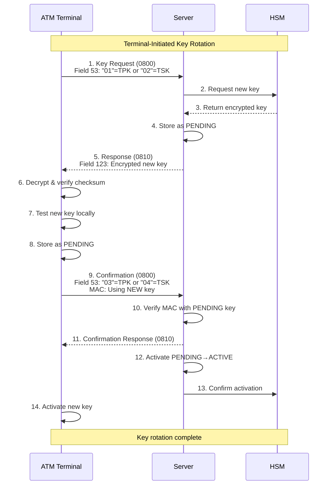
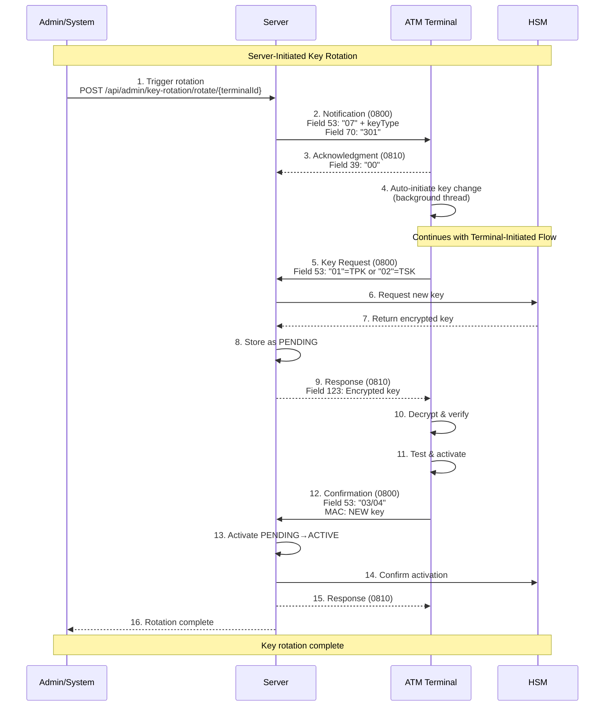
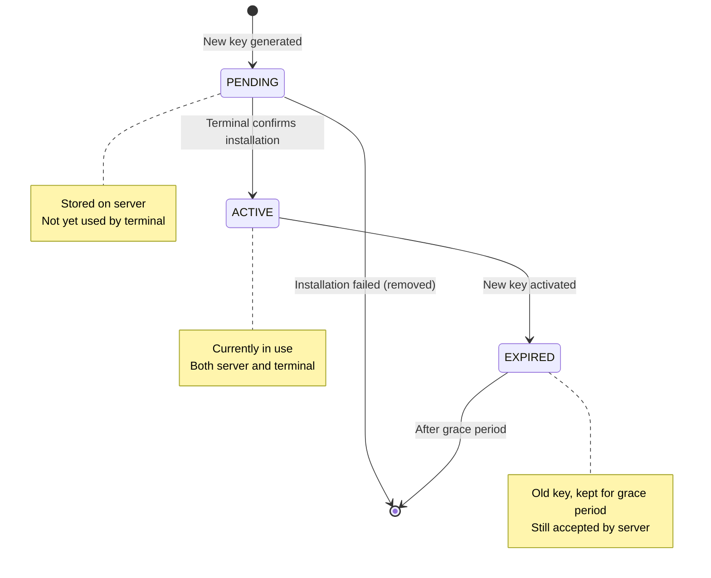
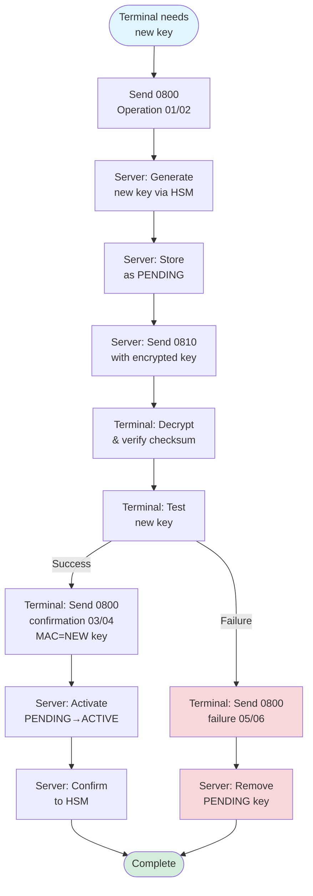
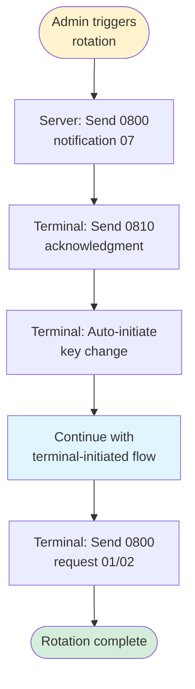

# Key Rotation Overview

## Table of Contents
- [Introduction](#introduction)
- [Key Types](#key-types)
- [Rotation Methods](#rotation-methods)
- [When to Use Which Method](#when-to-use-which-method)
- [Terminal-Initiated Flow](#terminal-initiated-flow)
- [Server-Initiated Flow](#server-initiated-flow)
- [ISO-8583 Field Reference](#iso-8583-field-reference)
- [Security Considerations](#security-considerations)

## Introduction

This system supports cryptographic key rotation for ATM terminals using ISO-8583 network management messages (MTI 0800/0810). Key rotation ensures ongoing security by periodically replacing encryption keys used for PIN protection and message authentication.

## Key Types

| Key Type | Purpose | Usage |
|----------|---------|-------|
| **TMK** | Terminal Master Key | Long-lived key used to encrypt/decrypt other keys during key exchange |
| **TPK** | Terminal PIN Key | Encrypts PIN blocks for PIN verification |
| **TSK** | Terminal Session Key | Generates and verifies message authentication codes (MAC) |

**Key Hierarchy:**
```
TMK (Master)
 ├── TPK (PIN encryption)
 └── TSK (MAC generation)
```

## Rotation Methods

### 1. Terminal-Initiated Rotation

Terminal requests new key from server when needed (scheduled rotation, key compromise, etc.).

**Characteristics:**
- Initiated by terminal
- Terminal controls timing
- Typical use: Scheduled/periodic rotation
- More predictable for terminal

### 2. Server-Initiated Rotation

Server triggers key rotation remotely without terminal intervention.

**Characteristics:**
- Initiated by server (admin/automated)
- Server controls timing
- Typical use: Emergency rotation, policy enforcement
- Allows centralized management

## When to Use Which Method

| Scenario | Method | Rationale |
|----------|--------|-----------|
| **Scheduled rotation** (e.g., every 90 days) | Terminal-initiated | Terminal can plan rotation during low-traffic periods |
| **Emergency rotation** (suspected compromise) | Server-initiated | Immediate action required across all terminals |
| **Policy enforcement** | Server-initiated | Centralized control ensures compliance |
| **Terminal maintenance** | Terminal-initiated | Terminal initiated during planned maintenance |
| **Mass rotation** (all terminals) | Server-initiated | Efficient centralized management |

## Terminal-Initiated Flow

### High-Level Sequence



### Operation Codes (Field 53)

| Operation | Description | MAC Key |
|-----------|-------------|---------|
| **01** | TPK request | OLD TSK |
| **02** | TSK request | OLD TSK |
| **03** | TPK confirmation | NEW TPK (proves terminal has new key) |
| **04** | TSK confirmation | NEW TSK (proves terminal has new key) |
| **05** | TPK failure | OLD TSK |
| **06** | TSK failure | OLD TSK |

**Detailed Documentation:** [Terminal-Initiated Key Rotation](KEY_ROTATION_TERMINAL_INITIATED.md)

## Server-Initiated Flow

### High-Level Sequence



### Operation Codes

| Operation | Description | Direction |
|-----------|-------------|-----------|
| **07** | Server-initiated rotation notification | Server → Terminal |

**Notification Fields:**
- Field 53: `"07" + keyTypeCode + "000000000000"`
  - `"0701..."` = TPK rotation
  - `"0702..."` = TSK rotation
- Field 70: `"301"` (Key change request)

**Detailed Documentation:** [Server-Initiated Key Rotation](KEY_ROTATION_SERVER_INITIATED.md)

## ISO-8583 Field Reference

### Request Message (MTI 0800)

| Field | Name | Format | Length | Description |
|-------|------|--------|--------|-------------|
| MTI | Message Type | N | 4 | `0800` - Network management |
| 11 | STAN | N | 6 | System trace audit number |
| 41 | Terminal ID | ANS | 15 | Terminal identifier (space-padded) |
| 42 | Card Acceptor ID | ANS | 15 | Institution code (space-padded) |
| 48 | Additional Data | ANS | var | Failure reason (operations 05/06 only) |
| 53 | Security Control | N | 16 | Operation code + padding |
| 64 | MAC | B | 16 | Message authentication code |
| 70 | Network Mgmt Code | N | 3 | `301` for server-initiated only |

### Response Message (MTI 0810)

| Field | Name | Format | Length | Description |
|-------|------|--------|--------|-------------|
| MTI | Message Type | N | 4 | `0810` - Network management response |
| 11 | STAN | N | 6 | Echoed from request |
| 39 | Response Code | AN | 2 | `00`=success, `30`=format error, `96`=system error |
| 41 | Terminal ID | ANS | 15 | Echoed from request |
| 48 | Key Checksum | ANS | 16 | SHA-256 checksum (first 16 hex chars) |
| 53 | Security Control | N | 16 | Echoed from request |
| 64 | MAC | B | 16 | Message authentication code |
| 123 | Encrypted Key | ANS | 128 | `[IV 32 hex][Ciphertext 96 hex]` |

### Field 123 Structure (Encrypted Key)

```
┌─────────────────────────┬──────────────────────────────────────┐
│   IV (32 hex chars)     │   Ciphertext (96 hex chars)          │
│   16 bytes              │   48 bytes (32-byte key + padding)   │
└─────────────────────────┴──────────────────────────────────────┘
         128 hex characters total

Encryption: AES-128-CBC with PKCS5Padding
Key: Derived from current master key using PBKDF2-SHA256
Context: "KEY_DELIVERY:ROTATION"
```

## Key Lifecycle States



## Complete Rotation Flow Comparison

### Terminal-Initiated



### Server-Initiated



## Security Considerations

### 1. Key Transport Security

- New keys encrypted under current active key
- Uses AES-128-CBC with random IV
- Key derivation context: `"KEY_DELIVERY:ROTATION"`
- Operational key derived using PBKDF2-SHA256

### 2. Integrity Protection

- SHA-256 checksum in field 48
- Terminal MUST verify checksum before activation
- Checksum mismatch = security event, DO NOT activate

### 3. Confirmation System

- Explicit confirmation required (operations 03/04)
- Terminal proves possession of new key via MAC
- Server detects successful installation via MAC verification with PENDING key
- Prevents activation of failed installations

### 4. Rollback Protection

- Monotonic key version numbers
- Server rejects keys with version ≤ current version
- Audit log of all key changes

### 5. Grace Period

- Old key remains ACTIVE for configured period (default: 24 hours)
- Server accepts MAC with both ACTIVE and PENDING keys
- Terminal can rollback if issues detected
- Old key expires after grace period

### 6. Failure Handling

- Terminal reports failures (operations 05/06)
- Server removes PENDING key
- Server notifies HSM of failure
- Old ACTIVE key remains unchanged
- Detailed logging of security events

## Error Handling

### Response Codes

| Code | Meaning | Terminal Action | Server Cause |
|------|---------|-----------------|--------------|
| `00` | Success | Proceed with installation | Key generation successful |
| `30` | Format error | Check field 53, retry | Invalid operation code |
| `91` | Not signed on | Sign on first, retry | Terminal not registered |
| `96` | System error | Wait and retry | HSM communication failure, database error |

### Common Issues

| Symptom | Cause | Solution |
|---------|-------|----------|
| Checksum mismatch | Corrupted transmission, wrong decryption key | Retry key request |
| Decryption fails | Using wrong current key, corrupted field 123 | Verify current key version |
| MAC verification fails | Terminal using new key before server activated | Send confirmation message |
| Response code 30 | Invalid field 53 format | Verify operation code format |
| Response code 96 | HSM unavailable | Check HSM connectivity, retry later |

## Testing

For comprehensive testing procedures, see [Key Rotation Testing Guide](KEY_ROTATION_TESTING.md)

## Related Documentation

- **[Terminal-Initiated Key Rotation](KEY_ROTATION_TERMINAL_INITIATED.md)** - Detailed protocol and implementation
- **[Server-Initiated Key Rotation](KEY_ROTATION_SERVER_INITIATED.md)** - Remote rotation triggering
- **[Testing Guide](KEY_ROTATION_TESTING.md)** - End-to-end testing procedures
- **[Quick Reference](KEY_CHANGE_QUICK_REFERENCE.md)** - Field formats and code examples

---

**Document Version:** 2.0
**Last Updated:** 2025-11-01
**Status:** Production Ready
