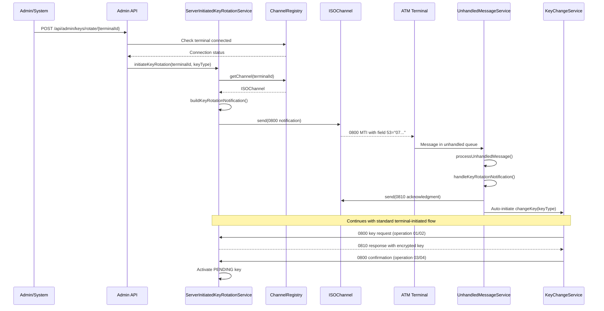
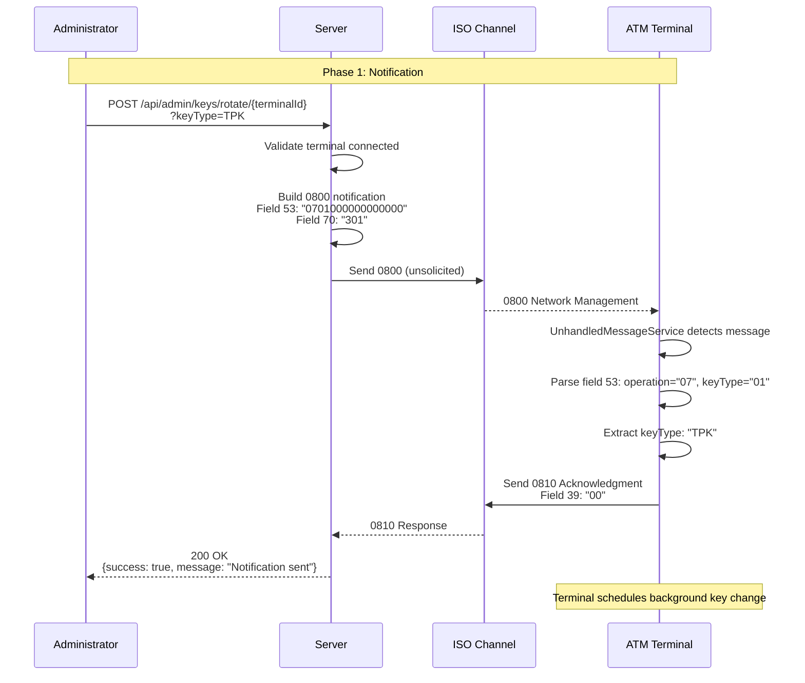
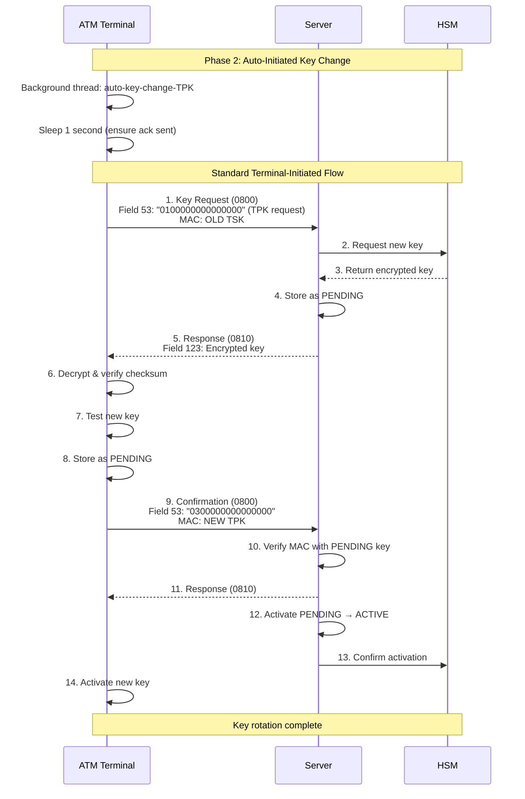

# Server-Initiated Key Rotation

## Table of Contents
- [Overview](#overview)
- [When to Use](#when-to-use)
- [Architecture](#architecture)
- [Admin API](#admin-api)
- [Notification Protocol](#notification-protocol)
- [Complete Flow](#complete-flow)
- [Implementation Guide](#implementation-guide)
- [Testing](#testing)
- [Troubleshooting](#troubleshooting)

## Overview

Server-initiated key rotation allows administrators or automated systems to remotely trigger key rotation for one or more ATM terminals without manual intervention at the terminal. The server sends a notification message to the terminal, which then automatically initiates the standard terminal-initiated key change flow.

This method provides centralized control over key rotation, enabling:
- **Emergency rotation**: Immediate key change across all terminals when compromise is suspected
- **Policy enforcement**: Ensure all terminals comply with key rotation schedules
- **Mass rotation**: Efficiently rotate keys for multiple terminals simultaneously
- **Automated compliance**: Integration with security policies and audit systems

## When to Use

| Scenario | Rationale |
|----------|-----------|
| **Emergency rotation** | Suspected key compromise requires immediate action across all affected terminals |
| **Policy enforcement** | Centralized control ensures consistent application of security policies |
| **Scheduled maintenance** | Automated rotation during low-traffic periods (e.g., 2 AM daily) |
| **Mass rotation** | Rotating keys for all terminals in a region or institution simultaneously |
| **Compliance requirements** | Regulatory requirements mandate specific rotation schedules |
| **Security audits** | Demonstrating centralized key management capabilities |

**Comparison with Terminal-Initiated:**

| Aspect | Server-Initiated | Terminal-Initiated |
|--------|------------------|-------------------|
| **Control** | Centralized (admin/system) | Distributed (each terminal) |
| **Timing** | Server controls | Terminal controls |
| **Use Case** | Emergency, policy, mass rotation | Scheduled, maintenance, on-demand |
| **Complexity** | Higher (additional notification step) | Lower (single request/response) |

## Architecture

### Components

#### Server Side

1. **AdminKeyRotationController**: REST API for triggering rotation
2. **ServerInitiatedKeyRotationService**: Sends 0800 notification to terminals
3. **ChannelRegistry**: Tracks active terminal connections
4. **Standard Key Rotation Components**: KeyChangeParticipant, KeyRotationService, etc.

#### Terminal Side

1. **UnhandledMessageService**: Monitors unhandled queue for server notifications
2. **KeyChangeService**: Executes standard terminal-initiated key change
3. **SignOnService**: Provides terminal configuration (IDs)
4. **MuxService**: Handles ISO-8583 communication

### Communication Flow



## Admin API

### Endpoint: Initiate Key Rotation

**URL:** `POST /api/admin/keys/rotate/{terminalId}`

**Path Parameters:**
- `terminalId` (required): Terminal identifier (e.g., `TRM-ISS001-ATM-001`)

**Query Parameters:**
- `keyType` (optional, default: `TSK`): Key type to rotate (`TPK` or `TSK`)

**Request Example:**
```bash
curl -X POST "http://localhost:22222/api/admin/keys/rotate/TRM-ISS001-ATM-001?keyType=TPK" \
  -H "Content-Type: application/json"
```

**Success Response (200 OK):**
```json
{
  "success": true,
  "message": "Key rotation notification sent to terminal",
  "terminalId": "TRM-ISS001-ATM-001",
  "keyType": "TPK",
  "nextStep": "Terminal will initiate standard key change flow (operation 01/02)"
}
```

**Error Response - Terminal Not Connected (400 Bad Request):**
```json
{
  "success": false,
  "error": "Terminal not connected",
  "terminalId": "TRM-ISS001-ATM-001"
}
```

**Error Response - Invalid Key Type (400 Bad Request):**
```json
{
  "success": false,
  "error": "Invalid key type. Must be TPK or TSK"
}
```

**Error Response - Send Failed (500 Internal Server Error):**
```json
{
  "success": false,
  "error": "Failed to send key rotation notification",
  "terminalId": "TRM-ISS001-ATM-001"
}
```

### Endpoint: List Connected Terminals

**URL:** `GET /api/admin/keys/connected-terminals`

**Response Example:**
```json
{
  "success": true,
  "count": 3,
  "terminals": [
    "TRM-ISS001-ATM-001",
    "TRM-ISS001-ATM-002",
    "TRM-ISS002-ATM-001"
  ]
}
```

**Use Case:** Determine which terminals are online before initiating mass rotation.

### Endpoint: Check Terminal Status

**URL:** `GET /api/admin/keys/status/{terminalId}`

**Response Example:**
```json
{
  "success": true,
  "terminalId": "TRM-ISS001-ATM-001",
  "connected": true
}
```

## Notification Protocol

### Notification Message (MTI 0800)

The server sends an unsolicited 0800 network management message to the terminal:

| Field | Name | Format | Length | Description | Value |
|-------|------|--------|--------|-------------|-------|
| MTI | Message Type | N | 4 | Network management | `0800` |
| 11 | STAN | N | 6 | System trace audit number | Timestamp-based |
| 41 | Terminal ID | ANS | 15 | Terminal identifier | e.g., `ATM-001        ` |
| 42 | Card Acceptor ID | ANS | 15 | Institution code | e.g., `TRM-ISS001    ` |
| 53 | Security Control | N | 16 | Operation + key type | `07` + keyType + 12 zeros |
| 70 | Network Mgmt Code | N | 3 | Key change request | `301` |

**Field 53 Format:**

```
┌────────────┬────────────┬─────────────────────────┐
│ Operation  │  Key Type  │   Reserved (zeros)      │
│   "07"     │  "01"/"02" │   "000000000000"        │
└────────────┴────────────┴─────────────────────────┘
     2 digits    2 digits        12 digits
                16 digits total
```

**Operation Code:** `07` = Server-initiated key change notification

**Key Type Codes:**
- `01` = TPK (Terminal PIN Key)
- `02` = TSK (Terminal Session Key)

**Examples:**
- TPK notification: `0701000000000000`
- TSK notification: `0702000000000000`

**Field 70:** `301` = Key change request (network management code)

**Sample Notification:**
```
MTI: 0800
Field 11: 123456
Field 41: ATM-001
Field 42: TRM-ISS001
Field 53: 0701000000000000  (TPK notification)
Field 70: 301
```

**Important Notes:**
- No MAC on notification (server → terminal, one-way notification)
- Terminal must acknowledge with 0810 response
- Notification triggers background key change process

### Acknowledgment Response (MTI 0810)

Terminal sends acknowledgment back to server:

| Field | Name | Format | Length | Description | Value |
|-------|------|--------|--------|-------------|-------|
| MTI | Message Type | N | 4 | Network management response | `0810` |
| 11 | STAN | N | 6 | Echoed from request | Same as notification |
| 39 | Response Code | AN | 2 | Result | `00` = acknowledged |
| 41 | Terminal ID | ANS | 15 | Terminal identifier | From terminal config |
| 42 | Card Acceptor ID | ANS | 15 | Institution code | From terminal config |
| 53 | Security Control | N | 16 | Echoed from request | Same as notification |

**Sample Acknowledgment:**
```
MTI: 0810
Field 11: 123456
Field 39: 00
Field 41: ATM-001
Field 42: TRM-ISS001
Field 53: 0701000000000000
```

**Important:**
- Fields 41/42 use terminal's own configuration (NOT echoed from server)
- Response code `00` = terminal acknowledges and will process
- Terminal auto-initiates key change in background thread

## Complete Flow

### Phase 1: Notification and Acknowledgment



### Phase 2: Automatic Terminal-Initiated Key Change



### Step-by-Step Details

#### Step 1: Admin Triggers Rotation

```bash
curl -X POST "http://localhost:22222/api/admin/keys/rotate/TRM-ISS001-ATM-001?keyType=TPK"
```

**Server Actions:**
1. AdminKeyRotationController receives request
2. Validate terminal ID format
3. Check terminal is connected (ChannelRegistry)
4. Parse and validate key type (TPK/TSK)
5. Call ServerInitiatedKeyRotationService.initiateKeyRotation()

#### Step 2: Server Builds Notification

```java
ISOMsg notification = new ISOMsg();
notification.setMTI("0800");
notification.set(11, String.format("%06d", timestamp % 1000000));

// Set terminal ID fields
TerminalIdUtil.setTerminalIdFields(notification, terminalId);

// Field 53: "07" + keyTypeCode + "000000000000"
String operationCode = "07";
String keyTypeCode = keyType == KeyType.TPK ? "01" : "02";
notification.set(53, operationCode + keyTypeCode + "000000000000");

// Field 70: Network management code
notification.set(70, "301");
```

#### Step 3: Server Sends Notification

```java
ISOChannel channel = channelRegistry.getChannel(terminalId);
channel.send(notification);
```

**Critical:** This is a "send-only" operation, not a request/response. The notification goes directly to the channel without expecting a matched response in MUX.

#### Step 4: Terminal Receives Notification

**UnhandledMessageService monitors the unhandled queue:**

```java
@Override
public void run() {
    while (running) {
        // Wait for unhandled messages (30 second timeout)
        Object obj = space.in(unhandledQueue, 30000);

        if (obj != null && running) {
            if (obj instanceof ISOMsg) {
                ISOMsg msg = (ISOMsg) obj;
                processUnhandledMessage(msg);
            }
        }
    }
}
```

**Why unhandled queue?**
- Server-initiated messages are unsolicited (not matching a pending MUX request)
- ChannelAdaptor (client-side) doesn't invoke request-listeners for unmatched messages
- jPOS routes unmatched messages to MUX's "unhandled" queue
- UnhandledMessageService monitors this queue for server notifications

#### Step 5: Terminal Processes Notification

```java
private void processUnhandledMessage(ISOMsg msg) {
    String mti = msg.getMTI();
    if (!"0800".equals(mti)) {
        return;  // Not a network management message
    }

    String securityControl = msg.getString(53);
    String operationCode = securityControl.substring(0, 2);

    if ("07".equals(operationCode)) {
        handleKeyRotationNotification(msg);
    }
}
```

#### Step 6: Terminal Sends Acknowledgment

```java
private void sendAcknowledgment(ISOMsg request) {
    ISOMsg response = (ISOMsg) request.clone();
    response.setMTI("0810");
    response.set(39, "00");  // Approved

    // Use terminal's own configuration (NOT echoing server's values)
    String terminalId = getTerminalId();  // From SignOnService
    String institutionId = getInstitutionId();  // From SignOnService
    TerminalIdUtil.setTerminalIdFields(response, terminalId, institutionId);

    // Echo STAN and security control
    if (request.hasField(11)) {
        response.set(11, request.getString(11));
    }
    if (request.hasField(53)) {
        response.set(53, request.getString(53));
    }

    // Send via space (bypassing MUX since this is unsolicited response)
    space.out("atm-send", response);
}
```

**Critical Design Decision:**
- Terminal retrieves its own terminal ID and institution ID from Spring configuration at runtime
- Does NOT echo field 41/42 from server's notification
- Ensures correct identification even if server's notification has different values

#### Step 7: Terminal Auto-Initiates Key Change

```java
private void handleKeyRotationNotification(ISOMsg msg) {
    // Extract key type from field 53
    String securityControl = msg.getString(53);
    String keyTypeCode = securityControl.substring(2, 4);  // Chars 2-3
    String keyType = "01".equals(keyTypeCode) ? "TPK" : "TSK";

    // Send acknowledgment first
    sendAcknowledgment(msg);

    // Auto-initiate key change in background thread
    new Thread(() -> {
        try {
            // Small delay to ensure acknowledgment is sent
            Thread.sleep(1000);

            log.info("Initiating automatic key change: keyType={}", keyType);
            KeyChangeService keyChangeService = SpringBeanFactory.getBean(KeyChangeService.class);
            keyChangeService.changeKey(keyType);

        } catch (Exception e) {
            log.error("Failed to initiate automatic key change: {}", e.getMessage(), e);
        }
    }, "auto-key-change-" + keyType).start();
}
```

**Why background thread?**
- Avoids blocking UnhandledMessageService processor
- Allows acknowledgment to be sent immediately
- Key change flow is complex and may take time
- Separate thread name for debugging: `auto-key-change-TPK`

#### Step 8-14: Standard Terminal-Initiated Flow

The terminal then executes the standard terminal-initiated key change flow:
1. Send 0800 key request (operation 01/02)
2. Receive 0810 response with encrypted key
3. Decrypt and verify checksum
4. Test new key
5. Send 0800 confirmation (operation 03/04)
6. Server activates PENDING key
7. Terminal activates new key

See [Terminal-Initiated Key Rotation](KEY_ROTATION_TERMINAL_INITIATED.md) for detailed flow.

## Implementation Guide

### Server-Side Implementation

#### 1. ServerInitiatedKeyRotationService

**Location:** [ServerInitiatedKeyRotationService.java:32](/Users/endymuhardin/workspace/training/training-spring-jpos-2025/sample-apps/spring-jpos-atm-server/src/main/java/com/example/atm/service/ServerInitiatedKeyRotationService.java#L32)

**Key Methods:**
- `initiateKeyRotation(terminalId, keyType)`: Main entry point
- `buildKeyRotationNotification(terminalId, keyType)`: Build 0800 message
- `isTerminalConnected(terminalId)`: Check connection status

**Dependencies:**
- `ChannelRegistry`: Track active connections
- `TerminalIdUtil`: Format terminal ID fields

#### 2. AdminKeyRotationController

**Location:** [AdminKeyRotationController.java:35](/Users/endymuhardin/workspace/training/training-spring-jpos-2025/sample-apps/spring-jpos-atm-server/src/main/java/com/example/atm/web/controller/AdminKeyRotationController.java#L35)

**Endpoints:**
- `POST /api/admin/keys/rotate/{terminalId}`: Trigger rotation
- `GET /api/admin/keys/connected-terminals`: List connected terminals
- `GET /api/admin/keys/status/{terminalId}`: Check terminal status

#### 3. ChannelRegistry

Tracks active terminal connections:

```java
@Component
public class ChannelRegistry {
    private final Map<String, ISOChannel> channels = new ConcurrentHashMap<>();

    public void registerChannel(String terminalId, ISOChannel channel) {
        channels.put(terminalId, channel);
    }

    public ISOChannel getChannel(String terminalId) {
        return channels.get(terminalId);
    }

    public boolean isConnected(String terminalId) {
        ISOChannel channel = channels.get(terminalId);
        return channel != null && channel.isConnected();
    }

    public Set<String> getConnectedTerminals() {
        return channels.entrySet().stream()
            .filter(e -> e.getValue().isConnected())
            .map(Map.Entry::getKey)
            .collect(Collectors.toSet());
    }
}
```

### Terminal-Side Implementation

#### 1. UnhandledMessageService

**Location:** [UnhandledMessageService.java:84](/Users/endymuhardin/workspace/training/training-spring-jpos-2025/sample-apps/spring-jpos-atm-simulator/src/main/java/com/example/atm/jpos/service/UnhandledMessageService.java#L84)

**Q2 Service Configuration:**

File: `src/main/resources/deploy/18_unhandled_message_service.xml`

```xml
<unhandled-message-service class="com.example.atm.jpos.service.UnhandledMessageService"
                           logger="Q2"
                           realm="unhandled-message-service">
    <property name="space" value="tspace:default"/>
    <property name="queue" value="atm-unhandled"/>
</unhandled-message-service>
```

**Key Points:**
- Runs as Q2 service (jPOS container)
- Monitors TSpace for unhandled messages
- Uses SpringBeanFactory to access Spring beans
- Retrieves terminal IDs from SignOnService at runtime

#### 2. KeyChangeService Integration

**Location:** [KeyChangeService.java:54](/Users/endymuhardin/workspace/training/training-spring-jpos-2025/sample-apps/spring-jpos-atm-simulator/src/main/java/com/example/atm/service/KeyChangeService.java#L54)

```java
public void changeKey(String keyType) {
    try {
        CryptoKey.KeyType type = CryptoKey.KeyType.valueOf(keyType.toUpperCase());
        initiateKeyChange(type);
        log.info("Key change completed successfully for: {}", keyType);
    } catch (Exception e) {
        log.error("Key change failed for {}: {}", keyType, e.getMessage(), e);
        throw new RuntimeException("Key change failed: " + e.getMessage(), e);
    }
}
```

**String Parameter:** Accepts both "TPK" and "TSK" as strings for easy invocation from UnhandledMessageService.

#### 3. SpringBeanFactory Bridge

```java
@Component
public class SpringBeanFactory implements ApplicationContextAware {
    private static ApplicationContext context;

    @Override
    public void setApplicationContext(ApplicationContext applicationContext) {
        context = applicationContext;
    }

    public static <T> T getBean(Class<T> beanClass) {
        return context.getBean(beanClass);
    }
}
```

**Purpose:** Allows jPOS Q2 components to access Spring-managed beans.

### MUX Configuration

File: `src/main/resources/deploy/15_mux.xml`

```xml
<mux class="org.jpos.q2.iso.QMUX" logger="Q2">
    <in>atm-receive</in>
    <out>atm-send</out>
    <unhandled>atm-unhandled</unhandled>  <!-- Critical for server-initiated -->

    <ready>atm-channel-ready</ready>

    <key>11</key>  <!-- STAN for request matching -->

    <timeout>300000</timeout>  <!-- 5 minutes -->
</mux>
```

**Critical Setting:** `<unhandled>atm-unhandled</unhandled>` - Routes unmatched messages to queue monitored by UnhandledMessageService.

## Testing

### Test 1: List Connected Terminals

**Execute:**
```bash
curl http://localhost:22222/api/admin/keys/connected-terminals
```

**Expected Response:**
```json
{
  "success": true,
  "count": 1,
  "terminals": ["TRM-ISS001-ATM-001"]
}
```

### Test 2: Check Terminal Status

**Execute:**
```bash
curl http://localhost:22222/api/admin/keys/status/TRM-ISS001-ATM-001
```

**Expected Response:**
```json
{
  "success": true,
  "terminalId": "TRM-ISS001-ATM-001",
  "connected": true
}
```

### Test 3: Trigger TPK Rotation

**Execute:**
```bash
curl -X POST "http://localhost:22222/api/admin/keys/rotate/TRM-ISS001-ATM-001?keyType=TPK"
```

**Expected Response:**
```json
{
  "success": true,
  "message": "Key rotation notification sent to terminal",
  "terminalId": "TRM-ISS001-ATM-001",
  "keyType": "TPK",
  "nextStep": "Terminal will initiate standard key change flow (operation 01/02)"
}
```

**Verify in Terminal Logs:**
```
INFO: Received key rotation notification from server
INFO: Server requesting key rotation: keyType=TPK
INFO: Sent acknowledgment to server
INFO: Initiating automatic key change: keyType=TPK
INFO: Initiating key change for key type: TPK
INFO: Sending key change request via MUX
INFO: Key change approved by server, processing encrypted key
INFO: Checksum verification successful: 3A5F9B2C8D1E4F7A
INFO: Key change completed successfully for TPK
INFO: Sent key installation confirmation to server
INFO: Server acknowledged key installation confirmation
```

**Verify in Server Logs:**
```
INFO: Admin key rotation request: terminalId=TRM-ISS001-ATM-001, keyType=TPK
INFO: Initiating server-side key rotation: terminalId=TRM-ISS001-ATM-001, keyType=TPK
INFO: Sending key rotation notification to terminal
INFO: Key rotation notification sent successfully

[After terminal auto-initiates]
INFO: Processing key change request: terminalId=TRM-ISS001-ATM-001, keyType=TPK
INFO: Stored new TPK key as PENDING: version=2
INFO: Processing key confirmation: terminalId=TRM-ISS001-ATM-001, keyType=TPK
INFO: MAC verified with PENDING TPK key - confirmation detected
INFO: Successfully activated TPK key version 2
INFO: Successfully confirmed TPK key activation to HSM
```

### Test 4: Trigger TSK Rotation

Same as Test 3, but with `keyType=TSK`:

```bash
curl -X POST "http://localhost:22222/api/admin/keys/rotate/TRM-ISS001-ATM-001?keyType=TSK"
```

### Test 5: Error - Terminal Not Connected

**Setup:** Stop terminal simulator

**Execute:**
```bash
curl -X POST "http://localhost:22222/api/admin/keys/rotate/TRM-ISS001-ATM-001?keyType=TPK"
```

**Expected Response (400 Bad Request):**
```json
{
  "success": false,
  "error": "Terminal not connected",
  "terminalId": "TRM-ISS001-ATM-001"
}
```

### Test 6: Error - Invalid Key Type

**Execute:**
```bash
curl -X POST "http://localhost:22222/api/admin/keys/rotate/TRM-ISS001-ATM-001?keyType=INVALID"
```

**Expected Response (400 Bad Request):**
```json
{
  "success": false,
  "error": "Invalid key type. Must be TPK or TSK"
}
```

### Test 7: Verify Post-Rotation Functionality

After successful server-initiated rotation, verify terminal can process transactions:

```bash
curl -X POST http://localhost:7070/api/transactions/balance \
  -H "Content-Type: application/json" \
  -d '{"pan": "4111111111111111", "pin": "1234"}'
```

**Expected:** Transaction succeeds with response code `00`, proving new key works end-to-end.

### Test 8: Mass Rotation (Multiple Terminals)

**Script:**
```bash
#!/bin/bash

# Get list of connected terminals
TERMINALS=$(curl -s http://localhost:22222/api/admin/keys/connected-terminals | jq -r '.terminals[]')

# Rotate TPK for each terminal
for TERMINAL in $TERMINALS; do
    echo "Rotating TPK for: $TERMINAL"
    curl -X POST "http://localhost:22222/api/admin/keys/rotate/$TERMINAL?keyType=TPK"
    echo ""
    sleep 5  # Delay between rotations
done

echo "Mass rotation complete"
```

## Troubleshooting

### Problem: Terminal Not Receiving Notification

**Symptoms:**
- Admin API returns success
- Terminal logs show no notification received
- No error in server logs

**Investigation:**
1. **Check terminal connection:**
   ```bash
   curl http://localhost:22222/api/admin/keys/status/TRM-ISS001-ATM-001
   ```

2. **Check UnhandledMessageService is running:**
   ```bash
   # Terminal logs should show
   INFO: Initializing UnhandledMessageService
   INFO: Starting UnhandledMessageService
   INFO: UnhandledMessageService processor thread started
   ```

3. **Check MUX configuration:**
   - Verify `<unhandled>atm-unhandled</unhandled>` in `15_mux.xml`
   - Verify queue name matches UnhandledMessageService config

**Common Causes:**
- UnhandledMessageService not deployed
- MUX unhandled queue not configured
- Queue name mismatch
- UnhandledMessageService stopped/crashed

**Solution:**
```bash
# Check Q2 deployment
ls deploy/ | grep unhandled

# Restart Q2 if needed
q2 --shutdown
q2
```

### Problem: Terminal Receives Notification But Doesn't Auto-Initiate

**Symptoms:**
- Terminal logs: "Sent acknowledgment to server"
- No subsequent logs about initiating key change
- No error messages

**Investigation:**
```bash
# Check if background thread started
grep "auto-key-change" logs/atm.log

# Check for exceptions in key change
grep -A 10 "Failed to initiate automatic key change" logs/atm.log
```

**Common Causes:**
1. KeyChangeService not accessible via SpringBeanFactory
2. Exception thrown in background thread (silently caught)
3. Terminal not signed on (prerequisite for key change)

**Solution:**
1. **Verify Spring context:**
   ```java
   log.info("Testing Spring context access");
   KeyChangeService service = SpringBeanFactory.getBean(KeyChangeService.class);
   log.info("KeyChangeService accessible: {}", service != null);
   ```

2. **Check sign-on status:**
   ```bash
   # Terminal must be signed on
   grep "Sign-on successful" logs/atm.log
   ```

3. **Add exception logging:**
   ```java
   } catch (Exception e) {
       log.error("Failed to initiate automatic key change: {}", e.getMessage(), e);
       // Add stack trace
   }
   ```

### Problem: Acknowledgment Has Wrong Terminal ID

**Symptoms:**
- Server logs: "Received response with terminal ID mismatch"
- Field 41/42 in acknowledgment don't match terminal's configuration

**Investigation:**
```bash
# Check terminal configuration
grep "terminal.id" application.yml
grep "terminal.institution.id" application.yml

# Check acknowledgment fields
grep "Built acknowledgment.*terminalId=" logs/atm.log
```

**Root Cause:**
- Terminal echoing server's field 41/42 instead of using own configuration
- SignOnService not returning correct IDs

**Solution:**
Verify UnhandledMessageService gets IDs at runtime:
```java
private String getTerminalId() {
    SignOnService signOnService = SpringBeanFactory.getBean(SignOnService.class);
    return signOnService.getTerminalId();  // From application.yml
}
```

### Problem: Multiple Notifications Sent

**Symptoms:**
- Single admin API call triggers multiple rotations
- Terminal receives multiple 0800 notifications

**Investigation:**
```bash
# Count notification sends
grep "Sending key rotation notification" logs/server.log | wc -l

# Check for duplicate API calls
grep "Admin key rotation request" logs/server.log
```

**Common Causes:**
- Admin script making duplicate API calls
- Load balancer retrying requests
- API endpoint called multiple times

**Solution:**
- Add idempotency check
- Use unique request ID
- Rate limit admin API

### Problem: Key Rotation Fails After Notification

**Symptoms:**
- Notification and acknowledgment succeed
- Terminal-initiated key change fails (checksum mismatch, etc.)

**Investigation:**
This is a standard terminal-initiated key change failure. Follow troubleshooting guide in [Terminal-Initiated Key Rotation](KEY_ROTATION_TERMINAL_INITIATED.md#troubleshooting).

**Key Point:** Server-initiated notification is just a trigger. The actual key rotation uses the same flow as terminal-initiated, so failures will have the same root causes.

### Diagnostic Commands

**Check server-side channel registry:**
```bash
# Not directly exposed, check logs
grep "Terminal connected" logs/server.log
grep "Terminal disconnected" logs/server.log
```

**Check terminal unhandled queue:**
```bash
# In Q2 console
q2 --cli
> help
> # List available commands
```

**Monitor notification flow:**
```bash
# Server side
tail -f logs/server.log | grep -i "key rotation notification"

# Terminal side
tail -f logs/atm.log | grep -i "rotation notification\|auto-key-change"
```

**Database check (after rotation):**
```sql
-- Verify key was rotated
SELECT terminal_id, key_type, key_version, status, effective_from
FROM crypto_keys
WHERE terminal_id = 'TRM-ISS001-ATM-001'
ORDER BY effective_from DESC
LIMIT 5;

-- Check for multiple PENDING keys (potential issue)
SELECT terminal_id, key_type, key_version, status
FROM crypto_keys
WHERE status = 'PENDING';
```

## Security Considerations

### 1. Authorization

**Current Implementation:** No authentication on admin API (development only)

**Production Requirements:**
- Admin API must require authentication
- Role-based access control (RBAC)
- Audit logging of all admin actions
- IP whitelisting for admin endpoints

**Example:**
```java
@PreAuthorize("hasRole('KEY_ADMIN')")
@PostMapping("/rotate/{terminalId}")
public ResponseEntity<Map<String, Object>> initiateKeyRotation(...) {
    auditLog.logAdminAction("KEY_ROTATION_INITIATED", terminalId, keyType);
    // ...
}
```

### 2. Notification Integrity

**Current:** Notification has no MAC (one-way message)

**Consideration:** Terminal must trust server's notification

**Mitigation:**
- TLS for ISO-8583 channel (encrypt entire communication)
- Mutual authentication during sign-on
- Terminal validates notification format strictly
- Terminal only accepts notifications from signed-on channel

### 3. Replay Protection

**Risk:** Attacker replays old notification to trigger unnecessary rotations

**Mitigation:**
- STAN (field 11) based on timestamp
- Terminal tracks recently processed STANs
- Reject duplicate STANs within time window

**Implementation:**
```java
private Set<String> recentStans = new ConcurrentHashSet<>();

private boolean isDuplicateStan(String stan) {
    if (recentStans.contains(stan)) {
        return true;
    }
    recentStans.add(stan);

    // Clean up old STANs (keep last 1000)
    if (recentStans.size() > 1000) {
        recentStans = new ConcurrentHashSet<>(
            recentStans.stream().skip(100).collect(Collectors.toSet())
        );
    }
    return false;
}
```

### 4. Denial of Service (DoS)

**Risk:** Attacker sends excessive rotation notifications

**Mitigation:**
- Rate limit admin API
- Limit rotation frequency per terminal (e.g., max 1/hour)
- Alert on excessive rotation requests
- Require confirmation for mass rotations

**Example:**
```java
private Map<String, Instant> lastRotationTime = new ConcurrentHashMap<>();

public boolean canRotate(String terminalId) {
    Instant last = lastRotationTime.get(terminalId);
    if (last != null && Duration.between(last, Instant.now()).toMinutes() < 60) {
        log.warn("Rotation throttled: terminalId={}, lastRotation={}", terminalId, last);
        return false;
    }
    return true;
}
```

### 5. Audit Trail

**Requirements:**
- Log all admin-initiated rotations
- Include timestamp, initiator, terminal ID, key type
- Log notification delivery status
- Log terminal acknowledgment
- Track rotation outcomes (success/failure)

**Example Audit Log Entry:**
```
{
  "timestamp": "2025-11-01T10:15:30Z",
  "action": "SERVER_INITIATED_KEY_ROTATION",
  "initiator": "admin@example.com",
  "terminalId": "TRM-ISS001-ATM-001",
  "keyType": "TPK",
  "notificationSent": true,
  "acknowledgmentReceived": true,
  "rotationCompleted": true,
  "newKeyVersion": 15
}
```

## Related Documentation

- **[Key Rotation Overview](KEY_ROTATION_OVERVIEW.md)** - High-level overview comparing both methods
- **[Terminal-Initiated Key Rotation](KEY_ROTATION_TERMINAL_INITIATED.md)** - Detailed terminal-initiated protocol
- **[Testing Guide](KEY_ROTATION_TESTING.md)** - Comprehensive testing procedures
- **[Quick Reference](KEY_CHANGE_QUICK_REFERENCE.md)** - Field formats and operation codes

---

**Document Version:** 1.0
**Last Updated:** 2025-11-01
**Status:** Production Ready
