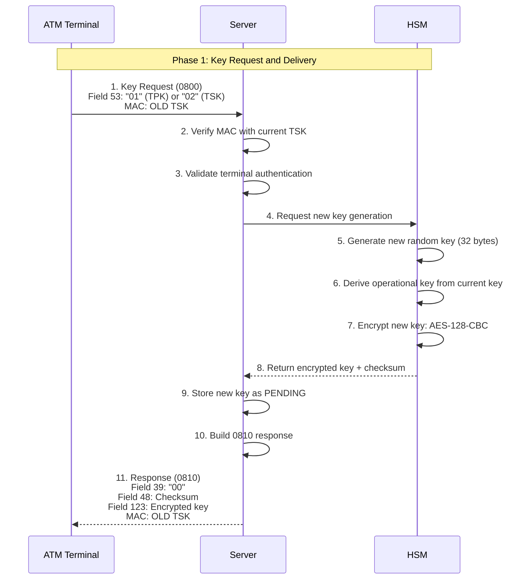
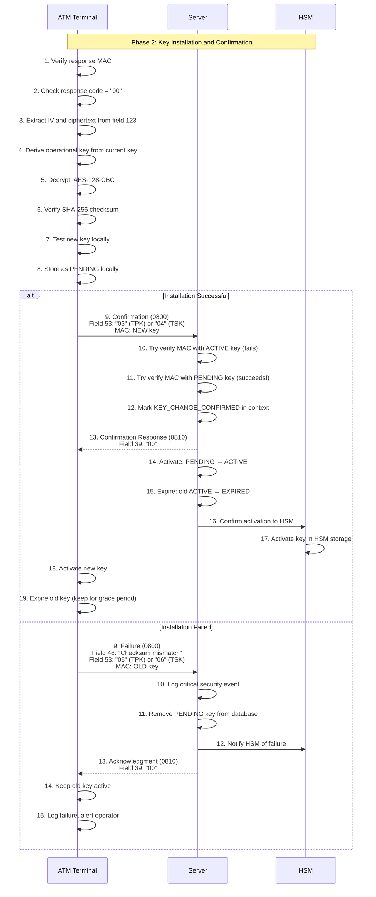

# Terminal-Initiated Key Rotation

## Table of Contents
- [Overview](#overview)
- [Protocol Summary](#protocol-summary)
- [Message Specifications](#message-specifications)
- [Complete Flow](#complete-flow)
- [Implementation Guide](#implementation-guide)
- [Security Considerations](#security-considerations)
- [Error Handling](#error-handling)
- [Testing](#testing)
- [Troubleshooting](#troubleshooting)

## Overview

Terminal-initiated key rotation is the standard method for cryptographic key rotation where the ATM terminal controls the timing and initiation of the key change process. This method is typically used for:

- **Scheduled rotation**: Periodic key changes (e.g., every 90 days)
- **Maintenance windows**: Key changes during planned downtime
- **On-demand rotation**: Manual key refresh when needed

The terminal sends a key request to the server, which coordinates with the HSM to generate and encrypt a new key under the current active key. The terminal then decrypts, verifies, tests, and activates the new key, sending explicit confirmation back to the server.

## Protocol Summary

- **Transport Protocol**: ISO-8583
- **Request MTI**: 0800 (Network Management Request)
- **Response MTI**: 0810 (Network Management Response)
- **Key Transport**: New key encrypted under current active key using AES-128-CBC
- **Integrity Protection**: SHA-256 checksum in response
- **Key Types**: TPK (Terminal PIN Key), TSK (Terminal Session Key)
- **Confirmation Required**: Yes (explicit confirmation message)

## Message Specifications

### Operation Codes (Field 53)

Field 53 contains a 16-digit numeric value identifying the operation:

| Operation | Code | Description | MAC Key | Direction |
|-----------|------|-------------|---------|-----------|
| **TPK Request** | `01` | Request new TPK from server | OLD TSK | Terminal → Server |
| **TSK Request** | `02` | Request new TSK from server | OLD TSK | Terminal → Server |
| **TPK Confirmation** | `03` | Confirm TPK installation succeeded | NEW TPK* | Terminal → Server |
| **TSK Confirmation** | `04` | Confirm TSK installation succeeded | NEW TSK | Terminal → Server |
| **TPK Failure** | `05` | Report TPK installation failed | OLD TSK | Terminal → Server |
| **TSK Failure** | `06` | Report TSK installation failed | OLD TSK | Terminal → Server |

*Note: When confirming TPK installation (operation 03), the MAC is still generated using TSK (not TPK). The operation code itself proves terminal has the new TPK.

**Field 53 Format**: `[Operation Code: 2 digits][Reserved: 14 zeros]`

**Examples:**
- TPK request: `0100000000000000`
- TSK confirmation: `0400000000000000`
- TPK failure: `0500000000000000`

### Request Message (MTI 0800)

#### Standard Key Request (Operations 01/02)

| Field | Name | Format | Length | Description | Example |
|-------|------|--------|--------|-------------|---------|
| MTI | Message Type | N | 4 | Network management request | `0800` |
| 11 | STAN | N | 6 | System trace audit number | `000001` |
| 41 | Terminal ID | ANS | 15 | Terminal identifier (space-padded) | `ATM-001        ` |
| 42 | Card Acceptor ID | ANS | 15 | Institution code (space-padded) | `TRM-ISS001    ` |
| 53 | Security Control | N | 16 | Operation code + padding | `0100000000000000` |
| 64 | MAC | B | 16 | Message authentication code | Binary 16 bytes |

**Sample Request:**
```
MTI: 0800
Field 11: 000001
Field 41: ATM-001         (15 chars, space-padded)
Field 42: TRM-ISS001      (15 chars, space-padded)
Field 53: 0100000000000000
Field 64: [16-byte MAC using current TSK]
```

#### Confirmation Message (Operations 03/04)

Same fields as request, but:
- Field 53: `03` for TPK or `04` for TSK
- Field 64: MAC generated using **NEW key** (proves terminal has it)

#### Failure Notification (Operations 05/06)

Adds field 48 with failure reason:

| Field | Name | Format | Length | Description |
|-------|------|--------|--------|-------------|
| 48 | Additional Data | ANS | var | Failure reason (e.g., "Checksum mismatch") |

### Response Message (MTI 0810)

#### Success Response (Response Code 00)

| Field | Name | Format | Length | Description |
|-------|------|--------|--------|-------------|
| MTI | Message Type | N | 4 | Network management response (`0810`) |
| 11 | STAN | N | 6 | Echoed from request |
| 39 | Response Code | AN | 2 | `00` = success |
| 41 | Terminal ID | ANS | 15 | Echoed from request |
| 48 | Key Checksum | ANS | 16 | SHA-256 checksum (first 16 hex chars) |
| 53 | Security Control | N | 16 | Echoed from request |
| 64 | MAC | B | 16 | Message authentication code |
| 123 | Encrypted Key | ANS | 128 | `[IV: 32 hex][Ciphertext: 96 hex]` |

**Field 39 Response Codes:**

| Code | Meaning | Terminal Action |
|------|---------|-----------------|
| `00` | Success | Proceed with key installation |
| `30` | Format error | Check field 53, retry with correct format |
| `91` | Not signed on | Sign on first, then retry |
| `96` | System error | Wait and retry (HSM/database error) |

**Field 48 Format (Key Checksum):**
- **Algorithm**: SHA-256 hash of plaintext key
- **Format**: First 16 hex characters (uppercase)
- **Purpose**: Verify key integrity after decryption
- **Example**: `3A5F9B2C8D1E4F7A`

**Field 123 Format (Encrypted Key):**

Structure:
```
┌─────────────────────────┬──────────────────────────────────────┐
│   IV (32 hex chars)     │   Ciphertext (96 hex chars)          │
│   16 bytes              │   48 bytes (32-byte key + padding)   │
└─────────────────────────┴──────────────────────────────────────┘
         128 hex characters total

Example:
A1B2C3D4E5F678901234567890ABCDEF1234567890ABCDEF1234567890ABCDEF1234567890ABCDEF1234567890ABCDEF1234567890ABCDEF1234567890ABCDEF
|------------ IV (32) -----------||----------------------------------- Ciphertext (96) -----------------------------------|
```

**Encryption Details:**
- **Algorithm**: AES-128-CBC with PKCS5Padding
- **Key**: Derived operational key (128 bits)
  - Derived from current master key using PBKDF2-SHA256
  - Context: `"KEY_DELIVERY:ROTATION"`
  - Output: 128 bits (16 bytes)
- **IV**: Random 16 bytes (32 hex chars)
- **Plaintext**: New key (32 bytes / 256 bits)
- **Padding**: PKCS5 adds 16 bytes (full block)
- **Ciphertext**: 48 bytes (32 + 16 padding) = 96 hex chars

**Sample Success Response:**
```
MTI: 0810
Field 11: 000001
Field 39: 00
Field 41: ATM-001
Field 48: 3A5F9B2C8D1E4F7A
Field 53: 0100000000000000
Field 64: [16-byte MAC]
Field 123: A1B2...ABCDEF (128 hex chars)
```

#### Error Response

For errors (response codes 30, 96), the response does NOT include fields 48 or 123:

```
MTI: 0810
Field 11: 000001
Field 39: 96
Field 41: ATM-001
Field 53: 0100000000000000
Field 64: [16-byte MAC]
```

## Complete Flow

### Phase 1: Key Request and Delivery



### Phase 2: Key Installation and Confirmation



### Step-by-Step Details

#### Step 1: Terminal Sends Key Request

Terminal builds 0800 message:
1. Set MTI = `0800`
2. Generate STAN (field 11)
3. Set terminal ID (field 41) and institution ID (field 42)
4. Set field 53 = `01` (TPK) or `02` (TSK) + 14 zeros
5. Generate MAC (field 64) using current TSK
6. Send via ISO-8583 channel

#### Step 2-3: Server Authentication

Server validates:
1. Verify MAC using current active TSK
2. Check terminal ID exists and is registered
3. Verify terminal has signed on
4. Check field 53 format is valid

#### Step 4-8: HSM Key Generation

HSM workflow:
1. Generate 32-byte random key using secure RNG
2. Derive 16-byte operational encryption key from current master key:
   - Algorithm: PBKDF2-SHA256
   - Salt: `"KEY_DELIVERY:ROTATION"`
   - Iterations: 10,000
   - Output: 128 bits
3. Generate random 16-byte IV
4. Encrypt new key: AES-128-CBC(new_key, operational_key, IV)
5. Calculate SHA-256(new_key), take first 16 hex chars
6. Return encrypted_key (IV + ciphertext) and checksum

#### Step 9-11: Server Response

Server stores and responds:
1. Save new key to database with status = PENDING
2. Store key version = current_version + 1
3. Build 0810 response with fields 48 (checksum), 123 (encrypted key)
4. Generate MAC using current TSK
5. Send response to terminal

#### Step 1-8 (Phase 2): Terminal Key Installation

Terminal processes response:

**1. Verify Response MAC:**
```java
boolean macValid = verifyMAC(response, currentTSK);
if (!macValid) {
    throw new SecurityException("Invalid response MAC");
}
```

**2. Check Response Code:**
```java
String responseCode = response.getString(39);
if (!"00".equals(responseCode)) {
    throw new RuntimeException("Key change rejected: " + responseCode);
}
```

**3. Extract Encrypted Key:**
```java
String encryptedKeyHex = response.getString(123); // 128 hex chars
String checksumHex = response.getString(48);       // 16 hex chars
```

**4. Derive Operational Decryption Key:**
```java
// Same derivation as HSM
byte[] currentMasterKey = hexToBytes(currentKeyHex);
byte[] operationalKey = CryptoUtil.deriveKeyFromParent(
    currentMasterKey,
    "KEY_DELIVERY:ROTATION",
    128  // 128 bits = 16 bytes
);
```

**5. Decrypt New Key:**
```java
String ivHex = encryptedKeyHex.substring(0, 32);
String ciphertextHex = encryptedKeyHex.substring(32);

byte[] iv = hexToBytes(ivHex);
byte[] ciphertext = hexToBytes(ciphertextHex);

Cipher cipher = Cipher.getInstance("AES/CBC/PKCS5Padding");
SecretKeySpec keySpec = new SecretKeySpec(operationalKey, "AES");
IvParameterSpec ivSpec = new IvParameterSpec(iv);
cipher.init(Cipher.DECRYPT_MODE, keySpec, ivSpec);

byte[] newKey = cipher.doFinal(ciphertext);  // 32 bytes
```

**6. Verify Checksum:**
```java
MessageDigest sha256 = MessageDigest.getInstance("SHA-256");
byte[] hash = sha256.digest(newKey);
String calculatedChecksum = bytesToHex(hash).substring(0, 16);

if (!calculatedChecksum.equalsIgnoreCase(checksumHex)) {
    // CRITICAL: Do NOT install key, send failure notification
    throw new SecurityException("Checksum verification failed");
}
```

**7. Test New Key:**
```java
// Perform local test (encrypt/decrypt test message)
boolean testPassed = testKey(newKey, keyType);
if (!testPassed) {
    throw new RuntimeException("Key test failed");
}
```

**8. Store as PENDING:**
```java
// Store in database/secure storage with status = PENDING
cryptoKeyService.storeAsPending(keyType, newKey, calculatedChecksum);
```

#### Step 9-18: Successful Confirmation

**Terminal sends confirmation (operation 03/04):**
```java
ISOMsg confirmMsg = new ISOMsg();
confirmMsg.setMTI("0800");
confirmMsg.set(11, generateSTAN());
confirmMsg.set(41, terminalId);
confirmMsg.set(42, institutionId);
confirmMsg.set(53, "0300000000000000");  // TPK confirmation

// CRITICAL: Use NEW key for MAC
byte[] mac = generateMAC(confirmMsg, newKey);
confirmMsg.set(64, mac);

ISOMsg confirmResponse = mux.request(confirmMsg);
```

**Server detects confirmation:**
```java
// Server tries to verify MAC
if (verifyMAC(request, activeKey)) {
    // Normal transaction
} else if (verifyMAC(request, pendingKey)) {
    // KEY CONFIRMATION DETECTED!
    ctx.put("KEY_CHANGE_CONFIRMED", true);
    // Proceed with response, activate key afterward
}
```

**Server activates key (after sending response):**
```java
// Update database
pendingKey.setStatus(KeyStatus.ACTIVE);
activeKey.setStatus(KeyStatus.EXPIRED);
activeKey.setExpiryDate(now + gracePeriod);

// Confirm to HSM
hsmClient.confirmKeyActivation(terminalId, keyType, newKeyVersion);
```

**Terminal activates:**
```java
// Load new key into runtime memory
runtimeKeyManager.reloadKey(keyType);

// Mark old key as expired (keep for grace period)
cryptoKeyService.expireOldKey(keyType);
```

#### Step 9-15: Failure Notification

If any step fails (checksum mismatch, test failure), terminal sends failure:

```java
ISOMsg failureMsg = new ISOMsg();
failureMsg.setMTI("0800");
failureMsg.set(11, generateSTAN());
failureMsg.set(41, terminalId);
failureMsg.set(42, institutionId);
failureMsg.set(48, "Checksum mismatch");  // Failure reason
failureMsg.set(53, "0500000000000000");   // TPK failure

// Use OLD key for MAC
byte[] mac = generateMAC(failureMsg, currentTSK);
failureMsg.set(64, mac);

mux.request(failureMsg);
```

Server handles failure:
```java
if (operationCode.equals("05") || operationCode.equals("06")) {
    // Log critical security event
    log.error("Key installation failed: terminalId={}, reason={}",
        terminalId, request.getString(48));

    // Remove PENDING key
    cryptoKeyService.removePendingKey(terminalId, keyType);

    // Notify HSM
    hsmClient.notifyKeyFailure(terminalId, keyType);

    // Old key remains active
}
```

## Implementation Guide

### Client-Side Implementation

See [KeyChangeService.java:72](/Users/endymuhardin/workspace/training/training-spring-jpos-2025/sample-apps/spring-jpos-atm-simulator/src/main/java/com/example/atm/service/KeyChangeService.java#L72) for complete implementation.

**Key Methods:**

1. **Build Request**: [KeyChangeService.java:119](/Users/endymuhardin/workspace/training/training-spring-jpos-2025/sample-apps/spring-jpos-atm-simulator/src/main/java/com/example/atm/service/KeyChangeService.java#L119)
2. **Process Response**: [KeyChangeService.java:155](/Users/endymuhardin/workspace/training/training-spring-jpos-2025/sample-apps/spring-jpos-atm-simulator/src/main/java/com/example/atm/service/KeyChangeService.java#L155)
3. **Decrypt Key**: [KeyChangeService.java:235](/Users/endymuhardin/workspace/training/training-spring-jpos-2025/sample-apps/spring-jpos-atm-simulator/src/main/java/com/example/atm/service/KeyChangeService.java#L235)
4. **Send Confirmation**: [KeyChangeService.java:318](/Users/endymuhardin/workspace/training/training-spring-jpos-2025/sample-apps/spring-jpos-atm-simulator/src/main/java/com/example/atm/service/KeyChangeService.java#L318)

### Server-Side Implementation

Key components:

1. **KeyChangeParticipant**: Handles key request (operations 01/02)
2. **KeyConfirmationParticipant**: Handles confirmation (operations 03/04)
3. **KeyActivationParticipant**: Activates PENDING keys after confirmation
4. **CryptoKeyService**: Database operations
5. **HsmClient**: HSM integration

### HSM Integration

HSM must implement:
1. `POST /api/keys/generate` - Generate and encrypt new key
2. `POST /api/keys/activate` - Confirm key activation
3. `POST /api/keys/failure` - Handle key installation failure

See HSM documentation for detailed API specifications.

## Security Considerations

### 1. Key Transport Security

**Encryption Layer:**
- New key never transmitted in plaintext
- Encrypted under derived operational key (not master key directly)
- Key derivation uses PBKDF2-SHA256 with context salt
- Random IV per encryption (prevents replay attacks)

**Why Derive Operational Key?**
- Limits exposure of master key
- Different contexts use different derived keys
- Master key compromise doesn't immediately reveal all operational keys

### 2. Integrity Protection

**Checksum Verification:**
- SHA-256 provides strong collision resistance
- Terminal MUST verify before activation
- Mismatch = potential attack or transmission error
- Failed verification = security event, do NOT install

**MAC Protection:**
- All messages protected by MAC
- Prevents message tampering
- Server verifies MAC before processing
- Terminal verifies MAC on responses

### 3. Explicit Confirmation System

**Why Required?**
- Server cannot assume successful installation
- Network failure could occur after terminal decryption
- Terminal could detect local issues (test failure)
- Explicit confirmation proves terminal has working key

**Confirmation Detection:**
- Terminal sends MAC using NEW key
- Server tries ACTIVE key first (normal transactions)
- Server tries PENDING keys (detects confirmation)
- MAC verification with PENDING key = confirmation signal

### 4. Key Lifecycle Management

**States:**
- **PENDING**: Just received, not yet activated
- **ACTIVE**: Currently in use
- **EXPIRED**: Old key, kept for grace period

**Grace Period Benefits:**
- Allows gradual transition
- Terminals can use old key temporarily
- Server accepts both keys during transition
- Failed rotation doesn't break service

**Typical Grace Period**: 24 hours

### 5. Rollback Protection

**Version Tracking:**
- Each key has monotonically increasing version number
- Server rejects keys with version ≤ current
- Prevents replay of old key change responses
- Audit log records all version changes

**Implementation:**
```java
if (newKeyVersion <= currentKeyVersion) {
    throw new SecurityException("Key version rollback detected");
}
```

### 6. Failure Handling

**Terminal Failures:**
- Checksum mismatch → Security event, alert admin
- Decryption failure → Log error, retry
- Test failure → Don't activate, notify server
- Always send failure notification (operations 05/06)

**Server Actions:**
- Log critical security events
- Remove PENDING key from database
- Notify HSM of failure
- Old ACTIVE key remains unchanged
- Send acknowledgment to terminal

## Error Handling

### Response Code 30 (Format Error)

**Cause**: Invalid field 53 format

**Terminal Action:**
1. Log error with request details
2. Verify field 53 construction:
   - TPK: `0100000000000000`
   - TSK: `0200000000000000`
3. Check field length = exactly 16 digits
4. Retry with corrected format

### Response Code 91 (Not Signed On)

**Cause**: Terminal not registered/signed on

**Terminal Action:**
1. Execute sign-on procedure
2. Wait for successful sign-on response
3. Retry key change request

### Response Code 96 (System Error)

**Cause**: Server/HSM malfunction

**Terminal Action:**
1. Log error with timestamp
2. Wait backoff period (exponential backoff recommended)
3. Retry request (max 3 attempts)
4. If all retries fail, alert operator
5. Continue using current key

**Backoff Strategy:**
```java
int[] delays = {30, 60, 120};  // seconds
for (int attempt = 0; attempt < 3; attempt++) {
    try {
        return initiateKeyChange(keyType);
    } catch (SystemErrorException e) {
        if (attempt < 2) {
            Thread.sleep(delays[attempt] * 1000);
        }
    }
}
throw new RuntimeException("Key change failed after 3 attempts");
```

### Checksum Verification Failure

**Cause**: Decrypted key doesn't match checksum

**Security Implications**: CRITICAL - Possible attack or transmission corruption

**Terminal Action:**
1. **DO NOT** install the new key
2. Log security event with full details
3. Discard decrypted key from memory
4. Send failure notification (operation 05/06)
5. Alert security administrator
6. Retry key change request
7. If repeated failures (>3), contact server admin

**Server Action:**
- Investigate logs for HSM errors
- Verify HSM connectivity
- Check key encryption implementation

### Decryption Failure

**Cause**: Cannot decrypt field 123

**Possible Root Causes:**
1. Using wrong current key for decryption
2. Corrupted field 123 during transmission
3. Key derivation mismatch
4. IV extraction error
5. Cipher configuration error

**Terminal Action:**
```java
try {
    byte[] newKey = decryptNewKey(encryptedKeyHex, currentKey);
} catch (BadPaddingException e) {
    log.error("Decryption failed - possible causes:");
    log.error("  1. Wrong current key used");
    log.error("  2. Corrupted ciphertext");
    log.error("  3. Key derivation mismatch");

    // Verify current key version
    log.info("Current key version: {}", currentKeyVersion);

    // Send failure notification
    sendKeyInstallationConfirmation(keyType, false);

    throw new RuntimeException("Key decryption failed", e);
}
```

### MAC Verification Failure

**On Request (Server Side):**
- Reject request immediately
- Return response code 96 (or custom security code)
- Log security event
- Do not process key change

**On Response (Terminal Side):**
- **CRITICAL SECURITY EVENT**
- Reject response immediately
- Do NOT decrypt field 123
- Do NOT install any key
- Log security alert
- Alert security team
- Potential man-in-the-middle attack

### Timeout Errors

**No Response from Server:**

**Terminal Action:**
```java
ISOMsg response = mux.request(request, 30000);  // 30 second timeout
if (response == null) {
    log.error("Key change timeout: no response from server");
    // Retry with exponential backoff
    throw new TimeoutException("No response from server");
}
```

**Grace Period Handling:**
- Old key remains active during timeout
- Terminal can retry without breaking service
- Server may have processed request (idempotency important)

## Testing

### Prerequisites

- ATM simulator running and connected
- Server running and healthy
- HSM simulator running
- Terminal signed on successfully
- Current keys verified working

### Test 1: Successful TPK Rotation

**Execute:**
```bash
curl -X POST http://localhost:7070/api/keys/change \
  -H "Content-Type: application/json" \
  -d '{"keyType": "TPK"}'
```

**Expected Result:**
```json
{
  "success": true,
  "keyType": "TPK",
  "keyId": "uuid",
  "checkValue": "3A5F9B2C8D1E4F7A",
  "message": "Key changed successfully via ISO-8583"
}
```

**Verify in Logs:**

Terminal:
```
INFO: Initiating key change for key type: TPK
INFO: Sending key change request via MUX
INFO: Key change approved by server, processing encrypted key
INFO: Decrypted new key: 32 bytes
INFO: Checksum verification successful: 3A5F9B2C8D1E4F7A
INFO: Key change completed successfully for TPK
INFO: Key installation successful, sending confirmation to server
INFO: Server acknowledged key installation confirmation: response code 00
```

Server:
```
INFO: Processing key change request: terminalId=TRM-ISS001-ATM-001, keyType=TPK
INFO: Generated new TPK key: version=2, checksum=3A5F9B2C8D1E4F7A
INFO: Stored new TPK key as PENDING: version=2
INFO: Processing key confirmation: terminalId=TRM-ISS001-ATM-001, keyType=TPK
INFO: MAC verified with PENDING TPK key - confirmation detected
INFO: Explicit confirmation received for TPK key installation
INFO: Successfully activated TPK key version 2
INFO: Successfully confirmed TPK key activation to HSM
```

HSM:
```
INFO: Generated new TPK for terminal: TRM-ISS001-ATM-001
INFO: Encrypted new key under current TPK using AES-128-CBC
INFO: Key activation confirmed: terminalId=TRM-ISS001-ATM-001, keyType=TPK, version=2
```

**Post-Rotation Verification:**
```bash
# Test PIN transaction with new TPK
curl -X POST http://localhost:7070/api/transactions/balance \
  -H "Content-Type: application/json" \
  -d '{"pan": "4111111111111111", "pin": "1234"}'
```

Should succeed with response code `00`.

### Test 2: Successful TSK Rotation

Same as Test 1, but with:
```json
{"keyType": "TSK"}
```

**Important**: After TSK rotation, the confirmation message itself uses the NEW TSK for MAC, proving end-to-end functionality.

### Test 3: Checksum Mismatch Simulation

**Setup**: Modify HSM to return incorrect checksum

**Expected Behavior:**
- Terminal detects mismatch
- Terminal sends failure notification (operation 05)
- Server removes PENDING key
- Old key remains active

**Terminal Log:**
```
ERROR: Checksum mismatch! Expected: 3A5F9B2C8D1E4F7A, Calculated: 1234567890ABCDEF
ERROR: SHA-256 checksum verification failed
INFO: Sending key installation FAILURE notification for TPK: operation code 05
```

### Test 4: Server Unavailable (Response Code 96)

**Setup**: Stop HSM simulator

**Expected Behavior:**
- Server returns response code 96
- Terminal logs error
- Terminal retries with backoff
- Old key remains active

### Test 5: Format Error (Response Code 30)

**Setup**: Modify terminal to send malformed field 53

**Expected Behavior:**
- Server returns response code 30
- Terminal logs format error
- Terminal corrects and retries

## Troubleshooting

### Problem: Checksum Always Fails

**Symptoms:**
- Decryption succeeds
- Checksum verification always fails
- Error: "Checksum mismatch"

**Investigation:**
```bash
# Check terminal logs
grep "Expected.*Calculated" logs/atm.log

# Check server/HSM logs for checksum generation
grep "Generated checksum" logs/server.log
```

**Common Causes:**
1. **Case sensitivity**: Terminal using lowercase, server using uppercase
2. **Hash truncation**: Taking wrong substring of hash
3. **Key encoding**: Using wrong key for hash calculation

**Solution:**
```java
// Both server and terminal must use same algorithm
String checksum = bytesToHex(sha256Hash).substring(0, 16).toUpperCase();
```

### Problem: Decryption Fails with BadPaddingException

**Symptoms:**
```
javax.crypto.BadPaddingException: Given final block not properly padded
```

**Investigation:**
1. **Check IV extraction:**
   ```java
   log.info("IV hex: {}", encryptedKeyHex.substring(0, 32));
   log.info("Ciphertext hex: {}", encryptedKeyHex.substring(32));
   ```

2. **Verify key derivation:**
   ```java
   log.info("Current master key length: {} bytes", currentMasterKey.length);
   log.info("Derived operational key length: {} bytes", operationalKey.length);
   ```

3. **Check cipher configuration:**
   ```java
   log.info("Cipher: {}", cipher.getAlgorithm());  // Should be "AES/CBC/PKCS5Padding"
   log.info("Key algorithm: {}", keySpec.getAlgorithm());  // Should be "AES"
   log.info("Key length: {} bytes", keySpec.getEncoded().length);  // Should be 16
   ```

**Common Causes:**
1. Wrong current key used for derivation
2. Key derivation context mismatch
3. Using master key directly instead of derived operational key
4. IV/ciphertext parsing error

**Solution:**
```java
// Terminal MUST match server/HSM key derivation
byte[] operationalKey = CryptoUtil.deriveKeyFromParent(
    currentMasterKeyBytes,
    "KEY_DELIVERY:ROTATION",  // EXACT context string
    128  // 128 bits output
);
```

### Problem: Confirmation Not Detected by Server

**Symptoms:**
- Terminal sends confirmation (operation 03/04)
- Server doesn't activate PENDING key
- Old key remains active

**Investigation:**
```bash
# Check if MAC verified with PENDING key
grep "MAC verified with PENDING" logs/server.log

# Check if confirmation was marked
grep "KEY_CHANGE_CONFIRMED" logs/server.log
```

**Common Causes:**
1. Terminal using wrong key for confirmation MAC
2. Server not trying PENDING keys for MAC verification
3. PENDING key not stored correctly

**Solution:**
Verify terminal sends confirmation with NEW key:
```java
// For TPK confirmation, MUST use NEW TPK
if (keyType == KeyType.TPK) {
    mac = generateMAC(confirmMsg, newTPK);
}
```

### Problem: Keys Out of Sync After Rotation

**Symptoms:**
- Key rotation appears successful
- Subsequent transactions fail
- MAC verification failures

**Investigation:**
```bash
# Check active key versions
SELECT terminal_id, key_type, key_version, status, effective_from
FROM crypto_keys
WHERE terminal_id = 'TRM-ISS001-ATM-001'
AND status = 'ACTIVE';
```

**Common Causes:**
1. Terminal activated but server didn't
2. Server activated but HSM didn't
3. Database transaction rollback

**Solution:**
- Verify HSM activation confirmation
- Check database transaction logs
- May need manual key synchronization

### Problem: Old Key Not Expiring

**Symptoms:**
- New key activated successfully
- Old key status still ACTIVE

**Investigation:**
```bash
# Check for multiple ACTIVE keys
SELECT * FROM crypto_keys
WHERE terminal_id = 'TRM-ISS001-ATM-001'
AND key_type = 'TPK'
AND status = 'ACTIVE';
```

**Solution:**
Verify KeyActivationParticipant expires old key:
```java
// After activating new key
oldActiveKey.setStatus(KeyStatus.EXPIRED);
oldActiveKey.setExpiryDate(now + gracePeriod);
```

### Diagnostic Commands

**Check Current Keys:**
```bash
# Terminal side
curl http://localhost:7070/api/debug/keys

# Server side
SELECT terminal_id, key_type, key_version, status, check_value, effective_from
FROM crypto_keys
WHERE terminal_id = 'TRM-ISS001-ATM-001'
ORDER BY effective_from DESC;
```

**View Recent Key Rotations:**
```bash
# Last 10 rotations
SELECT terminal_id, key_type, key_version, status,
       check_value, effective_from, created_at
FROM crypto_keys
ORDER BY created_at DESC
LIMIT 10;
```

**Test Current Keys:**
```bash
# Balance inquiry uses both TPK (PIN) and TSK (MAC)
curl -X POST http://localhost:7070/api/transactions/balance \
  -H "Content-Type: application/json" \
  -d '{"pan": "4111111111111111", "pin": "1234"}'
```

## Related Documentation

- **[Key Rotation Overview](KEY_ROTATION_OVERVIEW.md)** - High-level overview with mermaid diagrams
- **[Server-Initiated Key Rotation](KEY_ROTATION_SERVER_INITIATED.md)** - Remote rotation triggering
- **[Testing Guide](KEY_ROTATION_TESTING.md)** - Comprehensive testing procedures
- **[Quick Reference](KEY_CHANGE_QUICK_REFERENCE.md)** - Quick reference for field formats

---

**Document Version:** 1.0
**Last Updated:** 2025-11-01
**Status:** Production Ready
