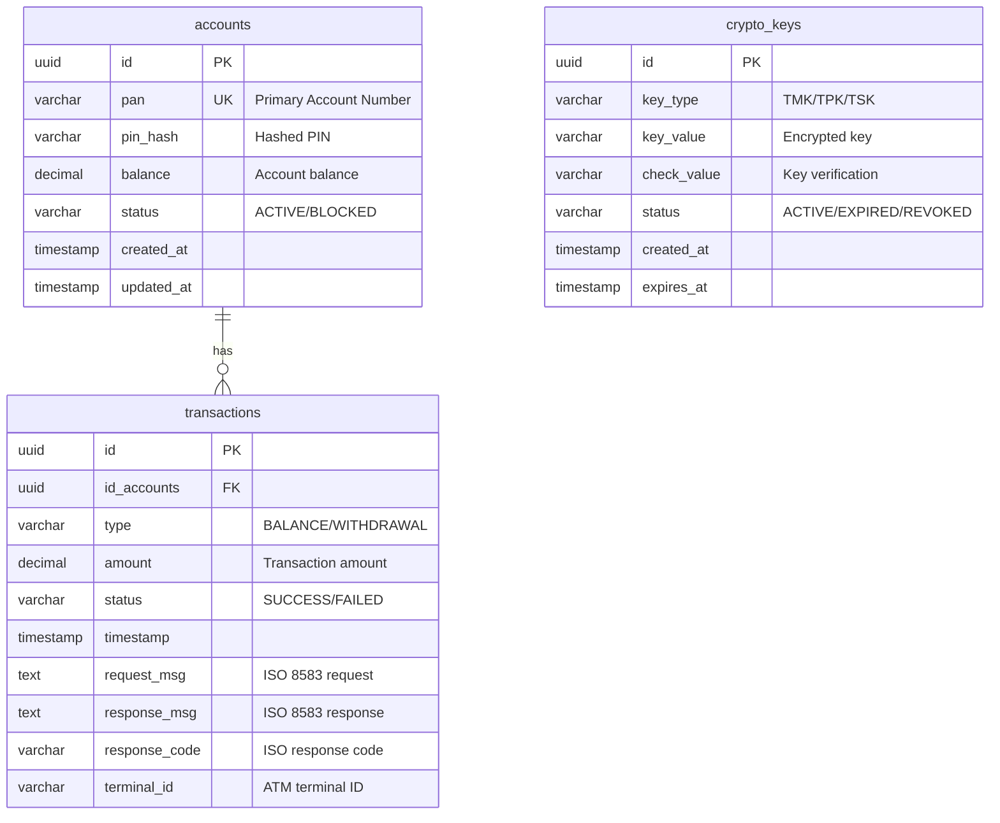

# ATM Simulator

A comprehensive ATM simulator application built with Spring Boot and jPOS for ISO 8583 message processing.

## Features

### Transaction Operations
- **Balance Inquiry** - Check account balance
- **Cash Withdrawal** - Withdraw funds from account
- **Key Change** - Update cryptographic keys (TMK, TPK, TSK)

## User Experience

### ATM Transaction Flow
1. Enter card number (PAN)
2. Enter PIN
3. Select transaction type (Balance Inquiry or Cash Withdrawal)
4. For withdrawals, enter the amount
5. Click "Execute" to process the transaction
6. View transaction result

### Key Change Flow
1. Select key type:
   - **TMK** (Terminal Master Key)
   - **TPK** (Terminal PIN Key)
   - **TSK** (Terminal Session Key)
2. Click "Initiate Key Change"
3. Monitor the process through console log output

## Tech Stack

- **Java 25**
- **Maven 3**
- **Spring Boot 3.5.7**
- **jPOS 3.0.0** - ISO 8583 message processing
  - **ASCIIChannel** - Communication channel for ASCII-based ISO 8583 messages
  - **Base24Packager** - ACI BASE24 message packager
- **PostgreSQL 17** - Database (containerized with Docker Compose)
- **Flyway DB** - Database migration tool
- **Thymeleaf** - Server-side templating
- **Tailwind CSS** - Styling framework

## Prerequisites

- Java 25 or higher
- Maven 3.x
- Docker and Docker Compose (for PostgreSQL)

## Database Design

### Entity Relationship Diagram



### Table Schemas

#### accounts
Stores card and account information.

| Column     | Type         | Constraints           | Description                    |
|------------|--------------|-----------------------|--------------------------------|
| id         | UUID         | PRIMARY KEY           | Unique account identifier      |
| pan        | VARCHAR(19)  | UNIQUE, NOT NULL      | Primary Account Number (card)  |
| pin_hash   | VARCHAR(255) | NOT NULL              | Hashed PIN for verification    |
| balance    | DECIMAL(15,2)| NOT NULL, DEFAULT 0   | Current account balance        |
| status     | VARCHAR(20)  | NOT NULL, DEFAULT 'ACTIVE' | Account status (ACTIVE/BLOCKED) |
| created_at | TIMESTAMP    | NOT NULL, DEFAULT NOW | Record creation timestamp      |
| updated_at | TIMESTAMP    | NOT NULL, DEFAULT NOW | Last update timestamp          |

**Indexes:**
- `idx_accounts_pan` on `pan`
- `idx_accounts_status` on `status`

---

#### transactions
Logs all ATM transactions.

| Column        | Type         | Constraints           | Description                         |
|---------------|--------------|-----------------------|-------------------------------------|
| id            | UUID         | PRIMARY KEY           | Unique transaction identifier       |
| id_accounts   | UUID         | FOREIGN KEY, NOT NULL | Reference to accounts table         |
| type          | VARCHAR(50)  | NOT NULL              | Transaction type (BALANCE/WITHDRAWAL) |
| amount        | DECIMAL(15,2)| NULL                  | Transaction amount (null for balance) |
| status        | VARCHAR(20)  | NOT NULL              | Transaction status (SUCCESS/FAILED) |
| timestamp     | TIMESTAMP    | NOT NULL, DEFAULT NOW | Transaction timestamp               |
| request_msg   | TEXT         | NULL                  | ISO 8583 request message            |
| response_msg  | TEXT         | NULL                  | ISO 8583 response message           |
| response_code | VARCHAR(10)  | NULL                  | ISO 8583 response code              |
| terminal_id   | VARCHAR(50)  | NULL                  | ATM terminal identifier             |

**Indexes:**
- `idx_transactions_id_accounts` on `id_accounts`
- `idx_transactions_timestamp` on `timestamp`
- `idx_transactions_type` on `type`

**Foreign Keys:**
- `id_accounts` REFERENCES `accounts(id)` ON DELETE CASCADE

---

#### crypto_keys
Manages cryptographic keys for secure transactions.

| Column      | Type         | Constraints                | Description                           |
|-------------|--------------|----------------------------|---------------------------------------|
| id          | UUID         | PRIMARY KEY                | Unique key identifier                 |
| key_type    | VARCHAR(10)  | NOT NULL                   | Key type (TMK/TPK/TSK)                |
| key_value   | VARCHAR(500) | NOT NULL                   | Encrypted key value                   |
| check_value | VARCHAR(50)  | NULL                       | Key check value for verification      |
| status      | VARCHAR(20)  | NOT NULL, DEFAULT 'ACTIVE' | Key status (ACTIVE/EXPIRED/REVOKED)   |
| created_at  | TIMESTAMP    | NOT NULL, DEFAULT NOW      | Key creation timestamp                |
| expires_at  | TIMESTAMP    | NULL                       | Key expiration timestamp              |

**Indexes:**
- `idx_crypto_keys_type_status` on `key_type, status`
- `idx_crypto_keys_expires_at` on `expires_at`

**Constraints:**
- `check_key_type` CHECK (key_type IN ('TMK', 'TPK', 'TSK'))
- `check_key_status` CHECK (status IN ('ACTIVE', 'EXPIRED', 'REVOKED'))

---

### Database Initialization

The database schema is automatically created on application startup using Spring Boot's schema management or Flyway/Liquibase migrations.

**Sample seed data:**

```sql
-- Insert test account
INSERT INTO accounts (id, pan, pin_hash, balance, status)
VALUES (gen_random_uuid(), '4111111111111111', '$2a$10$...', 1000.00, 'ACTIVE');

-- Insert initial crypto keys
INSERT INTO crypto_keys (id, key_type, key_value, check_value, status)
VALUES
  (gen_random_uuid(), 'TMK', 'encrypted_tmk_value', 'ABC123', 'ACTIVE'),
  (gen_random_uuid(), 'TPK', 'encrypted_tpk_value', 'DEF456', 'ACTIVE'),
  (gen_random_uuid(), 'TSK', 'encrypted_tsk_value', 'GHI789', 'ACTIVE');
```

## jPOS Configuration

### ASCIIChannel and Base24Packager Setup

The application uses jPOS ASCIIChannel for communication and Base24Packager for ISO 8583 message formatting.

**Channel Configuration (`/config/channel.xml`):**

```xml
<?xml version="1.0" encoding="UTF-8"?>
<channel class="org.jpos.iso.channel.ASCIIChannel" logger="Q2" packager="org.jpos.iso.packager.Base24Packager">
    <property name="host" value="localhost" />
    <property name="port" value="8000" />
    <property name="timeout" value="30000" />
</channel>
```

**Key jPOS Components:**

- **ASCIIChannel**: Handles ASCII-encoded ISO 8583 message transmission
- **Base24Packager**: Implements ACI BASE24 message format specifications
- **Message Processing**: All ISO 8583 messages are packed/unpacked using Base24 format

**Example ISO 8583 Message Fields (BASE24):**

| Field | Description              | Type          |
|-------|--------------------------|---------------|
| 0     | Message Type Indicator   | Fixed (4)     |
| 2     | Primary Account Number   | LLVAR         |
| 3     | Processing Code          | Fixed (6)     |
| 4     | Transaction Amount       | Fixed (12)    |
| 7     | Transmission Date/Time   | Fixed (10)    |
| 11    | System Trace Audit Number| Fixed (6)     |
| 41    | Card Acceptor Terminal ID| Fixed (8)     |
| 52    | PIN Block                | Fixed (16)    |

## Getting Started

### 1. Clone the repository
```bash
git clone <repository-url>
cd atm-simulator
```

### 2. Start PostgreSQL
```bash
docker-compose up -d
```

### 3. Build the application
```bash
mvn clean install
```

### 4. Run the application
```bash
mvn spring-boot:run
```

The application will start on `http://localhost:8080`

## Configuration

**Database configuration (`application.properties`):**

```properties
spring.datasource.url=jdbc:postgresql://localhost:5432/atm_db
spring.datasource.username=your_username
spring.datasource.password=your_password
spring.jpa.hibernate.ddl-auto=update
spring.jpa.show-sql=true
```

**jPOS configuration:**

```properties
# jPOS Channel Configuration
jpos.channel.host=localhost
jpos.channel.port=8000
jpos.channel.timeout=30000
jpos.channel.type=ASCIIChannel
jpos.packager.type=Base24Packager
```

## Logging

The application provides verbose logging for:
- **PIN Block Calculation** - Detailed steps of PIN encryption (ISO Format 0)
- **ISO 8583 Message Construction** - Field-by-field message building with Base24Packager
- **ASCIIChannel Communication** - Request/response transmission logs
- **Message Packing/Unpacking** - BASE24 format serialization details
- **Request/Response Flow** - Complete transaction lifecycle

**Sample log output:**

```
[INFO] PIN Block Calculation:
  - Clear PIN: ****
  - PIN Block Format: ISO-0
  - PAN: 411111******1111
  - PIN Block: 041234FFFFFFFFFF

[INFO] ISO 8583 Message Construction (Base24Packager):
  - MTI: 0200
  - Field 2 (PAN): 4111111111111111
  - Field 3 (Processing Code): 310000
  - Field 4 (Amount): 000000010000
  - Field 52 (PIN Block): 041234FFFFFFFFFF

[INFO] ASCIIChannel - Sending message to localhost:8000
[INFO] ASCIIChannel - Received response with MTI: 0210
[INFO] Response Code: 00 (Approved)
```

All logs are output to the console for easy debugging and monitoring.

## Project Structure

```
spring-jpos-atm-simulator/
├── src/
│   ├── main/
│   │   ├── java/
│   │   │   └── com/
│   │   │       └── example/
│   │   │           └── atm/
│   │   │               ├── SpringJposAtmApplication.java
│   │   │               │
│   │   │               ├── web/
│   │   │               │   └── controller/
│   │   │               │       ├── AtmController.java
│   │   │               │       └── KeyManagementController.java
│   │   │               │
│   │   │               ├── service/
│   │   │               │   ├── AccountService.java
│   │   │               │   ├── TransactionService.java
│   │   │               │   └── CryptoKeyService.java
│   │   │               │
│   │   │               ├── jpos/
│   │   │               │   ├── config/
│   │   │               │   │   ├── JposConfiguration.java
│   │   │               │   │   └── Q2Configuration.java
│   │   │               │   ├── channel/
│   │   │               │   │   ├── AtmChannelAdaptor.java
│   │   │               │   │   └── ChannelManager.java
│   │   │               │   ├── packager/
│   │   │               │   │   └── CustomBase24Packager.java
│   │   │               │   ├── participant/
│   │   │               │   │   ├── BalanceInquiryParticipant.java
│   │   │               │   │   ├── WithdrawalParticipant.java
│   │   │               │   │   ├── PinVerificationParticipant.java
│   │   │               │   │   └── KeyExchangeParticipant.java
│   │   │               │   ├── service/
│   │   │               │   │   ├── ISO8583MessageBuilder.java
│   │   │               │   │   ├── PINBlockService.java
│   │   │               │   │   └── MessageValidator.java
│   │   │               │   └── listener/
│   │   │               │       └── TransactionListener.java
│   │   │               │
│   │   │               ├── domain/
│   │   │               │   ├── model/
│   │   │               │   │   ├── Account.java
│   │   │               │   │   ├── Transaction.java
│   │   │               │   │   └── CryptoKey.java
│   │   │               │   └── repository/
│   │   │               │       ├── AccountRepository.java
│   │   │               │       ├── TransactionRepository.java
│   │   │               │       └── CryptoKeyRepository.java
│   │   │               │
│   │   │               ├── dto/
│   │   │               │   ├── TransactionRequest.java
│   │   │               │   ├── TransactionResponse.java
│   │   │               │   └── KeyChangeRequest.java
│   │   │               │
│   │   │               └── exception/
│   │   │                   ├── InsufficientBalanceException.java
│   │   │                   ├── InvalidPinException.java
│   │   │                   └── TransactionException.java
│   │   │
│   │   └── resources/
│   │       ├── application.yml
│   │       ├── application-dev.yml
│   │       ├── application-prod.yml
│   │       │
│   │       ├── deploy/                     # jPOS Q2 deployment descriptors
│   │       │   ├── 10_logger.xml
│   │       │   ├── 20_channelAdaptor.xml
│   │       │   ├── 30_txnmgr.xml
│   │       │   └── 99_sysmon.xml
│   │       │
│   │       ├── jpos/                       # jPOS configuration files
│   │       │   ├── packager/
│   │       │   │   ├── base24-atm.xml
│   │       │   │   └── base24-field-config.xml
│   │       │   ├── channel/
│   │       │   │   └── atm-channel.cfg
│   │       │   └── cfg/
│   │       │       └── default.cfg
│   │       │
│   │       ├── db/
│   │       │   └── migration/              # Flyway/Liquibase migrations
│   │       │       ├── V1__create_accounts_table.sql
│   │       │       ├── V2__create_transactions_table.sql
│   │       │       ├── V3__create_crypto_keys_table.sql
│   │       │       └── V4__seed_data.sql
│   │       │
│   │       ├── templates/                   # Thymeleaf templates
│   │       │   ├── index.html
│   │       │   ├── transaction.html
│   │       │   └── key-management.html
│   │       │
│   │       ├── static/
│   │       │   ├── css/
│   │       │   │   └── tailwind.css
│   │       │   └── js/
│   │       │       └── app.js
│   │       │
│   │       └── log/                         # jPOS log configuration
│   │           └── Q2.xml
│   │
│   └── test/
│       ├── java/
│       │   └── com/
│       │       └── example/
│       │           └── atm/
│       │               ├── service/
│       │               │   └── AccountServiceTest.java
│       │               ├── jpos/
│       │               │   ├── service/
│       │               │   │   └── ISO8583MessageBuilderTest.java
│       │               │   └── participant/
│       │               │       └── BalanceInquiryParticipantTest.java
│       │               └── web/
│       │                   └── controller/
│       │                       └── AtmControllerTest.java
│       └── resources/
│           └── application-test.yml
│
├── deploy/                                  # Q2 runtime directory (generated)
├── log/                                     # Application logs
├── docker-compose.yml
├── pom.xml
└── README.md
```

### Folder Structure Explanation

#### jPOS Integration (`src/main/java/.../jpos/`)

**config/** - Spring Boot integration configuration for jPOS
- `JposConfiguration.java` - Initializes jPOS components as Spring beans
- `Q2Configuration.java` - Configures Q2 container lifecycle

**channel/** - Channel management and adapters
- `AtmChannelAdaptor.java` - Bridges Spring services with jPOS channels
- `ChannelManager.java` - Manages channel lifecycle and connection pooling

**packager/** - Custom packager implementations
- `CustomBase24Packager.java` - Extended Base24 packager with custom fields

**participant/** - Transaction participant implementations
- Transaction-specific participants implementing jPOS TransactionParticipant interface
- Each participant handles specific business logic (balance inquiry, withdrawal, PIN verification)

**service/** - jPOS-specific services
- `ISO8583MessageBuilder.java` - Builds ISO 8583 messages
- `PINBlockService.java` - PIN block calculation and encryption
- `MessageValidator.java` - Validates ISO message structure

**listener/** - jPOS request listeners
- `TransactionListener.java` - Listens for incoming ISO 8583 transactions

#### jPOS Resources (`src/main/resources/`)

**deploy/** - Q2 deployment descriptors (XML files defining Q2 services)
- Loaded by Q2 container on startup
- Numbered prefix ensures load order

**jpos/** - jPOS-specific configuration files
- `packager/` - XML packager definitions
- `channel/` - Channel configuration
- `cfg/` - Environment-specific jPOS settings

**db/migration/** - Database version control
- Flyway or Liquibase migration scripts
- Uses UUID primary keys and id_tablename foreign key naming

#### Domain Layer (`domain/`)

**model/** - JPA entities with UUID primary keys
- `Account.java` - Uses `@Id @GeneratedValue(generator = "UUID")`
- Foreign keys follow `id_tablename` convention

**repository/** - Spring Data JPA repositories

## Usage Examples

### Balance Inquiry
1. Enter PAN: `4111111111111111`
2. Enter PIN: `1234`
3. Select "Balance Inquiry"
4. Click "Execute"
5. View balance in response

**ISO 8583 Message Flow:**
```
Request MTI: 0200
Processing Code: 310000 (Balance Inquiry)

Response MTI: 0210
Response Code: 00 (Approved)
Balance: $1,000.00
```

### Cash Withdrawal
1. Enter PAN: `4111111111111111`
2. Enter PIN: `1234`
3. Select "Cash Withdrawal"
4. Enter amount: `100.00`
5. Click "Execute"

**ISO 8583 Message Flow:**
```
Request MTI: 0200
Processing Code: 010000 (Cash Withdrawal)
Amount: 000000010000 ($100.00)

Response MTI: 0210
Response Code: 00 (Approved)
```

## Development

### Running Tests
```bash
mvn test
```

### Building for Production
```bash
mvn clean package
java -jar target/atm-simulator-1.0.0.jar
```

### Testing ISO 8583 Messages

Use jPOS tools to test message formatting:

```java
ISOMsg msg = new ISOMsg();
msg.setPackager(new Base24Packager());
msg.setMTI("0200");
msg.set(2, "4111111111111111");
msg.set(3, "310000");

byte[] packed = msg.pack();
// Send via ASCIIChannel
```

## License

[Your License Here]

## Contributing

Contributions are welcome! Please feel free to submit a Pull Request.

## Support

For issues and questions, please open an issue in the repository.