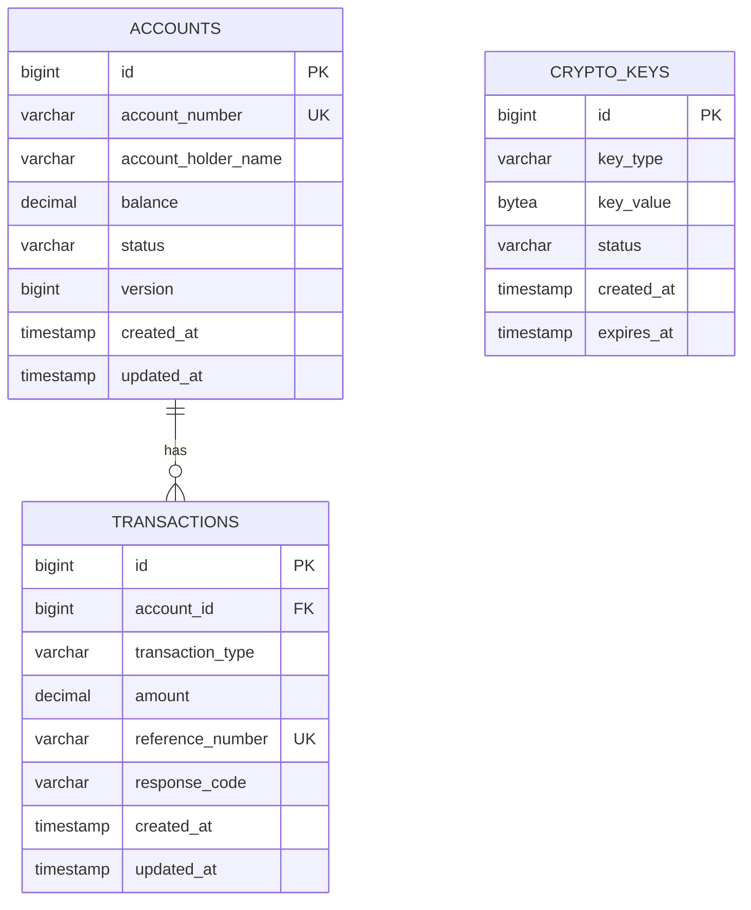

# Hari 1 – Spring Boot Application Setup, REST, dan Database

## Tujuan
- Pengenalan ekosistem pembayaran & ISO-8583
- Setup project Spring Boot untuk Bank Server
- Implementasi REST API untuk ATM operations (Balance Inquiry & Withdrawal)
- Integrasi database PostgreSQL untuk accounts & transactions
- Setup ATM terminal simulator dengan web UI
- Testing dengan Postman dan browser untuk validasi API

## 1. Environment Setup

### 1.1 Docker & Docker Compose Setup
```bash
# Install Docker Desktop (untuk macOS/Windows)
# atau install Docker + Docker Compose (untuk Linux)

# Verifikasi instalasi
docker --version
docker-compose --version
```

### 1.2 Start PostgreSQL dengan Docker Compose
```bash
# Navigate ke workshop/day-1 directory
cd workshop/day-1

# Start PostgreSQL container
docker-compose up -d

# Verifikasi container running
docker-compose ps

# View logs
docker-compose logs -f postgres
```

### 1.3 Connect ke Database
```bash
# Connect ke container
docker-compose exec postgres psql -U postgres -d payment_system

# Atau connect dari host machine
psql -h localhost -p 5432 -U postgres -d payment_system
```

## 2. Database Schema

### 2.1 Database Structure


### 2.2 Setup Database Schema
**Database akan dibuat otomatis oleh Docker Compose** karena script di folder `/docker-entrypoint-initdb.d` akan dieksekusi saat container pertama kali start.

Manual setup (jika diperlukan):
```bash
# Connect ke database
docker-compose exec postgres psql -U postgres -d payment_system

# Execute schema creation
\i /docker-entrypoint-initdb.d/schema.sql

# Execute sample data insertion
\i /docker-entrypoint-initdb.d/sample-data.sql
```

### 2.3 Verifikasi Database Setup
```bash
# Cek apakah tables sudah dibuat
docker-compose exec postgres psql -U postgres -d payment_system -c "\dt"

# Cek sample data
docker-compose exec postgres psql -U postgres -d payment_system -c "SELECT COUNT(*) FROM bills;"
docker-compose exec postgres psql -U postgres -d payment_system -c "SELECT COUNT(*) FROM transactions;"
```

## 3. Spring Boot Application Setup

### 3.1 Project Structure
```bash
# Buat struktur project untuk Bank Server dan ATM Simulator
mkdir -p spring-jpos-atm-server/src/main/java/com/artivisi/atm
mkdir -p spring-jpos-atm-server/src/main/resources
mkdir -p spring-jpos-atm-simulator/src/main/java/com/artivisi/atm
mkdir -p spring-jpos-atm-simulator/src/main/resources
```

### 3.2 Spring Boot Dependencies
Peserta akan membuat dua project Spring Boot:

**Dependencies yang Diperlukan:**
- `spring-boot-starter-web` - Pengembangan REST API
- `spring-boot-starter-data-jpa` - Integrasi database
- `postgresql` - PostgreSQL JDBC driver
- `spring-boot-starter-validation` - Validasi request
- `spring-boot-starter-actuator` - Health check dan monitoring
- `spring-boot-starter-thymeleaf` - Template engine untuk ATM UI (simulator only)
- `lombok` - Reduce boilerplate code

**Tugas Implementasi:**
1. Buat file POM untuk spring-jpos-atm-server dan spring-jpos-atm-simulator
2. Konfigurasi Spring Boot parent dependency
3. Tambah dependencies yang diperlukan untuk kedua service
4. Konfigurasi Maven compiler plugin untuk Java 25

### 3.3 Application Configuration
Peserta akan mengkonfigurasi file application.yml:

**Konfigurasi Bank Server:**
- Server port: 9090
- Application name: spring-jpos-atm-server
- Database connection ke PostgreSQL (port 5432)
- Konfigurasi JPA dengan PostgreSQL dialect
- Logging level untuk debugging
- Actuator endpoints untuk health check

**Konfigurasi ATM Simulator:**
- Server port: 7070
- Application name: spring-jpos-atm-simulator
- Database connection ke PostgreSQL (port 5433)
- Thymeleaf template configuration
- Konfigurasi JPA untuk entity management

### 3.4 Domain Models
Peserta akan membuat JPA entities:

**Fitur Account Entity:**
- Annotations @Entity dan @Table
- Primary key dengan @GeneratedValue
- Field unique account number
- Account holder name
- BigDecimal balance dengan precision
- Enum account status (ACTIVE, BLOCKED, CLOSED)
- Version field untuk optimistic locking
- Timestamp fields dengan @CreationTimestamp dan @UpdateTimestamp
- Validation annotations yang tepat

**Fitur Transaction Entity:**
- Primary key dengan @GeneratedValue
- Foreign key ke Account entity
- Transaction type (BALANCE_INQUIRY, WITHDRAWAL)
- BigDecimal amount dengan precision yang tepat
- Unique reference number
- Response code untuk tracking hasil
- Timestamp fields untuk audit trail
- Relationship annotations yang tepat (@ManyToOne dengan Account)

## 4. REST API Implementation

### 4.1 Bank Server API
Peserta akan implementasikan:

**BalanceInquiryRequest DTO:**
- Bean validation annotations (@NotBlank, @NotNull)
- Required field: accountNumber
- Getter/setter methods yang tepat

**WithdrawalRequest DTO:**
- Bean validation annotations (@NotBlank, @NotNull, @Positive)
- Required fields: accountNumber, amount
- Validation untuk minimum dan maximum amount
- Getter/setter methods yang tepat

**Fitur BankController:**
- Annotations @RestController dan @RequestMapping("/api/bank")
- Dependency injection dengan @Autowired
- @PostMapping("/balance-inquiry") untuk balance checking
- @PostMapping("/withdrawal") untuk cash withdrawal
- @Valid annotation untuk request validation
- Logging yang tepat dengan @Slf4j
- Health check endpoint dengan service information
- Error handling dengan HTTP status codes yang tepat

### 4.2 ATM Simulator Web UI
Peserta akan implementasikan:

**Fitur AtmController:**
- Annotations @Controller
- @GetMapping("/atm") untuk ATM UI page
- @PostMapping("/atm/transaction") untuk transaction processing
- Thymeleaf model attributes
- Request/response handling dengan model
- Display transaction results dan errors
- Session management untuk ATM state

**Halaman Thymeleaf:**
- index.html - ATM main page dengan form
- transaction-result.html - Display hasil transaksi
- Form input untuk: card number, PIN, transaction type, amount
- Client-side validation dengan JavaScript
- Tailwind CSS untuk styling

## 5. Service Layer Implementation

### 5.1 AccountService
Peserta akan implementasikan:

**Fitur Core Service:**
- Annotations @Service dan @Transactional
- Account lookup by account number
- Balance inquiry operation
- Account status validation
- Error handling dan exception handling

**Business Logic:**
- Account validation (status ACTIVE check)
- Balance retrieval
- Response mapping dan error handling
- Account not found exception handling

### 5.2 TransactionService
Peserta akan implementasikan:

**Fitur Core Service:**
- Annotations @Service dan @Transactional
- Transaction record creation dan persistence
- Balance inquiry processing
- Withdrawal processing dengan balance checking
- Transaction ID generation dengan timestamp
- Optimistic locking handling

**Business Logic:**
- Transaction type validation
- Insufficient balance checking untuk withdrawal
- Balance deduction dan update
- Transaction status updates
- Exception handling yang tepat

**Integration Requirements:**
- AccountRepository untuk data access
- TransactionRepository untuk transaction logging
- Logging yang tepat untuk debugging dan monitoring
- Builder pattern untuk response construction

### 5.3 Repository Layer
Peserta akan membuat Spring Data repositories:

**Fitur AccountRepository:**
- Spring Data JPA repository interface
- Custom query method: findByAccountNumber
- Exception handling yang tepat untuk not found cases

**Fitur TransactionRepository:**
- CRUD operations untuk transaction entities
- Query methods untuk finding by reference number
- Query methods untuk finding by account and date range
- Custom queries untuk business requirements

## 6. Application Startup
Peserta akan membuat main application classes:

**Fitur Spring Boot Application:**
- Annotation @SpringBootApplication
- Main method dengan SpringApplication.run()
- Component scanning configuration
- Package structure yang tepat

**Implementation Tasks:**
1. Buat SpringJposAtmServerApplication class
2. Buat SpringJposAtmSimulatorApplication class
3. Konfigurasi component scanning
4. Test application startup
5. Verify actuator endpoints bekerja
6. Test web UI accessible via browser

## 7. API Testing dengan Postman dan Browser

### 7.1 Test Bank Server (Port 9090)
```http
# Balance Inquiry
POST http://localhost:9090/api/bank/balance-inquiry
Content-Type: application/json

{
    "accountNumber": "1234567890"
}

# Cash Withdrawal
POST http://localhost:9090/api/bank/withdrawal
Content-Type: application/json

{
    "accountNumber": "1234567890",
    "amount": 500000.00
}

# Health Check
GET http://localhost:9090/actuator/health
```

### 7.2 Test ATM Simulator (Port 7070)
```bash
# Access ATM Web UI
open http://localhost:7070

# Or using curl
curl http://localhost:7070
```

**Testing via Browser:**
1. Open http://localhost:7070
2. Input card number: `1234567890`
3. Input PIN: `1234`
4. Select transaction type: Balance Inquiry or Withdrawal
5. For withdrawal, input amount: `500000`
6. Click "Execute" button
7. View transaction result

## 8. Database Validation

### 8.1 Query Data untuk Testing
```sql
-- Check accounts available
SELECT * FROM accounts WHERE status = 'ACTIVE';

-- Check transactions
SELECT * FROM transactions ORDER BY created_at DESC;

-- Check account with transactions
SELECT a.account_number, a.account_holder_name, a.balance,
       COUNT(t.id) as transaction_count
FROM accounts a
LEFT JOIN transactions t ON a.id = t.account_id
GROUP BY a.id, a.account_number, a.account_holder_name, a.balance;

-- Check balance changes
SELECT t.*, a.account_number, a.account_holder_name, a.balance
FROM transactions t
JOIN accounts a ON t.account_id = a.id
ORDER BY t.created_at DESC;
```

### 8.2 Sample Test Queries
```sql
-- Test query: Find all withdrawals
SELECT * FROM transactions WHERE transaction_type = 'WITHDRAWAL';

-- Test query: Find all balance inquiries
SELECT * FROM transactions WHERE transaction_type = 'BALANCE_INQUIRY';

-- Test query: Get transaction statistics by type
SELECT transaction_type, COUNT(*) as count, SUM(amount) as total_amount
FROM transactions
GROUP BY transaction_type;

-- Test query: Find accounts with low balance
SELECT * FROM accounts WHERE balance < 1000000 AND status = 'ACTIVE';
```

## 9. Validation Checklist

- [ ] Docker & Docker Compose installed
- [ ] PostgreSQL container running (`docker-compose ps`)
- [ ] Database created automatically (bank server: port 5432, ATM simulator: port 5433)
- [ ] Schema DDL executed without errors (check logs)
- [ ] Sample account data inserted successfully
- [ ] Can connect to database dari host machine
- [ ] Bank Server application starts on port 9090
- [ ] ATM Simulator application starts on port 7070
- [ ] ATM Web UI accessible via browser
- [ ] REST API balance inquiry works
- [ ] REST API withdrawal works
- [ ] Database transactions logged correctly
- [ ] Postman API tests configured

## 6. Common Issues & Solutions

### 6.1 Docker/Container Issues
```bash
# Check container status
docker-compose ps

# View container logs
docker-compose logs postgres

# Restart container
docker-compose restart postgres

# Rebuild container (jika ada perubahan)
docker-compose down
docker-compose up -d --build
```

### 6.2 Database Connection Issues
```bash
# Test connection dari host machine
psql -h localhost -p 5432 -U postgres -d payment_system

# Test connection dari dalam container
docker-compose exec postgres psql -U postgres -d payment_system

# Reset database
docker-compose down
docker volume rm training-postgres_data
docker-compose up -d
```

### 6.3 Schema/Data Issues
```sql
-- Connect ke container
docker-compose exec postgres psql -U postgres -d payment_system

-- Clean sample data
DELETE FROM audit_logs;
DELETE FROM transactions;
DELETE FROM bills;

-- Re-insert sample data (dari dalam container)
\i /docker-entrypoint-initdb.d/sample-data.sql
```

## 10. Next Steps

Setelah berhasil menyelesaikan Day 1:
1. Database siap untuk digunakan (accounts & transactions)
2. Bank Server REST API berfungsi untuk balance inquiry dan withdrawal
3. ATM Simulator Web UI berfungsi
4. Pahami struktur data untuk ATM transaction processing
5. Siapkan untuk Day 2 (jPOS ISO-8583 integration)
6. Review ISO-8583 message format concepts untuk ATM transactions