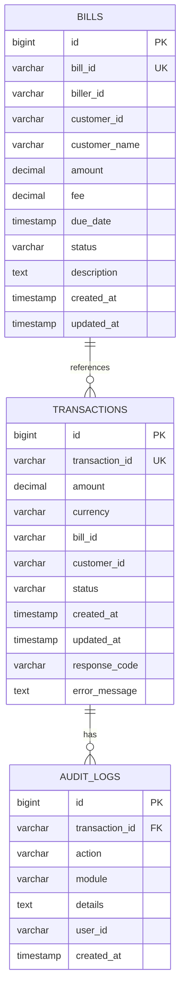

# Hari 1 – Spring Boot Application Setup, REST, dan Database

## Tujuan
- Pengenalan ekosistem pembayaran & ISO-8583
- Setup Spring Boot projects (Acquirer & Billing Provider)
- Implementasi REST API untuk payment processing
- Integrasi database PostgreSQL & logging transaksi
- Testing dengan Postman untuk API validation

## 1. Environment Setup

### 1.1 Docker & Docker Compose Setup
```bash
# Install Docker Desktop (untuk macOS/Windows)
# atau install Docker + Docker Compose (untuk Linux)

# Verifikasi instalasi
docker --version
docker-compose --version
```

### 1.2 Start PostgreSQL dengan Docker Compose
```bash
# Navigate ke workshop/day-1 directory
cd workshop/day-1

# Start PostgreSQL container
docker-compose up -d

# Verifikasi container running
docker-compose ps

# View logs
docker-compose logs -f postgres
```

### 1.3 Connect ke Database
```bash
# Connect ke container
docker-compose exec postgres psql -U postgres -d payment_system

# Atau connect dari host machine
psql -h localhost -p 5432 -U postgres -d payment_system
```

## 2. Database Schema

### 2.1 Database Structure


### 2.2 Setup Database Schema
**Database akan dibuat otomatis oleh Docker Compose** karena script di folder `/docker-entrypoint-initdb.d` akan dieksekusi saat container pertama kali start.

Manual setup (jika diperlukan):
```bash
# Connect ke database
docker-compose exec postgres psql -U postgres -d payment_system

# Execute schema creation
\i /docker-entrypoint-initdb.d/schema.sql

# Execute sample data insertion
\i /docker-entrypoint-initdb.d/sample-data.sql
```

### 2.3 Verifikasi Database Setup
```bash
# Cek apakah tables sudah dibuat
docker-compose exec postgres psql -U postgres -d payment_system -c "\dt"

# Cek sample data
docker-compose exec postgres psql -U postgres -d payment_system -c "SELECT COUNT(*) FROM bills;"
docker-compose exec postgres psql -U postgres -d payment_system -c "SELECT COUNT(*) FROM transactions;"
```

## 3. Spring Boot Application Setup

### 3.1 Project Structure
```bash
# Buat struktur project untuk dua aplikasi
mkdir -p acquirer-service/src/main/java/com/training/acquirer
mkdir -p acquirer-service/src/main/resources
mkdir -p billing-provider/src/main/java/com/training/billing
mkdir -p billing-provider/src/main/resources
```

### 3.2 Spring Boot Dependencies
Participants will create two Spring Boot projects:

**Required Dependencies:**
- `spring-boot-starter-web` - REST API development
- `spring-boot-starter-data-jpa` - Database integration
- `postgresql` - PostgreSQL JDBC driver
- `spring-boot-starter-validation` - Request validation
- `spring-boot-starter-actuator` - Health checks and monitoring

**Implementation Tasks:**
1. Create POM files for acquirer-service and billing-provider
2. Configure Spring Boot parent dependency
3. Add required dependencies for both services
4. Configure Maven compiler plugin for Java 25

### 3.3 Application Configuration
Participants will configure application.yml files:

**Acquirer Service Configuration:**
- Server port: 8080
- Application name: acquirer-service
- Database connection to PostgreSQL
- JPA configuration with PostgreSQL dialect
- Logging levels for debugging
- Actuator endpoints for health checks

**Billing Provider Configuration:**
- Server port: 8082
- Application name: billing-provider
- Database connection to PostgreSQL
- JPA configuration for entity management

### 3.4 Domain Models
Participants will create JPA entities:

**Transaction Entity Features:**
- @Entity and @Table annotations
- Primary key with @GeneratedValue
- Unique transaction ID field
- BigDecimal amount with precision
- Transaction status enum (PENDING, SUCCESS, FAILED)
- Timestamp fields with @CreationTimestamp and @UpdateTimestamp
- Proper validation annotations

**Bill Entity Features:**
- Primary key and unique bill ID
- Customer information fields
- Amount and fee fields with proper precision
- Bill status enum (ACTIVE, PAID, EXPIRED)
- Due date and description fields
- Proper relationship annotations

## 4. REST API Implementation

### 4.1 Acquirer Service API
Participants will implement:

**PaymentRequest DTO:**
- Bean validation annotations (@NotBlank, @NotNull, @Positive)
- Required fields: billId, customerId, amount
- Optional fields: currency, customerEmail, customerPhone
- Proper getter/setter methods

**PaymentController Features:**
- @RestController and @RequestMapping annotations
- Dependency injection with @Autowired
- @PostMapping for payment processing
- @GetMapping for status checking
- @Valid annotation for request validation
- Proper logging with @Slf4j
- Health check endpoint with service information

### 4.2 Billing Provider API
Participants will implement:

**BillController Features:**
- REST endpoints for bill inquiry
- Bill payment processing endpoint
- Bill validation endpoint
- Health check endpoint
- Proper request/response handling
- Structured logging for debugging
- Error handling with appropriate HTTP status codes

**Required DTOs:**
- BillResponse for inquiry results
- BillPaymentRequest for payment processing
- BillValidationRequest for bill validation
- BillValidationResponse for validation results

## 5. Service Layer Implementation

### 5.1 PaymentService
Participants will implement:

**Core Service Features:**
- @Service and @Transactional annotations
- Transaction ID generation with timestamp
- Transaction record creation and persistence
- Integration with billing provider
- Error handling and transaction status updates

**Business Logic:**
- Transaction state management
- Billing provider communication
- Response mapping and error handling
- Audit trail creation
- Proper exception handling

**Integration Requirements:**
- TransactionRepository for data access
- BillServiceClient for inter-service communication
- Proper logging for debugging and monitoring
- Builder pattern for response construction

### 5.2 Repository Layer
Participants will create Spring Data repositories:

**TransactionRepository Features:**
- Spring Data JPA repository interface
- Custom query method for finding by transaction ID
- Proper exception handling for not found cases

**BillRepository Features:**
- CRUD operations for bill entities
- Query methods for bill status and customer ID
- Custom queries for business requirements

## 6. Application Startup
Participants will create main application classes:

**Spring Boot Application Features:**
- @SpringBootApplication annotation
- Main method with SpringApplication.run()
- Component scanning configuration
- Proper package structure

**Implementation Tasks:**
1. Create AcquirerApplication class
2. Create BillingProviderApplication class
3. Configure component scanning
4. Test application startup
5. Verify actuator endpoints are working

## 7. API Testing dengan Postman

### 7.1 Test Acquirer Service (Port 8080)
```http
# Payment Request
POST http://localhost:8080/api/v1/payment/request
Content-Type: application/json

{
    "billId": "BILL001",
    "customerId": "CUST001",
    "amount": 152500.00,
    "currency": "IDR",
    "customerEmail": "budi@email.com"
}

# Check Status
GET http://localhost:8080/api/v1/payment/status/TXN20251021001

# Health Check
GET http://localhost:8080/api/v1/health
```

### 7.2 Test Billing Provider (Port 8082)
```http
# Bill Inquiry
GET http://localhost:8082/api/v1/bill/inquiry/BILL001

# Process Payment
POST http://localhost:8082/api/v1/bill/payment
Content-Type: application/json

{
    "billId": "BILL001",
    "transactionId": "TXN20251021001",
    "amount": 152500.00
}

# Validate Bill
POST http://localhost:8082/api/v1/bill/validation
Content-Type: application/json

{
    "billId": "BILL001",
    "customerId": "CUST001"
}
```

## 8. Database Validation

### 8.1 Query Data untuk Testing
```sql
-- Check bills available
SELECT * FROM bills WHERE status = 'ACTIVE';

-- Check transactions
SELECT * FROM transactions ORDER BY created_at DESC;

-- Check audit logs
SELECT * FROM audit_logs ORDER BY created_at DESC;

-- Check bill payment status
SELECT b.bill_id, b.customer_id, b.amount, b.status,
       COUNT(t.id) as transaction_count
FROM bills b
LEFT JOIN transactions t ON b.bill_id = t.bill_id
GROUP BY b.bill_id, b.customer_id, b.amount, b.status;
```

### 4.2 Sample Test Queries
```sql
-- Test query: Find paid bills
SELECT * FROM bills WHERE status = 'PAID';

-- Test query: Find failed transactions
SELECT * FROM transactions WHERE status = 'FAILED';

-- Test query: Get transaction statistics
SELECT status, COUNT(*) as count, SUM(amount) as total_amount
FROM transactions
GROUP BY status;
```

## 5. Validation Checklist

- [ ] Docker & Docker Compose installed
- [ ] PostgreSQL container running (`docker-compose ps`)
- [ ] Database `payment_system` created automatically
- [ ] Schema DDL executed without errors (check logs)
- [ ] Sample data inserted successfully
- [ ] Can connect to database dari host machine (localhost:5432)
- [ ] Can connect ke container (`docker-compose exec postgres`)
- [ ] Basic queries return expected results
- [ ] Postman API tests configured

## 6. Common Issues & Solutions

### 6.1 Docker/Container Issues
```bash
# Check container status
docker-compose ps

# View container logs
docker-compose logs postgres

# Restart container
docker-compose restart postgres

# Rebuild container (jika ada perubahan)
docker-compose down
docker-compose up -d --build
```

### 6.2 Database Connection Issues
```bash
# Test connection dari host machine
psql -h localhost -p 5432 -U postgres -d payment_system

# Test connection dari dalam container
docker-compose exec postgres psql -U postgres -d payment_system

# Reset database
docker-compose down
docker volume rm training-postgres_data
docker-compose up -d
```

### 6.3 Schema/Data Issues
```sql
-- Connect ke container
docker-compose exec postgres psql -U postgres -d payment_system

-- Clean sample data
DELETE FROM audit_logs;
DELETE FROM transactions;
DELETE FROM bills;

-- Re-insert sample data (dari dalam container)
\i /docker-entrypoint-initdb.d/sample-data.sql
```

## 7. Next Steps

Setelah berhasil menyelesaikan Day 1:
1. Database siap untuk digunakan
2. Pahami struktur data untuk payment processing
3. Siapkan untuk Day 2 (JPos integration)
4. Review ISO-8583 message format concepts