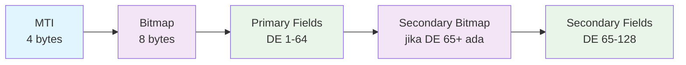
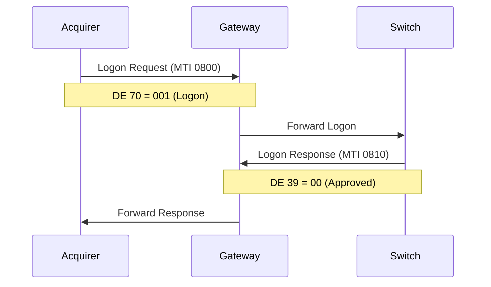
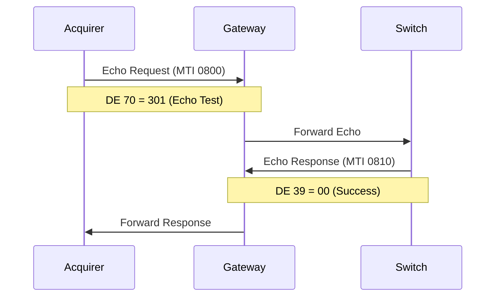
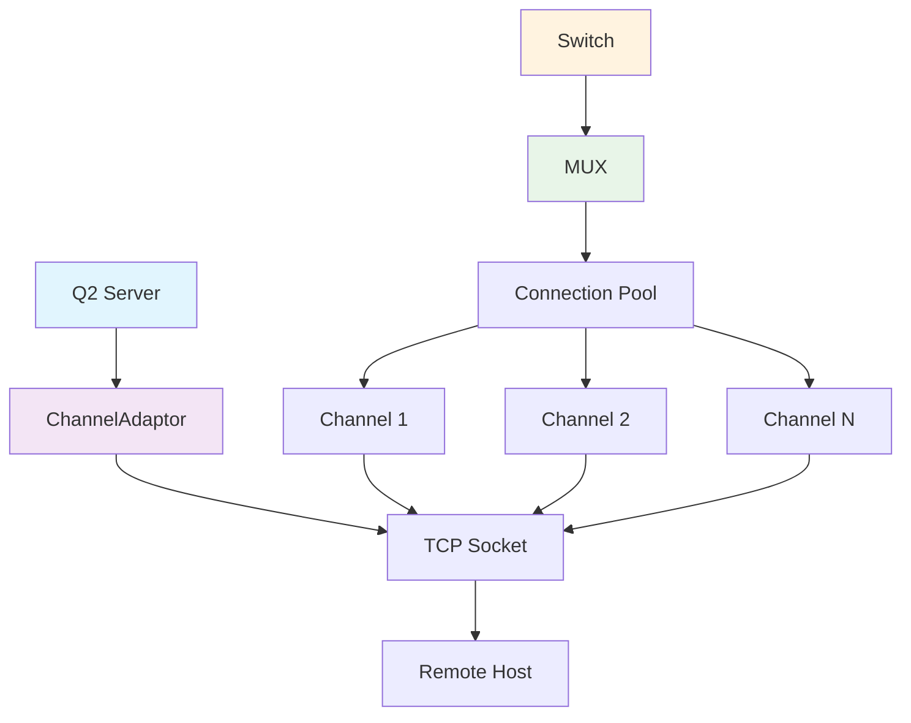

# Hari 2 – Integrasi JPOS & Dasar ISO-8583

## Tujuan
- Setup server JPos Q2
- Implementasi struktur pesan ISO-8583
- Pesan administratif (Logon, Logoff, Echo)
- Manajemen channel dan penanganan koneksi

## 1. Setup JPos

### 1.1 Menambahkan Dependencies JPos
Peserta akan menambahkan dependencies JPos ke project:

**Dependencies yang Diperlukan:**
- `jpos` 3.0.0 - JPos core library
- `jpos-q2` 3.0.0 - Q2 server framework

**Tugas Implementasi:**
1. Tambah dependencies ke masing-masing project POM
2. Konfigurasi JPos version
3. Pastikan compatibility dengan Spring Boot

### 1.2 Membuat Direktori Konfigurasi Q2
```bash
# Buat struktur direktori untuk Q2
mkdir -p src/main/resources/q2
mkdir -p src/main/resources/q2/deploy
```

### 1.3 Konfigurasi Properties Q2
**Template**: `config/q2.properties`

Peserta akan mengkonfigurasi:
- Direktori server Q2
- Konfigurasi logging
- Pengaturan ISO-8583
- Parameter connection timeout dan retry

## 2. Struktur Pesan ISO-8583

### 2.1 Memahami Format ISO-8583


### 2.2 Data Elements Penting untuk Pembayaran
- **MTI (Message Type Indicator)**: Tipe pesan
- **DE 2 (PAN)**: Primary Account Number
- **DE 3 (Processing Code)**: Jenis transaksi
- **DE 4 (Amount)**: Nominal transaksi
- **DE 11 (STAN)**: System Trace Audit Number
- **DE 12/13 (Time/Date)**: Timestamp transaksi
- **DE 39 (Response Code)**: Response status
- **DE 48 (Additional Data)**: Data tambahan (bill info)
- **DE 128 (MAC)**: Message Authentication Code

### 2.3 Konfigurasi Packager ISO-8583
**Template**: `config/iso8583-packager.xml`

Peserta akan mendefinisikan:
- Konfigurasi Data Element (DE) (DE 0-128)
- Tipe field (IFA_NUMERIC, IFA_LLNUM, dll)
- Panjang field dan formatting
- Penanganan field biner vs karakter

## 3. Pesan Administratif

### 3.1 Pesan Logon (MTI 0800)


### 3.2 Echo Test (MTI 0800)


### 3.3 Konfigurasi Pesan Administratif
Peserta akan mengimplementasikan layanan QBean untuk:
- **Logon (MTI 0800, DE 70 = 001)**: Pembuatan koneksi jaringan
- **Echo Test (MTI 0800, DE 70 = 301)**: Pemeriksaan kesehatan koneksi
- **Logoff (MTI 0800, DE 70 = 002)**: Penghentian koneksi
- **Network Management Responses (MTI 0810)**: Penanganan respons

Tugas implementasi:
- Buat kelas QBean untuk setiap tipe pesan administratif
- Konfigurasi routing pesan dan penanganan respons
- Implementasikan timeout dan logika retry
- Tambahkan logging untuk operasi administratif

## 4. Konfigurasi Channel

### 4.1 Tipe Channel
- **ChannelAdaptor**: Koneksi TCP dasar
- **ASCIIChannel**: Komunikasi berbasis karakter
- **RawChannel**: Komunikasi pesan biner
- **ChannelPool**: Multiple koneksi untuk load balancing

### 4.2 Manajemen Koneksi


### 4.3 Contoh Konfigurasi Channel
Peserta akan membuat konfigurasi channel dengan:
- **Setup ChannelAdaptor** untuk koneksi TCP
- **Konfigurasi RawChannel** untuk messaging biner
- Properti koneksi (host, port, timeout)
- Pengaturan rekoneksi dan monitoring kesehatan
- Integrasi packager

## 5. Konfigurasi MUX

### 5.1 Setup MUX (Multiplexer)
- Manajemen connection pooling
- Korelasi request-response
- Penanganan timeout
- Logika rekoneksi

### 5.2 Contoh Konfigurasi MUX
Peserta akan mengimplementasikan MUX dengan:
- **Manajemen connection pool** untuk multiple channel
- **Korelasi request-response** dengan tracking STAN
- **Penanganan timeout** dengan batas yang dapat dikonfigurasi
- **Rekoneksi otomatis** dengan exponential backoff
- **Load balancing** across available connections

## 6. Pengujian Implementasi

### 6.1 Uji Pesan Administratif dengan Netcat (Format ASCII)
```bash
# Buat file pesan logon ISO-8583 dalam format ASCII (lebih mudah dibaca)
# MTI 0800 + Primary Bitmap + Secondary Bitmap + Data Elements
# Primary Bitmap: 8000000000000000 (Bit 1 = 1 untuk secondary bitmap, Bit 65 = 1 untuk DE 70)
# Secondary Bitmap: 0000000000000040 (Bit 70 = 1 untuk DE 70)
# Format: 0800 + 8000000000000000 + 0000000000000040 + 001 (DE 70=Logon) + 12345678 (DE 98 data)
echo "080080000000000000000000000000000400010012345678" > logon.ascii

# Kirim pesan logon ke channel Q2 (port 9010)
# JPos channel akan mengkonversi ASCII ke format ISO-8583 yang sesuai
nc localhost 9010 < logon.ascii

# Buat file pesan echo test
# MTI 0800 + Primary Bitmap + Secondary Bitmap + Data Elements
echo "0800800000000000000000000000000004000301012345678" > echo.ascii

# Kirim pesan echo test
nc localhost 9010 < echo.ascii

# Buat file pesan logoff
# MTI 0800 + Primary Bitmap + Secondary Bitmap + Data Elements
echo "080080000000000000000000000000000400020012345678" > logoff.ascii

# Kirim pesan logoff
nc localhost 9010 < logoff.ascii
```

### 6.2 Uji Pesan ISO-8583 dengan Netcat (Format ASCII)
```bash
# Buat file pesan financial request (MTI 0200) dalam format ASCII
# Format: MTI + Bitmap + Data Elements
# MTI: 0200 (Authorization Request)
# Bitmap: F24000002001C000 (DE 2,4,11,12,13,22,37,39,48)
#
# Data Elements (dalam format ASCII yang mudah dibaca):
# DE 2  (PAN): 4111111111111111
# DE 4  (Amount): 00000000152500
# DE 11 (STAN): 000001
# DE 12 (Time): 091530
# DE 13 (Date): 1025
# DE 22 (POS Entry Mode): 011
# DE 37 (RRN): 091530000001
# DE 39 (Response Code): 00
# DE 48 (Additional Data): BILL001CUST001

# Pesan financial request sederhana (ASCII)
echo "0200F24000002001C000411111111111111110000000015250000010091530102501109153000000100BILL001CUST001" > financial.ascii

# Kirim pesan financial ke channel Q2
# JPos akan memproses format ASCII ini sesuai konfigurasi packager
nc localhost 9010 < financial.ascii

# Alternative: buat pesan step by step untuk lebih jelas
echo -n "0200F24000002001C000" > financial_step.ascii      # MTI + Bitmap
echo -n "4111111111111111" >> financial_step.ascii         # DE 2 (PAN)
echo -n "00000000152500" >> financial_step.ascii           # DE 4 (Amount)
echo -n "000001" >> financial_step.ascii                    # DE 11 (STAN)
echo -n "091530" >> financial_step.ascii                    # DE 12 (Time)
echo -n "1025" >> financial_step.ascii                      # DE 13 (Date)
echo -n "011" >> financial_step.ascii                       # DE 22 (POS Entry)
echo -n "091530000001" >> financial_step.ascii             # DE 37 (RRN)
echo -n "00" >> financial_step.ascii                        # DE 39 (Response)
echo -n "BILL001CUST001" >> financial_step.ascii           # DE 48 (Additional)

# Kirim versi step-by-step
nc localhost 9010 < financial_step.ascii

# Test dengan amount berbeda
echo "0200F24000002001C000411111111111111110000000005000000010091530102501109153000000100BILL002CUST002" > financial_test2.ascii
nc localhost 9010 < financial_test2.ascii
```

### 6.3 Monitoring Alur Pesan
```bash
# Monitor Q2 logs untuk melihat pesan yang diterima
tail -f logs/q2.log | grep -E "(MTI|DE|Channel|Message)"

# Monitor koneksi TCP ke port JPos
netstat -an | grep 9010

# Monitor traffic pada port channel (gunakan tcpdump jika tersedia)
sudo tcpdump -i lo port 9010 -X

# Test koneksi ke channel
telnet localhost 9010

# Cek status channel melalui Q2 Manager (jika ada HTTP endpoint)
curl http://localhost:8081/api/v1/admin/channel/status
curl http://localhost:8081/api/v1/admin/health
```

### 6.4 Tools Tambahan untuk Pengujian
```bash
# Install tools untuk hex manipulation (jika belum ada)
# macOS: sudah tersedia
# Linux: sudo apt-get install xxd

# Menggunakan xxd untuk melihat hex dump dari pesan
xxd financial.bin

# Menggunakan hexdump untuk inspect pesan
hexdump -C financial.bin

# Script untuk mengirim pesan berulang (test load)
for i in {1..10}; do
  echo "Sending message $i..."
  nc localhost 9010 < financial.bin
  sleep 0.5
done

# Menggunakan socat untuk koneksi persisten (jika tersedia)
socat TCP:localhost:9010 FILE:financial_request.bin

# Menggunakan telnet untuk manual testing
telnet localhost 9010
# Ketik pesan hex secara manual, atau paste binary data
```

### 6.5 Debug Pesan ISO-8583 (Format ASCII)
```bash
# Parsing dan memeriksa struktur pesan ASCII yang lebih mudah dibaca

# Cek panjang pesan ASCII
wc -c financial.ascii

# Lihat pesan lengkap dalam format ASCII (human-readable)
cat financial.ascii

# Validasi struktur pesan
# MTI (4 karakter pertama)
head -c 4 financial.ascii

# Bitmap (8 karakter berikutnya, dalam hex)
head -c 12 financial.ascii | tail -c 8

# Parse DE fields secara manual untuk pemahaman
# Ambil MTI
cut -c1-4 financial.ascii

# Ambil Bitmap
cut -c5-12 financial.ascii

# Ambil PAN (DE 2) - asumsikan 16 digit
cut -c13-28 financial.ascii

# Ambil Amount (DE 4) - asumsikan 15 digit
cut -c29-43 financial.ascii

# Verifikasi format pesan dengan grep
grep -E "^[0-9]{4}[0-9A-F]{8}" financial.ascii

# Buat helper script untuk parsing pesan ASCII
cat > parse_iso8583.sh << 'EOF'
#!/bin/bash
FILE=$1
echo "Parsing ISO-8583 message: $FILE"
echo "MTI: $(head -c 4 $FILE)"
echo "Bitmap: $(head -c 12 $FILE | tail -c 8)"
echo "PAN (DE 2): $(head -c 28 $FILE | tail -c 16)"
echo "Amount (DE 4): $(head -c 43 $FILE | tail -c 15)"
echo "STAN (DE 11): $(head -c 46 $FILE | tail -c 6)"
echo "Time (DE 12): $(head -c 52 $FILE | tail -c 6)"
echo "Date (DE 13): $(head -c 56 $FILE | tail -c 4)"
EOF

chmod +x parse_iso8583.sh
./parse_iso8583.sh financial.ascii
```

## 7. Contoh Pesan untuk Pengujian

### 7.1 Contoh Request Financial (Format ASCII)
```bash
# Contoh lengkap pesan financial request (MTI 0200) dalam format ASCII
# Format: MTI(4) + Bitmap(8) + Data Elements
#
# MTI: 0200 (Authorization Request)
# Bitmap: F23800002001C080 (DE 2,3,4,11,12,13,18,22,32,37,39,41,48)
#
# Data Elements (mudah dibaca):
# DE 2  (PAN): 4111111111111111
# DE 3  (Processing Code): 123456
# DE 4  (Amount): 00000000152500
# DE 11 (STAN): 000001
# DE 12 (Time): 091530
# DE 13 (Date): 1025
# DE 18 (Merchant Type): 6011
# DE 22 (POS Entry Mode): 011
# DE 32 (Acquiring Institution): 12345
# DE 37 (Retrieval Reference): 091530000001
# DE 39 (Response Code): 00
# DE 41 (Card Acceptor Terminal ID): 12345678
# DE 48 (Additional Data): BILL001CUST001

# Buat pesan financial request lengkap (format ASCII)
echo "0200F23800002001C080411111111111111111234560000000001525000001009153010256011011123450915300000010012345678BILL001CUST001" > financial_complete.ascii

# Lihat pesan yang dibuat (human-readable)
cat financial_complete.ascii

# Kirim pesan
nc localhost 9010 < financial_complete.ascii

# Alternative: buat pesan step-by-step untuk pembelajaran
echo -n "0200F23800002001C080" > financial_learn.ascii     # MTI + Bitmap
echo -n "4111111111111111" >> financial_learn.ascii        # DE 2 (PAN)
echo -n "123456" >> financial_learn.ascii                  # DE 3 (Processing Code)
echo -n "00000000152500" >> financial_learn.ascii          # DE 4 (Amount)
echo -n "000001" >> financial_learn.ascii                   # DE 11 (STAN)
echo -n "091530" >> financial_learn.ascii                   # DE 12 (Time)
echo -n "1025" >> financial_learn.ascii                     # DE 13 (Date)
echo -n "6011" >> financial_learn.ascii                     # DE 18 (Merchant Type)
echo -n "011" >> financial_learn.ascii                      # DE 22 (POS Entry Mode)
echo -n "12345" >> financial_learn.ascii                     # DE 32 (Acquiring Inst)
echo -n "091530000001" >> financial_learn.ascii             # DE 37 (RRN)
echo -n "00" >> financial_learn.ascii                        # DE 39 (Response Code)
echo -n "12345678" >> financial_learn.ascii                 # DE 41 (Terminal ID)
echo -n "BILL001CUST001" >> financial_learn.ascii           # DE 48 (Additional Data)

echo "Pesan lengkap:"
cat financial_learn.ascii
echo ""
echo "Kirim pesan:"
nc localhost 9010 < financial_learn.ascii
```

### 7.2 Contoh Respons Financial (Format ASCII)
```bash
# Contoh respons financial (MTI 0210) dalam format ASCII
# Format: MTI(4) + Bitmap(8) + Data Elements
#
# MTI: 0210 (Authorization Response)
# Bitmap: F23800002001C080 (sama dengan request)
#
# Data Elements (respons):
# DE 2  (PAN): 4111111111111111
# DE 3  (Processing Code): 123456
# DE 4  (Amount): 00000000152500
# DE 11 (STAN): 000001
# DE 12 (Time): 091535 (response time)
# DE 13 (Date): 1025
# DE 18 (Merchant Type): 6011
# DE 22 (POS Entry Mode): 011
# DE 32 (Acquiring Institution): 12345
# DE 37 (Retrieval Reference): 091530000001
# DE 39 (Response Code): 00 (Approved)
# DE 38 (Authorization ID): 123456
# DE 41 (Card Acceptor Terminal ID): 12345678
# DE 48 (Additional Data): BILL001CUST001

# Buat pesan respons (format ASCII)
echo "0210F23800002001C08041111111111111111123456000000001525000001009153510256011011123450915300000010012345612345678BILL001CUST001" > financial_response.ascii

# Test respons dengan error (Response Code 05 - Do Not Honor)
echo "0210F23800002001C08041111111111111111123456000000001525000001009153510256011011123450915300000010512345612345678BILL001CUST001" > financial_response_error.ascii

# Test respons decline (Response Code 14 - Invalid Card)
echo "0210F23800002001C08041111111111111111123456000000001525000001009153510256011011123450915300000011412345612345678BILL001CUST001" > financial_response_decline.ascii
```

### 7.3 Contoh Pesan Administratif (Format ASCII)
```bash
# Logon Request (MTI 0800)
echo "080080000000000000000000000000004000100112345678" > logon_request.ascii
# Format: 0800 + Primary Bitmap + Secondary Bitmap + 001 (DE 70=Logon) + 12345678 (DE 98)

# Logon Response (MTI 0810)
echo "0810800000000000000000000000000040000000100112345678" > logon_response.ascii
# Format: 0810 + Primary Bitmap + Secondary Bitmap + 00 (DE 39) + 001 (DE 70) + 12345678 (DE 98)

# Echo Test Request (MTI 0800)
echo "0800800000000000000000000000000040003010012345678" > echo_request.ascii
# Format: 0800 + Primary Bitmap + Secondary Bitmap + 301 (DE 70=Echo Test) + 12345678 (DE 98)

# Echo Test Response (MTI 0810)
echo "08108000000000000000000000000000400003010012345678" > echo_response.ascii
# Format: 0810 + Primary Bitmap + Secondary Bitmap + 00 (DE 39) + 301 (DE 70) + 12345678 (DE 98)

# Logoff Request (MTI 0800)
echo "08008000000000000000000000000000400020012345678" > logoff_request.ascii
# Format: 0800 + Primary Bitmap + Secondary Bitmap + 002 (DE 70=Logoff) + 12345678 (DE 98)

# Network Management Request (Key Exchange)
echo "0800800000000000000000000000000040003010012345678" > key_exchange_request.ascii
# Format: 0800 + Primary Bitmap + Secondary Bitmap + 301 (DE 70=Key Exchange) + 12345678 (DE 98)

# Test semua pesan administratif
echo "Testing Logon Request:"
nc localhost 9010 < logon_request.ascii
sleep 1

echo "Testing Echo Request:"
nc localhost 9010 < echo_request.ascii
sleep 1

echo "Testing Logoff Request:"
nc localhost 9010 < logoff_request.ascii
sleep 1

# Test network management messages
echo "Testing Key Exchange Request:"
nc localhost 9010 < key_exchange_request.ascii
```

### 7.4 Penjelasan Bitmap untuk Administratif Messages
```bash
# Bitmap 8000000000000000 berarti:
# Bit 1 (0x8000) = 1 → DE 1 (Bitmap sekunder tidak ada)
# Bit 2-64 = 0 → DE 2-64 tidak ada
# Bit 65 (0x8000...00000001) = 0 → DE 65-128 tidak ada
#
# Untuk network management messages (MTI 08xx):
# DE 70 (Network Management Code) adalah field yang paling penting
# - 001 = Logon
# - 002 = Logoff
# - 301 = Echo Test
# - 013 = Key Exchange
#
# DE 98 (Network Management Data) berisi informasi tambahan
# - Data untuk mendukung operasi network management
# - Bisa berupa session ID, timestamp, atau informasi koneksi
#
# Format standar untuk MTI 0800:
# 0800 (MTI) + 8000000000000000 (Bitmap) + DE 70 (Network Code) + DE 98 (Network Data)

# Contoh bitmap dengan DE 39 (Response Code) untuk MTI 0810:
# 8000000000000020 = Bit 65 = 1, Bit 67 = 1 (DE 70 dan DE 39)
# 0810800000000000020 + DE 39 + DE 70 + Network Data

# Buat contoh lengkap untuk understanding
echo "Bitmap explanation:"
echo "Primary bitmap: 8000000000000000 (hex) = 10000000000000000000000000000000000 (binary)"
echo "Bit 1 = 1 → Secondary bitmap not present"
echo "Bits 2-64 = 0 → No primary fields DE 2-64"
echo "Bit 65 = 0 → No secondary bitmap (no DE 65-128)"
echo ""
echo "For MTI 08xx messages, typical fields:"
echo "DE 70 = Network Management Code (001=Logon, 002=Logoff, 301=Echo, 013=Key Exchange)"
echo "DE 98 = Network Management Data (session info, timestamps, connection data)"
echo "DE 39 = Response Code (for MTI 0810 responses only)"
echo ""
echo "Note: Bitmap 8000000000000000 indicates:"
echo "- Only fixed-length fields in primary bitmap area"
echo "- DE 70 and DE 98 are fixed-length, so they don't need bitmap bits"
echo "- If DE 65+ (variable length) were needed, secondary bitmap would be used"
```

## 8. File Konfigurasi yang Dibuat

Peserta akan membuat file konfigurasi berikut:
- **`src/main/resources/q2/q2.properties`** - Konfigurasi server Q2
- **`src/main/resources/q2/deploy/channel.xml`** - Konfigurasi channel
- **`src/main/resources/q2/deploy/mux.xml`** - Konfigurasi MUX
- **`src/main/resources/q2/deploy/admin-messages.xml`** - Handler pesan administratif
- **`src/main/resources/q2/iso8583-packager.xml`** - Definisi field ISO-8583

**File template tersedia di direktori `config/` untuk referensi.

## 9. Checklist Validasi

- [ ] Dependencies JPos berhasil ditambahkan
- [ ] Server Q2 berjalan tanpa error
- [ ] Konfigurasi channel dimuat dengan benar
- [ ] TCP channel listening pada port 9010
- [ ] Pesan administratif berfungsi (Logon/Echo/Logoff) melalui TCP
- [ ] Packager ISO-8583 dikonfigurasi dengan benar
- [ ] Pesan financial dapat dikirim dengan `nc` ke port 9010
- [ ] Routing pesan berfungsi untuk MTI 0800, 0200, 0210
- [ ] Connection pooling berfungsi
- [ ] Response dari JPos dapat diterima klien
- [ ] Error handling diimplementasikan untuk pesan invalid
- [ ] Tools debugging (`xxd`, `hexdump`, `tcpdump`) berfungsi

## 10. Masalah Umum & Solusi

### 10.1 Masalah Startup Q2
```bash
# Check Q2 logs
tail -f logs/q2.log

# Verify configuration files
ls -la src/main/resources/q2/deploy/

# Check Q2 process status
ps aux | grep Q2
jps | grep Q2
```

### 10.2 Masalah Koneksi TCP
```bash
# Check port availability
netstat -an | grep 9010
lsof -i :9010

# Test TCP connection
telnet localhost 9010
nc -zv localhost 9010

# Test koneksi dengan timeout
timeout 5 nc localhost 9010 < /dev/null

# Monitor koneksi masuk
tcpdump -i lo port 9010 -n
```

### 10.3 Masalah Format Pesan ISO-8583 (ASCII)
```bash
# Verifikasi struktur pesan ASCII yang mudah dibaca
cat financial.ascii

# Cek MTI (4 karakter pertama)
head -c 4 financial.ascii

# Cek bitmap (8 karakter berikutnya)
head -c 12 financial.ascii | tail -c 8

# Validasi panjang pesan
wc -c financial.ascii

# Validasi format dengan regex
grep -E "^[0-9]{4}[0-9A-F]{8}" financial.ascii

# Compare dengan template yang benar
diff financial.ascii financial_template.ascii

# Test parsing dengan JPos packager
# Gunakan Q2 log untuk melihat error parsing
tail -f logs/q2.log | grep -E "(error|exception|failed|parse)"

# Parsing manual untuk debugging
echo "MTI: $(head -c 4 financial.ascii)"
echo "Bitmap: $(head -c 12 financial.ascii | tail -c 8)"
echo "PAN: $(head -c 28 financial.ascii | tail -c 16)"
echo "Amount: $(head -c 43 financial.ascii | tail -c 15)"

# Cek apakah pesan valid untuk ISO-8583
if [[ $(head -c 4 financial.ascii) =~ ^[0-9]{4}$ ]]; then
    echo "MTI valid: $(head -c 4 financial.ascii)"
else
    echo "MTI invalid"
fi

if [[ $(head -c 12 financial.ascii | tail -c 8) =~ ^[0-9A-F]{8}$ ]]; then
    echo "Bitmap valid: $(head -c 12 financial.ascii | tail -c 8)"
else
    echo "Bitmap invalid"
fi
```

### 10.4 Debug Pesan Tidak Terkirim (Format ASCII)
```bash
# Verifikasi channel status
curl http://localhost:8081/api/v1/admin/channel/status

# Cek log channel connection
tail -f logs/q2.log | grep -i channel

# Test dengan pesan sederhana (ASCII)
echo "080080000000000000000000000000004000100112345678" > simple_test.ascii  # Logon dengan DE 70+DE 98
nc localhost 9010 < simple_test.ascii

# Test dengan pesan kosong untuk testing koneksi
echo "" > empty_test.ascii
nc localhost 9010 < empty_test.ascii

# Monitor network traffic
sudo tcpdump -i lo -A port 9010  # -A untuk ASCII output

# Cek Q2 MUX status
curl http://localhost:8081/api/v1/admin/mux/status

# Debug dengan melihat respons dari server
# Gunakan timeout untuk menghindari hanging
timeout 5 nc localhost 9010 < financial.ascii

# Test koneksi dasar
echo "Testing basic connection..."
if echo "test" | nc localhost 9010; then
    echo "Connection successful"
else
    echo "Connection failed"
fi

# Monitor Q2 log untuk parsing errors
tail -f logs/q2.log | grep -E "(parse|error|invalid|failed)"

# Test dengan MTI yang berbeda
echo "0200F24000002001C000411111111111111110000000015250" > test_mti.ascii
nc localhost 9010 < test_mti.ascii

# Test dengan bitmap administratif yang benar
echo "Testing correct admin bitmap:"
echo "080080000000000000000000000000004000100112345678" | nc localhost 9010

# Verifikasi packager configuration
# Check apakah JPos packager mendukung format ASCII
tail -f logs/q2.log | grep -i packager

# Validasi bitmap format
echo "Bitmap validation:"
echo "Financial: F24000002001C000 (DE 2,3,4,11,12,13,18,22,32,37,39,48)"
echo "Admin:     8000000000000000 + 0000000200000040 (Primary + Secondary, DE 70, DE 98)"
echo "Response:  8000000000000080 + 0000000200000040 (Primary + Secondary, DE 39, DE 70, DE 98)"

# Test bitmap understanding
echo "Admin Message (DE 70, DE 98 only):"
echo "Primary Bitmap 8000000000000000 = 1000 0000 0000 0000 0000 0000 0000 0000 0000 0000 0000 0000 0000 0000 (binary)"
echo "Bit 1 = 1: Secondary bitmap present"
echo "Bit 65 = 1: DE 70 present (since DE 70 is in secondary bitmap position)"
echo "Secondary Bitmap 0000000200000040 = 0000 0000 0000 0000 0010 0000 0000 0000 0000 0000 0100 0000 0000 0000 (binary)"
echo "Bit 6 = 1: DE 70 present (DE 70-64 = 6)"
echo "Bit 34 = 1: DE 98 present (DE 98-64 = 34)"
echo ""
echo "Response Message (DE 39, DE 70, DE 98):"
echo "Primary Bitmap 8000000000000080 = 1000 0000 0000 0000 0000 0000 0000 0000 0000 0000 0000 1000 0000 0000 (binary)"
echo "Bit 1 = 1: Secondary bitmap present"
echo "Bit 39 = 1: DE 39 present (primary bitmap position)"
echo "Bit 65 = 1: DE 70 present (secondary bitmap indicator)"
echo "Secondary Bitmap 0000000200000040 = same as above for DE 70 and DE 98"
echo ""
echo "Bitmap calculation: DE field number - 1 = bit position (for DE 2-64)"
echo "Bitmap calculation: DE field number - 64 = bit position (for DE 65-128)"
```

## 11. Langkah Selanjutnya

Setelah berhasil menyelesaikan Day 2:
1. Server JPos Q2 siap digunakan
2. Format pesan ISO-8583 dipahami
3. Pesan administratif berfungsi
4. Siapkan untuk Day 3 (Alur pembayaran end-to-end)
5. Review konsep integrasi Spring Boot + JPos