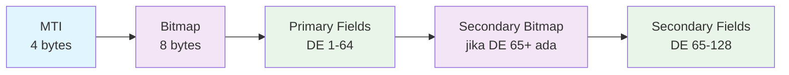
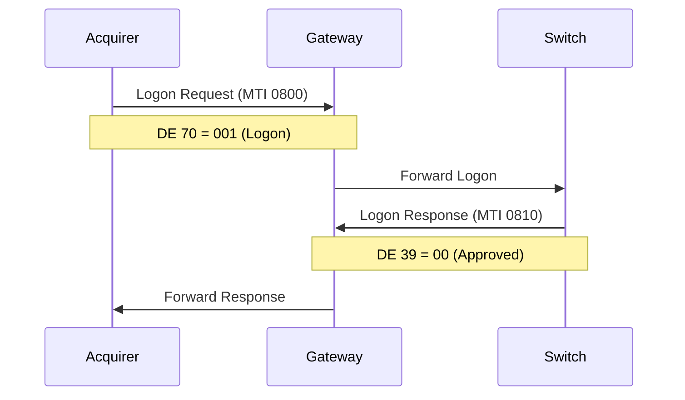
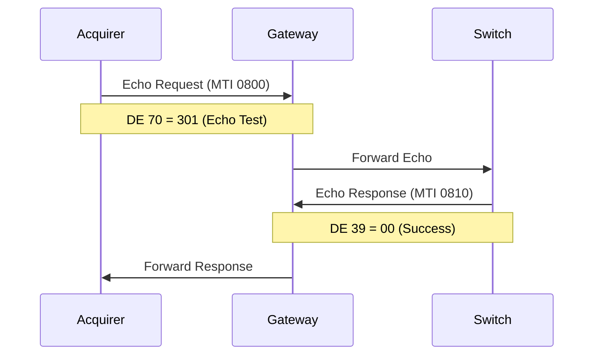
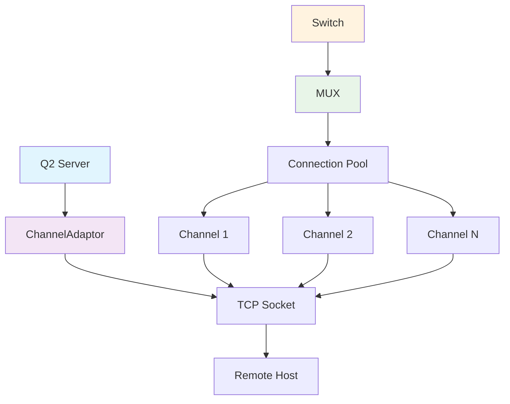

# Hari 2 – JPOS Integration & ISO-8583 Basics

## Tujuan
- Setup JPos Q2 server
- Implementasi ISO-8583 message structure
- Administrative messages (Logon, Logoff, Echo)
- Channel management dan connection handling

## 1. JPos Setup

### 1.1 Add JPos Dependencies
```xml
<!-- Tambahkan ke pom.xml -->
<dependency>
    <groupId>org.jpos</groupId>
    <artifactId>jpos</artifactId>
    <version>3.0.0</version>
</dependency>
<dependency>
    <groupId>org.jpos</groupId>
    <artifactId>jpos-q2</artifactId>
    <version>3.0.0</version>
</dependency>
```

### 1.2 Create Q2 Configuration Directory
```bash
# Buat struktur direktori untuk Q2
mkdir -p src/main/resources/q2
mkdir -p src/main/resources/q2/deploy
```

### 1.3 Q2 Properties Configuration
**Template**: `config/q2.properties`

Participants will configure:
- Q2 server directories
- Logging configuration
- ISO-8583 settings
- Connection timeout and retry parameters

## 2. ISO-8583 Message Structure

### 2.1 Understanding ISO-8583 Format


### 2.2 Key Data Elements untuk Payment
- **MTI (Message Type Indicator)**: Tipe pesan
- **DE 2 (PAN)**: Primary Account Number
- **DE 3 (Processing Code)**: Jenis transaksi
- **DE 4 (Amount)**: Nominal transaksi
- **DE 11 (STAN)**: System Trace Audit Number
- **DE 12/13 (Time/Date)**: Timestamp transaksi
- **DE 39 (Response Code)**: Response status
- **DE 48 (Additional Data)**: Data tambahan (bill info)
- **DE 128 (MAC)**: Message Authentication Code

### 2.3 ISO-8583 Packager Configuration
**Template**: `config/iso8583-packager.xml`

Participants will define:
- Data Element (DE) configurations (DE 0-128)
- Field types (IFA_NUMERIC, IFA_LLNUM, etc)
- Field lengths and formatting
- Binary vs character field handling

## 3. Administrative Messages

### 3.1 Logon Message (MTI 0800)


### 3.2 Echo Test (MTI 0800)


### 3.3 Administrative Message Configuration
Participants will implement QBean services for:
- **Logon (MTI 0800, DE 70 = 001)**: Network connection establishment
- **Echo Test (MTI 0800, DE 70 = 301)**: Connection health check
- **Logoff (MTI 0800, DE 70 = 002)**: Connection termination
- **Network Management Responses (MTI 0810)**: Response handling

Implementation tasks:
- Create QBean classes for each admin message type
- Configure message routing and response handling
- Implement timeout and retry logic
- Add logging for administrative operations

## 4. Channel Configuration

### 4.1 Channel Types
- **ChannelAdaptor**: Basic TCP connection
- **ASCIIChannel**: Character-based communication
- **RawChannel**: Binary message communication
- **ChannelPool**: Multiple connections untuk load balancing

### 4.2 Connection Management


### 4.3 Channel Configuration Sample
Participants will create channel configuration with:
- **ChannelAdaptor** setup for TCP connections
- **RawChannel** configuration for binary messaging
- Connection properties (host, port, timeout)
- Reconnection settings and health monitoring
- Packager integration

## 5. MUX Configuration

### 5.1 MUX (Multiplexer) Setup
- Connection pooling management
- Request-response correlation
- Timeout handling
- Reconnection logic

### 5.2 MUX Configuration Sample
Participants will implement MUX with:
- **Connection pool management** for multiple channels
- **Request-response correlation** with STAN tracking
- **Timeout handling** with configurable limits
- **Automatic reconnection** with exponential backoff
- **Load balancing** across available connections

## 6. Implementation Testing

### 6.1 Test Administrative Messages
```bash
# Test logon message
curl -X POST http://localhost:8081/api/v1/admin/logon

# Test echo message
curl -X POST http://localhost:8081/api/v1/admin/echo

# Test logoff message
curl -X POST http://localhost:8081/api/v1/admin/logoff
```

### 6.2 Test ISO-8583 Messages
```bash
# Send financial request
curl -X POST http://localhost:8081/api/v1/iso/payment \
  -H "Content-Type: application/json" \
  -d '{
    "mti": "0200",
    "pan": "1234567890123456",
    "processingCode": "123456",
    "amount": "00000000152500",
    "stan": "000001",
    "transmissionTime": "091530",
    "transmissionDate": "1025",
    "additionalData": "BILL001CUST001"
  }'
```

### 6.3 Monitor Message Flow
```bash
# Monitor Q2 logs
tail -f logs/q2.log

# Monitor channel status
curl http://localhost:8081/api/v1/admin/channel/status

# Monitor connection health
curl http://localhost:8081/api/v1/admin/health
```

## 7. Sample Messages for Testing

### 7.1 Financial Request Sample
```json
{
  "mti": "0200",
  "pan": "4111111111111111",
  "processingCode": "123456",
  "amount": "00000000152500",
  "stan": "000001",
  "transmissionTime": "091530",
  "transmissionDate": "1025",
  "merchantType": "6011",
  "posEntryMode": "011",
  "acquiringInstitution": "12345",
  "retrievalReference": "091530000001",
  "cardAcceptor": "ACQUIRER    TEST STORE    JAKARTA",
  "additionalData": "BILL001CUST001",
  "mac": "1234567890ABCDEF"
}
```

### 7.2 Response Sample
```json
{
  "mti": "0210",
  "pan": "4111111111111111",
  "processingCode": "123456",
  "amount": "00000000152500",
  "stan": "000001",
  "transmissionTime": "091530",
  "transmissionDate": "1025",
  "responseCode": "00",
  "authorizationId": "123456",
  "responseTime": "091535",
  "retrievalReference": "091530000001",
  "mac": "FEDCBA0987654321"
}
```

## 8. Configuration Files to Create

Participants will create the following configuration files:
- **`src/main/resources/q2/q2.properties`** - Q2 server configuration
- **`src/main/resources/q2/deploy/channel.xml`** - Channel configuration
- **`src/main/resources/q2/deploy/mux.xml`** - MUX configuration
- **`src/main/resources/q2/deploy/admin-messages.xml`** - Administrative message handlers
- **`src/main/resources/q2/iso8583-packager.xml`** - ISO-8583 field definitions

**Template files provided in `config/` directory** for reference.

## 9. Validation Checklist

- [ ] JPos dependencies added successfully
- [ ] Q2 server starts without errors
- [ ] Channel configuration loaded correctly
- [ ] Administrative messages working (Logon/Echo/Logoff)
- [ ] ISO-8583 packager configured
- [ ] Message routing working
- [ ] Connection pooling functional
- [ ] Error handling implemented

## 10. Common Issues & Solutions

### 10.1 Q2 Startup Issues
```bash
# Check Q2 logs
tail -f logs/q2.log

# Verify configuration files
ls -la src/main/resources/q2/deploy/
```

### 10.2 Connection Issues
```bash
# Check port availability
netstat -an | grep 9010

# Test remote connection
telnet localhost 9010
```

### 10.3 Message Format Issues
- Verify packager XML syntax
- Check field definitions
- Validate bitmap handling

## 11. Next Steps

Setelah berhasil menyelesaikan Day 2:
1. JPos Q2 server siap digunakan
2. ISO-8583 message format understood
3. Administrative messages working
4. Siapkan untuk Day 3 (End-to-end payment flow)
5. Review Spring Boot + JPos integration concepts