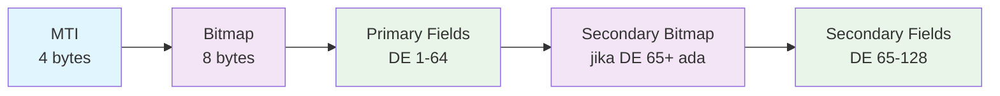
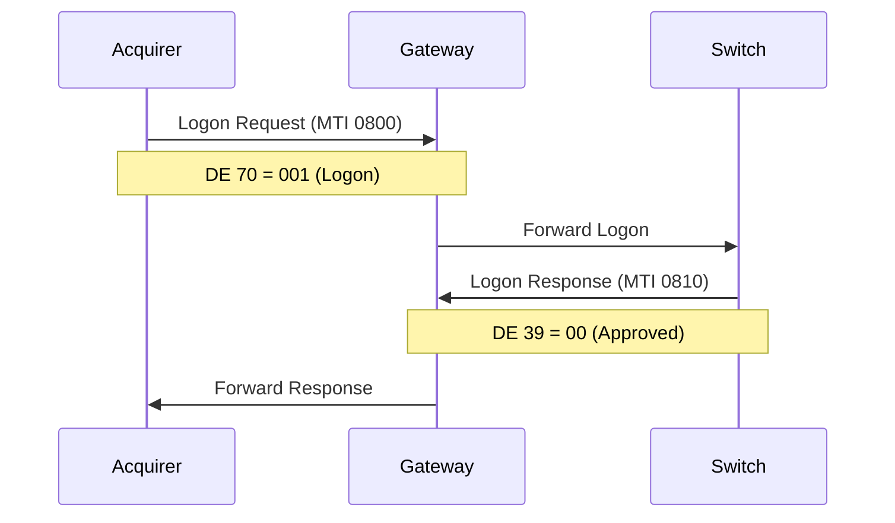
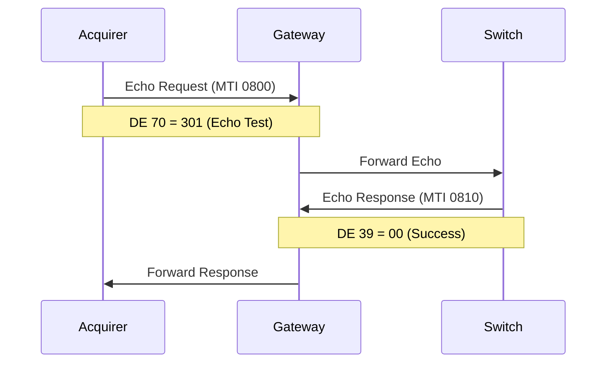
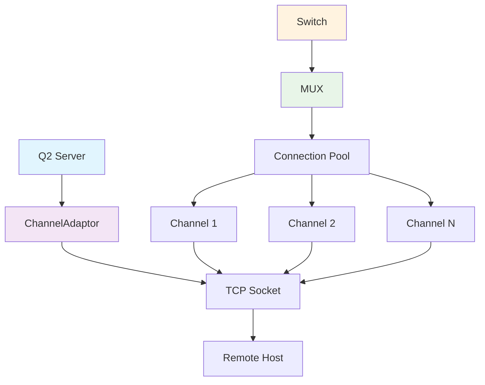

# Hari 2 – Integrasi JPOS & Dasar ISO-8583

## Tujuan
- Setup server JPos Q2
- Implementasi struktur pesan ISO-8583
- Pesan administratif (Logon, Logoff, Echo)
- Manajemen channel dan penanganan koneksi

## 1. Setup JPos

### 1.1 Menambahkan Dependencies JPos
Peserta akan menambahkan dependencies JPos ke project:

**Dependencies yang Diperlukan:**
- `jpos` 3.0.0 - JPos core library
- `jpos-q2` 3.0.0 - Q2 server framework

**Tugas Implementasi:**
1. Tambah dependencies ke masing-masing project POM
2. Konfigurasi JPos version
3. Pastikan compatibility dengan Spring Boot

### 1.2 Membuat Direktori Konfigurasi Q2
```bash
# Buat struktur direktori untuk Q2
mkdir -p src/main/resources/q2
mkdir -p src/main/resources/q2/deploy
```

### 1.3 Konfigurasi Properties Q2
**Template**: `config/q2.properties`

Peserta akan mengkonfigurasi:
- Direktori server Q2
- Konfigurasi logging
- Pengaturan ISO-8583
- Parameter connection timeout dan retry

## 2. Struktur Pesan ISO-8583

### 2.1 Memahami Format ISO-8583


### 2.2 Data Elements Penting untuk Pembayaran
- **MTI (Message Type Indicator)**: Tipe pesan
- **DE 2 (PAN)**: Primary Account Number
- **DE 3 (Processing Code)**: Jenis transaksi
- **DE 4 (Amount)**: Nominal transaksi
- **DE 11 (STAN)**: System Trace Audit Number
- **DE 12/13 (Time/Date)**: Timestamp transaksi
- **DE 39 (Response Code)**: Response status
- **DE 48 (Additional Data)**: Data tambahan (bill info)
- **DE 128 (MAC)**: Message Authentication Code

### 2.3 Konfigurasi Packager ISO-8583
**Template**: `config/iso8583-packager.xml`

Peserta akan mendefinisikan:
- Konfigurasi Data Element (DE) (DE 0-128)
- Tipe field (IFA_NUMERIC, IFA_LLNUM, dll)
- Panjang field dan formatting
- Penanganan field biner vs karakter

## 3. Pesan Administratif

### 3.1 Pesan Logon (MTI 0800)


### 3.2 Echo Test (MTI 0800)


### 3.3 Konfigurasi Pesan Administratif
Peserta akan mengimplementasikan layanan QBean untuk:
- **Logon (MTI 0800, DE 70 = 001)**: Pembuatan koneksi jaringan
- **Echo Test (MTI 0800, DE 70 = 301)**: Pemeriksaan kesehatan koneksi
- **Logoff (MTI 0800, DE 70 = 002)**: Penghentian koneksi
- **Network Management Responses (MTI 0810)**: Penanganan respons

Tugas implementasi:
- Buat kelas QBean untuk setiap tipe pesan administratif
- Konfigurasi routing pesan dan penanganan respons
- Implementasikan timeout dan logika retry
- Tambahkan logging untuk operasi administratif

## 4. Konfigurasi Channel

### 4.1 Tipe Channel
- **ChannelAdaptor**: Koneksi TCP dasar
- **ASCIIChannel**: Komunikasi berbasis karakter
- **RawChannel**: Komunikasi pesan biner
- **ChannelPool**: Multiple koneksi untuk load balancing

### 4.2 Manajemen Koneksi


### 4.3 Contoh Konfigurasi Channel
Peserta akan membuat konfigurasi channel dengan:
- **Setup ChannelAdaptor** untuk koneksi TCP
- **Konfigurasi RawChannel** untuk messaging biner
- Properti koneksi (host, port, timeout)
- Pengaturan rekoneksi dan monitoring kesehatan
- Integrasi packager

## 5. Konfigurasi MUX

### 5.1 Setup MUX (Multiplexer)
- Manajemen connection pooling
- Korelasi request-response
- Penanganan timeout
- Logika rekoneksi

### 5.2 Contoh Konfigurasi MUX
Peserta akan mengimplementasikan MUX dengan:
- **Manajemen connection pool** untuk multiple channel
- **Korelasi request-response** dengan tracking STAN
- **Penanganan timeout** dengan batas yang dapat dikonfigurasi
- **Rekoneksi otomatis** dengan exponential backoff
- **Load balancing** across available connections

## 6. Pengujian Implementasi

### 6.1 Uji Pesan Administratif
```bash
# Test logon message
curl -X POST http://localhost:8081/api/v1/admin/logon

# Test echo message
curl -X POST http://localhost:8081/api/v1/admin/echo

# Test logoff message
curl -X POST http://localhost:8081/api/v1/admin/logoff
```

### 6.2 Uji Pesan ISO-8583
```bash
# Send financial request
curl -X POST http://localhost:8081/api/v1/iso/payment \
  -H "Content-Type: application/json" \
  -d '{
    "mti": "0200",
    "pan": "1234567890123456",
    "processingCode": "123456",
    "amount": "00000000152500",
    "stan": "000001",
    "transmissionTime": "091530",
    "transmissionDate": "1025",
    "additionalData": "BILL001CUST001"
  }'
```

### 6.3 Monitor Alur Pesan
```bash
# Monitor Q2 logs
tail -f logs/q2.log

# Monitor channel status
curl http://localhost:8081/api/v1/admin/channel/status

# Monitor connection health
curl http://localhost:8081/api/v1/admin/health
```

## 7. Contoh Pesan untuk Pengujian

### 7.1 Contoh Request Financial
```json
{
  "mti": "0200",
  "pan": "4111111111111111",
  "processingCode": "123456",
  "amount": "00000000152500",
  "stan": "000001",
  "transmissionTime": "091530",
  "transmissionDate": "1025",
  "merchantType": "6011",
  "posEntryMode": "011",
  "acquiringInstitution": "12345",
  "retrievalReference": "091530000001",
  "cardAcceptor": "ACQUIRER    TEST STORE    JAKARTA",
  "additionalData": "BILL001CUST001",
  "mac": "1234567890ABCDEF"
}
```

### 7.2 Contoh Respons
```json
{
  "mti": "0210",
  "pan": "4111111111111111",
  "processingCode": "123456",
  "amount": "00000000152500",
  "stan": "000001",
  "transmissionTime": "091530",
  "transmissionDate": "1025",
  "responseCode": "00",
  "authorizationId": "123456",
  "responseTime": "091535",
  "retrievalReference": "091530000001",
  "mac": "FEDCBA0987654321"
}
```

## 8. File Konfigurasi yang Dibuat

Peserta akan membuat file konfigurasi berikut:
- **`src/main/resources/q2/q2.properties`** - Konfigurasi server Q2
- **`src/main/resources/q2/deploy/channel.xml`** - Konfigurasi channel
- **`src/main/resources/q2/deploy/mux.xml`** - Konfigurasi MUX
- **`src/main/resources/q2/deploy/admin-messages.xml`** - Handler pesan administratif
- **`src/main/resources/q2/iso8583-packager.xml`** - Definisi field ISO-8583

**File template tersedia di direktori `config/` untuk referensi.

## 9. Checklist Validasi

- [ ] Dependencies JPos berhasil ditambahkan
- [ ] Server Q2 berjalan tanpa error
- [ ] Konfigurasi channel dimuat dengan benar
- [ ] Pesan administratif berfungsi (Logon/Echo/Logoff)
- [ ] Packager ISO-8583 dikonfigurasi
- [ ] Routing pesan berfungsi
- [ ] Connection pooling berfungsi
- [ ] Error handling diimplementasikan

## 10. Masalah Umum & Solusi

### 10.1 Masalah Startup Q2
```bash
# Check Q2 logs
tail -f logs/q2.log

# Verify configuration files
ls -la src/main/resources/q2/deploy/
```

### 10.2 Masalah Koneksi
```bash
# Check port availability
netstat -an | grep 9010

# Test remote connection
telnet localhost 9010
```

### 10.3 Masalah Format Pesan
- Verifikasi syntax packager XML
- Periksa definisi field
- Validasi penanganan bitmap

## 11. Langkah Selanjutnya

Setelah berhasil menyelesaikan Day 2:
1. Server JPos Q2 siap digunakan
2. Format pesan ISO-8583 dipahami
3. Pesan administratif berfungsi
4. Siapkan untuk Day 3 (Alur pembayaran end-to-end)
5. Review konsep integrasi Spring Boot + JPos