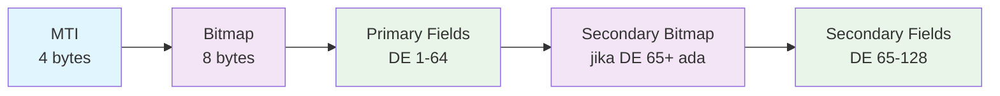
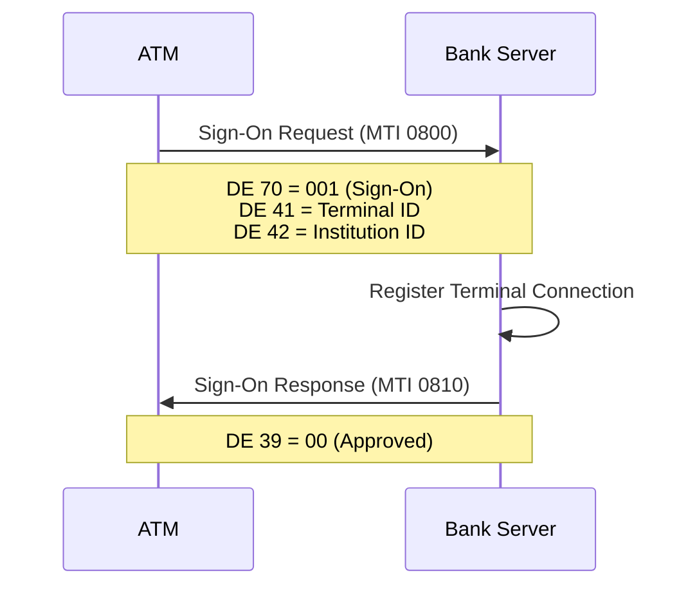
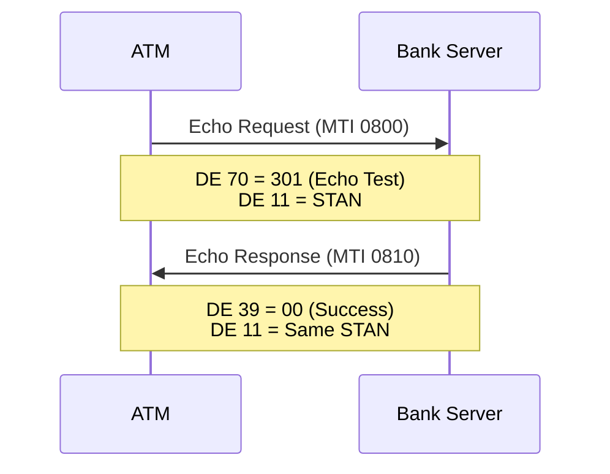
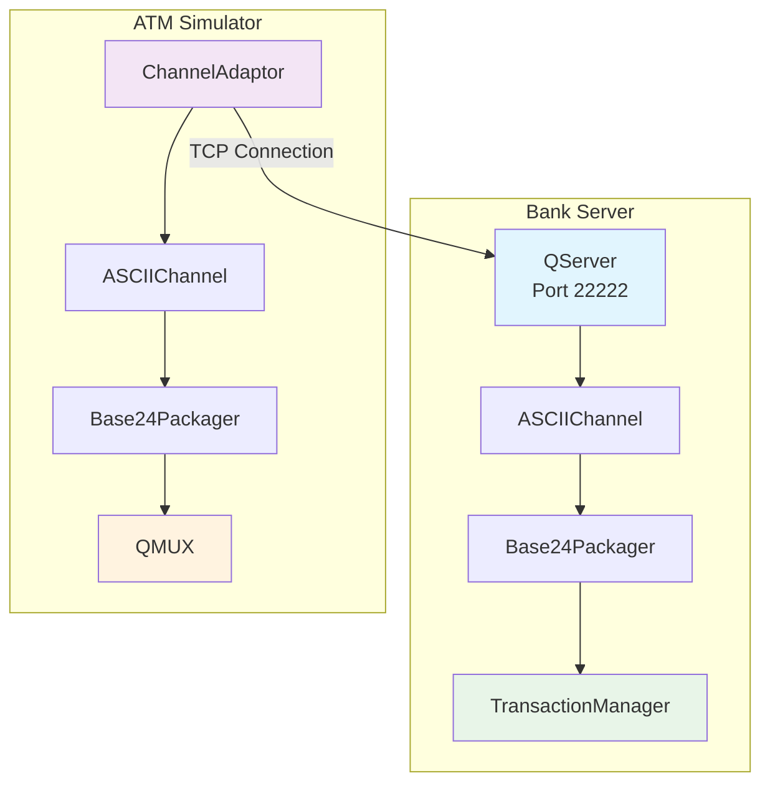

# Hari 2 – JPOS Integration & ISO-8583 Basics

## Tujuan
- Setup jPOS Q2 Server pada Bank Server (port 22222)
- Setup jPOS MUX pada ATM Simulator untuk ISO-8583 client
- Implementasi struktur pesan ISO-8583 untuk ATM communication
- Pesan administratif (Sign-On, Sign-Off, Echo)
- Manajemen channel dan penanganan koneksi ATM-to-Server
- Praktikum: komunikasi ISO-8583 awal (Sign-On/Echo)

## 1. Setup JPos

### 1.1 Menambahkan Dependencies JPos
Peserta akan menambahkan dependencies JPos ke project:

**Dependencies yang Diperlukan:**
- `jpos` 3.0.0 - JPos core library
- `jpos-q2` 3.0.0 - Q2 server framework

**Tugas Implementasi:**
1. Tambah dependencies ke masing-masing project POM
2. Konfigurasi JPos version
3. Pastikan compatibility dengan Spring Boot

### 1.2 Membuat Direktori Konfigurasi Q2
```bash
# Buat struktur direktori untuk Q2
mkdir -p src/main/resources/q2
mkdir -p src/main/resources/q2/deploy
```

### 1.3 Konfigurasi Properties Q2
**Template**: `config/q2.properties`

Peserta akan mengkonfigurasi:
- Direktori server Q2
- Konfigurasi logging
- Pengaturan ISO-8583
- Parameter connection timeout dan retry

## 2. Struktur Pesan ISO-8583

### 2.1 Memahami Format ISO-8583


### 2.2 Data Elements Penting untuk Pembayaran
- **MTI (Message Type Indicator)**: Tipe pesan
- **DE 2 (PAN)**: Primary Account Number
- **DE 3 (Processing Code)**: Jenis transaksi
- **DE 4 (Amount)**: Nominal transaksi
- **DE 11 (STAN)**: System Trace Audit Number
- **DE 12/13 (Time/Date)**: Timestamp transaksi
- **DE 39 (Response Code)**: Response status
- **DE 48 (Additional Data)**: Data tambahan (bill info)
- **DE 128 (MAC)**: Message Authentication Code

### 2.3 Konfigurasi Packager ISO-8583
**Template**: `config/iso8583-packager.xml`

Peserta akan mendefinisikan:
- Konfigurasi Data Element (DE) (DE 0-128)
- Tipe field (IFA_NUMERIC, IFA_LLNUM, dll)
- Panjang field dan formatting
- Penanganan field biner vs karakter

## 3. Pesan Administratif

### 3.1 Pesan Sign-On (MTI 0800)


### 3.2 Echo Test (MTI 0800)


### 3.3 Konfigurasi Pesan Administratif
Peserta akan mengimplementasikan komponen jPOS untuk:

**Pada Bank Server (jPOS Q2 Server):**
- **Sign-On Handler (MTI 0800, DE 70 = 001)**: Register terminal connection dan track status
- **Echo Test Handler (MTI 0800, DE 70 = 301)**: Connection health check response
- **Sign-Off Handler (MTI 0800, DE 70 = 002)**: Unregister terminal connection
- **Network Management Responses (MTI 0810)**: Build dan send response messages

**Pada ATM Simulator (jPOS MUX Client):**
- **Automatic Sign-On Service**: Send sign-on saat connection established
- **Echo Request Generator**: Periodic heartbeat untuk keep-alive
- **Sign-Off on Shutdown**: Graceful disconnection

Tugas implementasi:
- Buat Transaction Participants untuk handling pesan administratif
- Konfigurasi Q2 deployment descriptors (XML files)
- Setup QMUX untuk request-response correlation
- Implementasikan timeout dan logika retry
- Tambahkan logging untuk operasi administratif
- Track terminal sign-on status dalam database/memory

## 4. Konfigurasi Channel

### 4.1 Arsitektur Channel ATM System


### 4.2 Bank Server Channel Configuration
Peserta akan membuat konfigurasi untuk jPOS Q2 Server:

**File: `src/main/resources/deploy/10_qserver.xml`**
- **QServer**: Listen pada port 22222 untuk incoming ATM connections
- **ASCIIChannel**: Communication channel untuk ISO-8583 messages
- **Base24Packager**: Message format specification
- **Configuration Properties**:
  - Port: 22222
  - Max sessions: 100
  - Timeout settings
  - Channel class: org.jpos.iso.channel.ASCIIChannel
  - Packager: org.jpos.iso.packager.BASE24Packager

### 4.3 ATM Simulator Channel Configuration
Peserta akan membuat konfigurasi untuk jPOS MUX Client:

**File: `src/main/resources/deploy/12_channel.xml`**
- **ChannelAdaptor**: Outbound connection ke Bank Server
- **ASCIIChannel**: Same channel type as server
- **Base24Packager**: Same packager as server
- **Configuration Properties**:
  - Host: localhost
  - Port: 22222
  - Timeout: 0 (using heartbeat instead)
  - Auto-reconnect: enabled
  - Keep-alive: enabled

## 5. Konfigurasi MUX

### 5.1 Setup MUX untuk ATM Simulator
MUX (Multiplexer) pada ATM simulator menangani:
- **Request-Response Correlation**: Match response dengan request menggunakan STAN (field 11)
- **Timeout Management**: Handle timeout untuk requests yang tidak mendapat response
- **Thread Management**: Virtual threads untuk concurrent transaction handling
- **Connection Management**: Single persistent connection ke Bank Server

### 5.2 QMUX Configuration
Peserta akan mengimplementasikan QMUX pada ATM simulator:

**File: `src/main/resources/deploy/15_mux.xml`**
- **QMUX Name**: atm-mux
- **Channel Reference**: Reference ke channel yang sudah dikonfigurasi
- **Timeout**: 30000ms (30 detik)
- **MTI Mapping**:
  - Request: 0200, 0800
  - Response: 0210, 0810
- **Key Configuration**: STAN (field 11) untuk request-response matching

**Fitur QMUX:**
- Automatic request-response matching
- Timeout handling
- Concurrent transaction support
- Thread-safe operations

## 6. Pengujian Implementasi

### 6.1 Testing Setup
Sebelum testing, pastikan:
1. PostgreSQL running (kedua database untuk server dan simulator)
2. Bank Server running pada port 9090 (REST) dan 22222 (ISO-8583)
3. ATM Simulator running pada port 7070

### 6.2 Test Automatic Sign-On

**Cara Testing:**
1. Start Bank Server terlebih dahulu
2. Start ATM Simulator
3. Monitor logs dari kedua aplikasi

**Expected Behavior:**
```bash
# ATM Simulator Log:
[INFO] ATM Simulator starting on port 7070
[INFO] Connecting to Bank Server at localhost:22222
[INFO] Connection established
[INFO] Sending automatic sign-on message
[INFO] Sign-on successful, terminal registered

# Bank Server Log:
[INFO] Bank Server listening on port 22222
[INFO] New connection from ATM terminal
[INFO] Received sign-on request: MTI=0800, DE70=001
[INFO] Terminal TRM-ISS001-ATM-001 signed on successfully
[INFO] Sending sign-on response: MTI=0810, DE39=00
```

**Check Sign-On Status via REST API:**
```bash
# Check ATM sign-on status
curl http://localhost:7070/atm/status/signon

# Response:
{
  "signedOn": true,
  "timestamp": "2025-11-02T10:30:00"
}

# Check connected terminals from Bank Server
curl http://localhost:9090/api/admin/key-rotation/connected-terminals

# Response:
[
  {
    "terminalId": "TRM-ISS001-ATM-001",
    "signedOn": true,
    "signOnTime": "2025-11-02T10:30:00"
  }
]
```

### 6.3 Test Manual Sign-Off

**Cara Testing:**
```bash
# Trigger manual sign-off via REST API
curl -X POST http://localhost:7070/atm/signoff

# Response:
{
  "status": "success",
  "message": "Signed off successfully"
}
```

**Expected Behavior:**
```bash
# ATM Simulator Log:
[INFO] Manual sign-off requested
[INFO] Sending sign-off message: MTI=0800, DE70=002
[INFO] Sign-off successful

# Bank Server Log:
[INFO] Received sign-off request from TRM-ISS001-ATM-001
[INFO] Terminal unregistered
[INFO] Sending sign-off response: MTI=0810, DE39=00
```

### 6.4 Test Echo/Heartbeat

Echo messages akan dikirim secara otomatis oleh ATM simulator untuk keep-alive.

**Monitor Logs:**
```bash
# ATM Simulator akan mengirim echo secara periodic
tail -f logs/atm-simulator.log | grep -i echo

# Expected log output:
[DEBUG] Sending periodic echo message
[DEBUG] Echo response received, connection alive
```

### 6.5 Monitor ISO-8583 Messages

**Monitor Bank Server Logs:**
```bash
# Monitor all ISO-8583 messages
tail -f logs/bank-server.log | grep -E "(MTI|0800|0810)"

# Expected output:
[INFO] Received message: MTI=0800, DE70=001 (Sign-On)
[INFO] Sending response: MTI=0810, DE39=00
```

**Monitor ATM Simulator Logs:**
```bash
# Monitor outgoing messages
tail -f logs/atm-simulator.log | grep -E "(Sending|Received)"

# Expected output:
[INFO] Sending sign-on: MTI=0800
[INFO] Received response: MTI=0810, DE39=00
```

**Monitor TCP Connection:**
```bash
# Check connection status
netstat -an | grep 22222

# Expected output:
tcp4       0      0  127.0.0.1.22222        127.0.0.1.xxxxx        ESTABLISHED
```

## 7. File Konfigurasi jPOS

Peserta akan membuat file konfigurasi berikut:

**Bank Server (`spring-jpos-atm-server`):**
- **`src/main/resources/deploy/10_qserver.xml`** - QServer listening pada port 22222
- **`src/main/resources/deploy/20_txnmgr.xml`** - TransactionManager untuk routing messages
- **`src/main/resources/application.yml`** - jPOS configuration (port, packager)

**ATM Simulator (`spring-jpos-atm-simulator`):**
- **`src/main/resources/deploy/12_channel.xml`** - ChannelAdaptor ke Bank Server
- **`src/main/resources/deploy/15_mux.xml`** - QMUX configuration
- **`src/main/resources/deploy/18_auto_signon.xml`** - Automatic sign-on service
- **`src/main/resources/application.yml`** - jPOS configuration (host, port, mux name)

## 8. Integration dengan Spring Boot

Peserta akan mengintegrasikan jPOS dengan Spring Boot:

**Bank Server Integration:**
- Transaction Participants sebagai Spring beans
- SpringBeanFactory untuk dependency injection
- Service layer untuk business logic
- Repository integration untuk database access

**ATM Simulator Integration:**
- QMUX injection via Spring configuration
- Service layer untuk ISO-8583 message building
- Controller integration untuk web UI

## 9. Checklist Validasi

- [ ] Dependencies jPOS 3.0.0 berhasil ditambahkan ke kedua project
- [ ] Bank Server Q2 Server berjalan tanpa error
- [ ] Bank Server listening pada port 22222
- [ ] ATM Simulator ChannelAdaptor terkonfigurasi dengan benar
- [ ] ATM Simulator QMUX terkonfigurasi dengan benar
- [ ] Connection established antara ATM dan Bank Server
- [ ] Automatic sign-on berfungsi (check logs dan REST API)
- [ ] Sign-off manual berfungsi via REST API
- [ ] Echo/heartbeat messages berfungsi
- [ ] ISO-8583 packager (BASE24) dikonfigurasi di kedua sisi
- [ ] Terminal registration tracking berfungsi di Bank Server
- [ ] Logs menunjukkan ISO-8583 message flow dengan jelas

## 10. Masalah Umum & Solusi

### 10.1 Masalah Connection Bank Server
```bash
# Check jPOS Q2 Server status
tail -f logs/bank-server.log | grep -i "qserver\|channel"

# Check if port 22222 is listening
netstat -an | grep 22222
lsof -i :22222

# Restart Bank Server jika diperlukan
# Stop aplikasi dan start ulang
```

### 10.2 Masalah Connection ATM Simulator
```bash
# Check ChannelAdaptor logs
tail -f logs/atm-simulator.log | grep -i "channel\|connection"

# Test connection manually
telnet localhost 22222

# Check QMUX status
tail -f logs/atm-simulator.log | grep -i "mux"
```

### 10.3 Masalah Sign-On Gagal
```bash
# Check terminal ID configuration
grep -r "terminal.id\|institution.id" src/main/resources/application.yml

# Check Bank Server sign-on handler
tail -f logs/bank-server.log | grep -i "sign-on\|0800"

# Verify response code
# DE 39 = 00 (success), anything else = error
```

## 11. Langkah Selanjutnya

Setelah berhasil menyelesaikan Day 2:
1. jPOS Q2 Server berjalan di Bank Server (port 22222)
2. jPOS MUX client berjalan di ATM Simulator
3. ISO-8583 communication established
4. Automatic sign-on berfungsi
5. Format pesan ISO-8583 (MTI, Bitmap, Data Elements) dipahami
6. Pesan administratif (Sign-On, Echo, Sign-Off) berfungsi
7. Siapkan untuk Day 3 (ATM Transaction Flow - Balance & Withdrawal)
8. Review konsep integrasi jPOS Transaction Participants dengan Spring Boot
