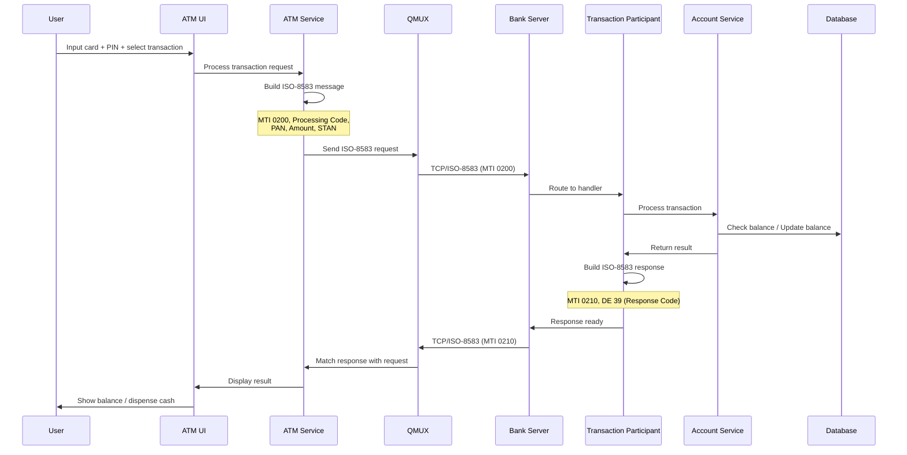
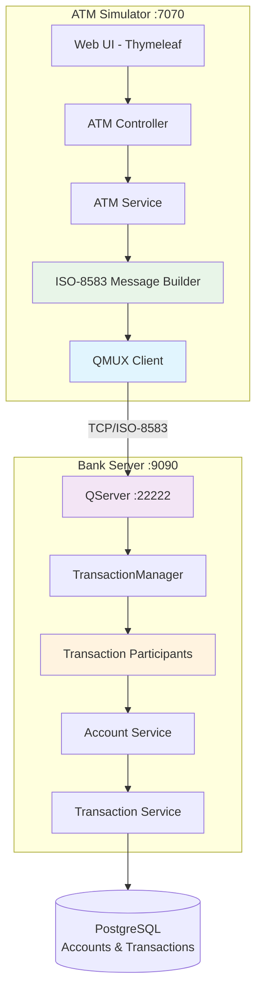
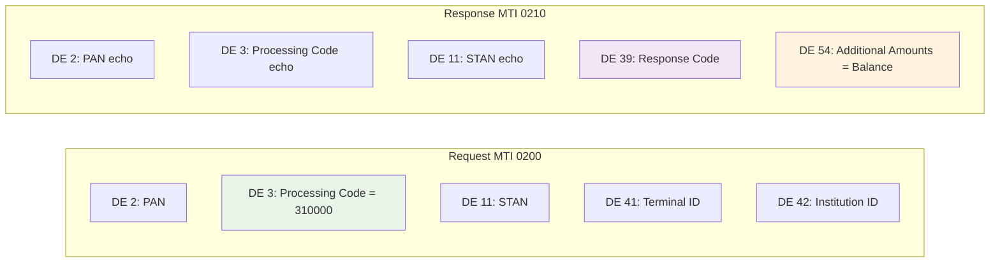
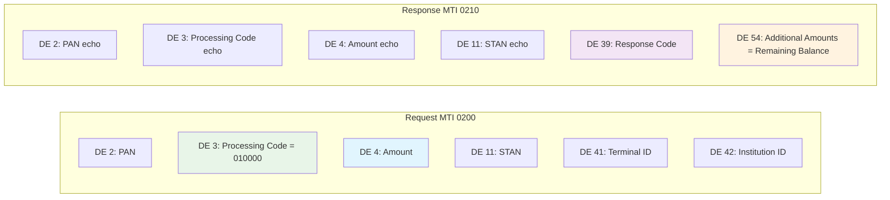
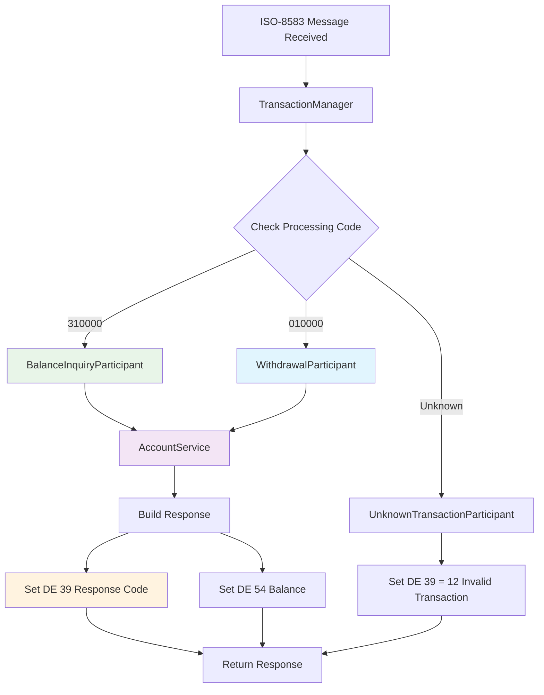
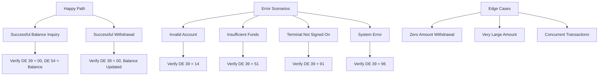

# Hari 3 – End-to-End ATM Transaction Flow

## Tujuan
- Integrasi jPOS dengan Spring Boot (Transaction Participants)
- Implementasi alur transaksi ATM end-to-end (Balance Inquiry & Cash Withdrawal)
- Translasi Web UI ↔ ISO-8583
- Processing Code, PAN, Amount, STAN handling
- Message field mapping dan response handling
- Collaborative testing & debugging

## 1. Arsitektur Alur Transaksi ATM

### 1.1 Alur Transaksi End-to-End


### 1.2 Komponen Sistem


## 2. ISO-8583 Message Field Mapping

### 2.1 Balance Inquiry Message Fields


### 2.2 Withdrawal Message Fields


### 2.3 Processing Code Reference
| Transaction Type | Processing Code | Description |
|-----------------|-----------------|-------------|
| Balance Inquiry | 310000 | Inquiry into cardholder account |
| Cash Withdrawal | 010000 | Cash disbursement |

### 2.4 Tugas Implementasi
Peserta akan mengimplementasikan:

**ATM Simulator (ISO-8583 Message Builder):**
- **Iso8583MessageBuilder** untuk build request messages
- Set MTI, Processing Code, PAN, Amount, STAN
- Set Terminal ID dan Institution ID
- Generate timestamp fields (DE 12, DE 13)

**Bank Server (Transaction Participants):**
- **BalanceInquiryParticipant** untuk handle processing code 310000
- **WithdrawalParticipant** untuk handle processing code 010000
- **ResponseBuilder** untuk build ISO-8583 responses
- Field validation dan business logic integration

## 3. Transaction Participants Implementation

### 3.1 Transaction Participant Flow


### 3.2 Implementation Tasks
**Peserta akan membuat:**

**BalanceInquiryParticipant:**
- Implement `org.jpos.transaction.TransactionParticipant`
- Override `prepare()` method
- Extract PAN from DE 2
- Call AccountService to get balance
- Build response dengan DE 39 = 00 dan DE 54 = balance
- Handle account not found (DE 39 = 14)

**WithdrawalParticipant:**
- Implement `org.jpos.transaction.TransactionParticipant`
- Override `prepare()` method
- Extract PAN from DE 2, Amount from DE 4
- Call AccountService to process withdrawal
- Build response dengan DE 39 = 00 dan DE 54 = remaining balance
- Handle insufficient funds (DE 39 = 51)
- Handle account not found (DE 39 = 14)

**TransactionManager Configuration:**
- Define participant groups in `20_txnmgr.xml`
- Route by processing code
- Configure timeout (30 seconds default)
- Enable Spring bean injection

## 4. Response Code Mapping

### 4.1 ISO-8583 Response Codes untuk ATM
| Response Code (DE 39) | Description | Use Case |
|----------------------|-------------|----------|
| 00 | Approved | Transaction successful |
| 05 | Do not honor | Generic decline |
| 12 | Invalid transaction | Unknown processing code |
| 14 | Invalid card number | Account not found |
| 51 | Insufficient funds | Balance too low for withdrawal |
| 55 | Incorrect PIN | PIN verification failed |
| 91 | System malfunction | Terminal not signed on |
| 96 | System error | Database or processing error |

### 4.2 ATM UI Display Mapping
```java
// Response code to user message mapping
Map<String, String> messageMap = Map.of(
    "00", "Transaction successful",
    "05", "Transaction declined",
    "12", "Invalid transaction type",
    "14", "Invalid account number",
    "51", "Insufficient funds",
    "55", "Incorrect PIN",
    "91", "Service temporarily unavailable",
    "96", "System error, please try again"
);
```

### 4.3 Error Handling Implementation
**Peserta akan mengimplementasikan:**

**ATM Simulator:**
- Parse response code dari DE 39
- Map response code ke user-friendly message
- Display appropriate message pada web UI
- Log transaction result

**Bank Server:**
- Catch exceptions dalam Transaction Participants
- Map exceptions ke appropriate response codes
- Log errors untuk troubleshooting
- Return proper ISO-8583 response dengan error code

## 5. Testing & Debugging

### 5.1 Test Scenarios


### 5.2 Testing via Web UI
```bash
# Open ATM UI
open http://localhost:7070

# Test Balance Inquiry:
1. Enter card number: 1234567890
2. Enter PIN: 1234
3. Select: Balance Inquiry
4. Click Execute
5. Expected: "Your balance is: 5,000,000"

# Test Withdrawal:
1. Enter card number: 1234567890
2. Enter PIN: 1234
3. Select: Withdrawal
4. Enter amount: 500000
5. Click Execute
6. Expected: "Withdrawal successful. Remaining balance: 4,500,000"

# Test Insufficient Funds:
1. Enter card number: 1234567890
2. Enter amount: 10000000 (more than balance)
3. Expected: "Insufficient funds"

# Test Invalid Account:
1. Enter card number: 9999999999
2. Expected: "Invalid account number"
```

### 5.3 Testing via Logs
**Monitor ATM Simulator:**
```bash
tail -f logs/atm-simulator.log

# Expected for Balance Inquiry:
[INFO] Building ISO-8583 message: MTI=0200, Processing Code=310000
[INFO] Sending request via QMUX, STAN=000001
[INFO] Received response: MTI=0210, DE39=00
[INFO] Balance: 5000000
```

**Monitor Bank Server:**
```bash
tail -f logs/bank-server.log

# Expected for Balance Inquiry:
[INFO] Received message: MTI=0200, Processing Code=310000, PAN=1234567890
[INFO] Routing to BalanceInquiryParticipant
[INFO] Account balance: 5000000
[INFO] Sending response: MTI=0210, DE39=00, DE54=5000000
```

### 5.4 Database Verification
```sql
-- Check transaction logs
SELECT * FROM transactions
ORDER BY created_at DESC
LIMIT 10;

-- Check account balance updates
SELECT account_number, balance, updated_at
FROM accounts
WHERE account_number = '1234567890';

-- Verify transaction count
SELECT transaction_type, COUNT(*) as count
FROM transactions
GROUP BY transaction_type;
```

## 6. Sample Test Data

### 6.1 Test Accounts (Already in database)
| Account Number | Holder Name | Balance | PIN |
|---------------|-------------|---------|-----|
| 1234567890 | John Doe | 5,000,000 | 1234 |
| 0987654321 | Jane Smith | 3,000,000 | 5678 |
| 5555555555 | Bob Johnson | 10,000,000 | 9999 |

### 6.2 Sample ISO-8583 Messages

**Balance Inquiry Request:**
```
MTI: 0200
DE 2: 1234567890
DE 3: 310000
DE 11: 000001
DE 41: ATM-001
DE 42: TRM-ISS001
```

**Balance Inquiry Response:**
```
MTI: 0210
DE 2: 1234567890
DE 3: 310000
DE 11: 000001
DE 39: 00
DE 54: 5000000
```

**Withdrawal Request:**
```
MTI: 0200
DE 2: 1234567890
DE 3: 010000
DE 4: 500000
DE 11: 000002
DE 41: ATM-001
DE 42: TRM-ISS001
```

**Withdrawal Response:**
```
MTI: 0210
DE 2: 1234567890
DE 3: 010000
DE 4: 500000
DE 11: 000002
DE 39: 00
DE 54: 4500000
```

## 7. Validation Checklist

### 7.1 End-to-End Testing
- [ ] ATM Web UI accessible pada http://localhost:7070
- [ ] Bank Server listening pada port 22222
- [ ] jPOS Q2 Server running without errors
- [ ] QMUX connection established
- [ ] Terminal signed on automatically

### 7.2 Transaction Testing
- [ ] Balance inquiry berfungsi (Processing Code 310000)
- [ ] Withdrawal berfungsi (Processing Code 010000)
- [ ] Response code 00 untuk successful transactions
- [ ] Response code 14 untuk invalid account
- [ ] Response code 51 untuk insufficient funds
- [ ] Balance updated correctly dalam database
- [ ] Transaction logs created

### 7.3 Integration Testing
- [ ] ISO-8583 messages built correctly (MTI, DE 2, DE 3, DE 4, DE 11)
- [ ] Transaction Participants routing by processing code
- [ ] AccountService integration berfungsi
- [ ] Database transactions logged
- [ ] Response messages properly formatted
- [ ] STAN correlation working (request-response matching)

### 7.4 Performance Validation
- **Response time** < 1 detik untuk alur normal
- **QMUX timeout** configured (30 detik)
- **Database queries** optimized
- **Concurrent transactions** handled correctly

## 8. Troubleshooting

### 8.1 Common Issues

**Transaction Participant Not Found:**
```bash
# Check TransactionManager configuration
cat src/main/resources/deploy/20_txnmgr.xml

# Check participant routing
tail -f logs/bank-server.log | grep "participant"
```

**Response Code Always 96 (System Error):**
```bash
# Check exception logs
tail -f logs/bank-server.log | grep "Exception"

# Check database connection
docker-compose exec postgres psql -U postgres -d payment_system -c "SELECT 1;"
```

**QMUX Timeout:**
```bash
# Check QMUX configuration
grep "timeout" src/main/resources/deploy/15_mux.xml

# Check connection to server
telnet localhost 22222

# Monitor QMUX logs
tail -f logs/atm-simulator.log | grep "QMUX\|timeout"
```

**Balance Not Updated:**
```bash
# Check optimistic locking version
SELECT id, account_number, balance, version
FROM accounts
WHERE account_number = '1234567890';

# Check transaction logs
SELECT * FROM transactions
WHERE account_id IN (SELECT id FROM accounts WHERE account_number = '1234567890')
ORDER BY created_at DESC;
```

## 9. Next Steps

Setelah berhasil menyelesaikan Day 3:
1. Alur transaksi ATM end-to-end berfungsi (Balance Inquiry & Withdrawal)
2. jPOS Transaction Participants integrated dengan Spring Boot services
3. ISO-8583 message building dan parsing berfungsi
4. Processing Code routing berfungsi (310000 dan 010000)
5. Response code mapping implemented
6. Database integration untuk transaction logging
7. Siapkan untuk Day 4 (HSM Integration - PIN, MAC, Key Rotation)
8. Review konsep cryptography: PIN encryption, MAC generation, Key management