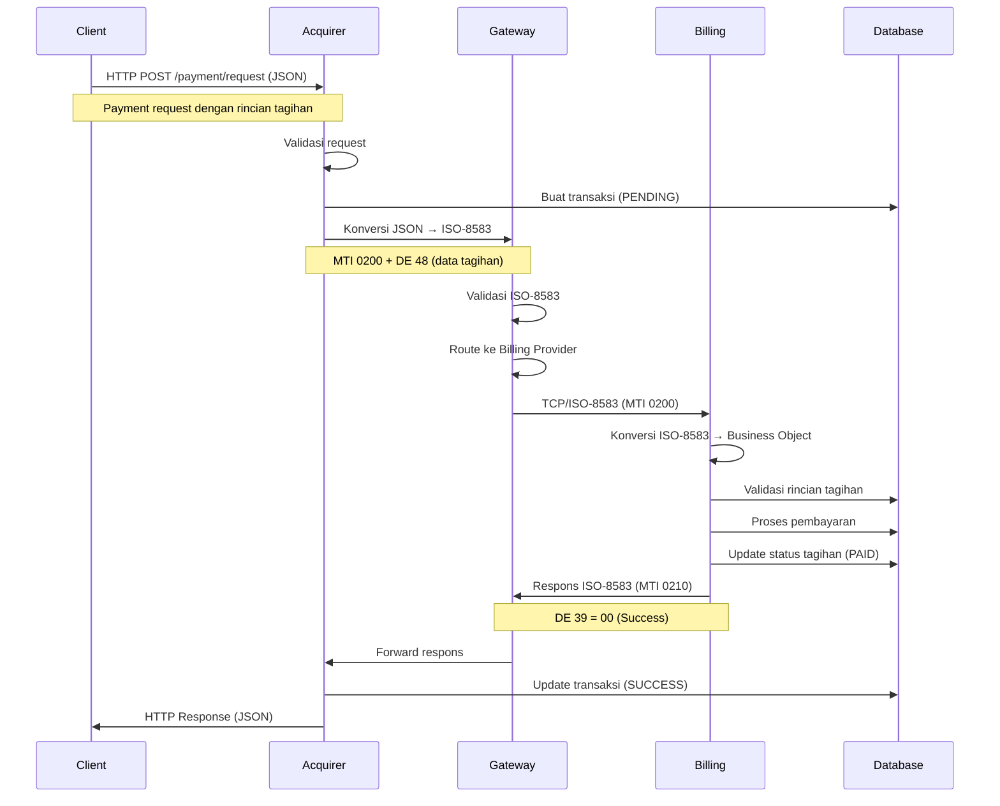
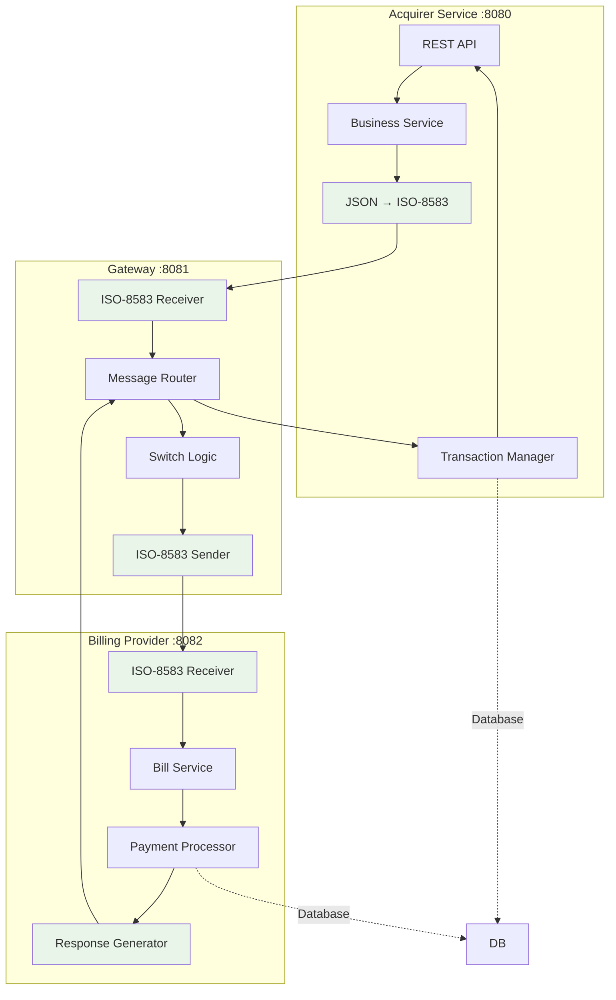
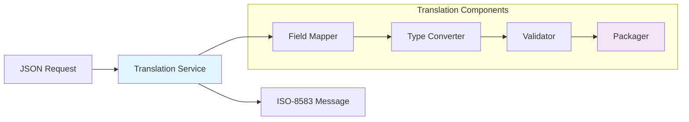
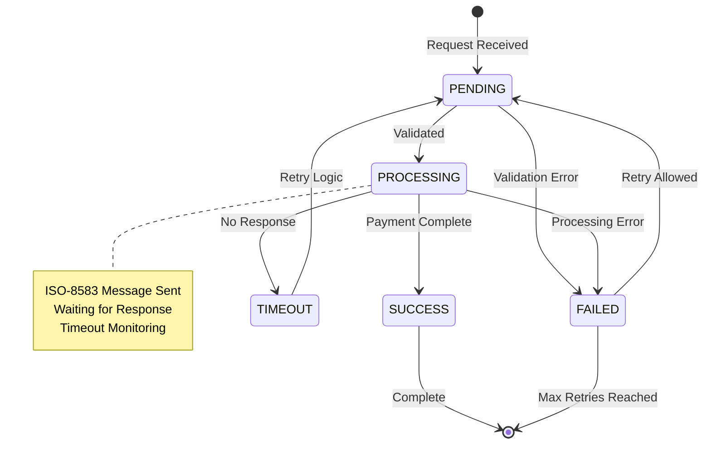
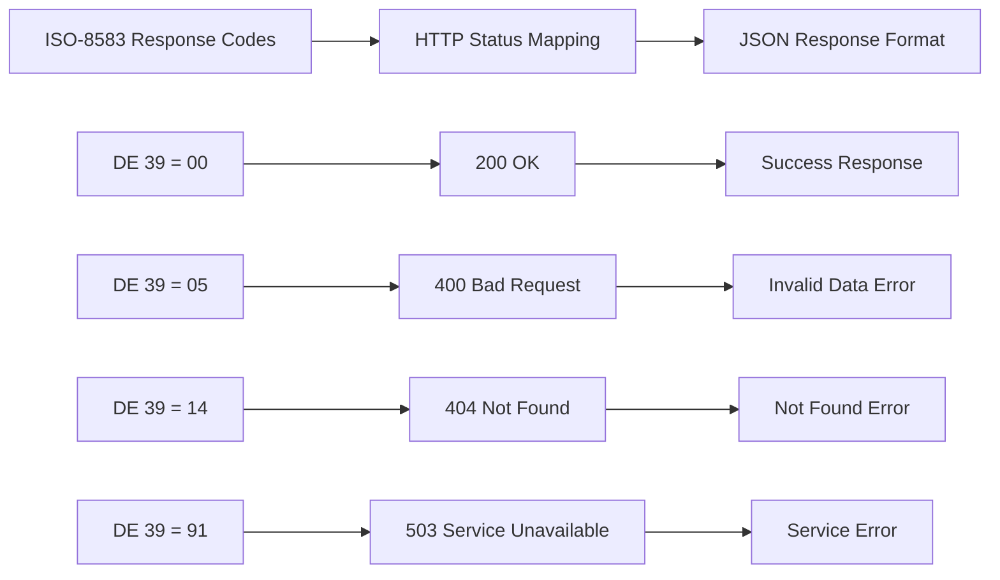
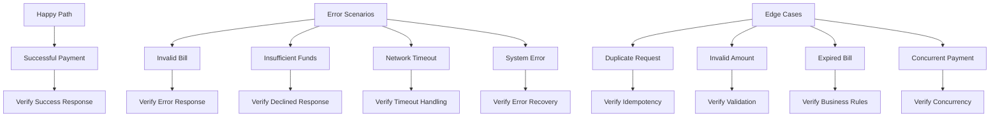

# Hari 3 – Alur Pembayaran Tagihan End-to-End

## Tujuan
- Implementasi alur pembayaran lengkap dari Client → Acquirer → Gateway → Billing
- Layanan translasi JSON ↔ ISO-8583
- Manajemen state transaksi
- Penanganan error dan pemetaan respons
- Pengujian dan debugging kolaboratif

## 1. Arsitektur Alur Pembayaran Lengkap

### 1.1 Alur Transaksi End-to-End


### 1.2 Titik Integrasi Layanan


## 2. Translasi JSON ↔ ISO-8583

### 2.1 Arsitektur Layanan Translasi


### 2.2 Konfigurasi Pemetaan Field
```json
{
  "requestMapping": {
    "billId": "DE_48_SUBFIELD_1",
    "customerId": "DE_48_SUBFIELD_2",
    "amount": "DE_4",
    "currency": "DE_49",
    "transactionId": "DE_11",
    "timestamp": "DE_12_DE_13",
    "merchantType": "DE_18",
    "acquirerInstitution": "DE_32",
    "retrievalReference": "DE_37",
    "cardAcceptor": "DE_43"
  },
  "responseMapping": {
    "transactionId": "DE_11",
    "responseCode": "DE_39",
    "authorizationId": "DE_38",
    "responseTime": "DE_12_DE_13",
    "retrievalReference": "DE_37",
    "additionalAmounts": "DE_54"
  }
}
```

### 2.3 Tugas Implementasi
Peserta akan mengimplementasikan:
- **FieldMapperService** untuk mapping field JSON ↔ ISO-8583
- **TypeConverterService** untuk konversi tipe data
- **ValidationService** untuk validasi field
- **TranslationService** untuk konversi end-to-end

## 3. Manajemen State Transaksi

### 3.1 Alur State Transaksi


### 3.2 Implementasi Manajemen State
**Peserta akan membuat:**
- **TransactionStateService** untuk transisi state
- **TimeoutManager** untuk penanganan timeout
- **RetryService** untuk logika retry
- **StateRepository** untuk persistence

### 3.3 Konfigurasi Timeout Transaksi
```yaml
transaction:
  timeout:
    processing: 30s      # Waktu maksimal untuk proses pembayaran
    response: 45s        # Waktu maksimal untuk respons
    retry: 60s           # Waktu tunggu sebelum retry
  retry:
    maxAttempts: 3       # Maksimal percobaan retry
    backoffMultiplier: 2 # Exponential backoff
```

## 4. Penanganan Error & Pemetaan Respons

### 4.1 Pemetaan Kode Respons ISO-8583


### 4.2 Format Respons Error Standar
```json
{
  "transactionId": "TXN20251021001",
  "status": "FAILED",
  "responseCode": "05",
  "message": "Do not honor",
  "details": {
    "errorCode": "PAYMENT_DECLINED",
    "originalError": "Insufficient funds",
    "timestamp": "2025-10-21T09:15:35Z",
    "retryAllowed": false
  }
}
```

### 4.3 Kategorisasi Error
**Peserta akan mengimplementasikan penanganan error untuk:**
- **Business Logic Errors**: Tagihan tidak valid, dana tidak cukup
- **Network Errors**: Koneksi timeout, host tidak bisa dijangkau
- **System Errors**: Database failure, error pemrosesan
- **Security Errors**: MAC tidak valid, token kedaluwarsa

## 5. Pengujian & Debugging

### 5.1 Skenario Pengujian


### 5.2 Script Pengujian Integrasi
**Peserta akan membuat script pengujian untuk:**
- **Alur pembayaran normal** dengan berbagai tipe tagihan
- **Skenario error** dengan kode respons berbeda
- **Penanganan timeout** dengan respons yang ditunda
- **Request konkuren** dengan ID transaksi duplikat

### 5.3 Implementasi Alat Debug
**Peserta akan membangun:**
- **Message Tracer** untuk visualisasi alur transaksi
- **Log Aggregator** untuk logging terpusat
- **Response Validator** untuk validasi format
- **Health Check Service** untuk status sistem

## 6. Contoh Data Pengujian

### 6.1 Data Tagihan Pengujian
Data tagihan pengujian tersedia di: `data/test-bills.sql`

### 6.2 Skenario Transaksi Pengujian
Skenario transaksi pengujian tersedia di: `scenarios/transaction-tests.json`

### 6.3 Contoh Respons yang Diharapkan
Contoh respons yang diharapkan tersedia di: `samples/expected-responses.json`

## 7. Validasi Implementasi

### 7.1 Pengujian End-to-End
```bash
# Test complete payment flow
curl -X POST http://localhost:8080/api/v1/payment/request \
  -H "Content-Type: application/json" \
  -d @samples/payment-request.json

# Monitor transaction flow
curl http://localhost:8081/api/v1/admin/trace/TXN20251021001

# Verify bill status
curl http://localhost:8082/api/v1/bill/status/BILL001
```

### 7.2 Checklist Validasi
- [ ] Alur pembayaran lengkap berfungsi
- [ ] Translasi JSON → ISO-8583 berfungsi
- [ ] Manajemen state transaksi berfungsi
- [ ] Penanganan error diimplementasikan dengan benar
- [ ] Pemetaan respons akurat
- [ ] Penanganan timeout berfungsi
- [ ] Logika retry berfungsi
- [ ] Idempotency diimplementasikan
- [ ] Penanganan konkurensi aman
- [ ] Semua skenario pengujian berhasil

### 7.3 Validasi Performa
- **Response time** < 2 detik untuk alur normal
- **Throughput** > 100 transaksi/menit
- **Error rate** < 1% untuk operasi normal
- **Recovery time** < 30 detik untuk kegagalan

## 8. Panduan Pemecahan Masalah

### 8.1 Masalah Umum
- **Translation errors**: Konfigurasi pemetaan field
- **State management**: Konsistensi database
- **Timeout issues**: Konektivitas jaringan
- **Error handling**: Pemetaan kode respons

### 8.2 Perintah Debug
```bash
# Check transaction status
docker-compose exec postgres psql -U postgres -d payment_system \
  -c "SELECT * FROM transactions WHERE transaction_id = 'TXN20251021001';"

# Monitor JPos messages
tail -f logs/q2.log | grep "TXN20251021001"

# Test ISO-8583 message directly
curl -X POST http://localhost:8081/api/v1/iso/test \
  -H "Content-Type: application/json" \
  -d @samples/iso-test.json
```

## 9. Langkah Selanjutnya

Setelah berhasil menyelesaikan Day 3:
1. Alur pembayaran lengkap diimplementasikan dan diuji
2. Translasi JSON ↔ ISO-8583 berfungsi
3. Manajemen state transaksi robust
4. Penanganan error komprehensif
5. Siapkan untuk Day 4 (Integrasi Keamanan HSM)
6. Review konsep PIN, MAC, dan Key Exchange