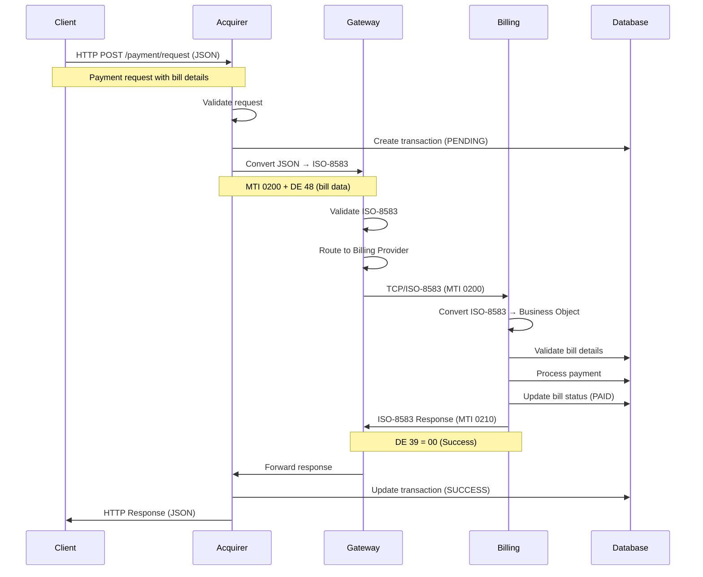
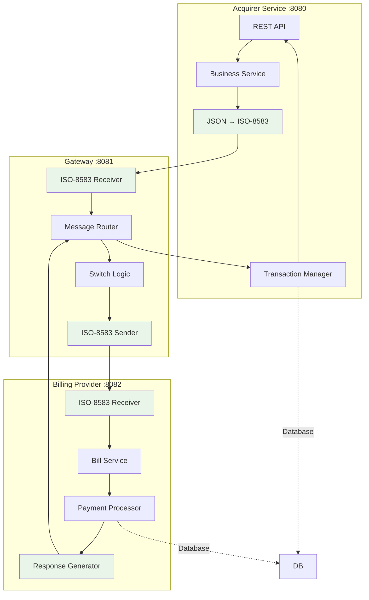
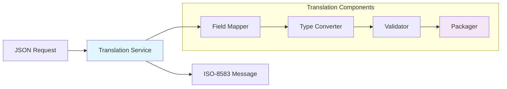
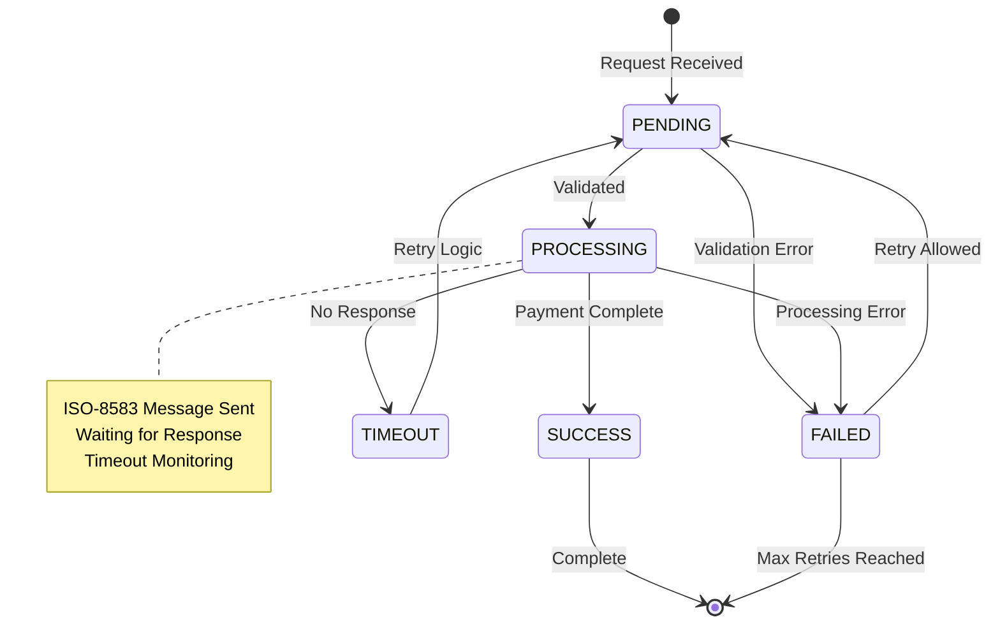
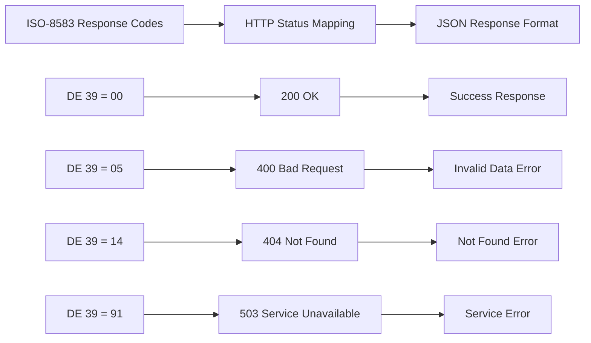
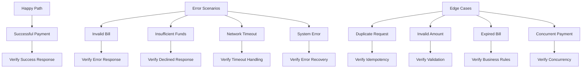

# Hari 3 – End-to-End Bill Payment Flow

## Tujuan
- Implementasi complete payment flow dari Client → Acquirer → Gateway → Billing
- JSON ↔ ISO-8583 translation service
- Transaction state management
- Error handling dan response mapping
- Collaborative testing & debugging

## 1. Complete Payment Flow Architecture

### 1.1 End-to-End Transaction Flow


### 1.2 Service Integration Points


## 2. JSON ↔ ISO-8583 Translation

### 2.1 Translation Service Architecture


### 2.2 Field Mapping Configuration
```json
{
  "requestMapping": {
    "billId": "DE_48_SUBFIELD_1",
    "customerId": "DE_48_SUBFIELD_2",
    "amount": "DE_4",
    "currency": "DE_49",
    "transactionId": "DE_11",
    "timestamp": "DE_12_DE_13",
    "merchantType": "DE_18",
    "acquirerInstitution": "DE_32",
    "retrievalReference": "DE_37",
    "cardAcceptor": "DE_43"
  },
  "responseMapping": {
    "transactionId": "DE_11",
    "responseCode": "DE_39",
    "authorizationId": "DE_38",
    "responseTime": "DE_12_DE_13",
    "retrievalReference": "DE_37",
    "additionalAmounts": "DE_54"
  }
}
```

### 2.3 Implementation Tasks
Participants will implement:
- **FieldMapperService** untuk mapping JSON ↔ ISO-8583 fields
- **TypeConverterService** untuk data type conversions
- **ValidationService** untuk field validation
- **TranslationService** untuk end-to-end conversion

## 3. Transaction State Management

### 3.1 Transaction State Flow


### 3.2 State Management Implementation
**Participants will create:**
- **TransactionStateService** untuk state transitions
- **TimeoutManager** untuk timeout handling
- **RetryService** untuk retry logic
- **StateRepository** untuk persistence

### 3.3 Transaction Timeout Configuration
```yaml
transaction:
  timeout:
    processing: 30s      # Max time for payment processing
    response: 45s        # Max time for response
    retry: 60s           # Wait time before retry
  retry:
    maxAttempts: 3       # Maximum retry attempts
    backoffMultiplier: 2 # Exponential backoff
```

## 4. Error Handling & Response Mapping

### 4.1 ISO-8583 Response Code Mapping


### 4.2 Standardized Error Response Format
```json
{
  "transactionId": "TXN20251021001",
  "status": "FAILED",
  "responseCode": "05",
  "message": "Do not honor",
  "details": {
    "errorCode": "PAYMENT_DECLINED",
    "originalError": "Insufficient funds",
    "timestamp": "2025-10-21T09:15:35Z",
    "retryAllowed": false
  }
}
```

### 4.3 Error Categorization
**Participants will implement error handling for:**
- **Business Logic Errors**: Invalid bill, insufficient funds
- **Network Errors**: Connection timeout, unreachable host
- **System Errors**: Database failure, processing errors
- **Security Errors**: Invalid MAC, expired tokens

## 5. Testing & Debugging

### 5.1 Test Scenarios


### 5.2 Integration Test Scripts
**Participants will create test scripts for:**
- **Normal payment flow** with various bill types
- **Error scenarios** with different response codes
- **Timeout handling** with delayed responses
- **Concurrent requests** with duplicate transaction IDs

### 5.3 Debug Tools Implementation
**Participants will build:**
- **Message Tracer** untuk transaction flow visualization
- **Log Aggregator** untuk centralized logging
- **Response Validator** untuk format validation
- **Health Check Service** untuk system status

## 6. Sample Test Data

### 6.1 Test Bill Data
Lihat: `data/test-bills.sql`

### 6.2 Test Transaction Scenarios
Lihat: `scenarios/transaction-tests.json`

### 6.3 Expected Response Samples
Lihat: `samples/expected-responses.json`

## 7. Implementation Validation

### 7.1 End-to-End Test
```bash
# Test complete payment flow
curl -X POST http://localhost:8080/api/v1/payment/request \
  -H "Content-Type: application/json" \
  -d @samples/payment-request.json

# Monitor transaction flow
curl http://localhost:8081/api/v1/admin/trace/TXN20251021001

# Verify bill status
curl http://localhost:8082/api/v1/bill/status/BILL001
```

### 7.2 Validation Checklist
- [ ] Complete payment flow working
- [ ] JSON → ISO-8583 translation functional
- [ ] Transaction state management working
- [ ] Error handling implemented correctly
- [ ] Response mapping accurate
- [ ] Timeout handling functional
- [ ] Retry logic working
- [ ] Idempotency implemented
- [ ] Concurrency handling safe
- [ ] All test scenarios passing

### 7.3 Performance Validation
- **Response time** < 2 seconds for normal flow
- **Throughput** > 100 transactions/minute
- **Error rate** < 1% for normal operations
- **Recovery time** < 30 seconds for failures

## 8. Troubleshooting Guide

### 8.1 Common Issues
- **Translation errors**: Field mapping configuration
- **State management**: Database consistency
- **Timeout issues**: Network connectivity
- **Error handling**: Response code mapping

### 8.2 Debug Commands
```bash
# Check transaction status
docker-compose exec postgres psql -U postgres -d payment_system \
  -c "SELECT * FROM transactions WHERE transaction_id = 'TXN20251021001';"

# Monitor JPos messages
tail -f logs/q2.log | grep "TXN20251021001"

# Test ISO-8583 message directly
curl -X POST http://localhost:8081/api/v1/iso/test \
  -H "Content-Type: application/json" \
  -d @samples/iso-test.json
```

## 9. Next Steps

Setelah berhasil menyelesaikan Day 3:
1. Complete payment flow implemented and tested
2. JSON ↔ ISO-8583 translation working
3. Transaction state management robust
4. Error handling comprehensive
5. Siapkan untuk Day 4 (HSM Security Integration)
6. Review PIN, MAC, and Key Exchange concepts