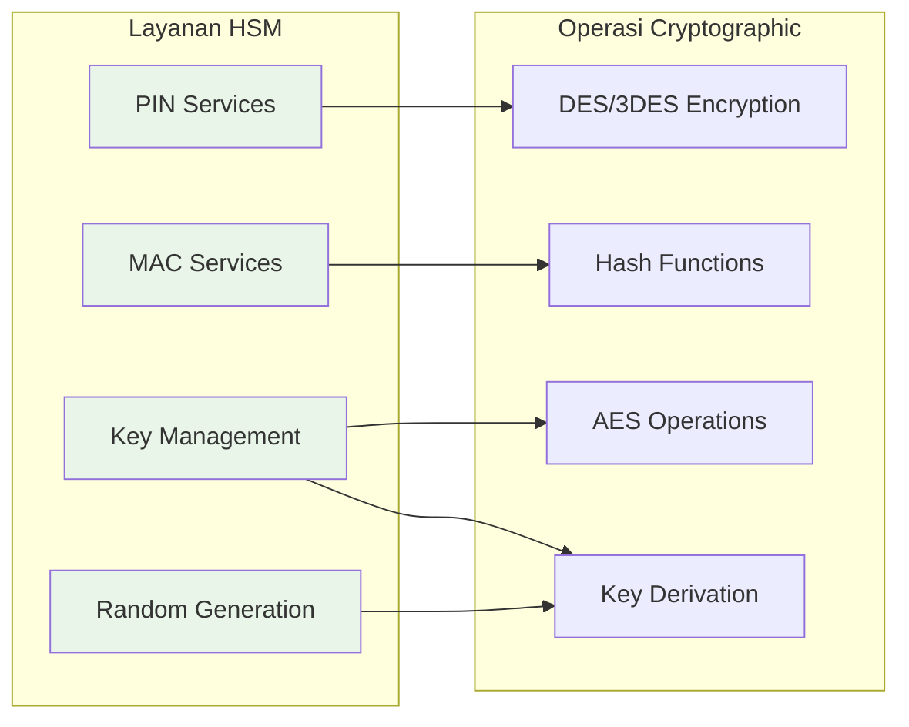
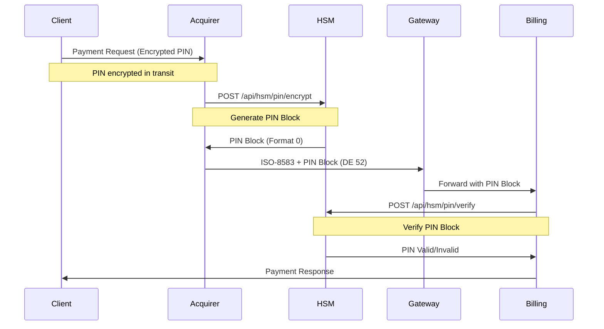
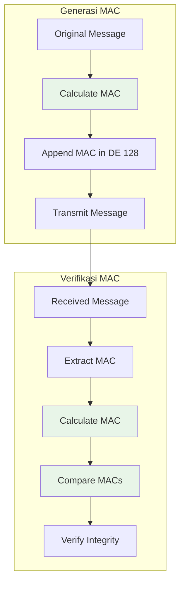
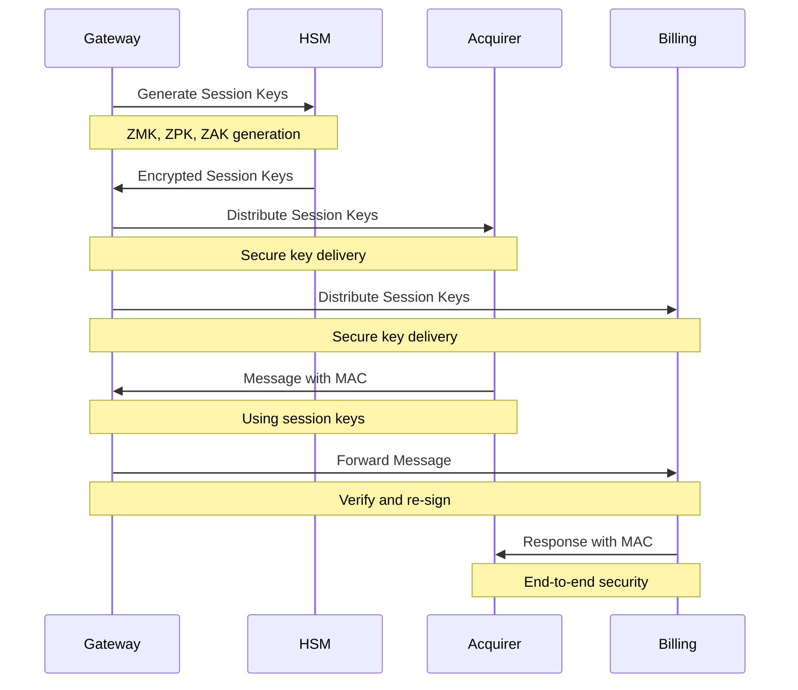
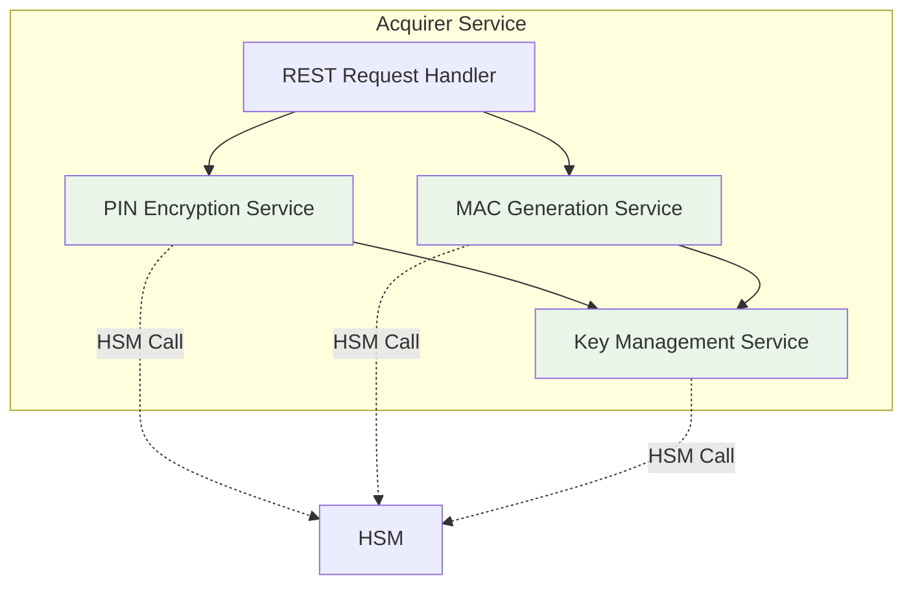
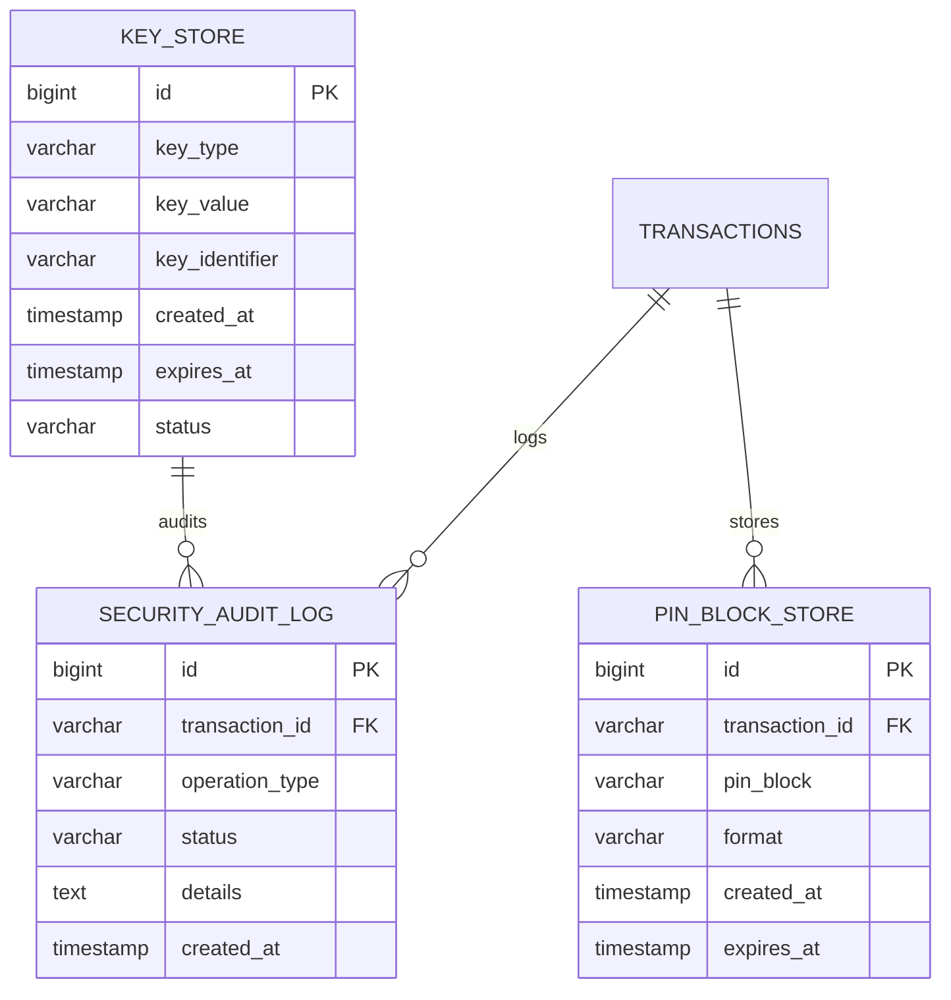

# Hari 4 – Simulasi HSM, PIN, MAC & Key Exchange

## Tujuan
- Implementasi simulator HSM untuk operasi cryptographic
- Manajemen PIN block (generasi, enkripsi, verifikasi)
- Generasi dan verifikasi MAC untuk integritas pesan
- Mekanisme key exchange untuk komunikasi aman
- Integrasi HSM ke alur pembayaran

## 1. Arsitektur Simulator HSM

### 1.1 Desain Simulator HSM


### 1.2 Arsitektur Layanan HSM


## 2. Manajemen PIN Block

### 2.1 Alur PIN Block


### 2.2 Format PIN Block
**Peserta akan mengimplementasikan:**
- **Format 0**: Format PIN block ANSI X9.8
- **Format 3**: Format PIN block ISO 9564-1 Format 3
- **Format 4**: Format PIN block ISO 9564-1 Format 4

### 2.3 Tugas Implementasi PIN Block
```java
// Peserta akan mengimplementasikan:
public class PinBlockService {
    // Generate PIN block dari customer PIN
    public String encryptPinBlock(String pin, String pan);

    // Verify PIN block terhadap customer PIN
    public boolean verifyPinBlock(String pinBlock, String pan, String pin);

    // Konversi antar format PIN block
    public String convertPinBlockFormat(String pinBlock, int fromFormat, int toFormat);
}
```

## 3. Generasi & Verifikasi MAC

### 3.1 Arsitektur Alur MAC


### 3.2 Implementasi Algoritma MAC
**Peserta akan mengimplementasikan algoritma MAC ANSI X9.19:**
- **Block cipher DES** untuk perhitungan MAC
- **CBC mode** untuk chaining blocks
- **Padding handling** untuk block yang tidak lengkap
- **Key management** untuk MAC keys

### 3.3 Integrasi Layanan MAC
```java
// Peserta akan mengimplementasikan:
public class MacService {
    // Generate MAC untuk pesan ISO-8583
    public String generateMac(String message, String macKey);

    // Verify MAC untuk pesan yang diterima
    public boolean verifyMac(String message, String mac, String macKey);

    // Update MAC ketika fields berubah
    public String updateMac(String message, String mac, String macKey, String... changedFields);
}
```

## 4. Implementasi Key Exchange

### 4.1 Alur Key Exchange


### 4.2 Tipe Key dan Manajemen
**Tipe Key yang Akan Diimplementasikan:**
- **ZMK (Zone Master Key)**: Master key untuk distribusi key
- **ZPK (Zone PIN Key)**: Untuk enkripsi/dekripsi PIN block
- **ZAK (Zone Authentication Key)**: Untuk generasi/verifikasi MAC
- **TEK (Traffic Encryption Key)**: Untuk enkripsi pesan

### 4.3 Pesan Key Exchange
**Peserta akan mengimplementasikan pesan key exchange ISO-8583:**
```json
{
  "keyExchangeRequest": {
    "mti": "0800",
    "de_53": "301",  // Network management code untuk key exchange
    "de_48": "KEY_EXCHANGE_REQUEST_DATA",
    "de_128": "MAC_FOR_KEY_EXCHANGE"
  },
  "keyExchangeResponse": {
    "mti": "0810",
    "de_39": "00",  // Success
    "de_48": "ENCRYPTED_SESSION_KEYS",
    "de_128": "MAC_FOR_RESPONSE"
  }
}
```

## 5. Spesifikasi API Layanan HSM

### 5.1 API Operasi PIN
```yaml
# PIN Encryption
POST /api/hsm/pin/encrypt
Content-Type: application/json
{
  "pin": "123456",
  "pan": "4111111111111111",
  "format": 0
}

# PIN Verification
POST /api/hsm/pin/verify
Content-Type: application/json
{
  "pinBlock": "041234567890ABCDE",
  "pan": "4111111111111111",
  "pin": "123456",
  "format": 0
}
```

### 5.2 API Operasi MAC
```yaml
# MAC Generation
POST /api/hsm/mac/generate
Content-Type: application/json
{
  "message": "ISO8583_MESSAGE_DATA",
  "key": "MAC_KEY_HEX",
  "algorithm": "ANSI_X9_19"
}

# MAC Verification
POST /api/hsm/mac/verify
Content-Type: application/json
{
  "message": "ISO8583_MESSAGE_DATA",
  "mac": "GENERATED_MAC_HEX",
  "key": "MAC_KEY_HEX",
  "algorithm": "ANSI_X9_19"
}
```

### 5.3 API Manajemen Key
```yaml
# Key Generation
POST /api/hsm/key/generate
Content-Type: application/json
{
  "keyType": "ZPK",
  "algorithm": "DESede",
  "keyLength": 192
}

# Key Exchange
POST /api/hsm/key/exchange
Content-Type: application/json
{
  "keyType": "ZPK",
  "wrappedKey": "ENCRYPTED_KEY_HEX",
  "kek": "KEY_ENCRYPTION_KEY"
}
```

## 6. Titik Integrasi Keamanan

### 6.1 Integrasi Keamanan Acquirer


### 6.2 Integrasi Keamanan Gateway
**Peserta akan mengimplementasikan:**
- **Incoming MAC verification** untuk semua pesan
- **Outgoing MAC generation** untuk pesan yang diteruskan
- **Key rotation** untuk manajemen sesi
- **Security audit logging** untuk kepatuhan

### 6.3 Integrasi Keamanan Billing
**Peserta akan mengimplementasikan:**
- **PIN block verification** untuk transaksi debit
- **MAC verification** untuk integritas pesan
- **Secure response generation** dengan MAC
- **Transaction security audit trail**

## 7. Schema Database untuk Keamanan

### 7.1 Tabel Keamanan
Schema keamanan tersedia di: `data/security-schema.sql`

### 7.2 Schema Penyimpanan Key


## 8. Pengujian & Validasi

### 8.1 Skenario Pengujian Keamanan
Skenario pengujian keamanan tersedia di: `security/test-scenarios.json`

### 8.2 Kasus Uji PIN Block
```bash
# Test PIN block generation
curl -X POST http://localhost:8083/api/hsm/pin/encrypt \
  -H "Content-Type: application/json" \
  -d @samples/pin-encrypt-request.json

# Test PIN block verification
curl -X POST http://localhost:8083/api/hsm/pin/verify \
  -H "Content-Type: application/json" \
  -d @samples/pin-verify-request.json
```

### 8.3 Kasus Uji MAC
```bash
# Test MAC generation
curl -X POST http://localhost:8083/api/hsm/mac/generate \
  -H "Content-Type: application/json" \
  -d @samples/mac-generate-request.json

# Test MAC verification
curl -X POST http://localhost:8083/api/hsm/mac/verify \
  -H "Content-Type: application/json" \
  -d @samples/mac-verify-request.json
```

### 8.4 Kasus Uji Key Exchange
```bash
# Test key generation
curl -X POST http://localhost:8083/api/hsm/key/generate \
  -H "Content-Type: application/json" \
  -d @samples/key-generate-request.json

# Test key exchange
curl -X POST http://localhost:8083/api/hsm/key/exchange \
  -H "Content-Type: application/json" \
  -d @samples/key-exchange-request.json
```

## 9. Validasi Implementasi

### 9.1 Checklist Validasi Keamanan
- [ ] Simulator HSM berjalan pada port 8083
- [ ] Generasi PIN block berfungsi (semua format)
- [ ] Verifikasi PIN block berfungsi
- [ ] Generasi MAC berfungsi (ANSI X9.19)
- [ ] Verifikasi MAC berfungsi
- [ ] Key exchange diimplementasikan
- [ ] Manajemen session key berfungsi
- [ ] Security audit logging berfungsi
- [ ] Semua pengujian keamanan berhasil

### 9.2 Pengujian Integrasi
```bash
# Test end-to-end secure payment
curl -X POST http://localhost:8080/api/v1/payment/secure \
  -H "Content-Type: application/json" \
  -d @samples/secure-payment-request.json

# Verify security in database
docker-compose exec postgres psql -U postgres -d payment_system \
  -c "SELECT * FROM security_audit_log WHERE transaction_id = 'TXN20251021001';"
```

### 9.3 Validasi Performa
- **PIN operation response time** < 100ms
- **MAC operation response time** < 50ms
- **Key exchange response time** < 200ms
- **Security audit overhead** < 5%

## 10. Masalah Keamanan Umum

### 10.1 Masalah PIN Block
- **Invalid format**: Periksa kompatibilitas format
- **PAN mismatch**: Verifikasi perhitungan PAN
- **Encryption failure**: Periksa ketersediaan key

### 10.2 Masalah MAC
- **Key mismatch**: Verifikasi distribusi MAC key
- **Message alteration**: Periksa formatting pesan
- **Algorithm error**: Verifikasi implementasi

### 10.3 Masalah Manajemen Key
- **Key expiration**: Implementasi rotasi key
- **Distribution failure**: Periksa secure channel
- **Storage security**: Verifikasi enkripsi

## 11. Langkah Selanjutnya

Setelah berhasil menyelesaikan Day 4:
1. Simulator HSM diimplementasikan dan berfungsi
2. Manajemen PIN block berfungsi
3. Generasi/verifikasi MAC berfungsi
4. Key exchange diimplementasikan
5. Integrasi keamanan lengkap
6. Siapkan untuk Day 5 (Ketahanan Koneksi & Kesiapan Produksi)
7. Review mekanisme retry dan pola store-and-forward