# Hari 4 – HSM Simulation, PIN, MAC & Key Management

## Tujuan
- Setup HSM simulator untuk cryptographic operations
- AES-128 PIN block encryption (field 123)
- AES-CMAC untuk message integrity (field 64)
- PIN verification dengan HSM integration
- Terminal-initiated key rotation (TPK/TSK)
- Integrasi HSM ke alur transaksi ATM

## 1. Arsitektur Simulator HSM

### 1.1 Desain Simulator HSM
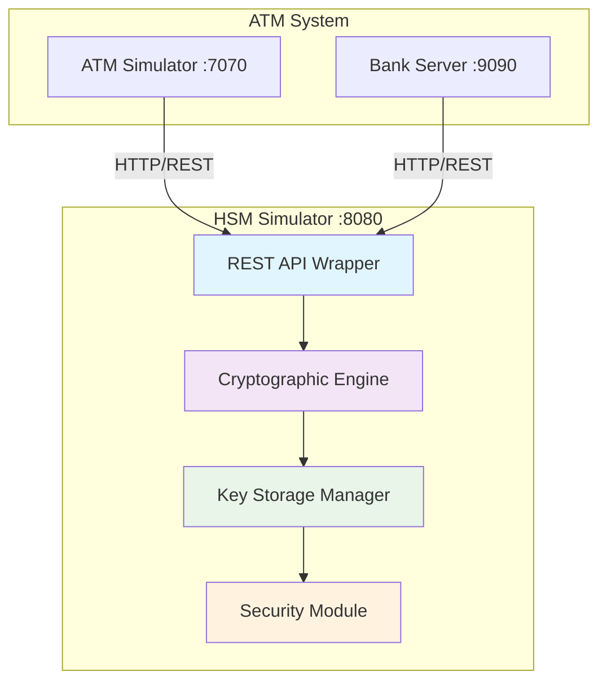

### 1.2 Arsitektur Layanan HSM
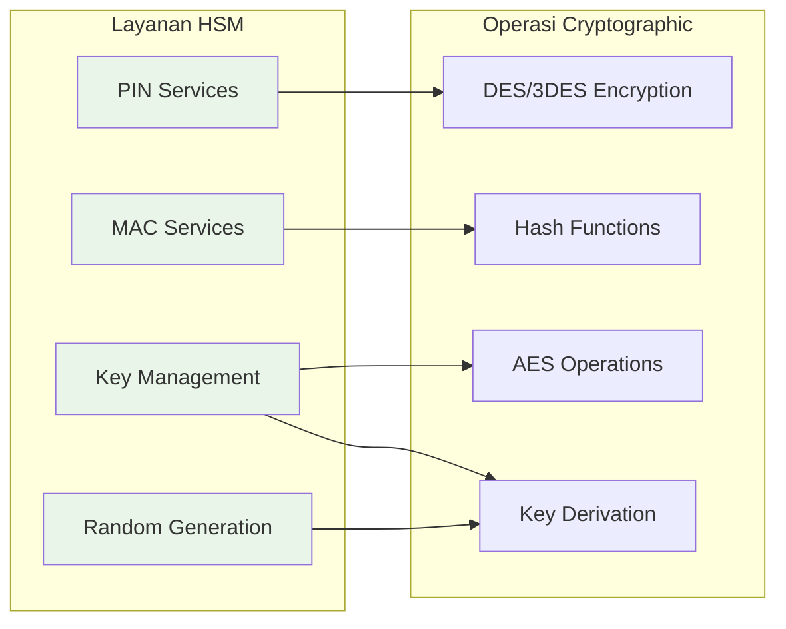

## 2. Manajemen PIN Block

### 2.1 PIN Verification Methods

Ada 2 metode PIN verification yang diimplementasikan:

**Method A - PIN Block Decryption (PINBLOCK):**
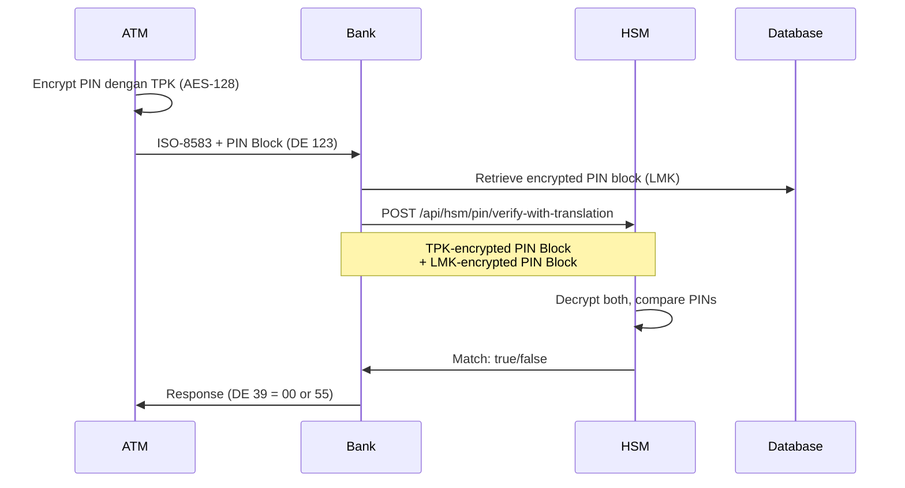

**Method B - PVV Verification (PVV):**
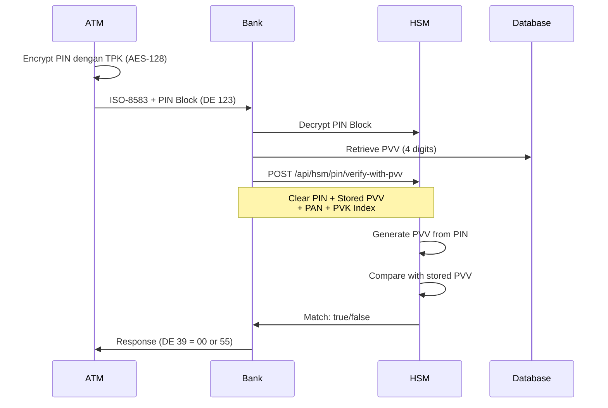

### 2.2 PIN Block Format ISO 9564-1 Format 0
**Format yang digunakan: ISO 9564-1 Format 0**
- 16 bytes PIN block
- Byte 0: PIN length (0x04 untuk 4-digit PIN)
- Bytes 1-6: PIN digits (padded dengan 'F')
- Bytes 7-15: XOR dengan PAN (rightmost 12 digits, excluding check digit)

### 2.3 PIN Verification Strategy Pattern
**Peserta akan mengimplementasikan:**

**PinVerificationStrategy Interface:**
```java
public interface PinVerificationStrategy {
    boolean verifyPin(Account account, String clearPin);
}
```

**PinBlockVerificationStrategy (Method A):**
```java
public class PinBlockVerificationStrategy implements PinVerificationStrategy {
    @Override
    public boolean verifyPin(Account account, String clearPin) {
        // 1. Encrypt clear PIN dengan TPK
        // 2. Call HSM: /api/hsm/pin/verify-with-translation
        // 3. Compare TPK-encrypted vs LMK-encrypted PIN blocks
        // 4. Return match result
    }
}
```

**PvvVerificationStrategy (Method B):**
```java
public class PvvVerificationStrategy implements PinVerificationStrategy {
    @Override
    public boolean verifyPin(Account account, String clearPin) {
        // 1. Call HSM: /api/hsm/pin/verify-with-pvv
        // 2. HSM generates PVV from clear PIN
        // 3. Compare with stored PVV from account
        // 4. Return match result
    }
}
```

**Configuration di Account Entity:**
```java
public enum PinVerificationType {
    PINBLOCK,  // Method A - PIN block decryption
    PVV        // Method B - PVV verification
}
```

### 2.4 Comparison: PINBLOCK vs PVV Method

| Aspect | PINBLOCK Method | PVV Method |
|--------|----------------|------------|
| **Storage** | Encrypted PIN block (LMK) in DB | PVV (4 digits) in DB |
| **Security** | Requires secure LMK management | More secure - stores hash only |
| **Performance** | Slightly faster (1 decrypt) | Slightly slower (hash generation) |
| **HSM Operations** | 2 decryptions + compare | Decrypt + hash + compare |
| **Reversibility** | PIN can be recovered with LMK | PIN cannot be recovered |
| **ISO Standard** | ISO 9564-1 | ISO 9564-1 Appendix B |
| **Use Case** | Legacy systems, offline PIN | Modern systems, online PIN |

**Account Configuration Examples:**
```sql
-- Account 1234567890: Uses PINBLOCK method
INSERT INTO accounts (account_number, pin_verification_type, encrypted_pin_block, pvv)
VALUES ('1234567890', 'PINBLOCK', 'A1B2C3...', NULL);

-- Account 0987654321: Uses PVV method
INSERT INTO accounts (account_number, pin_verification_type, encrypted_pin_block, pvv)
VALUES ('0987654321', 'PVV', NULL, '5678');
```

## 3. Generasi & Verifikasi MAC

### 3.1 Arsitektur Alur MAC
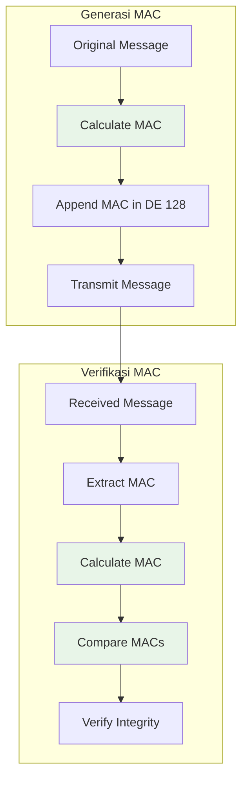

### 3.2 Implementasi Algoritma MAC
**Peserta akan mengimplementasikan algoritma MAC ANSI X9.19:**
- **Block cipher DES** untuk perhitungan MAC
- **CBC mode** untuk chaining blocks
- **Padding handling** untuk block yang tidak lengkap
- **Key management** untuk MAC keys

### 3.3 Integrasi Layanan MAC
```java
// Peserta akan mengimplementasikan:
public class MacService {
    // Generate MAC untuk pesan ISO-8583
    public String generateMac(String message, String macKey);

    // Verify MAC untuk pesan yang diterima
    public boolean verifyMac(String message, String mac, String macKey);

    // Update MAC ketika fields berubah
    public String updateMac(String message, String mac, String macKey, String... changedFields);
}
```

## 4. Terminal-Initiated Key Rotation

### 4.1 Overview Terminal-Initiated Key Rotation

Terminal-initiated key rotation adalah metode standar untuk rotasi kunci kriptografi di mana ATM terminal mengontrol timing dan inisiasi proses penggantian kunci. Metode ini digunakan untuk:

- **Scheduled rotation**: Penggantian kunci berkala (contoh: setiap 90 hari)
- **Maintenance windows**: Penggantian kunci saat maintenance terjadwal
- **On-demand rotation**: Manual key refresh saat dibutuhkan

Terminal mengirim key request ke server, server berkoordinasi dengan HSM untuk generate dan encrypt kunci baru. Terminal kemudian decrypt, verify, test, dan activate kunci baru, mengirimkan konfirmasi eksplisit ke server.

**Catatan**: Server-initiated key rotation (operation code 07) akan dibahas di Day 5.

### 4.2 Hirarki Key ATM

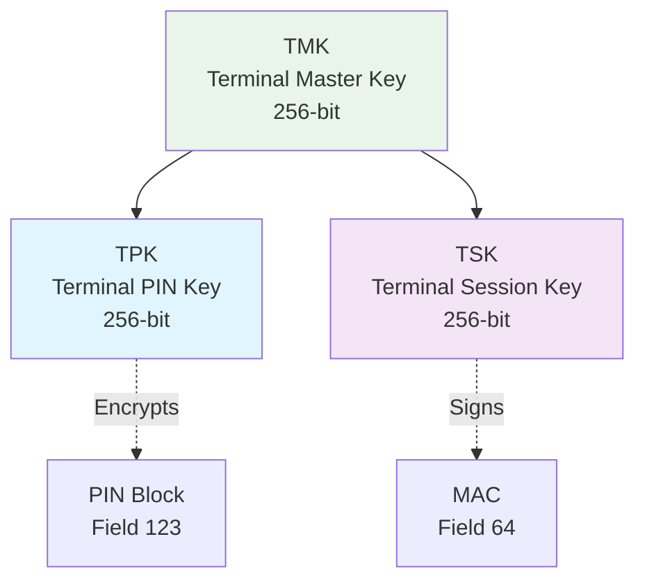

**Key Types:**
- **TMK (Terminal Master Key)**: Master key, jarang dirotasi, digunakan untuk derive TPK dan TSK
- **TPK (Terminal PIN Key)**: Untuk enkripsi PIN block (field 123)
- **TSK (Terminal Session Key)**: Untuk generasi MAC (field 64)

### 4.3 Operation Codes untuk Key Rotation

Field 53 berisi 16-digit numeric value yang mengidentifikasi operasi:

| Operation | Code | Description | MAC Key | Direction |
|-----------|------|-------------|---------|-----------|
| **TPK Request** | `01` | Request new TPK dari server | OLD TSK | Terminal → Server |
| **TSK Request** | `02` | Request new TSK dari server | OLD TSK | Terminal → Server |
| **TPK Confirmation** | `03` | Konfirmasi TPK installation sukses | NEW TPK* | Terminal → Server |
| **TSK Confirmation** | `04` | Konfirmasi TSK installation sukses | NEW TSK | Terminal → Server |
| **TPK Failure** | `05` | Report TPK installation gagal | OLD TSK | Terminal → Server |
| **TSK Failure** | `06` | Report TSK installation gagal | OLD TSK | Terminal → Server |

*Catatan: Saat konfirmasi TPK (operation 03), MAC masih menggunakan TSK (bukan TPK). Operation code itu sendiri membuktikan terminal memiliki TPK baru.

**Format Field 53**: `[Operation Code: 2 digits][Reserved: 14 zeros]`

**Contoh:**
- TPK request: `0100000000000000`
- TSK confirmation: `0400000000000000`
- TPK failure: `0500000000000000`

### 4.4 Message Flow Terminal-Initiated Key Rotation

#### Phase 1: Key Request and Delivery

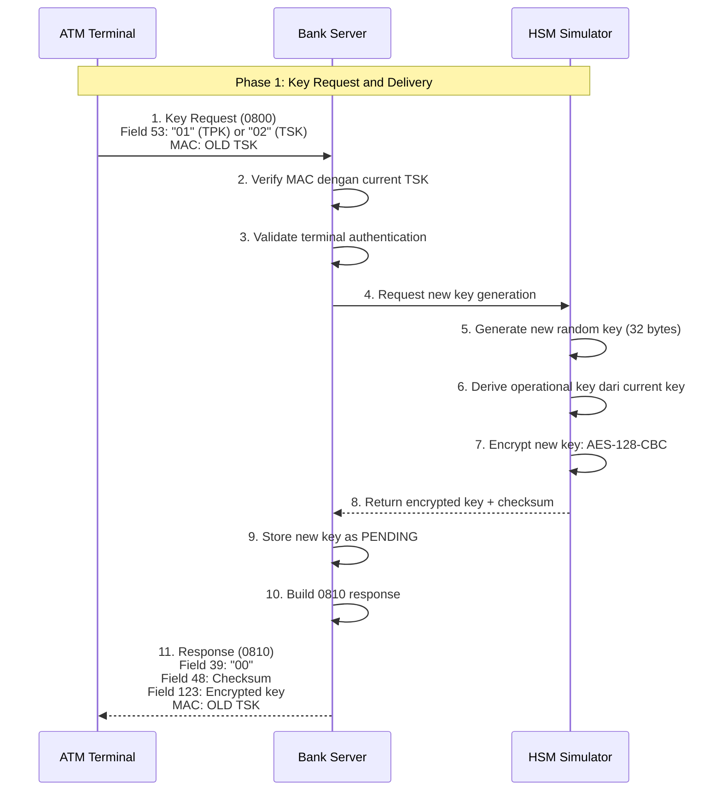

#### Phase 2: Key Installation and Confirmation

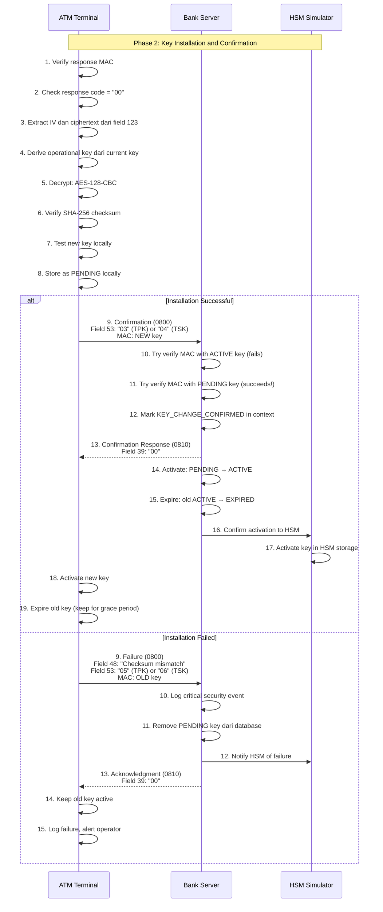

### 4.5 Field Specifications

#### Request Message (MTI 0800)

**Standard Key Request (Operations 01/02):**

| Field | Name | Format | Length | Description | Example |
|-------|------|--------|--------|-------------|---------|
| MTI | Message Type | N | 4 | Network management request | `0800` |
| 11 | STAN | N | 6 | System trace audit number | `000001` |
| 41 | Terminal ID | ANS | 15 | Terminal identifier (space-padded) | `ATM-001        ` |
| 42 | Card Acceptor ID | ANS | 15 | Institution code (space-padded) | `TRM-ISS001    ` |
| 53 | Security Control | N | 16 | Operation code + padding | `0100000000000000` |
| 64 | MAC | B | 16 | Message authentication code | Binary 16 bytes |

**Confirmation Message (Operations 03/04):**
- Same fields as request
- Field 53: `03` untuk TPK atau `04` untuk TSK
- Field 64: MAC generated using **NEW key** (membuktikan terminal memiliki key baru)

**Failure Notification (Operations 05/06):**
- Adds field 48 dengan failure reason
- Field 64: MAC generated using **OLD key**

#### Response Message (MTI 0810)

**Success Response (Response Code 00):**

| Field | Name | Format | Length | Description |
|-------|------|--------|--------|-------------|
| MTI | Message Type | N | 4 | Network management response | `0810` |
| 11 | STAN | N | 6 | Echoed from request |
| 39 | Response Code | AN | 2 | `00` = success |
| 41 | Terminal ID | ANS | 15 | Echoed from request |
| 48 | Key Checksum | ANS | 16 | SHA-256 checksum (first 16 hex chars) |
| 53 | Security Control | N | 16 | Echoed from request |
| 64 | MAC | B | 16 | Message authentication code |
| 123 | Encrypted Key | ANS | 128 | `[IV: 32 hex][Ciphertext: 96 hex]` |

**Field 39 Response Codes:**

| Code | Meaning | Terminal Action |
|------|---------|-----------------|
| `00` | Success | Proceed with key installation |
| `30` | Format error | Check field 53, retry with correct format |
| `91` | Not signed on | Sign on first, then retry |
| `96` | System error | Wait and retry (HSM/database error) |

**Field 48 Format (Key Checksum):**
- **Algorithm**: SHA-256 hash of plaintext key
- **Format**: First 16 hex characters (uppercase)
- **Purpose**: Verify key integrity setelah decryption
- **Example**: `3A5F9B2C8D1E4F7A`

**Field 123 Format (Encrypted Key):**

Structure:
```
┌─────────────────────────┬──────────────────────────────────────┐
│   IV (32 hex chars)     │   Ciphertext (96 hex chars)          │
│   16 bytes              │   48 bytes (32-byte key + padding)   │
└─────────────────────────┴──────────────────────────────────────┘
         128 hex characters total

Example:
A1B2C3D4E5F678901234567890ABCDEF1234567890ABCDEF1234567890ABCDEF...
|------------ IV (32) -----------||----------- Ciphertext (96) ------------|
```

**Encryption Details:**
- **Algorithm**: AES-128-CBC dengan PKCS5Padding
- **Key**: Derived operational key (128 bits)
  - Derived dari current master key menggunakan PBKDF2-SHA256
  - Context: `"KEY_DELIVERY:ROTATION"`
  - Output: 128 bits (16 bytes)
- **IV**: Random 16 bytes (32 hex chars)
- **Plaintext**: New key (32 bytes / 256 bits)
- **Padding**: PKCS5 menambahkan 16 bytes (full block)
- **Ciphertext**: 48 bytes (32 + 16 padding) = 96 hex chars

### 4.6 Key Lifecycle Management

#### Key States

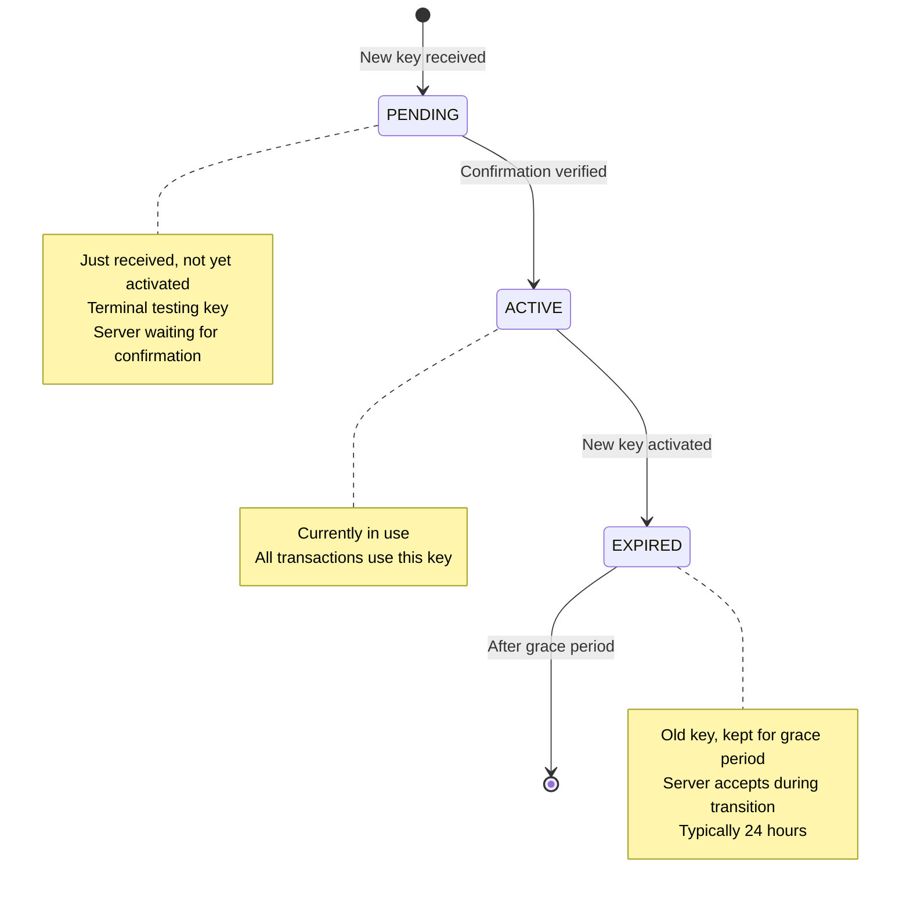

**States:**
- **PENDING**: Baru diterima, belum diaktifkan
- **ACTIVE**: Currently in use
- **EXPIRED**: Old key, disimpan untuk grace period

**Grace Period Benefits:**
- Allows gradual transition
- Terminals bisa menggunakan old key sementara
- Server accepts both keys during transition
- Failed rotation tidak merusak service

**Typical Grace Period**: 24 hours

### 4.7 Implementation Tasks

#### ATM Simulator (Terminal Side)

**Peserta akan mengimplementasikan:**

**1. KeyChangeService:**
- Build key request message (MTI 0800, field 53)
- Send request via QMUX
- Process response (verify MAC, extract fields)
- Decrypt encrypted key dari field 123
- Verify SHA-256 checksum dari field 48
- Test new key locally
- Send confirmation atau failure notification
- Activate new key jika sukses

**2. Key Decryption Logic:**
```java
// Derive operational key dari current master key
byte[] operationalKey = CryptoUtil.deriveKeyFromParent(
    currentMasterKeyBytes,
    "KEY_DELIVERY:ROTATION",
    128  // 128 bits
);

// Extract IV dan ciphertext dari field 123
String ivHex = encryptedKeyHex.substring(0, 32);
String ciphertextHex = encryptedKeyHex.substring(32);

// Decrypt dengan AES-128-CBC
Cipher cipher = Cipher.getInstance("AES/CBC/PKCS5Padding");
SecretKeySpec keySpec = new SecretKeySpec(operationalKey, "AES");
IvParameterSpec ivSpec = new IvParameterSpec(hexToBytes(ivHex));
cipher.init(Cipher.DECRYPT_MODE, keySpec, ivSpec);
byte[] newKey = cipher.doFinal(hexToBytes(ciphertextHex));
```

**3. Checksum Verification:**
```java
// Calculate SHA-256 checksum
MessageDigest sha256 = MessageDigest.getInstance("SHA-256");
byte[] hash = sha256.digest(newKey);
String calculatedChecksum = bytesToHex(hash).substring(0, 16);

if (!calculatedChecksum.equalsIgnoreCase(checksumHex)) {
    // CRITICAL: Do NOT install key
    throw new SecurityException("Checksum verification failed");
}
```

**4. Confirmation Message:**
```java
// Send confirmation dengan NEW key untuk MAC
ISOMsg confirmMsg = new ISOMsg();
confirmMsg.setMTI("0800");
confirmMsg.set(11, generateSTAN());
confirmMsg.set(41, terminalId);
confirmMsg.set(42, institutionId);
confirmMsg.set(53, "0300000000000000");  // TPK confirmation

// CRITICAL: Use NEW key for MAC
byte[] mac = generateMAC(confirmMsg, newKey);
confirmMsg.set(64, mac);
```

#### Bank Server Side

**Peserta akan mengimplementasikan:**

**1. KeyChangeParticipant:**
- Handle key request (operations 01/02)
- Verify MAC dengan current TSK
- Validate terminal authentication
- Call HSM untuk generate new key
- Store new key as PENDING dalam database
- Build 0810 response dengan encrypted key dan checksum

**2. KeyConfirmationParticipant:**
- Handle confirmation (operations 03/04)
- Try verify MAC dengan ACTIVE key (normal transactions)
- Try verify MAC dengan PENDING keys (detects confirmation)
- Mark KEY_CHANGE_CONFIRMED dalam context
- Send confirmation response

**3. KeyActivationParticipant:**
- Activate PENDING key → ACTIVE
- Expire old ACTIVE key → EXPIRED
- Set expiry date = now + grace period (24 hours)
- Confirm activation to HSM

**4. CryptoKeyService:**
- Database operations untuk key storage
- Key version management
- Key status transitions
- Grace period management

### 4.8 Testing Terminal-Initiated Key Rotation

#### Test 1: Successful TPK Rotation

**Execute:**
```bash
curl -X POST http://localhost:7070/api/keys/change \
  -H "Content-Type: application/json" \
  -d '{"keyType": "TPK"}'
```

**Expected Result:**
```json
{
  "success": true,
  "keyType": "TPK",
  "keyId": "uuid",
  "checkValue": "3A5F9B2C8D1E4F7A",
  "message": "Key changed successfully via ISO-8583"
}
```

**Verify in ATM Simulator Logs:**
```
INFO: Initiating key change for key type: TPK
INFO: Sending key change request via MUX
INFO: Key change approved by server, processing encrypted key
INFO: Decrypted new key: 32 bytes
INFO: Checksum verification successful: 3A5F9B2C8D1E4F7A
INFO: Key change completed successfully for TPK
INFO: Key installation successful, sending confirmation to server
INFO: Server acknowledged key installation confirmation: response code 00
```

**Verify in Bank Server Logs:**
```
INFO: Processing key change request: terminalId=TRM-ISS001-ATM-001, keyType=TPK
INFO: Generated new TPK key: version=2, checksum=3A5F9B2C8D1E4F7A
INFO: Stored new TPK key as PENDING: version=2
INFO: Processing key confirmation: terminalId=TRM-ISS001-ATM-001, keyType=TPK
INFO: MAC verified with PENDING TPK key - confirmation detected
INFO: Explicit confirmation received for TPK key installation
INFO: Successfully activated TPK key version 2
INFO: Successfully confirmed TPK key activation to HSM
```

**Verify in Database:**
```sql
-- Check key status
SELECT terminal_id, key_type, key_version, status, check_value, effective_from
FROM crypto_keys
WHERE terminal_id = 'TRM-ISS001-ATM-001'
AND key_type = 'TPK'
ORDER BY effective_from DESC;

-- Expected result:
-- version 2: status = ACTIVE
-- version 1: status = EXPIRED (with expiry date = now + 24 hours)
```

**Post-Rotation Verification:**
```bash
# Test PIN transaction dengan new TPK
curl -X POST http://localhost:7070/api/transactions/balance \
  -H "Content-Type: application/json" \
  -d '{"pan": "1234567890", "pin": "1234"}'
```

Should succeed with response code `00`.

#### Test 2: Successful TSK Rotation

Same as Test 1, but dengan:
```json
{"keyType": "TSK"}
```

**Important**: Setelah TSK rotation, confirmation message itu sendiri menggunakan NEW TSK untuk MAC, membuktikan end-to-end functionality.

#### Test 3: Checksum Mismatch (Failure Scenario)

**Setup**: Modify HSM untuk return incorrect checksum (testing only)

**Expected Behavior:**
- Terminal detects mismatch
- Terminal sends failure notification (operation 05)
- Server removes PENDING key
- Old key tetap active

**Terminal Log:**
```
ERROR: Checksum mismatch! Expected: 3A5F9B2C8D1E4F7A, Calculated: 1234567890ABCDEF
ERROR: SHA-256 checksum verification failed
INFO: Sending key installation FAILURE notification for TPK: operation code 05
```

**Server Log:**
```
ERROR: Key installation failed: terminalId=TRM-ISS001-ATM-001, reason=Checksum mismatch
INFO: Removing PENDING key from database
INFO: Notifying HSM of key installation failure
```

## 5. Spesifikasi API Layanan HSM

### 5.1 API Operasi PIN

**Method A - PIN Block Verification dengan Translation:**
```yaml
POST /api/hsm/pin/verify-with-translation
Content-Type: application/json
{
  "tpkEncryptedPinBlock": "A1B2C3D4E5F6....",  # PIN block encrypted dengan TPK
  "lmkEncryptedPinBlock": "F6E5D4C3B2A1....",  # PIN block encrypted dengan LMK (from DB)
  "tpkKey": "TPK_KEY_HEX",
  "pan": "1234567890"
}

Response:
{
  "match": true,
  "message": "PIN verification successful"
}
```

**Method B - PIN Verification dengan PVV:**
```yaml
POST /api/hsm/pin/verify-with-pvv
Content-Type: application/json
{
  "clearPin": "1234",           # Clear PIN (decrypted dari PIN block)
  "storedPvv": "5678",         # PVV dari database (4 digits)
  "pan": "1234567890",
  "pvkIndex": 1                 # PVK (PIN Verification Key) index
}

Response:
{
  "match": true,
  "generatedPvv": "5678",
  "message": "PVV verification successful"
}
```

### 5.2 API Operasi MAC
```yaml
# MAC Generation
POST /api/hsm/mac/generate
Content-Type: application/json
{
  "message": "ISO8583_MESSAGE_DATA",
  "key": "MAC_KEY_HEX",
  "algorithm": "ANSI_X9_19"
}

# MAC Verification
POST /api/hsm/mac/verify
Content-Type: application/json
{
  "message": "ISO8583_MESSAGE_DATA",
  "mac": "GENERATED_MAC_HEX",
  "key": "MAC_KEY_HEX",
  "algorithm": "ANSI_X9_19"
}
```

### 5.3 API Manajemen Key
```yaml
# Key Generation
POST /api/hsm/key/generate
Content-Type: application/json
{
  "keyType": "ZPK",
  "algorithm": "DESede",
  "keyLength": 192
}

# Key Exchange
POST /api/hsm/key/exchange
Content-Type: application/json
{
  "keyType": "ZPK",
  "wrappedKey": "ENCRYPTED_KEY_HEX",
  "kek": "KEY_ENCRYPTION_KEY"
}
```

## 6. Titik Integrasi Keamanan

### 6.1 Integrasi Keamanan Acquirer
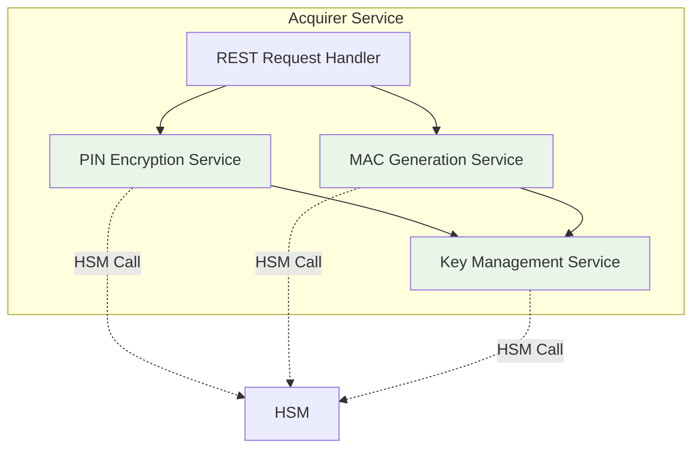

### 6.2 Integrasi Keamanan Gateway
**Peserta akan mengimplementasikan:**
- **Incoming MAC verification** untuk semua pesan
- **Outgoing MAC generation** untuk pesan yang diteruskan
- **Key rotation** untuk manajemen sesi
- **Security audit logging** untuk kepatuhan

### 6.3 Integrasi Keamanan Billing
**Peserta akan mengimplementasikan:**
- **PIN block verification** untuk transaksi debit
- **MAC verification** untuk integritas pesan
- **Secure response generation** dengan MAC
- **Transaction security audit trail**

## 7. Schema Database untuk Keamanan

### 7.1 Tabel Keamanan
Schema keamanan tersedia di: `data/security-schema.sql`

### 7.2 Schema Penyimpanan Key
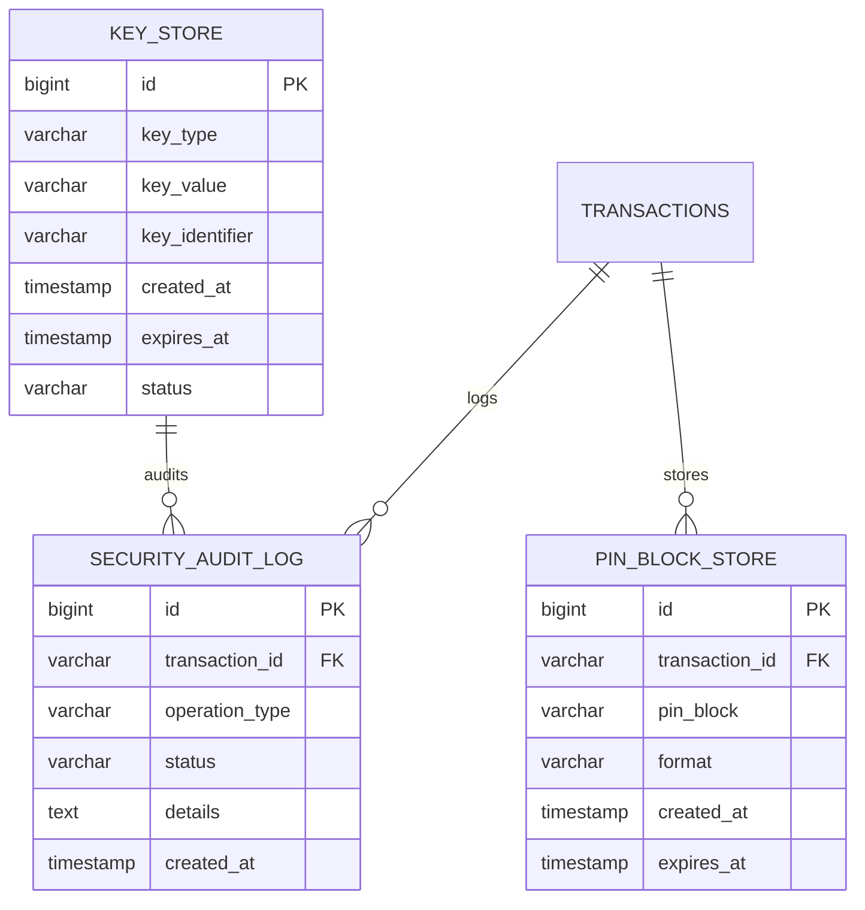

## 8. Pengujian & Validasi

### 8.1 Skenario Pengujian Keamanan
Skenario pengujian keamanan tersedia di: `security/test-scenarios.json`

### 8.2 Kasus Uji PIN Verification

**Method A - PIN Block Verification:**
```bash
# Test PIN block verification dengan translation
curl -X POST http://localhost:8080/api/hsm/pin/verify-with-translation \
  -H "Content-Type: application/json" \
  -d '{
    "tpkEncryptedPinBlock": "A1B2C3D4E5F6....",
    "lmkEncryptedPinBlock": "F6E5D4C3B2A1....",
    "tpkKey": "TPK_KEY_HEX",
    "pan": "1234567890"
  }'

# Expected response:
{
  "match": true,
  "message": "PIN verification successful"
}
```

**Method B - PVV Verification:**
```bash
# Test PVV verification
curl -X POST http://localhost:8080/api/hsm/pin/verify-with-pvv \
  -H "Content-Type: application/json" \
  -d '{
    "clearPin": "1234",
    "storedPvv": "5678",
    "pan": "0987654321",
    "pvkIndex": 1
  }'

# Expected response:
{
  "match": true,
  "generatedPvv": "5678",
  "message": "PVV verification successful"
}
```

**End-to-End Test via ATM UI:**
```bash
# Open ATM UI
open http://localhost:7070

# Test with PINBLOCK verification account:
1. Card: 1234567890
2. PIN: 1234
3. Transaction: Balance Inquiry
4. Expected: Success (uses PINBLOCK method)

# Test with PVV verification account:
1. Card: 0987654321
2. PIN: 5678
3. Transaction: Balance Inquiry
4. Expected: Success (uses PVV method)
```

### 8.3 Kasus Uji MAC
```bash
# Test MAC generation
curl -X POST http://localhost:8083/api/hsm/mac/generate \
  -H "Content-Type: application/json" \
  -d @samples/mac-generate-request.json

# Test MAC verification
curl -X POST http://localhost:8083/api/hsm/mac/verify \
  -H "Content-Type: application/json" \
  -d @samples/mac-verify-request.json
```

### 8.4 Kasus Uji Key Exchange
```bash
# Test key generation
curl -X POST http://localhost:8083/api/hsm/key/generate \
  -H "Content-Type: application/json" \
  -d @samples/key-generate-request.json

# Test key exchange
curl -X POST http://localhost:8083/api/hsm/key/exchange \
  -H "Content-Type: application/json" \
  -d @samples/key-exchange-request.json
```

## 9. Validasi Implementasi

### 9.1 Checklist Validasi Keamanan
- [ ] HSM simulator berjalan pada port 8080
- [ ] AES-128 PIN block encryption (field 123) berfungsi
- [ ] PIN verification Method A (PINBLOCK) berfungsi
- [ ] PIN verification Method B (PVV) berfungsi
- [ ] Strategy pattern untuk PIN verification implemented
- [ ] AES-CMAC generation berfungsi (field 64)
- [ ] AES-CMAC verification berfungsi
- [ ] Terminal-initiated key rotation (TPK/TSK) berfungsi
- [ ] Database crypto_keys table untuk key management
- [ ] Semua pengujian keamanan berhasil

### 9.2 Pengujian Integrasi
```bash
# Test ATM transaction dengan PIN verification (PINBLOCK method)
# Via ATM UI: http://localhost:7070
# Account: 1234567890, PIN: 1234

# Test ATM transaction dengan PIN verification (PVV method)
# Via ATM UI: http://localhost:7070
# Account: 0987654321, PIN: 5678

# Verify dalam database
docker-compose exec postgres psql -U postgres -d atm_db \
  -c "SELECT account_number, pin_verification_type, pvv FROM accounts;"

# Check transaction logs
docker-compose exec postgres psql -U postgres -d atm_db \
  -c "SELECT * FROM transactions ORDER BY created_at DESC LIMIT 5;"
```

### 9.3 Validasi Performa
- **PIN operation response time** < 100ms
- **MAC operation response time** < 50ms
- **Key exchange response time** < 200ms
- **Security audit overhead** < 5%

## 10. Masalah Keamanan Umum

### 10.1 Masalah PIN Block
- **Invalid format**: Periksa kompatibilitas format
- **PAN mismatch**: Verifikasi perhitungan PAN
- **Encryption failure**: Periksa ketersediaan key

### 10.2 Masalah MAC
- **Key mismatch**: Verifikasi distribusi MAC key
- **Message alteration**: Periksa formatting pesan
- **Algorithm error**: Verifikasi implementasi

### 10.3 Masalah Manajemen Key
- **Key expiration**: Implementasi rotasi key
- **Distribution failure**: Periksa secure channel
- **Storage security**: Verifikasi enkripsi

## 11. Next Steps

Setelah berhasil menyelesaikan Day 4:
1. HSM simulator running pada port 8080
2. AES-128 PIN block encryption (field 123) implemented
3. AES-CMAC message integrity (field 64) implemented
4. PIN verification integrated ke ATM transaction flow
5. Terminal-initiated key rotation (TPK/TSK) berfungsi
6. Database crypto_keys table untuk key management
7. Integrasi keamanan complete untuk ATM transactions
8. Siapkan untuk Day 5 (Connection Resiliency & Server-Initiated Key Rotation)
9. Review persistent connection, heartbeat, dan automatic re-sign-on