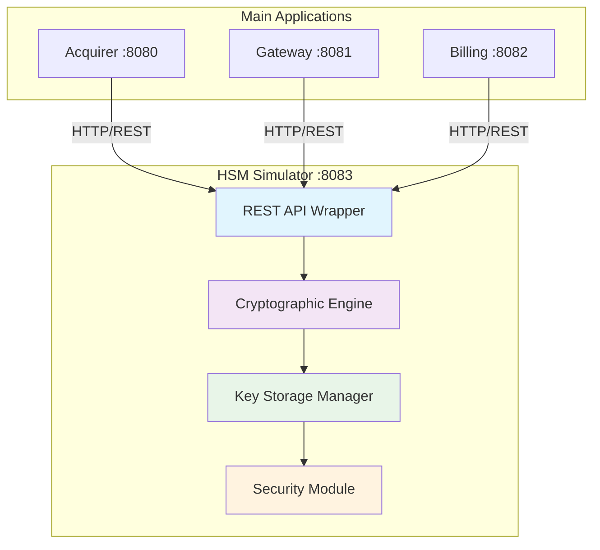
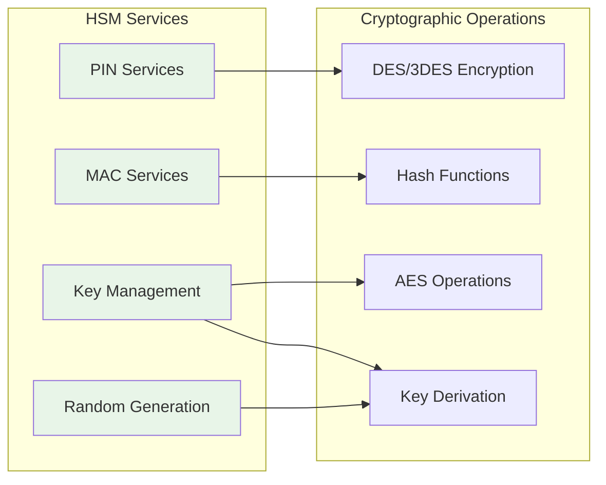
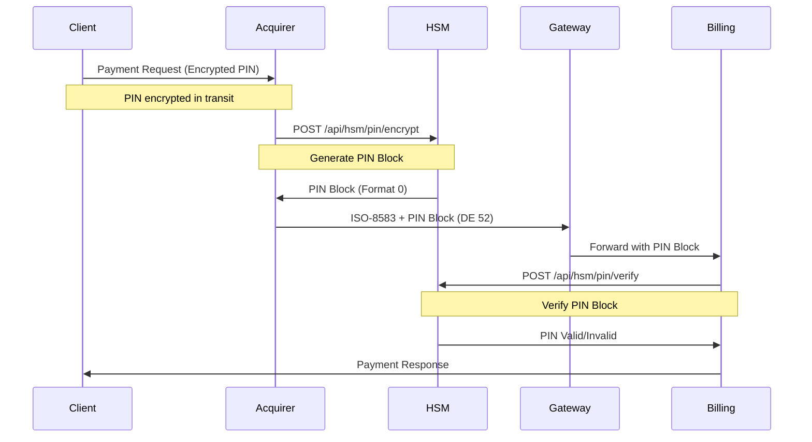
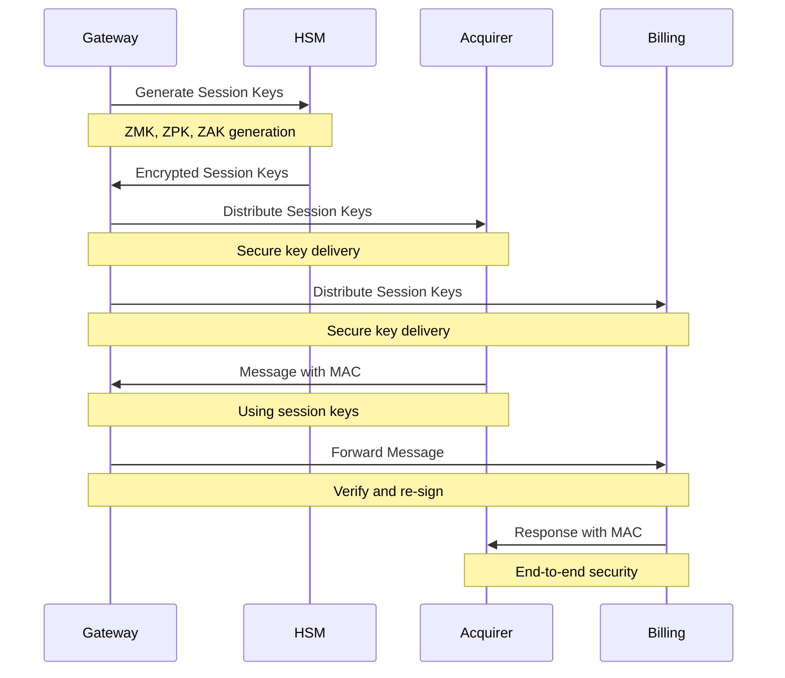
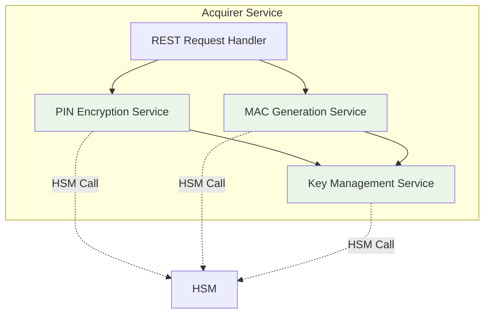
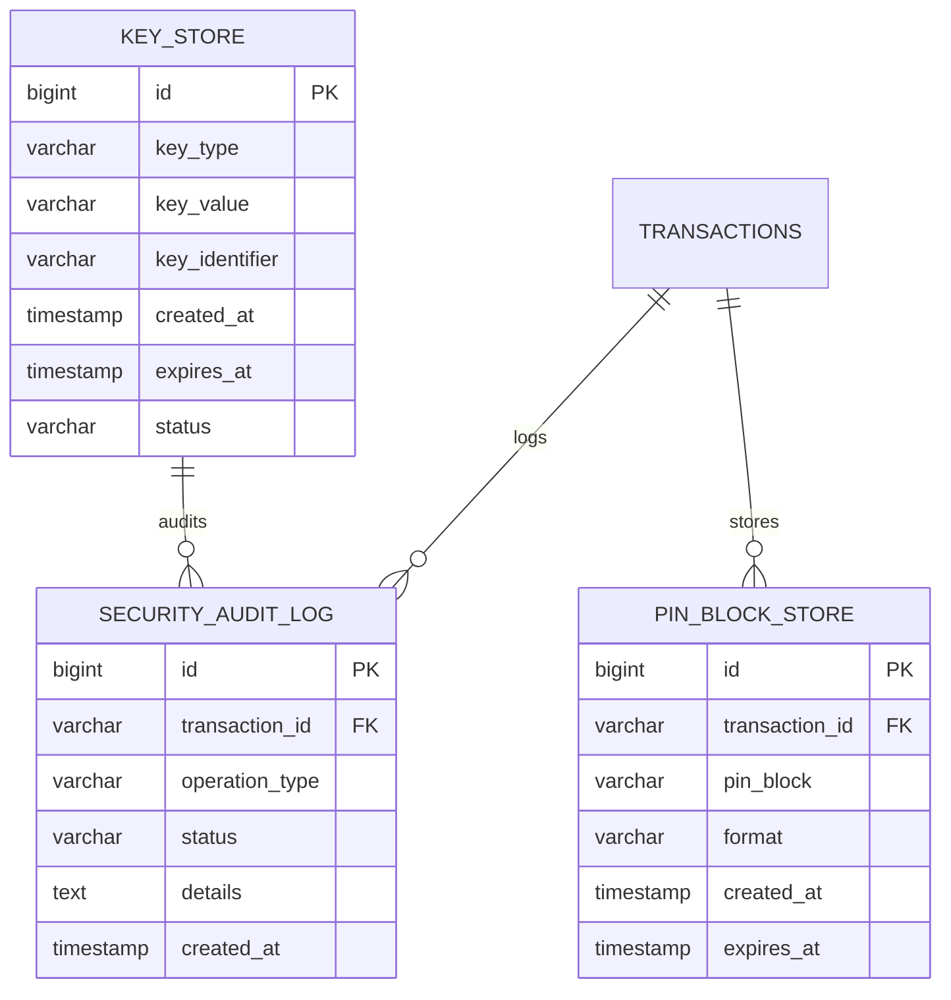

# Hari 4 – HSM Simulation, PIN, MAC & Key Exchange

## Tujuan
- Implementasi HSM simulator untuk cryptographic operations
- PIN block management (generation, encryption, verification)
- MAC generation dan verification untuk message integrity
- Key exchange mechanisms untuk secure communication
- Integrasi HSM ke alur pembayaran

## 1. HSM Simulator Architecture

### 1.1 HSM Simulator Design


### 1.2 HSM Service Architecture


## 2. PIN Block Management

### 2.1 PIN Block Flow


### 2.2 PIN Block Formats
**Participants will implement:**
- **Format 0**: ANSI X9.8 PIN block format
- **Format 3**: ISO 9564-1 Format 3 PIN block
- **Format 4**: ISO 9564-1 Format 4 PIN block

### 2.3 PIN Block Implementation Tasks
```java
// Participants will implement:
public class PinBlockService {
    // Generate PIN block from customer PIN
    public String encryptPinBlock(String pin, String pan);

    // Verify PIN block against customer PIN
    public boolean verifyPinBlock(String pinBlock, String pan, String pin);

    // Convert between PIN block formats
    public String convertPinBlockFormat(String pinBlock, int fromFormat, int toFormat);
}
```

## 3. MAC Generation & Verification

### 3.1 MAC Flow Architecture
```mermaid
graph TB
    subgraph "MAC Generation"
        A1[Original Message]
        A2[Calculate MAC]
        A3[Append MAC (DE 128)]
        A4[Transmit Message]
    end

    subgraph "MAC Verification"
        B1[Received Message]
        B2[Extract MAC]
        B3[Calculate MAC]
        B4[Compare MACs]
        B5[Verify Integrity]
    end

    A1 --> A2
    A2 --> A3
    A3 --> A4
    A4 --> B1
    B1 --> B2
    B2 --> B3
    B3 --> B4
    B4 --> B5

    style A2 fill:#e8f5e8
    style B3 fill:#e8f5e8
    style B4 fill:#e8f5e8
```

### 3.2 MAC Algorithm Implementation
**Participants will implement ANSI X9.19 MAC algorithm:**
- **Block cipher DES** for MAC calculation
- **CBC mode** for chaining blocks
- **Padding handling** for incomplete blocks
- **Key management** for MAC keys

### 3.3 MAC Service Integration
```java
// Participants will implement:
public class MacService {
    // Generate MAC for ISO-8583 message
    public String generateMac(String message, String macKey);

    // Verify MAC for received message
    public boolean verifyMac(String message, String mac, String macKey);

    // Update MAC when fields change
    public String updateMac(String message, String mac, String macKey, String... changedFields);
}
```

## 4. Key Exchange Implementation

### 4.1 Key Exchange Flow


### 4.2 Key Types and Management
**Key Types to Implement:**
- **ZMK (Zone Master Key)**: Master key for key distribution
- **ZPK (Zone PIN Key)**: For PIN block encryption/decryption
- **ZAK (Zone Authentication Key)**: For MAC generation/verification
- **TEK (Traffic Encryption Key)**: For message encryption

### 4.3 Key Exchange Messages
**Participants will implement ISO-8583 key exchange messages:**
```json
{
  "keyExchangeRequest": {
    "mti": "0800",
    "de_53": "301",  // Network management code for key exchange
    "de_48": "KEY_EXCHANGE_REQUEST_DATA",
    "de_128": "MAC_FOR_KEY_EXCHANGE"
  },
  "keyExchangeResponse": {
    "mti": "0810",
    "de_39": "00",  // Success
    "de_48": "ENCRYPTED_SESSION_KEYS",
    "de_128": "MAC_FOR_RESPONSE"
  }
}
```

## 5. HSM Service API Specification

### 5.1 PIN Operations API
```yaml
# PIN Encryption
POST /api/hsm/pin/encrypt
Content-Type: application/json
{
  "pin": "123456",
  "pan": "4111111111111111",
  "format": 0
}

# PIN Verification
POST /api/hsm/pin/verify
Content-Type: application/json
{
  "pinBlock": "041234567890ABCDE",
  "pan": "4111111111111111",
  "pin": "123456",
  "format": 0
}
```

### 5.2 MAC Operations API
```yaml
# MAC Generation
POST /api/hsm/mac/generate
Content-Type: application/json
{
  "message": "ISO8583_MESSAGE_DATA",
  "key": "MAC_KEY_HEX",
  "algorithm": "ANSI_X9_19"
}

# MAC Verification
POST /api/hsm/mac/verify
Content-Type: application/json
{
  "message": "ISO8583_MESSAGE_DATA",
  "mac": "GENERATED_MAC_HEX",
  "key": "MAC_KEY_HEX",
  "algorithm": "ANSI_X9_19"
}
```

### 5.3 Key Management API
```yaml
# Key Generation
POST /api/hsm/key/generate
Content-Type: application/json
{
  "keyType": "ZPK",
  "algorithm": "DESede",
  "keyLength": 192
}

# Key Exchange
POST /api/hsm/key/exchange
Content-Type: application/json
{
  "keyType": "ZPK",
  "wrappedKey": "ENCRYPTED_KEY_HEX",
  "kek": "KEY_ENCRYPTION_KEY"
}
```

## 6. Security Integration Points

### 6.1 Acquirer Security Integration


### 6.2 Gateway Security Integration
**Participants will implement:**
- **Incoming MAC verification** for all messages
- **Outgoing MAC generation** for forwarded messages
- **Key rotation** for session management
- **Security audit logging** for compliance

### 6.3 Billing Security Integration
**Participants will implement:**
- **PIN block verification** for debit transactions
- **MAC verification** for message integrity
- **Secure response generation** with MAC
- **Transaction security audit trail**

## 7. Database Schema for Security

### 7.1 Security Tables
Lihat: `data/security-schema.sql`

### 7.2 Key Storage Schema


## 8. Testing & Validation

### 8.1 Security Test Scenarios
Lihat: `security/test-scenarios.json`

### 8.2 PIN Block Test Cases
```bash
# Test PIN block generation
curl -X POST http://localhost:8083/api/hsm/pin/encrypt \
  -H "Content-Type: application/json" \
  -d @samples/pin-encrypt-request.json

# Test PIN block verification
curl -X POST http://localhost:8083/api/hsm/pin/verify \
  -H "Content-Type: application/json" \
  -d @samples/pin-verify-request.json
```

### 8.3 MAC Test Cases
```bash
# Test MAC generation
curl -X POST http://localhost:8083/api/hsm/mac/generate \
  -H "Content-Type: application/json" \
  -d @samples/mac-generate-request.json

# Test MAC verification
curl -X POST http://localhost:8083/api/hsm/mac/verify \
  -H "Content-Type: application/json" \
  -d @samples/mac-verify-request.json
```

### 8.4 Key Exchange Test Cases
```bash
# Test key generation
curl -X POST http://localhost:8083/api/hsm/key/generate \
  -H "Content-Type: application/json" \
  -d @samples/key-generate-request.json

# Test key exchange
curl -X POST http://localhost:8083/api/hsm/key/exchange \
  -H "Content-Type: application/json" \
  -d @samples/key-exchange-request.json
```

## 9. Implementation Validation

### 9.1 Security Validation Checklist
- [ ] HSM simulator running on port 8083
- [ ] PIN block generation working (all formats)
- [ ] PIN block verification working
- [ ] MAC generation working (ANSI X9.19)
- [ ] MAC verification working
- [ ] Key exchange implemented
- [ ] Session key management working
- [ ] Security audit logging functional
- [ ] All security tests passing

### 9.2 Integration Testing
```bash
# Test end-to-end secure payment
curl -X POST http://localhost:8080/api/v1/payment/secure \
  -H "Content-Type: application/json" \
  -d @samples/secure-payment-request.json

# Verify security in database
docker-compose exec postgres psql -U postgres -d payment_system \
  -c "SELECT * FROM security_audit_log WHERE transaction_id = 'TXN20251021001';"
```

### 9.3 Performance Validation
- **PIN operation response time** < 100ms
- **MAC operation response time** < 50ms
- **Key exchange response time** < 200ms
- **Security audit overhead** < 5%

## 10. Common Security Issues

### 10.1 PIN Block Issues
- **Invalid format**: Check format compatibility
- **PAN mismatch**: Verify PAN calculation
- **Encryption failure**: Check key availability

### 10.2 MAC Issues
- **Key mismatch**: Verify MAC key distribution
- **Message alteration**: Check message formatting
- **Algorithm error**: Verify implementation

### 10.3 Key Management Issues
- **Key expiration**: Implement key rotation
- **Distribution failure**: Check secure channel
- **Storage security**: Verify encryption

## 11. Next Steps

Setelah berhasil menyelesaikan Day 4:
1. HSM simulator implemented and working
2. PIN block management functional
3. MAC generation/verification working
4. Key exchange implemented
5. Security integration complete
6. Siapkan untuk Day 5 (Connection Resiliency & Production Readiness)
7. Review retry mechanisms and store-and-forward patterns