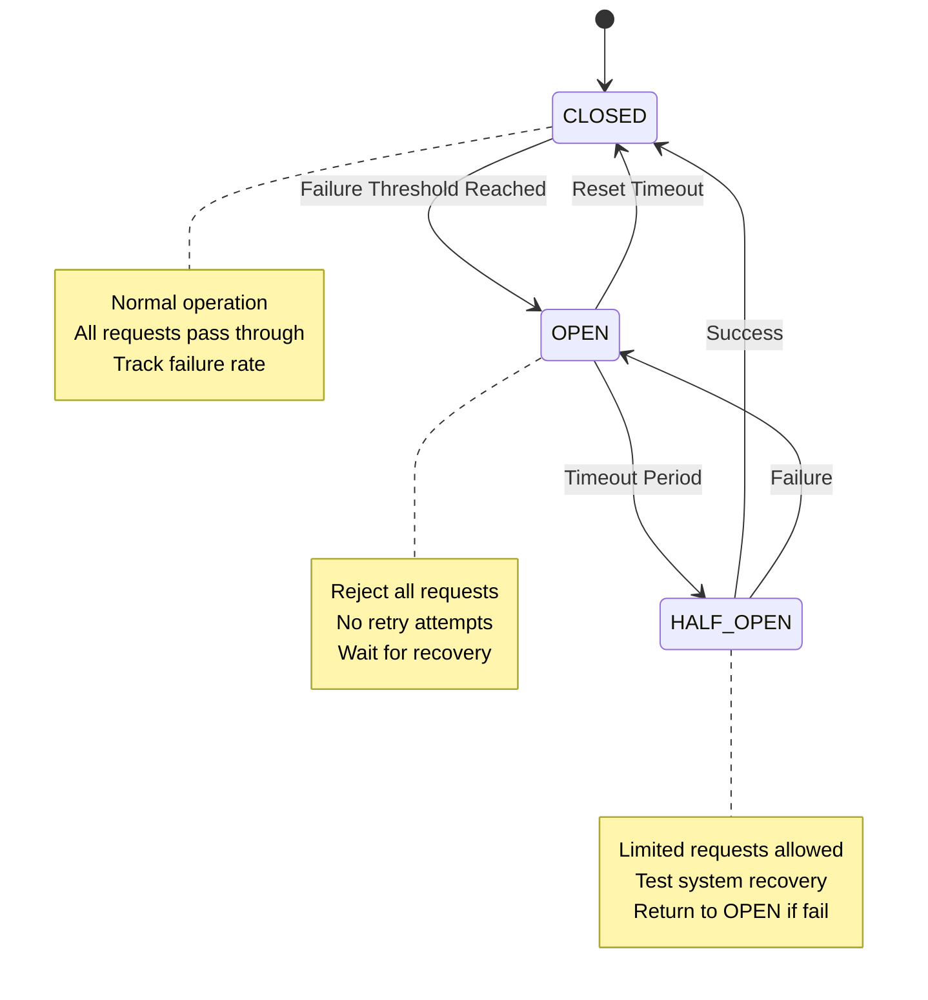
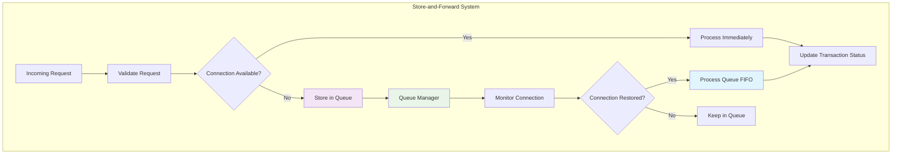
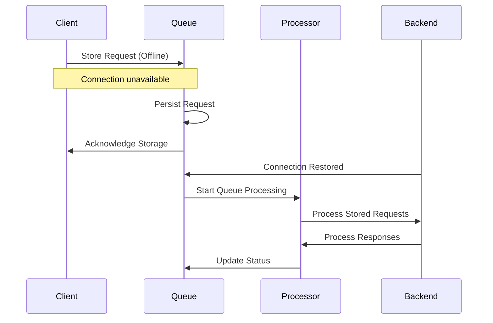
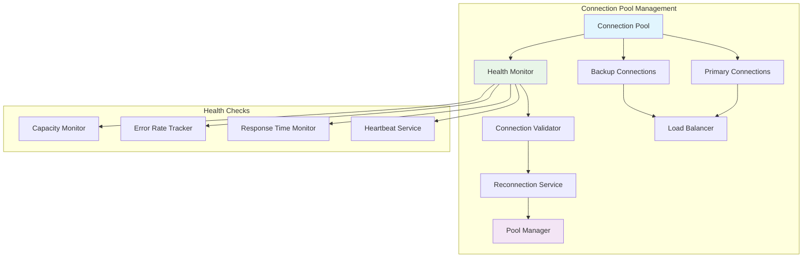
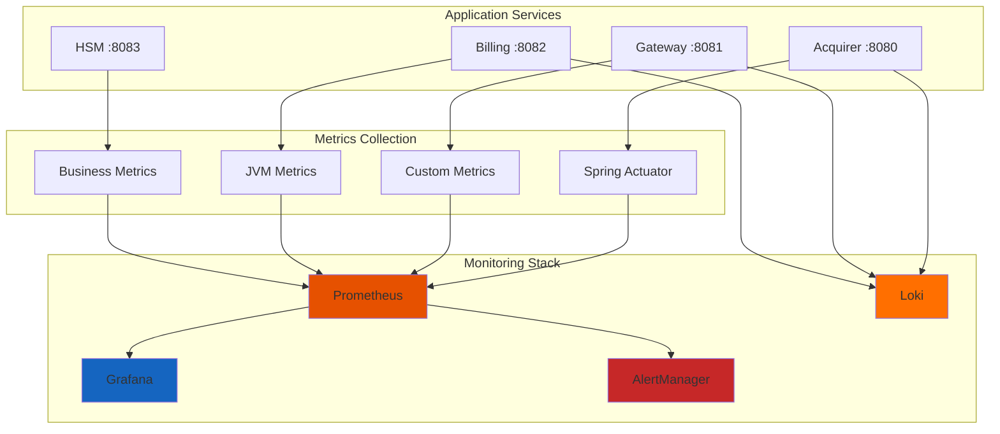
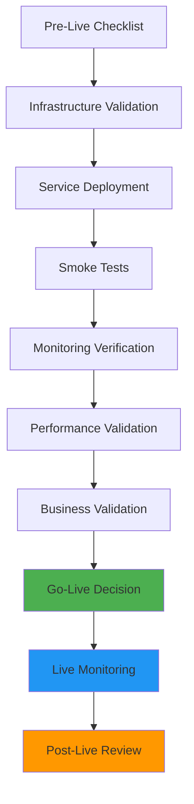

# Hari 5 – Connection Resiliency & Production Readiness

## Tujuan
- Implementasi retry mechanism dengan exponential backoff
- Store-and-forward pattern untuk offline scenarios
- Production monitoring dengan Grafana & Prometheus
- End-to-end testing untuk complete system validation
- Best practices untuk deployment, security, dan performance

## 1. Retry Mechanisms

### 1.1 Retry Strategy Architecture


### 1.2 Exponential Backoff Implementation
**Participants will implement:**
- **Configurable retry attempts** (3-5 retries)
- **Exponential backoff** (1s, 2s, 4s, 8s, 16s)
- **Maximum timeout limits** (30-60 seconds)
- **Smart retry logic** (retry only transient failures)

### 1.3 Circuit Breaker Pattern


## 2. Store-and-Forward Pattern

### 2.1 Store-and-Forward Architecture


### 2.2 Message Queue Implementation
**Participants will implement:**
- **Persistent queue** for failed transactions
- **FIFO processing** with priority handling
- **Duplicate detection** dan idempotency
- **Manual retry** dan cancellation capabilities

### 2.3 Queue Database Schema
Lihat: `production/store-forward-schema.sql`

### 2.4 Queue Processing Logic


## 3. Connection Management Enhancement

### 3.1 Advanced Connection Pooling


### 3.2 Health Monitoring Implementation
**Participants will implement:**
- **Connection health checks** (30-second intervals)
- **Automatic reconnection** with exponential backoff
- **Connection status dashboard** with real-time monitoring
- **Performance metrics** tracking and alerting

## 4. Production Monitoring Setup

### 4.1 Monitoring Architecture


### 4.2 Prometheus Configuration
Lihat: `production/prometheus.yml`

### 4.3 Grafana Dashboard Configuration
Lihat: `production/grafana-dashboard.json`

### 4.4 Key Metrics to Monitor
**Application Metrics:**
- **Transaction throughput** (transactions/second)
- **Response time** (p50, p95, p99 percentiles)
- **Error rate** (4xx, 5xx, ISO-8583 response codes)
- **Connection pool status** (active, idle, exhausted)

**Business Metrics:**
- **Payment success rate** by biller, by amount
- **Transaction value distribution**
- **Peak hour analysis**
- **Customer satisfaction metrics**

**Infrastructure Metrics:**
- **CPU/Memory/Disk** usage
- **Network latency** and throughput
- **Database connection** pool status
- **JVM performance** metrics

## 5. Deployment Configuration

### 5.1 Docker Configuration for Production
Lihat: `production/docker-compose.prod.yml`

### 5.2 Environment-Specific Configurations
**Production Environment Variables:**
```yaml
# Database
spring.datasource.url=jdbc:postgresql://postgres:5432/payment_system
spring.datasource.username=${DB_USER}
spring.datasource.password=${DB_PASSWORD}

# Connection Pool
spring.datasource.hikari.maximum-pool-size=20
spring.datasource.hikari.minimum-idle=5
spring.datasource.hikari.connection-timeout=30000

# Retry Configuration
retry.max-attempts=3
retry.backoff-delay=1000
retry.max-timeout=30000

# Store-and-Forward
queue.enabled=true
queue.max-size=10000
queue.retry-interval=5000

# Monitoring
management.endpoints.web.exposure.include=health,info,metrics,prometheus
management.metrics.export.prometheus.enabled=true
```

### 5.3 Kubernetes Deployment
Lihat: `production/k8s-deployment.yaml`

## 6. Security Hardening

### 6.1 PCI DSS Compliance Checklist
**Participants will implement:**
- **Secure transmission** untuk all data in transit
- **Encryption at rest** untuk sensitive data
- **Access control** dengan principle of least privilege
- **Audit logging** untuk all security events
- **Vulnerability scanning** dan patching

### 6.2 Security Headers Configuration
```yaml
# Spring Security Headers
security.headers.frame-options=deny
security.headers.content-type-options=nosniff
security.headers.xss-protection=1; mode=block
security.headers.referrer-policy=strict-origin-when-cross-origin
```

### 6.3 Rate Limiting Implementation
**Participants will implement:**
- **API rate limiting** (requests per minute per client)
- **Connection rate limiting** (connections per IP)
- **Payment frequency limiting** (payments per customer)
- **DDoS protection** with automatic blocking

## 7. Testing & Validation

### 7.1 End-to-End Test Scenarios
Lihat: `production/e2e-test-scenarios.json`

### 7.2 Load Testing Configuration
**Using JMeter/k6 for performance testing:**
```yaml
# Load Test Scenarios
load_test:
  users: 100
  duration: 10m
  ramp_up: 2m
  scenarios:
    - name: "Normal Payment Flow"
      weight: 70
    - name: "Retry Scenarios"
      weight: 20
    - name: "Error Handling"
      weight: 10
```

### 7.3 Chaos Engineering
**Chaos scenarios to test:**
- **Network partition** simulation
- **Database connection** failure
- **Service unavailability** testing
- **Resource exhaustion** scenarios

### 7.4 Validation Checklist
- [ ] All retry mechanisms working correctly
- [ ] Store-and-forward queue processing functional
- [ ] Circuit breaker pattern implemented
- [ ] Monitoring dashboards configured
- [ ] Alerts configured and tested
- [ ] Load testing meets performance targets
- [ ] Chaos engineering tests pass
- [ ] Security hardening complete
- [ ] Documentation updated
- [ ] Deployment scripts tested

## 8. Operational Procedures

### 8.1 Runbook Templates
**Common operational procedures:**
- **Service restart** procedures
- **Database maintenance** procedures
- **Security incident** response
- **Performance troubleshooting** guide

### 8.2 Backup and Recovery
**Participants will implement:**
- **Database backup** procedures (daily/weekly)
- **Configuration backup** and versioning
- **Disaster recovery** testing
- **RTO/RPO** documentation

### 8.3 Monitoring Alert Rules
**Critical alerts:**
- **Service down** (> 1 minute)
- **High error rate** (> 5% for 5 minutes)
- **Slow response time** (> 2 seconds p95)
- **Database connection** issues
- **Queue backlog** (> 1000 transactions)

## 9. Production Readiness Assessment

### 9.1 Readiness Checklist
**Technical Readiness:**
- [ ] All services containerized and tested
- [ ] Infrastructure as code implemented
- [ ] Monitoring and alerting configured
- [ ] Backup procedures documented
- [ ] Security scan completed
- [ ] Performance benchmarks met

**Operational Readiness:**
- [ ] Runbooks created and tested
- [ ] Team training completed
- [ ] Support procedures defined
- [ ] Escalation paths identified
- [ ] Communication plans prepared

**Business Readiness:**
- [ ] SLA agreements defined
- [ ] Capacity planning completed
- [ ] Business continuity tested
- [ ] User training completed
- [ ] Go-live plan approved

### 9.2 Go-Live Process


## 10. Best Practices Summary

### 10.1 Development Best Practices
- **Code quality** with automated testing
- **Security by design** principles
- **Performance optimization** from start
- **Observability** built-in
- **Documentation** as code

### 10.2 Operational Best Practices
- **Infrastructure as code** for consistency
- **Automated deployment** pipelines
- **Proactive monitoring** and alerting
- **Regular security** assessments
- **Continuous improvement** process

## 11. Next Steps

Setelah berhasil menyelesaikan Day 5:
1. Complete resiliency patterns implemented
2. Production monitoring configured
3. Security hardening completed
4. Load testing validated
5. Operational procedures documented
6. System ready for production deployment
7. Review complete training journey and lessons learned

## 12. Final Project Deliverables

**Complete production-ready system with:**
- ✅ All 5 days of implementation
- ✅ Full documentation and runbooks
- ✅ Monitoring and alerting
- ✅ Security hardening
- ✅ Load testing validation
- ✅ Deployment automation
- ✅ Operational procedures