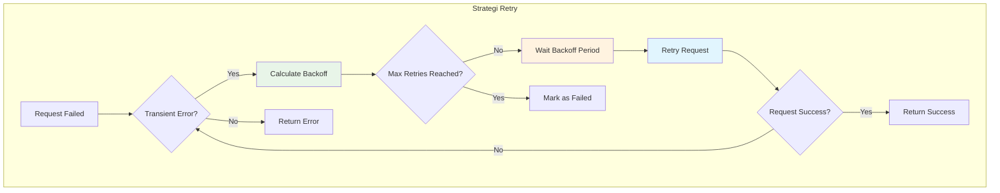
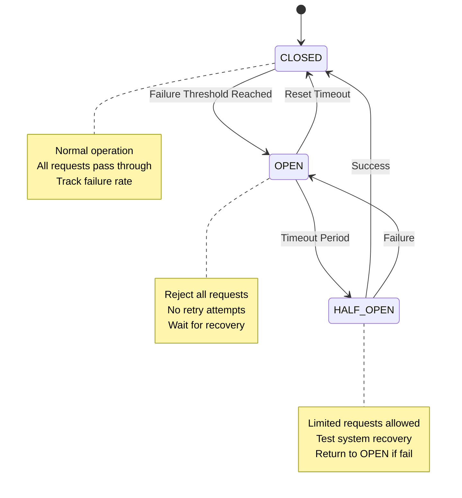
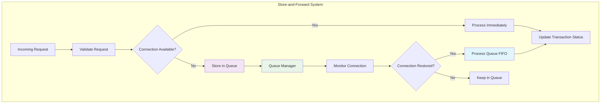
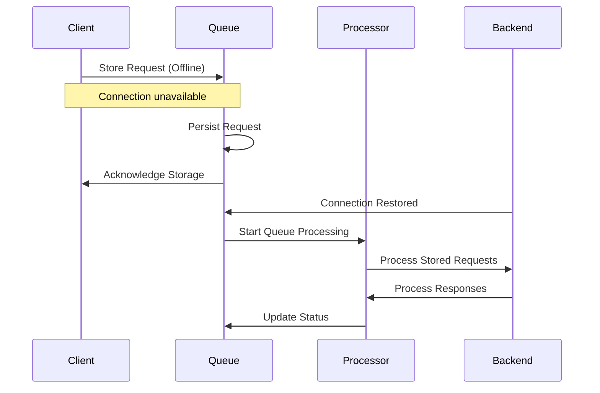
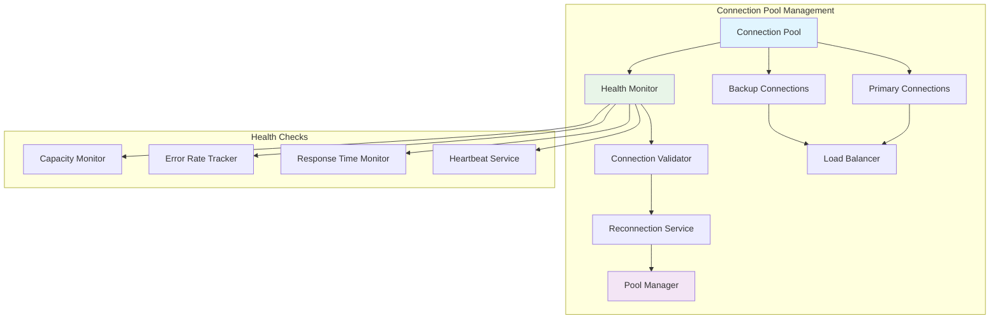
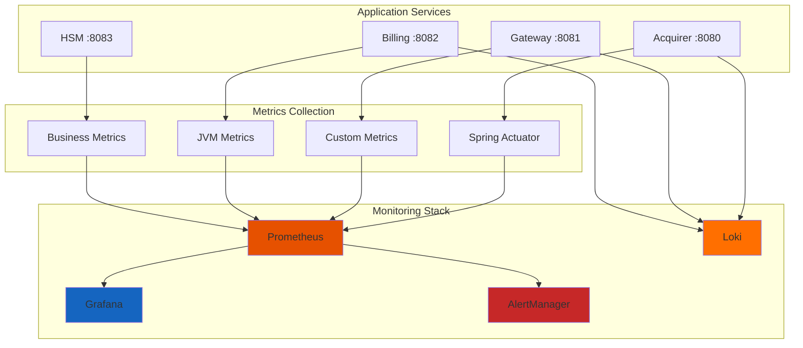
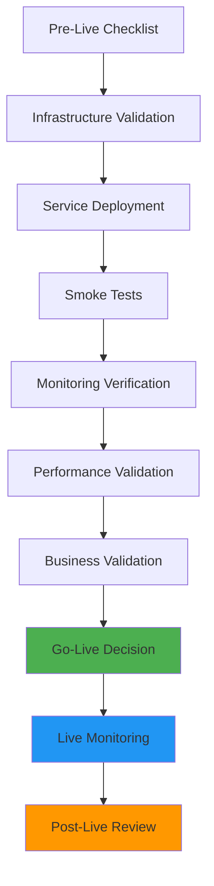

# Hari 5 – Ketahanan Koneksi & Kesiapan Produksi

## Tujuan
- Implementasi mekanisme retry dengan exponential backoff
- Store-and-forward pattern untuk skenario offline
- Monitoring produksi dengan Grafana & Prometheus
- Pengujian end-to-end untuk validasi sistem lengkap
- Best practices untuk deployment, security, dan performance

## 1. Mekanisme Retry

### 1.1 Arsitektur Strategi Retry


### 1.2 Implementasi Exponential Backoff
**Peserta akan mengimplementasikan:**
- **Configurable retry attempts** (3-5 retries)
- **Exponential backoff** (1s, 2s, 4s, 8s, 16s)
- **Maximum timeout limits** (30-60 seconds)
- **Smart retry logic** (retry only transient failures)

### 1.3 Circuit Breaker Pattern


## 2. Store-and-Forward Pattern

### 2.1 Arsitektur Store-and-Forward


### 2.2 Implementasi Message Queue
**Peserta akan mengimplementasikan:**
- **Persistent queue** untuk transaksi gagal
- **FIFO processing** dengan penanganan prioritas
- **Duplicate detection** dan idempotency
- **Manual retry** dan cancellation capabilities

### 2.3 Schema Database Queue
Schema queue tersedia di: `production/store-forward-schema.sql`

### 2.4 Logika Pemrosesan Queue


## 3. Peningkatan Manajemen Koneksi

### 3.1 Connection Pooling Lanjutan


### 3.2 Implementasi Health Monitoring
**Peserta akan mengimplementasikan:**
- **Connection health checks** (interval 30 detik)
- **Automatic reconnection** dengan exponential backoff
- **Connection status dashboard** dengan monitoring real-time
- **Performance metrics** tracking dan alerting

## 4. Setup Monitoring Produksi

### 4.1 Arsitektur Monitoring


### 4.2 Konfigurasi Prometheus
Konfigurasi Prometheus tersedia di: `production/prometheus.yml`

### 4.3 Konfigurasi Dashboard Grafana
Konfigurasi dashboard Grafana tersedia di: `production/grafana-dashboard.json`

### 4.4 Metrik Kunci untuk Monitoring
**Application Metrics:**
- **Transaction throughput** (transaksi/detik)
- **Response time** (persentil p50, p95, p99)
- **Error rate** (4xx, 5xx, kode respons ISO-8583)
- **Connection pool status** (active, idle, exhausted)

**Business Metrics:**
- **Payment success rate** berdasarkan biller dan amount
- **Transaction value distribution**
- **Peak hour analysis**
- **Customer satisfaction metrics**

**Infrastructure Metrics:**
- **CPU/Memory/Disk** usage
- **Network latency** dan throughput
- **Database connection** pool status
- **JVM performance** metrics

## 5. Konfigurasi Deployment

### 5.1 Konfigurasi Docker untuk Produksi
Konfigurasi Docker produksi tersedia di: `production/docker-compose.prod.yml`

### 5.2 Konfigurasi Spesifik Environment
**Environment Variables Produksi:**
```yaml
# Database
spring.datasource.url=jdbc:postgresql://postgres:5432/payment_system
spring.datasource.username=${DB_USER}
spring.datasource.password=${DB_PASSWORD}

# Connection Pool
spring.datasource.hikari.maximum-pool-size=20
spring.datasource.hikari.minimum-idle=5
spring.datasource.hikari.connection-timeout=30000

# Retry Configuration
retry.max-attempts=3
retry.backoff-delay=1000
retry.max-timeout=30000

# Store-and-Forward
queue.enabled=true
queue.max-size=10000
queue.retry-interval=5000

# Monitoring
management.endpoints.web.exposure.include=health,info,metrics,prometheus
management.metrics.export.prometheus.enabled=true
```

### 5.3 Deployment Kubernetes
Konfigurasi Kubernetes tersedia di: `production/k8s-deployment.yaml`

## 6. Security Hardening

### 6.1 Checklist Kepatuhan PCI DSS
**Peserta akan mengimplementasikan:**
- **Secure transmission** untuk semua data in transit
- **Encryption at rest** untuk sensitive data
- **Access control** dengan principle of least privilege
- **Audit logging** untuk semua security events
- **Vulnerability scanning** dan patching

### 6.2 Konfigurasi Security Headers
```yaml
# Spring Security Headers
security.headers.frame-options=deny
security.headers.content-type-options=nosniff
security.headers.xss-protection=1; mode=block
security.headers.referrer-policy=strict-origin-when-cross-origin
```

### 6.3 Implementasi Rate Limiting
**Peserta akan mengimplementasikan:**
- **API rate limiting** (request per menit per client)
- **Connection rate limiting** (koneksi per IP)
- **Payment frequency limiting** (pembayaran per customer)
- **DDoS protection** dengan automatic blocking

## 7. Pengujian & Validasi

### 7.1 Skenario Pengujian End-to-End
Skenario pengujian end-to-end tersedia di: `production/e2e-test-scenarios.json`

### 7.2 Konfigurasi Load Testing
**Menggunakan JMeter/k6 untuk pengujian performa:**
```yaml
# Load Test Scenarios
load_test:
  users: 100
  duration: 10m
  ramp_up: 2m
  scenarios:
    - name: "Normal Payment Flow"
      weight: 70
    - name: "Retry Scenarios"
      weight: 20
    - name: "Error Handling"
      weight: 10
```

### 7.3 Chaos Engineering
**Skenario chaos yang akan diuji:**
- **Network partition** simulation
- **Database connection** failure
- **Service unavailability** testing
- **Resource exhaustion** scenarios

### 7.4 Checklist Validasi
- [ ] Semua mekanisme retry berfungsi dengan benar
- [ ] Pemrosesan store-and-forward queue berfungsi
- [ ] Circuit breaker pattern diimplementasikan
- [ ] Dashboard monitoring dikonfigurasi
- [ ] Alert dikonfigurasi dan diuji
- [ ] Load testing memenuhi target performa
- [ ] Chaos engineering tests lulus
- [ ] Security hardening lengkap
- [ ] Dokumentasi diperbarui
- [ ] Deployment scripts diuji

## 8. Prosedur Operasional

### 8.1 Template Runbook
**Prosedur operasional umum:**
- **Service restart** procedures
- **Database maintenance** procedures
- **Security incident** response
- **Performance troubleshooting** guide

### 8.2 Backup dan Recovery
**Peserta akan mengimplementasikan:**
- **Database backup** procedures (harian/mingguan)
- **Configuration backup** dan versioning
- **Disaster recovery** testing
- **RTO/RPO** documentation

### 8.3 Aturan Alert Monitoring
**Alert kritis:**
- **Service down** (> 1 menit)
- **High error rate** (> 5% selama 5 menit)
- **Slow response time** (> 2 detik p95)
- **Database connection** issues
- **Queue backlog** (> 1000 transaksi)

## 9. Penilaian Kesiapan Produksi

### 9.1 Checklist Kesiapan
**Kesiapan Teknis:**
- [ ] Semua services dikontainerisasi dan diuji
- [ ] Infrastructure as code diimplementasikan
- [ ] Monitoring dan alerting dikonfigurasi
- [ ] Prosedur backup didokumentasikan
- [ ] Security scan selesai
- [ ] Target performa tercapai

**Kesiapan Operasional:**
- [ ] Runbooks dibuat dan diuji
- [ ] Training tim selesai
- [ ] Prosedur support didefinisikan
- [ ] Jalur eskalasi diidentifikasi
- [ ] Rencana komunikasi disiapkan

**Kesiapan Bisnis:**
- [ ] Perjanjian SLA didefinisikan
- [ ] Perencanaan kapasitas selesai
- [ ] Business continuity diuji
- [ ] Training pengguna selesai
- [ ] Rencana go-live disetujui

### 9.2 Proses Go-Live


## 10. Ringkasan Best Practices

### 10.1 Best Practices Pengembangan
- **Code quality** dengan automated testing
- **Security by design** principles
- **Performance optimization** dari awal
- **Observability** built-in
- **Documentation** as code

### 10.2 Best Practices Operasional
- **Infrastructure as code** untuk konsistensi
- **Automated deployment** pipelines
- **Proactive monitoring** dan alerting
- **Regular security** assessments
- **Continuous improvement** process

## 11. Langkah Selanjutnya

Setelah berhasil menyelesaikan Day 5:
1. Pola ketahanan lengkap diimplementasikan
2. Monitoring produksi dikonfigurasi
3. Security hardening selesai
4. Load testing tervalidasi
5. Prosedur operasional didokumentasikan
6. Sistem siap untuk deployment produksi
7. Review perjalanan training lengkap dan pelajaran yang dipelajari

## 12. Deliverables Proyek Akhir

**Sistem produksi siap lengkap dengan:**
- ✅ Semua 5 hari implementasi
- ✅ Dokumentasi dan runbooks lengkap
- ✅ Monitoring dan alerting
- ✅ Security hardening
- ✅ Validasi load testing
- ✅ Otomasi deployment
- ✅ Prosedur operasional